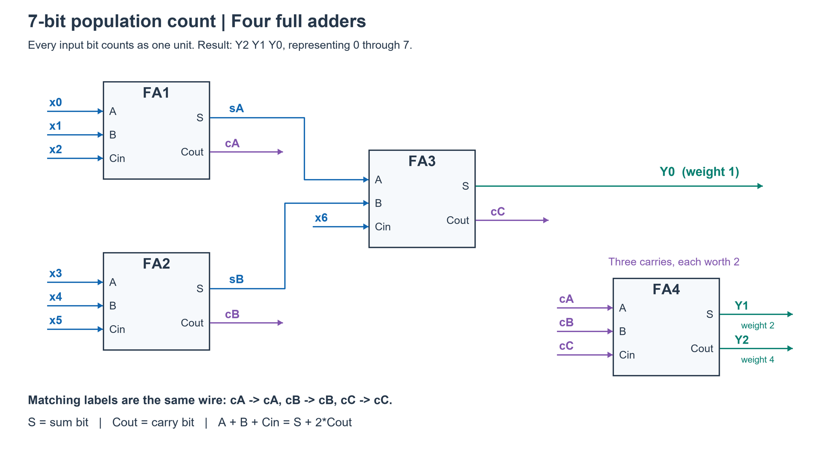

# PREP-001 — ספירת אחדות בכניסה בת 8 סיביות באמצעות מחברים

## השאלה המקורית

ממש באמצעות רכיבי Full-Adder ורכיבי Half-adder מכונה הסופרת את כמות ה'1' בכניסה בעלת 8 סיביות.

## English translation

Using Full-Adder and Half-adder components, implement a circuit that counts the number of '1' bits in an 8-bit input.

## נושאים

- תגיות במקור: hardware, logic-design, asic.
- סיווג נוסף שלנו: מעגלים צירופיים, אריתמטיקה בינארית, ספירת ביטים דולקים, Half-Adder, Full-Adder.

## חברות המופיעות במקור

Cisco, Applied Materials, Apple, Elbit, Marvell, Mellanox, Intel, Amazon, Arm, NVIDIA, Nuvoton, Hailo, Mobileye.

בתמונה מופיעה גם תווית ״אינטל״. הרשימה מתעדת את השיוך שבצילום שסופק; לא בוצע אימות עצמאי לשיוך לחברות.

## מקור וקשרים

- [צילום השאלה והתגיות](../../sources/prep-001.png), התקבל ב־24 בספטמבר 2026.
- שאלות בנושאים קשורים במאגרים הקיימים: HW-008, SW-001, VSW-001. אין בכך קביעה שהן כפילויות.
- רמת קושי וזמן פתרון: טרם הוערכו.

## מצב הלמידה

השאלה נקלטה. ניתן רמז ראשון, ולאחר מכן נכתב פתרון מלא לבקשת הראל.

## רמז 1 — 24 בספטמבר 2026

בקשה: ״תן לי כיוון איך לפתור את השאלה ואיך בכללי פותרים שאלות כאלה״.

חשוב על כל ביט קלט כעל מספר 0 או 1 שתרומתו לספירה שווה, בלי קשר למיקומו בכניסה.
מספר האחדות הוא סכום שמונת הביטים.

- Half-Adder מחבר שני ביטים: `a + b = S + 2C`.
- Full-Adder מחבר שלושה ביטים: `a + b + c = S + 2C`.

אפשר לראות במחבר מונה קטן של אחדות. לדוגמה, שלוש אחדות נותנות `C=1, S=1`, שמייצגים יחד 3.

סדר אותות בעמודות משקל 1, 2, 4 וכן הלאה. מחבר מקבל אותות מאותה עמודת משקל:
Sum נשאר באותה עמודה ו־Carry עובר לעמודה שמשקלה כפול.
התחל מקבוצה קטנה וסמן את משקל הפלטים לפני שילובם בהמשך.

שיטת עבודה כללית לשאלות כאלה:

1. להגדיר את הפונקציה, טווח הפלט ורוחבו.
2. להבין את הפעולה ואת משמעות הפלטים של כל אבן בניין מותרת.
3. לפתור תת־בעיה קטנה ולשלב תוצאות תוך שימור הערך והמשקלים.
4. לבדוק מקרי קצה כמו אפסים בלבד, אחד בודד ואחדות בלבד.
5. אחרי מימוש נכון, להשוות מספר רכיבים ועומק לוגי לפי קריטריון האופטימיזציה.

לא נמסרו חיבורי המעגל המלאים או מספר המחברים.

## הנחות

- הרכיבים המותרים הם Half-Adder ו־Full-Adder אידאליים; השערים שבתוכם אינם נספרים.
- הפלט הוא מונה בינארי unsigned בן 4 ביטים, כאשר `y0` הוא ה־LSB.
- ״אופטימלי״ פירושו מספר מינימלי של רכיבי HA/FA תוך שמירת כל שמונת ביטי הקלט.

## הצעה לפתרון — רשת Carry-Save

נסמן את הקלטים `x0..x7`, כאשר כל ביט הוא מספר 0 או 1. הפלט `y3..y0` צריך לייצג את:

`x0 + x1 + x2 + x3 + x4 + x5 + x6 + x7`.

ל־Half-Adder מתקיים:

`a + b = S + 2C`.

ל־Full-Adder מתקיים:

`a + b + c = S + 2C`.

כלומר, `S` נשאר באותה עמודת משקל ו־`C` עובר לעמודה שמשקלה כפול.

### חיבורי המעגל

| שלב | רכיב | כניסות | Sum / פלט באותו משקל | Carry / פלט במשקל כפול |
|---|---|---|---|---|
| 1 | FA1 | `x0,x1,x2` | `s0` | `c1a` |
| 2 | FA2 | `x3,x4,x5` | `s1` | `c1b` |
| 3 | FA3 | `s0,s1,x6` | `s2` | `c1c` |
| 4 | HA1 | `s2,x7` | `y0` | `c1d` |
| 5 | FA4 | `c1a,c1b,c1c` | `t1` | `c2a` |
| 6 | HA2 | `t1,c1d` | `y1` | `c2b` |
| 7 | HA3 | `c2a,c2b` | `y2` | `c3` |
| 8 | חיבור ישיר | `c3` | `y3=c3` | — |

לכן הפלט הוא `y3 y2 y1 y0`.

### למה זה נכון

בכל רכיב נשמר הערך האריתמטי: סכום הכניסות שווה ל־`Sum + 2·Carry`.
בשלב הראשון כל שמונת הקלטים נמצאים בעמודת משקל 1. לאחר שלושת ה־FA וה־HA
נשאר `y0` בעמודת משקל 1 וארבעה carries בעמודת משקל 2.
ה־FA וה־HA הבאים משאירים `y1` ומעבירים שני carries לעמודת משקל 4.
ה־HA האחרון מפיק `y2` ומעביר carry לעמודת משקל 8, שהוא `y3`.

### הוכחת אופטימליות

יש 8 חוטי קלט ו־4 חוטי פלט. Full-Adder ממיר 3 חוטים ל־2 ולכן מקטין את מספר החוטים הכולל באחד.
Half-Adder ממיר 2 חוטים ל־2 ולכן אינו מקטין אותו. לכן חייבים לפחות 4 Full-Adders.

כדי לצמצם את עמודת משקל 1 מ־8 אותות לאות יחיד, אם `f0` הוא מספר ה־FA ו־`h0` מספר ה־HA בעמודה זו,
נדרש `2f0+h0=7`. עם לכל היותר שלושה FA בעמודה נקבל לפחות HA אחד.
לאחר ארבעת ה־carry בעמודה הבאה נדרש `2f1+h1=3`, ולכן נדרש HA נוסף אם משתמשים ב־FA אחד.
בעמודה הבאה נשארים שני אותות ונדרש `2f2+h2=1`, ולכן נדרש HA שלישי.
המימוש משתמש בדיוק ב־4 FA וב־3 HA, ולכן הוא מינימלי תחת ההנחות.

### בדיקות

נבדקו כל 256 הקלטים האפשריים. בכל קלט הפלט שווה ל־`popcount(input)`.

| קלט | מספר אחדות | פלט |
|---|---:|---|
| `00000000` | 0 | `0000` |
| `00000001` | 1 | `0001` |
| `10101010` | 4 | `0100` |
| `11111111` | 8 | `1000` |

### תשובה קצרה לראיון

״אני בונה מונה אוכלוסייה באמצעות רשת Carry-Save. שלושה Full-Adders ו־Half-Adder אחד מצמצמים את שמונת ביטי הקלט; לאחר מכן Full-Adder ו־Half-Adder מצמצמים את עמודת ה־carry הבאה, ו־Half-Adder נוסף מפיק את הביט הבא. מתקבלים ארבעה ביטי פלט, ובסך הכול 4 Full-Adders ו־3 Half-Adders. זה מינימלי כי צריך ארבעה Full-Adders כדי להפוך שמונה חוטים לארבעה, ומשוואות העמודות מחייבות שלושה Half-Adders.״

## מצב

הפתרון נשמר כ־`solution_status: proposed`. שיוך השאלה לחברות נשמר כפי שנמסר בתמונה ואינו אימות עצמאי.

## וריאציית מקור: Bus בן 7 ביט

נתון Bus בן 7 ביט. תכנן מערכת המורכבת ממחברים, מחסרים FFs וכו' שתספור את מספר האחדות בBus הנתון.
לדוגמא, עבור (1001101) תתקבל התוצאה 100

תגית מקור: hardware. חברות לפי המקור (לא אומתו): NVIDIA, Hailo, Mobileye, Inomize, Qualcomm, Elta, Apple, CEVA, Marvell, Intel, Amazon. תווית ראשית: אלתא.

### שלושה רמזים לווריאציה

1. כל ביט תורם לספירה אפס או אחד, ללא קשר למיקומו. מה טווח הספירה וכמה ביטים דרושים לייצוגה?

2. Full-Adder סופר למעשה את האחדות בשלושה ביטים: a+b+c=S+2C. חלק את הקלט לשתי קבוצות של שלושה ביטים וביט נוסף.

3. חבר יחד את שני ביטי ה־Sum ואת הביט השביעי. כעת נותרו שלושה Carry בעלי אותו משקל; כיצד אפשר לחבר אותם?

**הצעה לפתרון — וריאציית 7 ביט:** הקלט x6..x0 והפלט y2..y0 הם בינאריים; התוצאה בטווח 0..7 ולכן דרושים שלושה ביטים. כל ביט קלט תורם 0 או 1 לספירה, ולא לפי משקלו במספר המקורי. הדוגמה 1001101 כוללת ארבע אחדות, ולכן הפלט 100 בבינארי.

מימוש קומבינטורי בארבעה Full-Adders, ללא צורך ב־FF או במחסר:
1. FA1(x0,x1,x2) -> (sA,cA).
2. FA2(x3,x4,x5) -> (sB,cB).
3. FA3(sA,sB,x6) -> (y0,cC).
4. FA4(cA,cB,cC) -> (y1,y2), כאשר y1 הוא Sum ו־y2 הוא Carry.

בכל זוג מוצאים נרשמו Sum ואז Carry. נשאי FA1,FA2,FA3 מייצגים יחידות במשקל 2; לכן מותר לחברם יחד ב־FA4. הוכחה: סכום שבעת ביטי הקלט הוא sA+sB+x6+2(cA+cB)=y0+2(cA+cB+cC)=y0+2y1+4y2. FA1 ו־FA2 פועלים במקביל, אחריהם FA3 ואחריו FA4; עומק תלות של שלוש שכבות מחברים, ללא הנחת זמני השהיה פנימיים שווים.

המימוש משתמש במינימום ארבעה מחברים במודל מוגבל של רשת הפחתת ביטים באמצעות FA/HA ששומרת את סכום עמודות המשקל: דרוש צמצום מ־7 אותות התחלתיים ל־3 אותות תוצאה; FA מצמצם אות אחד ו־HA אינו מצמצם. זו אינה הוכחה למינימום שטח/שערים/השהיה כשמותרים רכיבים שרירותיים, מחסרים או לוגיקה מותאמת. אין בשאלה דרישת מינימום מפורשת. FF מותרים אך אינם נדרשים: אם רוצים דגימה או pipeline, יש להגדיר שעון, latency וליישר אותות בין שלבים. חיבור כל הקלטים במקביל חוסך פרוטוקול סדרתי; אין סופרים רק ביטים השווים ל־1 לאורך זמן.

בדיקות: נבדקו כל 128 הקלטים מול bit_count בפייתון, כולל אפס, כל השבעה דלוקים, כל one-hot והדוגמה. זו בדיקת מודל פונקציונלי ולא HDL או timing פיזי. אין לפרש את פלט 100 כמאה עשרוני.

תעדוף: עדיפות גבוהה לחזרה על יסודות אריתמטיקה בינארית, רוחב תוצאה, משקלי נשאים ותכנון בדיקות; מאחר ששאלת 8 הביט כבר קיימת, זו חזרה קצרה ולא נושא חדש. זו הערכת הכנה לפי התפקיד ולא תחזית לראיון.

### English variant

Given a 7-bit bus, design a system using adders, subtractors, flip-flops, etc. that counts the ones in the bus. For example, input (1001101) produces 100.

1. Each input bit contributes zero or one regardless of position. What is the count range and required output width?

2. A full adder counts the ones in three bits: a+b+c=S+2C. Split the input into two groups of three and one remaining bit.

3. Add the two sum bits and the seventh input. Three equal-weight carry bits remain; how can they be combined?

Proposed solution — 7-bit variant: output y2..y0 is the unsigned population count in 0..7. Each input contributes zero or one, not its original binary place value. Input 1001101 contains four ones, so output is binary 100.
Use four full adders with (sum,carry) output convention: FA1(x0,x1,x2)->(sA,cA); FA2(x3,x4,x5)->(sB,cB); FA3(sA,sB,x6)->(y0,cC); FA4(cA,cB,cC)->(y1,y2). All carries into FA4 have weight two. The invariant is sum(inputs)=sA+sB+x6+2(cA+cB)=y0+2(cA+cB+cC)=y0+2y1+4y2. FA1/FA2 are parallel; three adder dependency layers suffice. No flip-flops or subtractors are required for the combinational task. Registered or pipelined alternatives require explicit clock/latency and stage alignment.
Four is minimum only for a weight-preserving FA/HA bit-reduction network: reducing seven signals to three needs four one-signal reductions; each FA reduces by one and HA by zero. This is not a global area/gate/delay lower bound under arbitrary permitted components, nor is optimality explicitly requested. All 128 inputs, including zero, all ones, one-hot and the example, were checked against Python bit_count. Functional model verification only, not HDL or physical timing. High preparation relevance for binary arithmetic, carry weights, output sizing and verification, but this is a short revision of existing PREP-001, not a new topic or an interview prediction.

### שרטוט והסבר אינטואיטיבי — 7 ביט

הסבר אינטואיטיבי: Full-Adder מחלק עד שלוש אחדות לזוג ולשארית. Carry=1 אומר שיש זוג אחד, ו־Sum=1 אומר שנותרה יחידה בודדת. לדוגמה 1+1+1=3 נותן C=1,S=1: זוג ועוד יחידה. FA1 ו־FA2 מטפלים בשתי שלשות קלט, ושומרים בנפרד זוגות cA,cB ושאריות sA,sB. FA3 אוסף את שתי השאריות ואת הביט השביעי; הוא מוציא את היחידה הסופית y0 ואולי זוג נוסף cC. FA4 סופר את שלושת הזוגות cA,cB,cC. משום שכל זוג שווה שתי אחדות מקוריות, Sum שלו שווה 2 במניין המקורי, ו־Carry שלו שווה 4. לכן אלה y1,y2, והמספר נקרא y2y1y0.
בדוגמה x6..x0=1001101: FA1 מקבל (1,0,1) ומוציא sA=0,cA=1; FA2 מקבל (1,0,0) ומוציא sB=1,cB=0; FA3 מקבל (0,1,1) ומוציא y0=0,cC=1; FA4 מקבל (1,0,1) ומוציא y1=0,y2=1. הפלט 100. חוטים בעלי אותו שם בשרטוט מחוברים פיזית, גם כאשר קו ארוך הוחלף בתוויות. כל Cin הוא ביט קלט במשקל השווה ל־A ול־B של אותו מחבר; מותר לחבר אליו ביט נתון, אין צורך שיהיה נשא ממחבר קודם.

Intuition: a full adder splits up to three ones into a pair (carry) and a leftover unit (sum). FA1/FA2 keep pairs cA,cB and leftovers sA,sB. FA3 combines the leftovers and seventh input, yielding final unit y0 and another pair cC. FA4 counts the three pair indicators; its sum has original weight 2 and its carry original weight 4, giving y1,y2. Read output as y2y1y0. For input x6..x0=1001101: FA1 inputs (1,0,1) -> (sA,cA)=(0,1); FA2 (1,0,0)->(sB,cB)=(1,0); FA3 (0,1,1)->(y0,cC)=(0,1); FA4 (1,0,1)->(y1,y2)=(0,1). Output 100. Repeated net labels in the diagram denote the same physical connection. Cin has the same weight as A and B within a full adder and may receive an ordinary input bit.
