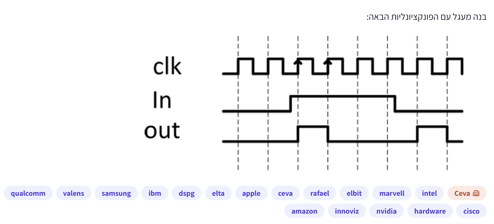

# PREP-004 — מימוש מעגל לפי תרשים תזמון

## השאלה המקורית

בנה מעגל עם הפונקציונליות הבאה:



התרשים הוא חלק הכרחי מהשאלה.

## English translation

Build a circuit with the following functionality. Refer to the attached clk, In and out timing diagram.

## תיאור נגיש של התרשים

משמאל לימין מופיעות שמונה חזיתות עלייה של השעון. In מתחיל ב־0, עולה בין חזיתות 2 ו־3,
ויורד בין חזיתות 6 ו־7. out גבוה מחזית 3 עד חזית 4 ומחזית 7 עד חזית 8,
ונמוך ביתר הזמן המוצג.

| חזית עלייה | 1 | 2 | 3 | 4 | 5 | 6 | 7 | 8 |
|---|---|---|---|---|---|---|---|---|
| In בחזית | 0 | 0 | 1 | 1 | 1 | 1 | 0 | 0 |
| out אחרי החזית | 0 | 0 | 1 | 0 | 0 | 0 | 1 | 0 |

The diagram shows eight rising clock edges. In rises between edges 2 and 3 and falls between
edges 6 and 7. out is high between edges 3–4 and 7–8 and is otherwise low.

## נושאים

- תגית במקור: hardware.
- סיווג נוסף שלנו: מעגלים סינכרוניים, תרשימי תזמון, דלגלגים ולוגיקה ספרתית.

## חברות לפי המקור

Qualcomm, Valens, Samsung, IBM, DSPG, Elta, Apple, CEVA, Rafael, Elbit, Marvell, Intel,
Amazon, Innoviz, NVIDIA, Cisco.

בתמונה מופיעה גם תווית ״Ceva״. השיוך מתועד כפי שסופק, ללא אימות עצמאי.

## מצב הלמידה

שלושת הרמזים נשמרו. הראשון נמסר כרמז, והמשך הדרך לפתרון התקיים בדיון:
הראל זיהה צורך בדגימה קודמת וב־XOR, הציע FF יחיד, ולאחר הסבר התזמון הגענו לשני FF.
הפתרון המלא נשמר לבקשתו. רמזים 2–3 לא סומנו בדיעבד כאילו נמסרו בנפרד.

## רמזים מוכנים — חומר מחבר, לחשיפה רק לפי בקשה

1. הסתכל על שני הפולסים של out: מה קרה ל־In לפני כל אחד מהם, ומתי בדיוק out מגיב ביחס לחזיתות השעון? שים לב גם למשך של כל פולס.
2. בכל חזית עלייה השווה את הערך הנוכחי של In לערך שנדגם בחזית הקודמת. מה צריך לקרות בפלט כשהם שונים, ומה כשהם זהים? כדי לבצע את ההשוואה תצטרך לזכור את הדגימה הקודמת.
3. כתוב טבלת אמת עבור זוג הדגימות: 00 ו־11 פירושם שלא היה שינוי, ואילו 01 ו־10 פירושם שהיה שינוי. איזה שער מזהה בדיוק את המצבים האלה? כעת חשוב איך לשמור את תוצאת ההשוואה באוגר שמתעדכן בחזית עלייה, ובמקביל לעדכן את אוגר הדגימה הקודמת, כך ש־out יישאר יציב בין חזיתות.

## רמז ראשון שנמסר — הסבר התרשים

קוראים את התרשים משמאל לימין. clk הוא השעון, In הוא הקלט ו־out הוא הפלט.
בתרשים, כש־In עולה מ־0 ל־1, out עולה ל־1 בחזית העלייה הבאה של השעון ונשאר גבוה למשך מחזור אחד בלבד.
כאשר In ממשיך להיות 1, out חוזר ל־0. כאשר In יורד מ־1 ל־0, מתקבל שוב פולס של מחזור אחד החל מחזית העלייה הבאה של השעון.
לכן שני הפולסים מסמנים שינוי בקלט — גם עלייה וגם ירידה.
רמז החשיבה הוא להתמקד במה שהשתנה בקלט, ולא רק ברמה הנוכחית שלו. טרם נמסר מימוש.

## הערות מחבר להשלמה בשלב הפתרון

המקור אינו מציין איפוס, אתחול, סינכרוניות של In לשעון או דרישות setup/hold.
יש לציין את ההנחות בעת הפתרון; התרשים מציג דוגמה ולא מגדיר את כל התנהגויות הקלט האפשריות.
שאלה קשורה: HW-013. אינה שאלה זהה, משום ששם מדובר בפולס בעקבות עלייה בלבד.

## הצעה לפתרון

מימוש יעיל: **שני D-FF ושער XOR אחד**. שני הדלגלגים פועלים באותה חזית עלייה:

`D1 = In`, `D2 = Q1`, `out = Q1 XOR Q2`.

אחרי חזית n, הראשון מחזיק את `x[n]` והשני את `x[n-1]`. לכן:

`out[n] = x[n] XOR x[n-1]`.

שני ה־FF מתעדכנים יחד, אבל השני קולט את הערך של הראשון מלפני החזית.
בשינוי מבודד, ה־XOR גבוה במשך מחזור אחד וחוזר ל־0 בחזית הבאה כשהדגימות משתוות.
בשינויים בכל מחזור הפלט יכול להישאר גבוה במחזורים רצופים.

### מימוש SystemVerilog

נניח כניסה שעומדת בדרישות setup/hold ואתחול שני האוגרים ל־0. האיפוס הסינכרוני הבא
הוא בחירת מימוש, ולא דרישה שנמסרה בתמונה.

```systemverilog
module sampled_change_detector (
    input  logic clk,
    input  logic reset,
    input  logic in_bit,
    output logic out
);
    logic q1, q2;
    always_ff @(posedge clk) begin
        if (reset) begin
            q1 <= 1'b0;
            q2 <= 1'b0;
        end else begin
            q1 <= in_bit;
            q2 <= q1;
        end
    end
    assign out = q1 ^ q2;
endmodule
```

### למה FF אחד עם הכניסה החיה אינו מתאים

אם `In` עולה בין חזיתות, XOR בינו לבין הדגימה הקודמת עולה מיד; בחזית הבאה ה־FF
קולט את In והפלט יורד. כך הפולס מסתיים בדיוק בחזית שבה בתרשים עליו להתחיל,
ואורכו תלוי במועד שינוי הכניסה.

### חלופה עם פלט רשום

במעגל פיזי, XOR של מוצאי שני FF יכול ליצור גליץ' סביב החזית כאשר שניהם משתנים,
עקב זמני התפשטות שונים. חלופה בעלת אותו מספר רכיבים רושמת את תוצאת ההשוואה:

```systemverilog
// Alternative state/output logic; do not combine with the previous output driver.
logic prev;
always_ff @(posedge clk) begin
    if (reset) begin
        prev <= 1'b0;
        out  <= 1'b0;
    end else begin
        prev <= in_bit;
        out  <= in_bit ^ prev;
    end
end
```

גם כאן יש שני FF ושער XOR אחד. ההשמות nonblocking מבטיחות שההשוואה משתמשת ב־prev הישן.
הפלט נלקח ישירות מ־FF. מניחים עמידה בדרישות התזמון גם במסלול ה־XOR.

### יעילות

נדרשים ארבעה מצבים נבדלים: שילובי הדגימה האחרונה עם דגל השינוי. כולם אפשריים.
מצבים עם דגל שונה מובחנים מיד בפלט. מצבים עם אותו דגל ודגימה אחרונה שונה מובחנים
בפלט הבא עבור אותו קלט. לכן נדרשים לפחות שני ביטי מצב במודל הסינכרוני הזה,
והמימושים משיגים זאת עם שני D-FF ושער XOR, ללא ספירת מעגלי reset.
אין כאן טענה למינימום שטח או השהיה פיזיים בכל ספריית תאים.

### מגבלות ומקרי קצה

- שינוי מבודד בעלייה או בירידה: מחזור פלט גבוה אחד.
- שינוי בכל דגימה: מחזורים גבוהים רצופים, ללא התחייבות לרווח נמוך ביניהם.
- קלט שחוזר לערכו בין חזיתות: ייתכן שלא יתגלה שינוי כלל.
- דגימה ראשונה של 1 אחרי reset ל־0: מזוהה כשינוי ביחס לערך האתחול.
- קלט אסינכרוני: נדרש טיפול CDC נפרד שעלול להוסיף השהיה. חיבור XOR למוצא
  השלב הראשון אינו הופך את שני ה־FF למסנכרן אסינכרוני בטוח.

### בדיקה

[בדיקה חוזרת](../checks/check_prep_004.py) רצה בהצלחה: התאמה לתרשים המקור,
512 מקרים של רצפים בני שמונה דגימות (כל 256 הרצפים לשני ערכי התחלה שווים),
ומקרה של reset סינכרוני באמצע הרצף. שני המימושים התאימו להשוואת דגימות עוקבות.
זו בדיקת מודל לוגי ב־Python; קוד ה־HDL לא עבר סימולציה, ואין בדיקת גליצ'ים או metastability פיזית.

### Proposed solution — English

Use two same-clock rising-edge D flip-flops: `D1=In`, `D2=Q1`, with `out=Q1 XOR Q2`.
After edge n they hold the current and previous input samples, so the output indicates
whether the samples differ. An isolated change yields one high cycle; consecutive changes
may keep the output high. A single delayed input XORed with live In gives incorrect timing.
Assume valid setup/hold and zero initialization. Both implementations use two state bits
and one XOR. For a registered output, use `prev<=In; out<=In ^ prev;` with nonblocking
assignments on the same edge. This avoids the combinational output XOR's physical glitch
hazard. Asynchronous inputs require separate CDC handling; exposing the first-stage output
to logic is not a safe two-flop synchronizer. Verification covers discrete logical behavior only.

### תשובה קצרה לראיון

אשתמש בשני D-FF על אותה חזית עלייה: הראשון דוגם את In והשני שומר את הדגימה הקודמת.
XOR של מוצאיהם מזהה שינוי ומפיק מחזור גבוה בעקבות שינוי מבודד.
אם נדרש פלט רשום, אפשר לשמור את הדגימה הקודמת ב־FF אחד ולרשום את תוצאת ה־XOR
ב־FF השני, באותו מספר רכיבים.
