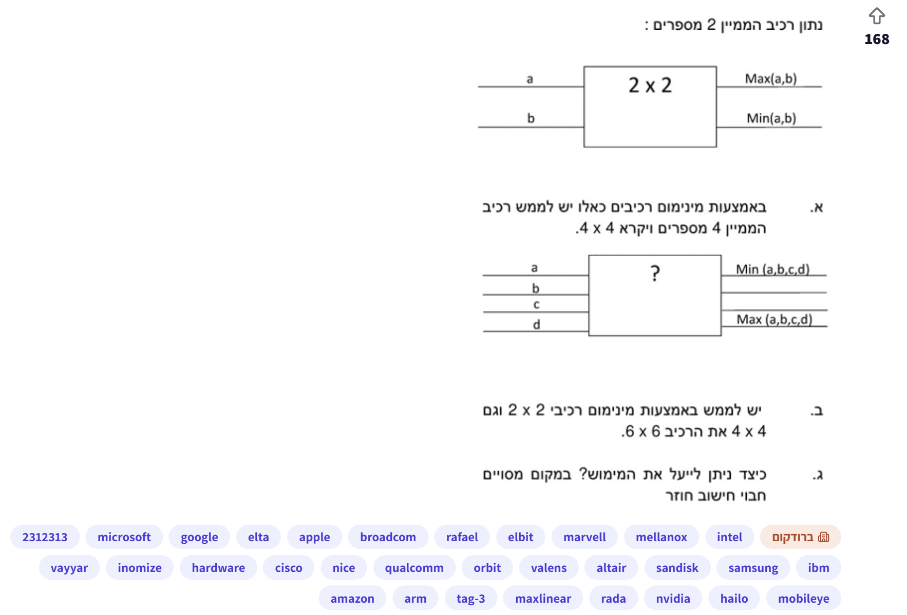
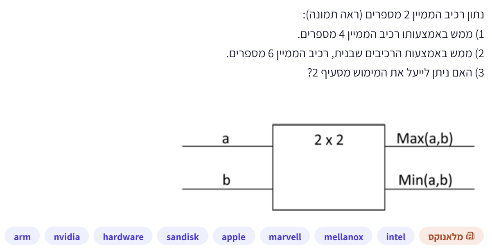
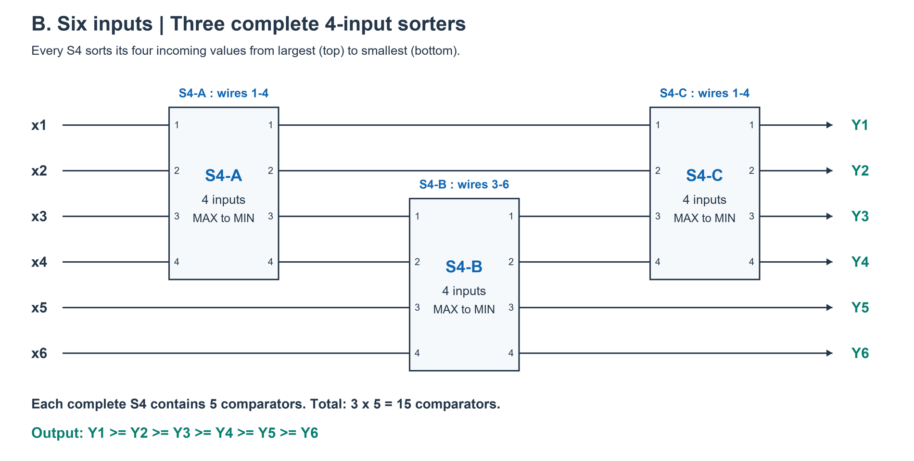
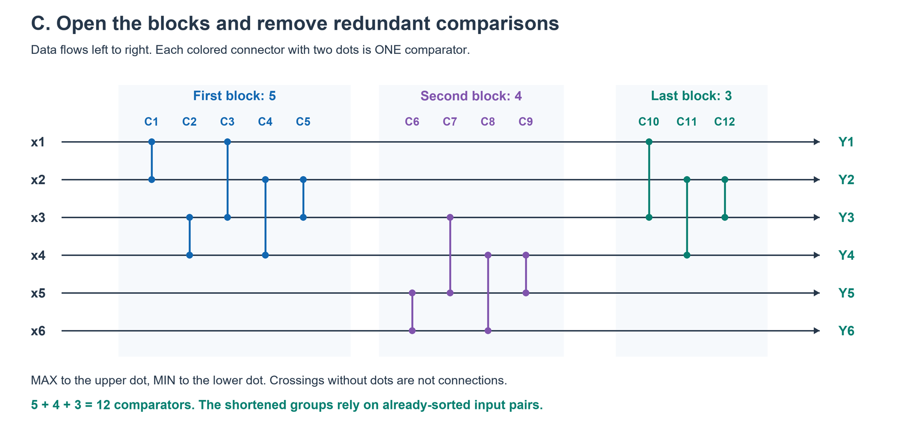
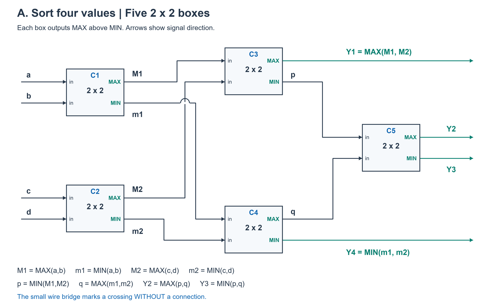
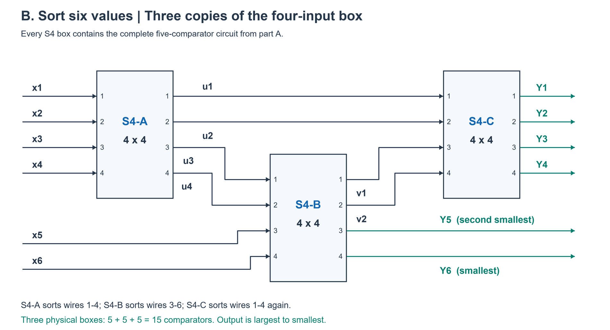
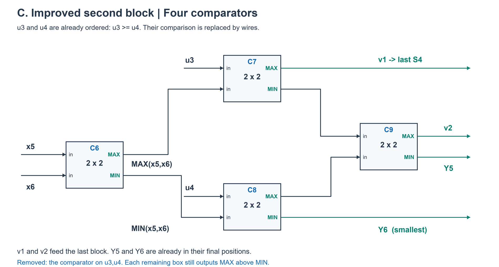
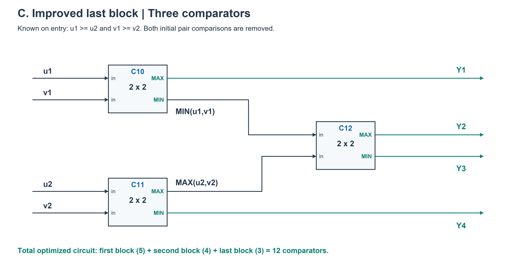

# PREP-005 — בניית רשתות מיון ל־4 ול־6 מספרים

## המקור

נתון רכיב הממיין 2 מספרים:

הרכיב 2×2 מקבל a,b. המוצא העליון הוא Max(a,b) והתחתון Min(a,b).

א. באמצעות מינימום רכיבים כאלו יש לממש רכיב הממיין 4 מספרים ויקרא 4×4.

בתרשים ארבע כניסות a,b,c,d וארבעה מוצאים. העליון מסומן Min(a,b,c,d) והתחתון Max(a,b,c,d).

ב. יש לממש באמצעות מינימום רכיבי 2×2 וגם 4×4 את הרכיב 6×6.

ג. כיצד ניתן לייעל את המימוש? במקום מסויים [מילה לא ברורה] חישוב חוזר.

מילה אחת בסעיף ג׳ אינה ברורה בצילום; התמונה נשמרה כמקור. אין השלמה מנוחשת.

## English translation

A 2×2 component receives a,b and outputs their maximum and minimum.

A. Build a four-number sorter (4×4) using the fewest such components.

B. Build a six-number sorter (6×6) using the fewest 2×2 and 4×4 components.

C. How can the implementation be improved? The source mentions repeated computation at a certain point; one word is unclear in the screenshot.

## קטגוריות

- במקור: hardware.
- סיווג נוסף: רשתות מיון, רכיבי השוואה, מעגלים צירופיים ואופטימיזציית חומרה.

## חברות לפי התמונה

Microsoft, Google, Elta, Apple, Broadcom, Rafael, Elbit, Marvell, Mellanox, Intel,
Vayyar, Inomize, Cisco, NICE, Qualcomm, Orbit, Valens, Altair, SanDisk, Samsung, IBM,
Amazon, Arm, MaxLinear, Rada, NVIDIA, Hailo, Mobileye.

תווית החברה הראשית בתמונה: ״ברודקום״. השיוכים נשמרים כפי שדווחו במקור ואינם מאומתים עצמאית.
התגיות `2312313` ו־`tag-3` נשמרו בנפרד כתגיות לא מסווגות, ולא כשמות חברות.

## מצב הלמידה

השאלה, התרשימים, שלושת הרמזים והפתרון המלא נשמרו לבקשת הראל.
הרמזים לא נמסרו בנפרד בשיחה. הפתרון במצב `proposed`; לא נטענה בדיקת מומחה אנושי.

## רמזים מוכנים — למסירה אחד בכל בקשה

1. התחל מסעיף א׳: חלק את ארבעת המספרים לשני זוגות ומיין כל זוג בנפרד. אחרי הפעולה הזאת, אילו יחסי סדר כבר ידועים לך, ואילו השוואות בין הזוגות עדיין חסרות?
2. לאחר מיון שני הזוגות, הקטן ביותר חייב להיות אחד משני המינימומים, והגדול ביותר חייב להיות אחד משני המקסימומים. חשוב אילו שני חיבורים נוספים מאפשרים לקבוע את שני קצות הרשימה.
3. כאשר משווים את שני המינימומים ואת שני המקסימומים, בכל השוואה יש גם מוצא נוסף שלא נבחר לקצה הרשימה. שני הערכים האלה צריכים למלא את המקומות האמצעיים: האם הסדר ביניהם כבר ידוע? בהמשך, כשמרכיבים רשת גדולה יותר, עקוב אחרי יחסי סדר שכבר מובטחים ובדוק אם רכיב כלשהו משווה שוב זוג שכבר ידוע סדרו.

## הנחות ומדד היעילות

- מדובר ברשת קומבינטורית קבועה: אין בחירת ההשוואה הבאה לפי תוצאות קודמות ואין שימוש חוזר באותו רכיב במחזורי שעון שונים.
- המספרים שייכים לתחום בעל סדר מלא; שוויון מותר. חיבורים קבועים אינם נספרים כרכיבי מיון.
- בסעיף ב׳ נפרש 2×2 ו־4×4 כסוגי רכיבים זמינים, ללא חובה להשתמש לפחות פעם אחת בכל סוג.
- בסעיף א׳ ובמימוש הפתוח של ג׳ סופרים רכיבי 2×2. בסעיף ב׳ סופרים בלוקים שלמים; ציינו גם את עלותם ברכיבים בסיסיים.
- המטרה היא מספר רכיבים; אין טענה שהמימוש משיג גם השהיה מינימלית.
- סדר Min/Max מלמעלה למטה בתרשים 2×2 הפוך לזה המוצג עבור 4×4. יש לסמן חיבורים במפורש.
- הפירוש לסעיף ג׳ הוא הסרת השוואות חוזרות במימוש של סעיף ב׳; מילה אחת במקור נותרה לא ברורה.

## הצעה לפתרון

התוצאות: **5 רכיבי 2×2 למיון ארבעה מספרים; 3 בלוקי 4×4 למיון שישה; לאחר הסרת השוואות מיותרות — 12 רכיבי 2×2 למיון שישה.**

### סימון

נסמן `C(i,j)` כהשוואה שמחזירה את המינימום לקו i ואת המקסימום לקו j, כאשר `i<j`.
אחרי כל השוואה עובדים עם הערכים המעודכנים בקווים. אף שבציור הרכיב הבסיסי מציג Max למעלה,
אפשר לחווט את מוצא Min לקו העליון; אין צורך ברכיב נוסף.

### א. ממיין 4×4 באמצעות חמישה רכיבים

הרשת, לפי סדר השכבות:

| שכבה | רכיבי 2×2 |
|---|---|
| 1 | `C(1,2)` ו־`C(3,4)` במקביל |
| 2 | `C(1,3)` ו־`C(2,4)` במקביל |
| 3 | `C(2,3)` |

אחרי השכבה הראשונה שני זוגות ממוינים. השוואת הקטנים מבין הזוגות מציבה את המינימום
הכולל בקו 1, והשוואת הגדולים מציבה את המקסימום הכולל בקו 4. נותר למיין את שני
הערכים שבקווים 2 ו־3, ולכן מספיקה ההשוואה האחרונה.

מינימליות: בארבעה מספרים שונים יש `4!=24` סדרי קלט. ארבע השוואות יכולות להבחין לכל היותר
ב־`2^4=16` תוצאות השוואה. לכן נדרשות לפחות `ceil(log2(24))=5` השוואות, והרשת משיגה זאת.

### ב. ממיין 6×6 באמצעות שלושה בלוקי 4×4

נסמן `S4(i,j,k,l)` כבלוק שממיין את ארבעת הקווים בסדר עולה.

1. `S4(1,2,3,4)`.
2. `S4(3,4,5,6)`.
3. `S4(1,2,3,4)` שוב, על הערכים החדשים.

ההופעה החוזרת בסעיף 3 היא בלוק פיזי נוסף ברשת, לא שימוש חוזר בזמן באותו בלוק.

למה זה עובד: אחרי הבלוק הראשון נסמן את ארבעת ערכיו `u1<=u2<=u3<=u4`.
הבלוק השני ממיין את `u3,u4,e,f` ומוציא `v1<=v2<=v3<=v4`.
שני הגדולים בעולם הם `v3,v4`: בפרט `v3>=u3>=u2>=u1`, כי בבלוק השני כבר יש
שני ערכים שאינם קטנים מ־u3, והיתר `v1,v2` אינם גדולים מ־v3.
לכן קווים 5 ו־6 במקומם הסופי. הבלוק השלישי ממיין את ארבעת הערכים הנותרים בקווים 1–4.

שלושה הוא גם מספר הבלוקים המינימלי, כאשר כל בלוק מטפל לכל היותר בארבעה ערכים:
בשני בלוקים בלבד, לפחות שני פלטים סופיים אינם עוברים דרך הבלוק השני. כל אחד מהם
תלוי לכל היותר בארבעת הקלטים שעברו בבלוק הראשון, או בקלט יחיד. אבל כל פלט דירוג של
מיון שישה מספרים עשוי להשתנות בהשפעת כל אחד מששת הקלטים. לכן שני בלוקים אינם מספיקים.

שלושה בלוקי 4×4 מלאים שווים ל־`3*5=15` רכיבי 2×2 לפני אופטימיזציה.

### ג. ביטול שלוש השוואות חוזרות — 12 רכיבים

פותחים כל בלוק 4×4 למימוש מסעיף א׳:

- בבלוק הראשון אין השוואות להסיר: דרושים כל חמשת הרכיבים.
- בבלוק השני, קווים 3 ו־4 כבר ממוינים מהבלוק הראשון. לכן `C(3,4)` בתחילתו
  אינה מחליפה דבר ואפשר להסיר אותה. נשארים ארבעה רכיבים.
- בבלוק השלישי, קווים 1 ו־2 נשארו ממוינים מהבלוק הראשון, וקווים 3 ו־4 כבר ממוינים
  מהשני. לכן אפשר להסיר את שתי ההשוואות הראשונות `C(1,2)` ו־`C(3,4)`.
  נשארים שלושה רכיבים.

לכן: `5+4+3=12`, חיסכון של 3 מתוך 15 רכיבים, כלומר 20% ממספר המשווים.
זה אינו בהכרח חיסכון של 20% בשטח הפיזי או בהשהיה.

רשימת החיבורים הסופית:

| קבוצה | רכיבים, בסדר הביצוע הלוגי |
|---|---|
| 1 — ממיין ראשון | `(1,2), (3,4), (1,3), (2,4), (2,3)` |
| 2 — ממיין שני לאחר קיצור | `(5,6), (3,5), (4,6), (4,5)` |
| 3 — מיזוג אחרון | `(1,3), (2,4), (2,3)` |

הפלט בקווים 1–6 מסודר מהקטן לגדול.

חשוב: לאחר ההסרה, הקבוצות השנייה והשלישית אינן בלוקי 4×4 כלליים לכל קלט.
הן תקינות בגלל יחסי הסדר שהשלבים הקודמים מבטיחים. הסרת הרכיבים דורשת גישה למימוש הפנימי;
אם ה־4×4 הוא בלוק אטום שאינו ניתן לשינוי, משאירים את שלושת הבלוקים השלמים.

12 הוא גם המינימום הידוע והמוכח לרשת מיון קבועה בת שישה קלטים; הוא מופיע כגבול תחתון ועליון
ב[טבלת קבוצת המחקר לרשתות מיון](https://imada.sdu.dk/u/petersk/sn/).
בדיקות נכונות אינן מוכיחות את הגבול התחתון הזה. גם `ceil(log2(6!))=10` לבדו אינו מוכיח 12;
האופטימליות לשישה קלטים נשענת על התוצאה המחקרית, ולא על הכללה שגויה של ההוכחה מסעיף א׳.

### Proposed solution — English

Use a fixed compare-exchange network, with `C(i,j)` placing min on channel i and max on j.
For four inputs use `(1,2),(3,4),(1,3),(2,4),(2,3)`: five comparators in three layers.
Sorting each pair, then comparing the two minima and the two maxima, fixes the outside
values; the last comparator orders the middle pair. Five is minimal since `2^4<4!`.

For six inputs use three complete four-input blocks in sequence: `S4(1,2,3,4)`,
`S4(3,4,5,6)`, `S4(1,2,3,4)`. The second block fixes the largest two values on channels
5 and 6; the third sorts the rest. Two blocks cannot suffice: at least two final outputs
would bypass the second block and thus could not depend on all six inputs, whereas each
order statistic must be able to depend on every input.

Expand each block into five comparators. Remove `(3,4)` from the second block, since that
pair is already sorted, and `(1,2),(3,4)` from the third block, since both pairs are already
sorted. This gives `5+4+3=12` comparators. The pruned blocks rely on these input-order
invariants and are not general four-input sorters on their own. Twelve is the proven minimum
size for a fixed six-input sorting network, as reported by the cited research group.
Block count and primitive comparator count are separate objectives; minimum delay is not claimed.

### בדיקה שבוצעה

[סקריפט בדיקה חוזרת](../checks/check_prep_005.py):

- מיון 4: כל 16 הקלטים הבינאריים וכל 24 התמורות של ארבעה ערכים שונים.
- מיון 6: כל 64 הקלטים הבינאריים, כל 720 התמורות של שישה ערכים שונים,
  ועוד 729 קלטים מתוך `{-1,0,1}` לכיסוי שליליים ושוויונות — 1,513 מקרים.
- בכל מקרה בן שישה קלטים הושוו שלושת הבלוקים, הפריסה ל־15 רכיבים והמימוש המקוצר ל־12.
- נבדק שכל אחת משלוש ההשוואות שהוסרו אכן קיבלה זוג שכבר ממויין.

כל הבדיקות עברו. כיסוי כל קלטי 0–1 מוכיח מיון לכל תחום בעל סדר מלא ברשת min/max קבועה,
לפי עקרון 0–1; ראו [הסבר של חוקר רשתות המיון Jannis Harder](https://jix.one/proving-50-year-old-sorting-networks-optimal-part-1/).
הבדיקות הן מודל פונקציונלי, ללא סינתזה או מדידת תזמון פיזית.

### תשובה קצרה לראיון

״לארבעה מספרים אמיין שני זוגות, אשווה את המינימומים ואת המקסימומים ואז את שני האמצעיים:
חמישה רכיבים. לשישה אשתמש בשלושה ממייני ארבעה על קווים 1–4, אחר כך 3–6 ואז שוב 1–4.
אחרי השני שני הגדולים כבר במקומם. כשפותחים את הממיינים, יש השוואה מיותרת בשני ושתיים
בשלישי, כי זוגות אלה כבר ממוינים. לכן יורדים מ־15 ל־12 רכיבי השוואה.״

### מקורות

- [Sorting Networks — Optimal size, University of Southern Denmark](https://imada.sdu.dk/u/petersk/sn/) — גבולות מספר המשווים, נבדק ב־24 בספטמבר 2026.
- [Jannis Harder — Proving 50-Year-Old Sorting Networks Optimal: Part 1](https://jix.one/proving-50-year-old-sorting-networks-optimal-part-1/) — הגדרת רשת קבועה, עקרון 0–1 וההבדל בין בדיקת נכונות להוכחת מינימליות.

מקורות אלה תומכים ברקע המתמטי בלבד ואינם מאמתים שיוך שאלה לחברה.

## מקור נוסף — נוסח מלאנוקס, 29 בספטמבר 2026

נתון רכיב הממיין 2 מספרים (ראה תמונה):
1) ממש באמצעותו רכיב הממיין 4 מספרים.
2) ממש באמצעות הרכיבים שבנית, רכיב הממיין 6 מספרים.
3) האם ניתן לייעל את המימוש מסעיף 2?

חברות לפי צילום המקור: Arm, NVIDIA, SanDisk, Apple, Marvell, Mellanox, Intel. תגית: hardware. תווית ראשית: מלאנוקס.

זו וריאציית ניסוח של PREP-005, עם אותם שלושה סעיפים. בניגוד למקור הראשון, לא מופיעה דרישת מינימום מפורשת בסעיפים 1–2 ולא מופיע הרמז לחישוב חוזר בסעיף 3. אין בכך שינוי בפתרון השמור: ממיין ארבעה באמצעות חמישה משווים, ממיין שישה באמצעות שלושה ממייני ארבעה, והסרת השוואות שיחסי הסדר שלהן כבר מובטחים לאחר פתיחת הבלוקים. שלושת הרמזים והפתרון המלא בעברית ובאנגלית מופיעים ברשומה הראשית ובקובץ זה; לא נוצרה שאלה כפולה.

בתרשים המקור החדש מוצא Max מעל Min. אין דרישה לסדר הפלט הכולל. הפתרון השמור משתמש בסדר עולה ומגדיר במפורש חיווט Min לקו בעל האינדקס הקטן ו־Max לקו בעל האינדקס הגדול. אפשר גם להפוך באופן עקבי את כל ההשוואות לקבלת סדר יורד. יש להבחין בין חיווט רכיב תקין כאן לבין מודל התקלה של PREP-030.

השוואת התוכן למקור הקודם הושלמה. בדיקות המימוש הקיימות נשמרות בתוקף משום שלא שונה המימוש: checks/check_prep_005.py. אין טענה שנערכה סינתזה או בדיקה פיזית. הוכחת חסם 12 המשווים נשענת על מקור המחקר שכבר מצוטט בפתרון המקורי, לא על בדיקת נכונות בלבד.

תעדוף: חזרה מועילה על רשתות מיון ועל ניצול יחסי סדר לביטול רכיבים מיותרים; בזמן מוגבל זו חזרה על נושא שכבר נשמר, ולא תוספת נושא חדש. השיוכים לחברות הם כפי שמופיעים בצילום ולא אומתו עצמאית.

### English source variant

Given a component that sorts two numbers (see image):
1) Use it to implement a component sorting four numbers.
2) Use the components you built to implement a component sorting six numbers.
3) Can the implementation from part 2 be improved?

Same three-part problem as PREP-005. The new wording does not explicitly require minimum components in parts 1–2 and omits the original repeated-computation clue in part 3. The existing five-comparator four-sorter, three-four-sorter six-sorter, and pruning of redundant comparisons remain applicable. Reuse the complete bilingual solution and three prepared hints of the canonical record. The pictured cell outputs MAX above MIN; the saved ascending network explicitly wires MIN to the lower-index channel, or every comparison may be consistently reversed for descending order. This is not the fault model of PREP-030. The existing implementation checks remain applicable because its netlist is unchanged; no new physical synthesis/testing is claimed. Known minimum size 12 is supported by the research source already cited in the canonical solution. Useful revision rather than a new topic; company attribution remains source-reported, unverified.

## שרטוט שלושת הסעיפים בסדר יורד

שרטוטים בסדר יורד, בהתאמה ישירה לרכיב Max/Min שבמקור החדש. המימוש המקורי שבמסמך בסדר עולה נשאר תקין; אלה אותם זוגות השוואות בכיוון הפוך ועקבי. בארבעה קלטים: 12,34; 13,24; 23. בשישה: ממיין ארבעה על חוטים 1–4, אחריו על 3–6, ולבסוף שוב על 1–4. לאחר הממיין הראשון, שני העליונים אינם קטנים מאף אחד משני התחתונים שלו. לכן שני הקטנים של כל השישה נמצאים בין חוטים 3–6; הממיין השני מציב אותם בחוטים 5–6, והממיין האחרון מסדר את ארבעת האחרים.
דוגמה: (2,4,1,3,6,5) -> (4,3,2,1,6,5) -> (4,3,6,5,2,1) -> (6,5,4,3,2,1).
בפתיחת שלושת הבלוקים, מסירים את השוואת 34 בתחילת הבלוק השני ואת השוואות 12,34 בתחילת השלישי, משום שהזוגות כבר ממוינים בסדר יורד. נשארים 5+4+3=12 רכיבים במקום 15. אלה רכיבים פיזיים שונים; אין שעון או שימוש חוזר בזמן. הסרת משווים פנימיים מותרת כאשר יש גישה למימוש שבנינו, ולא אם הוא קופסה אטומה שאסור לשנות. נבדקו בנפרד 40 קלטים לממיין ארבעה ו־1513 לממיין שישה בסדר יורד, כולל נכונות כל השוואה שהוסרה. המינימום במספר הרכיבים אינו טענה למינימום עומק או השהיה.

Descending diagrams directly match the source MAX/MIN cell. The original ascending explanation remains valid with every comparator consistently reversed. Use the same four-input network, then three four-sorter blocks on wires 1..4,3..6,1..4. The first block leaves its top two at least as large as its bottom two, so the smallest two of all six lie among wires 3..6. The second block fixes them at outputs 5,6; the third sorts the other four. Example: (2,4,1,3,6,5)->(4,3,2,1,6,5)->(4,3,6,5,2,1)->(6,5,4,3,2,1). Remove comparison 34 in block two and 12,34 in block three because those pairs are already descending; cost becomes 5+4+3=12 rather than 15. These are distinct physical blocks, not clocked reuse. Pruning requires access to the implementation rather than immutable black boxes. Verified 40 four-input and 1513 six-input descending cases, including each removed-comparison invariant. No depth/delay minimum is asserted.

## שרטוטים מועדפים — קופסאות וחיבורים מפורשים

אותו מעגל ופתרון, עם קופסאות Max/Min, חיבורים בזוויות וקשת בחצייה ללא חיבור. שרטוטי סעיף ג׳ מציגים בנפרד את הממיין השני והשלישי לאחר הסרת משווים; הממיין הראשון נשאר הממיין בן חמשת הרכיבים שבסעיף א׳. הכניסות u1,u2 הן שני מוצאי הממיין הראשון העליונים; v1,v2 הם שני מוצאי הממיין השני העליונים.

[תמונת סגנון שסיפק המשתמש](../sources/prep-005-box-diagram-style-reference.png)
