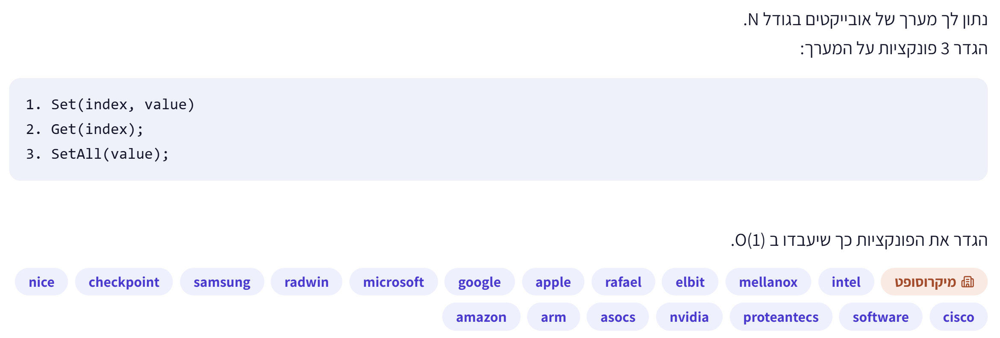

# PREP-006 — מערך עם Set, Get ו־SetAll בזמן קבוע

## השאלה המקורית

נתון לך מערך של אובייקטים בגודל N.
הגדר 3 פונקציות על המערך:

```text
1. Set(index, value)
2. Get(index);
3. SetAll(value);
```

הגדר את הפונקציות כך שיעבדו ב O(1).



## English translation

Given an array of N objects, implement Set(index, value), Get(index), and SetAll(value)
so that each operation runs in O(1) time.

## קטגוריות וחברות

תגית מקור: software. סיווג נוסף: מבני נתונים, מערכים, עדכון עצל וסיבוכיות זמן.

חברות לפי התמונה: NICE, Check Point, Samsung, RADWIN, Microsoft, Google, Apple,
Rafael, Elbit, Mellanox, Intel, Amazon, Arm, ASOCS, NVIDIA, proteanTecs, Cisco.
בתמונה מופיעה גם תווית ״מיקרוסופט״. השיוך מתעד את המקור שסופק ואינו מאומת עצמאית.

## מצב למידה

בהתאם להוראה הקבועה המעודכנת, השאלה, שלושת הרמזים והפתרון הוכנו ונשמרו אוטומטית.
הפתרון הוסבר בשיחה בהדרגה; לבקשת הראל הוצג גם קוד מלא עם מספר דור.
הרמזים המוכנים לא נמסרו כבקשות רמז נפרדות. הפתרון הוא `proposed`, ללא טענה לבדיקת מומחה.

## שלושה רמזים מדורגים

1. האם כדי שכל הקריאות הבאות יחזירו אותו ערך, חייבים באמת לכתוב את הערך לכל תא מיד? חשוב מה אפשר לשמור במקום מרכזי.
2. אחרי SetAll יכול להגיע Set לתא מסוים. Get צריך להבחין בין תא שעודכן מאז ה־SetAll האחרון לבין תא שלא עודכן. איזה מידע קטן אפשר לצרף לכל תא?
3. השתמש במזהה דור גלובלי חדש בכל SetAll ושמור ליד כל תא את הדור שבו בוצע לו Set. ב־Get השווה את דור התא לדור הנוכחי כדי לבחור בין הערך המקומי לערך הגלובלי.

## הצעה לפתרון

נשתמש בעדכון עצל: SetAll משנה את המשמעות הלוגית של התאים באמצעות מידע גלובלי.

נשמור מערך ערכים `values`, חותמת דור לכל תא `stamps`, מזהה דור נוכחי `epoch`
וערך גלובלי `all_value`. בתחילת העבודה כל התאים מסומנים בדור הנוכחי ומכילים את הערכים המקוריים.

```text
Set(i, value):
    values[i] = value
    stamps[i] = epoch

SetAll(value):
    all_value = value
    epoch = fresh_unique_token()

Get(i):
    if stamps[i] is epoch:
        return values[i]
    return all_value
```

ב־Python אפשר ליצור מזהה דור חדש באמצעות `object()` ולהשוות זהות באמצעות `is`.
כך אין צורך במונה שעלול לגלוש. כל עוד חותמת תא מפנה לדור ישן, האובייקט שלו נשאר חי
ולא יכול להתבלבל עם מזהה חדש. יש לכל היותר N+1 מזהי דור חיים דרך המבנה.

### למה זה נכון

נשמור את האינווריאנט: חותמת מהדור הנוכחי פירושה שהערך המקומי תקף;
חותמת ישנה פירושה שהערך הגלובלי האחרון תקף.

- באתחול כל הערכים המקומיים תקפים.
- Set הופך את הערך המקומי של תא אחד לתקף בדור הנוכחי.
- SetAll יוצר דור חדש, ולכן שום חותמת קיימת אינה מהדור הנוכחי וכל Get מחזיר את הערך הגלובלי החדש.
- Set מאוחר יותר מסמן שוב תא בודד בדור החדש, ומאפשר לו לחרוג מהערך הגלובלי.

### דוגמה

| פעולה | המערך הלוגי שמתקבל בקריאות Get |
|---|---|
| אתחול | `[10, 20, 30]` |
| `SetAll(7)` | `[7, 7, 7]` |
| `Set(1, 9)` | `[7, 9, 7]` |
| `SetAll(None)` | `[None, None, None]` |
| `Set(0, 4)` | `[4, None, None]` |

### סיבוכיות והנחות

| פעולה | זמן |
|---|---|
| אתחול מתוך מערך בן N איברים | O(N) |
| Set | O(1) |
| Get | O(1) |
| SetAll | O(1) |

זיכרון עזר: O(N) הפניות לחותמות ולמזהי הדורות. מספר ההפניות למידע הישן נשאר O(N),
אף אם האובייקטים עצמם גדולים. אין מעבר על המערך בזמן SetAll.

הפעולות מיטביות בזמן אסימפטוטי: כל פעולה דורשת לפחות עבודה קבועה, והמימוש מבצע מספר קבוע של צעדים.
הניתוח הוא במודל RAM של הפניות, עם השמת הפניה והקצאת מזהה קבוע־גודל כפעולות בסיסיות.
זמני GC, הקצאות ו־destructors שרירותיים ב־Python אינם הבטחת זמן אמת.

הערכים הם הפניות לאובייקטים: SetAll על אובייקט משתנה מציב לוגית אותה הפניה בכל תא,
ללא העתקה עמוקה. הממשק הוא הדרך לקרוא את המערך; מבט ישיר על מערך האחסון יכול להראות ערכים ישנים.
המימוש חד־תהליכי; טיפול בתחרות בין תהליכונים אינו חלק מהשאלה.

### מימוש ובדיקה

- [מימוש Python מלא](../solutions/prep_006_set_all_array.py).
- [גרסה לימודית עם מספר דור](../solutions/prep_006_set_all_array_versions.py), כפי שהוסבר בשיחה.
- [בדיקות מול מערך רגיל](../checks/check_prep_006.py).

בגרסה המספרית מגדילים מונה בכל SetAll ומשווים את חותמת התא למונה באמצעות `==`.
הניתוח O(1) מניח אריתמטיקה והשוואה של מזהה דור בעלות קבועה. מספרי Python אינם גולשים,
אבל אורכם יכול לגדול בריצה בלתי חסומה; גרסת מזהי האובייקטים נשמרת כמימוש שאינו תלוי במונה גדל.
אותן בדיקות ניתנות להרצה עם `--numeric` על הגרסה המספרית.

הבדיקות עברו: 4,096 רצפי פעולות באורך ארבע, 10,000 פעולות אקראיות עם seed קבוע,
מערך ריק, גבולות אינדקס, ערכי None ואובייקטים משתנים עם זהות משותפת.
האינדקסים החוקיים הם 0 עד N-1; שליליים וחורגים נדחים. SetAll על מערך ריק תקין.

### טעויות נפוצות

- מעבר על כל התאים ב־SetAll — הופך את הפעולה ל־O(N).
- שמירת ערך גלובלי בלי סימון לתאים — מאבדת עדכוני Set שהגיעו אחריו.
- שימוש ב־None לציון ״אין ערך״ — מתנגש בערך חוקי.
- ערבוב זמן האתחול O(N) עם זמן הפעולות O(1).
- הנחה שהעתקה עמוקה של אובייקט בגודל שרירותי היא O(1).

### English hints and solution

1. Must you physically write every cell immediately for all future reads to return one value? Consider what you could store centrally instead.
2. A Set may follow SetAll. Get must distinguish cells updated since the last SetAll from older cells. What small piece of metadata could you attach to each cell?
3. Give each SetAll a fresh global generation identifier and stamp each cell with the current generation on Set. Get compares the cell generation with the current one to choose its local value or the global value.

Keep local values, per-cell generation tokens, a current token and a global value. Initialize every
cell's token to the current one. Set writes a local value and stamps it with the current token.
SetAll changes only the global value and replaces the token with a fresh identity object.
Get returns the local value when its stamp matches the current token, otherwise the global value.
The invariant is that current stamps identify valid local values; older stamps defer to the latest
global write. This gives O(1) worst-case algorithmic work per operation, O(N) initialization and
O(N) auxiliary references. Values are stored by reference; deep copies and arbitrary runtime
allocation/GC/destructor costs are outside this reference-RAM analysis. The supplied Python code
passes exhaustive short sequences, seeded randomized checks and object-identity/bounds cases.

### תשובה קצרה לראיון

״אשמור ערך גלובלי ומזהה דור. SetAll יעדכן רק אותם, Set יסמן תא בדור הנוכחי,
ו־Get יחזיר את הערך המקומי רק אם הדור מתאים; אחרת יחזיר את הערך הגלובלי.
כך כל פעולה O(1), עם אתחול O(N) וזיכרון עזר O(N).״
