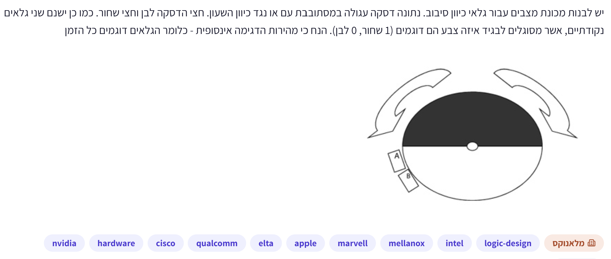
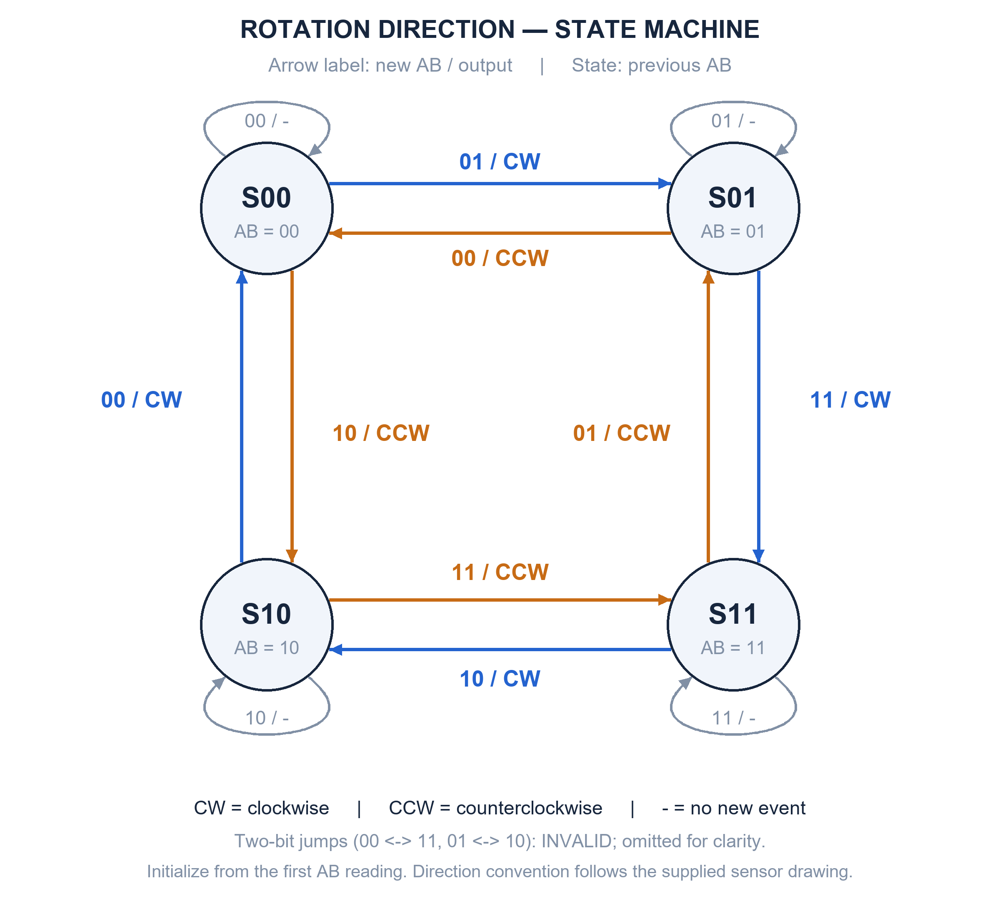

# PREP-007 — מכונת מצבים לזיהוי כיוון סיבוב בעזרת שני גלאים

## השאלה המקורית

יש לבנות מכונת מצבים עבור גלאי כיוון סיבוב. נתונה דיסקה עגולה המסתובבת עם או נגד כיוון השעון.
חצי הדיסקה לבן וחצי שחור. כמו כן ישנם שני גלאים נקודתיים, אשר מסוגלים להגיד איזה צבע הם
דוגמים (1 שחור, 0 לבן). הנח כי מהירות הדגימה אינסופית - כלומר הגלאים דוגמים כל הזמן.



בתמונה החצי העליון שחור והתחתון לבן. הגלאים סמוכים בצד השמאלי־תחתון של ההיקף,
A מעל B, ושניהם בצד הלבן סמוך לגבול. הציור אינו מציין זווית מדויקת בין הגלאים.

## English translation

Build a state machine for a rotation-direction detector. A circular disk rotates clockwise
or counterclockwise. Half is white and half black. Two point sensors report their observed
color (1 for black, 0 for white). Assume infinite sampling rate: the sensors sample continuously.
Their positions A and B are shown in the diagram.

## קטגוריות וחברות

- תגיות מקור: hardware, logic-design.
- סיווג נוסף: מכונות מצבים, מעגלים סינכרוניים, מקודדי סיבוב וזיהוי כיוון.
- חברות לפי התמונה: NVIDIA, Cisco, Qualcomm, Elta, Apple, Marvell, Mellanox, Intel.
- תווית ראשית: ״מלאנוקס״. השיוכים מתועדים מהמקור ואינם מאומתים עצמאית.

## מצב למידה

השאלה, שלושת הרמזים והפתרון המלא הוכנו ונשמרו בהתאם לנוהל הקבוע.
נמסר הרמז הראשון; הבא בתור הוא רמז 2. הפתרון המלא טרם הוצג בשיחה.
מצב הפתרון `proposed`, ללא בדיקת מומחה נטענת.

## שלושה רמזים מדורגים

1. קריאה אחת של A ו־B אומרת אילו צבעים הם רואים, אבל האם היא מספרת לאיזה כיוון הדיסקה זזה? עקוב אחרי הגבול בין השחור ללבן וחשוב מי מהגלאים משתנה קודם בכל כיוון.
2. כתוב את זוג הקריאות AB כמצב בעל שני ביטים. יש ארבע אפשרויות. צייר סיבוב איטי בכיוון אחד ורשום את סדר המצבים; בגלל מיקום הגלאים והדגימה הרציפה, רק ביט אחד משתנה בכל מעבר.
3. שמור את זוג הקריאות הקודם והשווה אותו לזוג החדש. אותו מצב נוכחי יכול להתקבל משני שכנים שונים: המעבר מאחד מצביע על כיוון אחד, ומהשני על הכיוון ההפוך. הוסף לולאה למצב שלא השתנה וטיפול נפרד לשינוי שני ביטים.

## רמז ראשון שנמסר

תסתכל על הגבול בין השחור ללבן כשהוא עובר ליד שני החיישנים: בכיוון סיבוב אחד הוא מגיע
קודם ל־A ואז ל־B; בכיוון ההפוך הסדר מתהפך. לכן המידע החשוב הוא סדר השינויים בקריאות.
התחל מהציור, שבו שניהם רואים לבן, ודמיין סיבוב קטן נגד כיוון השעון: מי יראה שחור ראשון?

## הצעה לפתרון

משתמשים במכונת Mealy בת ארבעה מצבים, השומרת את הקריאה הקודמת של שני הגלאים.
נסמן את הקלט `AB`, כאשר A הוא הביט הגבוה. הפלט מודיע על כיוון של מעבר שנצפה;
מצורף סימון תקפות כדי לא לייחס כיוון כשאין מעבר.

### קביעת הרצפים מתוך הגאומטריה

בהתחלה בתמונה שני הגלאים רואים לבן: `AB=00`.
בסיבוב נגד כיוון השעון, הגבול השמאלי של החצי השחור נע מטה ופוגש תחילה את A ואז את B.
לכן A עולה לפני B. בחצי הסיבוב הבא A גם יורד לפני B:

`CCW: 00 → 10 → 11 → 01 → 00`.

עם כיוון השעון מתקבל הסדר ההפוך:

`CW: 00 → 01 → 11 → 10 → 00`.

אין צורך בזווית הפרדה של 90 מעלות בדיוק. נדרשים גלאים שונים ולא מנוגדים קוטרית,
כפי שמצויר, כדי שהמעברים יהיו מדורגים. החלפת A ו־B הופכת את שמות הכיוונים.

### תרשים מצבים



כל עיגול הוא זוג הקריאות הקודם. תווית חץ היא `AB חדש / פלט`.
כחול מסמן עם כיוון השעון וכתום נגדו; לולאה אפורה מציינת קריאה שלא השתנתה, ללא אירוע חדש.
למשל `01 / CW` מ־S00 ל־S01 אומר: אם שמרנו 00 וכעת קיבלנו 01, נדווח עם השעון ונעבור ל־S01.
ארבעת המעברים שבהם שני הביטים משתנים אינם מצוירים כדי לשמור על קריאות;
הם מוגדרים כלא תקינים בטבלה המלאה. בתחילת העבודה נטען את זוג הקריאות הראשון כמצב.

### טבלת המעברים המלאה

המצב הוא הקריאה הקודמת. בכל תא מופיע הפלט; המצב הבא הוא תמיד AB הנוכחי.

| מצב קודם / AB חדש | 00 | 01 | 10 | 11 |
|---|---|---|---|---|
| S00 | ללא שינוי | CW | CCW | לא תקין |
| S01 | CCW | ללא שינוי | לא תקין | CW |
| S10 | CW | לא תקין | ללא שינוי | CCW |
| S11 | לא תקין | CCW | CW | ללא שינוי |

על שינוי של ביט יחיד מפיקים `valid=1` וכיוון. בלולאה עצמית `valid=0`.
בשינוי שני ביטים לא מנחשים כיוון: מפיקים שגיאה ומעדכנים את המצב לקריאה החדשה לשם התאוששות.
המעבר הלא תקין אינו צפוי בהנחות האידאליות, אך ההגדרה משלימה את הטבלה.

### משוואות לוגיות

```text
dA = A_prev XOR A
dB = B_prev XOR B
valid = dA XOR dB
error = dA AND dB
cw = A_prev XOR B     # משמעותי רק כאשר valid=1
next_state = AB
```

כאשר valid=1, `cw=1` פירושו עם כיוון השעון ו־`cw=0` נגדו, לפי מיקום הגלאים בציור.
השוואה זו נעשית מול המצב הישן, לפני עדכונו לקריאה החדשה.

### למה זה נכון ולמה ארבעה מצבים

בין שתי קריאות עוקבות שהשתנו, גבול צבע חצה גלאי אחד בלבד. לכן זוג הקריאות מתקדם
לשכן במעגל המצבים. ההתקדמות בכיוון אחד או ההפוך מזהה את כיוון תנועת הגבול.
מכיוון שהמצב שומר את הקריאה הקודמת, אפשר להחליט מיד במעבר הראשון, בלי לחכות לסיבוב שלם.

ארבעת המצבים ניתנים להבחנה: משני מצבים שכנים, בחירת אחד מהם כקלט הבא נותנת
ללא שינוי באחד וכיוון באחר. משני מצבים מנוגדים, מעבר לשכן משותף נותן כיוונים הפוכים.
לכן אי אפשר למזג מצבים תחת מפרט הפלט הזה. הליבה צריכה שני ביטי מצב, והלוגיקה קבועה בגודלה.
זו מינימליות במספר מצבי היסטוריה, לא הוכחה למינימום שטח פיזי של כל מימוש אפשרי.

### אתחול ופלט מתמשך

אם ידוע ששני הגלאים מתחילים בלבן, אפשר לאתחל ל־S00.
אם מתחילים בזווית שרירותית, קולטים את AB הראשון כמצב ואינם מדווחים כיוון עד לשינוי הבא.
קוד הייחוס משתמש ב־UNKNOWN עבור התצפית הראשונה. דגל האתחול הזה נוסף לליבה בת ארבעת המצבים.

אם רוצים שפלט הכיוון יישאר מוצג בין אירועים, מוסיפים אוגר last_direction ודגל אם כבר
נצפה כיוון, ומעדכנים רק במעבר תקין. פלט רשום או Moore מלא הם מפרטים אחרים שמצריכים
הגדרה ומניין זיכרון נפרדים; אין לכלול אותם בטענת שני ביטי הליבה ללא הסתייגות.

### מקרי קצה והנחות

- קריאה קבועה לא מוכיחה שהדיסקה נעצרה: היא עשויה לנוע בתוך אזור אחיד בלי לחצות גבול.
- היפוך כיוון באמצע הסיבוב הופך את המעבר הבא במעגל, ולכן מזוהה ללא השלמת סיבוב.
- שינוי שני ביטים אינו מאפשר לדעת איזה מהשינויים התרחש קודם.
- גלאים באותה נקודה או במיקומים מנוגדים קוטרית אינם מספקים את הסדר המדורג שהפתרון מניח.
- הדגימה האינסופית היא הנחה אידאלית של השאלה. בפועל יש להגדיר קצב תנועה, תדירות דגימה,
  סנכרון וטיפול ברעש; מודל הייחוס אינו מימוש אסינכרוני פיזי או הבטחת CDC.

### קוד ובדיקות

- [מודל FSM בפייתון](../solutions/prep_007_rotation_fsm.py).
- [בדיקות הטבלה והגאומטריה](../checks/check_prep_007.py).

נבדקו בהצלחה כל 16 המעברים, אתחול, התאוששות ממעבר לא תקין,
10,000 צעדים עם תנועה קדימה/אחורה/ללא שינוי, ו־3,600 צעדי זווית לכל כיוון סיבוב.
הבדיקה הגאומטרית השתמשה במיקומים מייצגים של A ו־B בצד השמאלי־תחתון,
ולא טוענת שהזוויות נמדדו מהתמונה. לא נבדקו תזמון פיזי, רעש או metastability.

## English hints and proposed solution

1. One A/B reading tells you the colors, but does it tell you the direction? Follow a black-white boundary and ask which sensor changes first in each direction.
2. Represent AB as a two-bit state with four possibilities. Trace a slow rotation and list its states. With these sensor positions and continuous observation, only one bit changes at each transition.
3. Remember the previous AB pair and compare it with the new one. The same current state can be reached from either neighbor, indicating opposite directions. Add self-loops for unchanged readings and separate handling for two-bit changes.

With A above B on the lower-left rim and black=1, CCW follows `00,10,11,01,00`, while CW
follows the reverse cycle `00,01,11,10,00`. Use four Mealy states storing the previous AB pair.
A neighboring transition reports direction, a self-loop reports no observed change, and a
two-bit jump reports invalid without inferring direction. Always update the state to the
current pair; initialize from the first reading without a direction result.

Let `dA=A_prev XOR A` and `dB=B_prev XOR B`. Then `valid=dA XOR dB`,
`error=dA AND dB`, and, when valid, `cw=A_prev XOR B`.
All four previous-pair states are distinguishable, requiring two state bits after initialization.
Startup tracking, persistent direction storage or output registers are separate additions.
No-change readings do not prove the disk is stopped. Real hardware requires sampling and
synchronization design beyond the problem's ideal continuous-observation assumption.

## תשובה קצרה לראיון

״אשמור את זוג הקריאות הקודם כמצב. ארבעת הצירופים מסתדרים במעגל שבו רק ביט אחד
משתנה בכל מעבר. כיוון ההתקדמות במעגל קובע CW או CCW. ליבה של ארבעה מצבים מספיקה,
כלומר שני ביטי זיכרון; בתחילת העבודה הכיוון לא ידוע עד למעבר הראשון.״

## מקור טכני

[Microchip — Quadrature Encoding](https://onlinedocs.microchip.com/oxy/GUID-954122A4-C243-4CDD-AAB7-64D199581D04-en-US-5/GUID-96E15BCB-15F0-4DC6-876D-66EBF4B40CC7.html)
תומך בעיקרון של ארבעה מצבי Gray משני אותות עם הפרש מופע. הקביעה איזה רצף הוא CW בציור
המסוים נגזרה ממיקום הגלאים ונבדקה גאומטרית; אין כאן טענה שהציור מגדיר הפרש מופע של 90 מעלות.
המקור אינו מאמת את שיוך השאלה לחברות.
