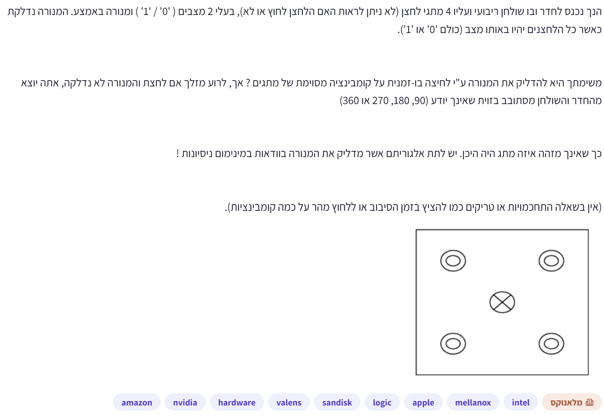
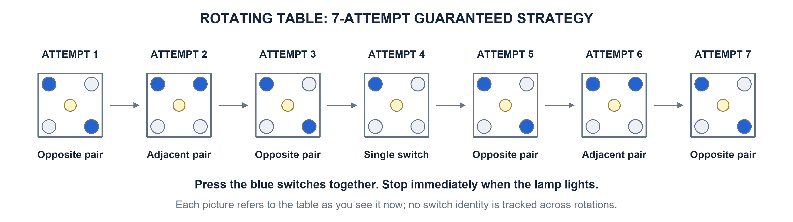

# PREP-008 — ארבעה מתגים נסתרים על שולחן מסתובב

## השאלה המקורית והשרטוט

הנך נכנס לחדר בו שולחן ריבועי ועליו 4 מתגי לחצן (לא ניתן לראות האם הלחצן לחוץ או לא),
בעלי 2 מצבים ('0' / '1') ומנורה באמצע. המנורה נדלקת כאשר כל הלחצנים יהיו באותו מצב (כולם '0' או '1').

משימתך היא להדליק את המנורה ע״י לחיצה בו-זמנית על קומבינציה מסוימת של מתגים? אך,
לרוע מזלך אם לחצת והמנורה לא נדלקה, אתה יוצא מהחדר והשולחן מסתובב בזווית שאינך יודע (90, 180, 270 או 360)

כך שאינך מזהה מתג מהו היה היכן. יש לתת אלגוריתם אשר מדליק את המנורה בוודאות במינימום ניסיונות!

(אין בשאלה התחכמויות או טריקים כמו להציץ בזמן הסיבוב או ללחוץ מהר על כמה קומבינציות).

## English translation

A square table has four two-state switches whose 0/1 states cannot be observed, and a central
lamp that lights when all four agree. In one attempt, press a chosen subset simultaneously.
After failure, leave the room; the table rotates by an unknown 90, 180, 270 or 360 degrees,
preventing identification of the old switch positions. Give a strategy that guarantees lighting
the lamp in the minimum number of attempts. No observing the rotation or trying multiple
combinations within one attempt.

## קטגוריות וחברות

- תגיות מקור: hardware, logic.
- סיווג נוסף: חידות היגיון, סימטריה, אינווריאנטים, תכנון תחת אי־ודאות וחיפוש במרחב מצבים.
- חברות לפי המקור: Amazon, NVIDIA, Valens, SanDisk, Apple, Mellanox, Intel.
- תווית ראשית: ״מלאנוקס״. זהו שיוך מהמקור שסופק, ללא אימות עצמאי.

## שלושה רמזים מדורגים

1. הסיבוב מסתיר את זהות המתגים, אבל שומר על יחסים כמו ״שכנים״ ו״מול זה לזה״. נסה לסווג את המצבים לפי הצורה שלהם, בלי לתת שמות קבועים למתגים.
2. כשהמנורה כבויה יש שלושה סוגי מצב, אם מתעלמים מסיבוב ומהחלפת 0 ו־1: מתג יחיד שונה מהשאר; שני מתגים שכנים במצב 1; או שני מתגים אלכסוניים במצב 1. אילו פעולות יכולות להדליק כל סוג, ומה אפשר להסיק מכישלון?
3. התחל בלחיצה על זוג אלכסוני. אם המנורה לא נדלקת, אפשר לשלול את הסוג האלכסוני ולבחון רק את הסוגים שנותרו. בכל ניסיון עקוב אחרי קבוצת סוגי המצבים שעדיין אפשרית אחרי לחיצה וסיבוב, ולא אחרי סידור יחיד שניחשת.

## הנחות

לחיצה הופכת 0 ל־1 או 1 ל־0, ולא קובעת ערך ידוע. אפשר לבחור כל תת־קבוצה וללחוץ עליה
בו־זמנית. המידע היחיד שמתקבל הוא אם המנורה נדלקה. אין סימון או זיהוי של מתגים לאורך סיבובים.
הסיבוב יכול להיות כל אחת מארבע האפשרויות בכל פעם, גם באופן שמקשה עלינו ככל האפשר.
סיבוב 360 שקול ל־0. המטרה היא חסם ודאי במקרה הגרוע, ולא מספר ניסיונות צפוי.
בודקים אם המנורה כבר דולקת לפני ההתחלה ועוצרים מיד כשהיא נדלקת.

## הצעה לפתרון

**7 ניסיונות מספיקים במקרה הגרוע, וזה גם המינימום.**

הרצף הוא:

1. זוג מתגים אלכסוניים.
2. זוג מתגים שכנים.
3. זוג מתגים אלכסוניים.
4. מתג יחיד.
5. זוג מתגים אלכסוניים.
6. זוג מתגים שכנים.
7. זוג מתגים אלכסוניים.

בכל ניסיון בוחרים לפי מיקום המתגים מולנו כרגע; אין צורך לזהות את אותם מתגים פיזיים מהניסיון הקודם.
אם המנורה נדלקת, עוצרים ולא ממשיכים ברצף.

### איך מגיעים לרעיון

הסיבוב משנה מיקומים, אבל אינו משנה את סוג התבנית. גם החלפת כל האפסים באחדות ולהפך
אינה משנה את השאלה: גם 0000 וגם 1111 הם הצלחה. לכן נשארים שלושה סוגים של מצבים כושלים:

- `O`: מתג אחד שונה משלושת האחרים — אחד או שלושה מתגים במצב 1.
- `A`: שני מתגים שכנים במצב 1 והשניים האחרים 0.
- `D`: שני מתגים אלכסוניים במצב 1 והשניים האחרים 0.

הרעיון הוא לנצל כישלון: אם לחיצה הייתה בהכרח מצליחה עבור סוג מסוים, והוא לא קרה,
אפשר להסיר את הסוג הזה. צריך גם לעקוב אחרי השינוי שהלחיצה עצמה עשתה בסוגים שנותרו.

### טבלת ההשפעה של פעולה, בתנאי שהמנורה נשארה כבויה

| סוג קודם | מתג יחיד | זוג שכנים | זוג אלכסוני |
|---|---|---|---|
| O | A או D | O | O |
| A | O | D | A |
| D | O | A | אין מצב כושל — הצלחה ודאית |

לדוגמה, זוג אלכסוני פותר כל מצב מסוג D: לוחצים על שתי האחדות ומקבלים 0000,
או על שני האפסים ומקבלים 1111. במצב A אותה פעולה משאירה זוג שכנים, ובמצב O
היא משאירה מספר אי־זוגי של אחדות.

### הוכחת הצלחה של הרצף

מעדכנים את כל קבוצת האפשרויות בכל שלב:

| אחרי ניסיון | מה לחצנו | אילו סוגים עוד אפשריים אם נכשלנו? |
|---|---|---|
| לפני ההתחלה | — | O, A, D |
| 1 | אלכסון | O, A |
| 2 | שכנים | O, D |
| 3 | אלכסון | O |
| 4 | יחיד | A, D |
| 5 | אלכסון | A |
| 6 | שכנים | D |
| 7 | אלכסון | אף סוג — כישלון אינו אפשרי |

### למה אי אפשר להבטיח פחות משבעה

כל עוד לא הצלחנו, תמיד התקבלה אותה תשובה: ״המנורה כבויה״. לכן גם אסטרטגיה שמסתעפת
לפי התוצאות חייבת לקבוע מסלול אחד להמשך הכישלונות. נבחן את קבוצת המצבים שאפשריים במסלול הזה.

בגלל הסימטריה, כל קבוצת אפשרויות היא איחוד של O, A, D. נגדיר משקל:

`W = 4*[O עדיין אפשרי] + 2*[A עדיין אפשרי] + 1*[D עדיין אפשרי]`.

כל אפשרויות הלחיצה מסתכמות בארבעה סוגים: יחיד (או שלושה), שכנים, אלכסון,
או אף מתג (או כל הארבעה). פעולות בסוגריים שקולות ברמת הסוגים בשל סימטריית ההשלמה.

| קבוצת אפשרויות | W | אחרי יחיד | אחרי שכנים | אחרי אלכסון |
|---|---:|---|---|---|
| ריקה | 0 | ריקה | ריקה | ריקה |
| D | 1 | O | A | ריקה |
| A | 2 | O | D | A |
| A,D | 3 | O | A,D | A |
| O | 4 | A,D | O | O |
| O,D | 5 | O,A,D | O,A | O |
| O,A | 6 | O,A,D | O,D | O,A |
| O,A,D | 7 | O,A,D | O,A,D | O,A |

אפשר לבדוק בכל שורה: שום פעולה אינה מורידה את W ביותר מאחד.
אף מתג או כל הארבעה אינם משנים את קבוצת הסוגים.
מתחילים עם W=7; כדי להבטיח הצלחה צריך שקבוצת האפשרויות לכישלון תהיה ריקה, כלומר W=0.
לכן נדרשים לפחות שבעה ניסיונות במקרה הגרוע. הרצף שהצגנו משיג בדיוק את הגבול הזה.

### בדיקה ממצה

- [מודל מדויק וחיפוש אסטרטגיה ב־BFS](../solutions/prep_008_rotating_switches.py).
- [בדיקות נכונות ומינימליות](../checks/check_prep_008.py).

נבדקו כל 14 מצבי ההתחלה שבהם המנורה כבויה וכל `4^6` אפשרויות הסיבוב בין שבעת הניסיונות:
**57,344 מסלולים**, כולם הסתיימו בהצלחה עד ניסיון 7, וחלקם נזקקו לניסיון השביעי.

בנפרד, חיפוש BFS על קבוצות המצבים המדויקות בדק את כל 16 מסכות הלחיצה וכל ארבעת הסיבובים
ומצא אסטרטגיה קצרה ביותר באורך 7. כך בדיקת האופטימליות אינה מסתמכת רק על הצלחת הרצף המסוים.

### English hints and solution

1. Rotation hides switch identities but preserves adjacency and opposite corners. Classify configurations by their shape instead of assigning persistent names to switches.
2. Ignoring rotation and swapping 0 with 1, unlit configurations have three types: one switch differs from the other three, two adjacent ones, or two diagonal ones. Which presses can solve each type, and what does failure tell you?
3. Begin by toggling a diagonal pair. If the lamp stays off, the diagonal configuration type is ruled out. Track the whole set of configuration types still possible after each press and unknown rotation, rather than guessing a single arrangement.

The optimal worst-case strategy takes seven attempts: diagonal, adjacent, diagonal, single,
diagonal, adjacent, diagonal. Stop as soon as the lamp lights. Choose subsets relative to the
currently visible table, without tracking physical switch identities.

Let O be the one-odd-switch type, A adjacent ones, and D diagonal ones. The surviving failure
beliefs are `O+A+D → O+A → O+D → O → A+D → A → D → empty`. Empty means failure is impossible.
Assign potential `4*[O possible]+2*[A possible]+[D possible]`. The complete failure-action table
shows this potential drops by at most one per press. It starts at 7 and must reach 0, proving
the lower bound of seven. Exact belief-state BFS and 57,344 initial-state/rotation paths
independently verify the strategy and minimum bound under the stated assumptions.

### תשובה קצרה לראיון

״אסווג מצבים לפי צורה שנשמרת בסיבוב: מתג אחד שונה, זוג שכנים או זוג אלכסוני.
אלחץ אלכסון, שכנים, אלכסון, יחיד, אלכסון, שכנים, אלכסון, ואעצור בהצלחה.
כל כישלון מעדכן את קבוצת האפשרויות עד שלא נותר מצב כושל אחרי שבעה ניסיונות.
אפשר להוכיח מינימליות בעזרת משקל על קבוצות האפשרויות שיורד לכל היותר באחד בכל פעולה.״

### שרטוטים ומקורות

צילום המקור נשמר ללא החלפה ב־`sources/prep-008.png` ומכיל גם את תרשים השולחן.
שרטוט הפתרון נשמר בנפרד ב־`diagrams/prep-008-strategy.png`.
[מחולל השרטוט](../solutions/draw_prep_008_strategy.py) מאפשר לייצר אותו מחדש.
הפתרון מבוסס על המודל וההוכחה המפורטים כאן; לא נטען שהפתרון או החברה אומתו על ידי מראיין.
