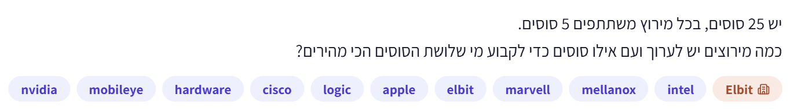

# PREP-009 — מציאת שלושת הסוסים המהירים מתוך 25

## השאלה המקורית

יש 25 סוסים, בכל מירוץ משתתפים 5 סוסים.
כמה מירוצים יש לערוך ועם אילו סוסים כדי לקבוע מי שלושת הסוסים הכי מהירים?

## קטגוריות וחברות

- תגיות מקור: hardware, logic.
- סיווג נוסף: חידות היגיון, אלגוריתמים, בחירה באמצעות השוואות, פסילת מועמדים וסדר חלקי.
- חברות לפי צילום המקור: NVIDIA, Mobileye, Cisco, Apple, Elbit, Marvell, Mellanox, Intel.
- תווית ראשית: Elbit. השיוך לחברות מבוסס על המקור, ללא אימות עצמאי.

## שלושה רמזים מדורגים

1. חלק את הסוסים לקבוצות של חמישה והריץ כל קבוצה. חשוב מה סדר ההגעה מלמד אותך בתוך כל קבוצה, ומה עדיין אינך יודע על סוסים מקבוצות שונות.

2. אחרי המירוצים הראשונים, השווה בין מנצחי הקבוצות. כלל שימושי: אם אתה יודע ששלושה סוסים מהירים מסוס מסוים, הוא כבר לא יכול להיות בשלישייה הראשונה.

3. סמן את הקבוצות A עד E לפי סדר ההגעה של המנצחים. מהקבוצה A עדיין מעניינים שלושת הראשונים, מ־B שני הראשונים ומ־C הראשון. אחד מהם כבר מובטח במקום הראשון — כמה מועמדים נשארו לשני המקומות האחרים?

## הצעה לפתרון

**התשובה: 7 מירוצים כדי להבטיח מציאת שלושת המהירים ביותר.**

מניחים שאין שעון עצר: מכל מירוץ מקבלים רק סדר הגעה. בנוסף, סדר המהירויות קבוע ואין תיקו. ההנחות האלה אינן מופיעות בצילום וצריך לברר אותן בראיון.

**1. חמישה מירוצים — מיון בתוך קבוצות.** מחלקים את 25 הסוסים לחמש קבוצות של חמישה, ומריצים כל קבוצה. המספר בתוך כל קבוצה מציין את מקום הסוס במירוץ שלה: 1 המהיר ביותר, אחריו 2 וכן הלאה.

**2. מירוץ שישי — השוואת המנצחים.** מריצים את חמשת מנצחי הקבוצות. עכשיו נותנים לקבוצות שמות לפי התוצאה: A1 הגיע ראשון, אחריו B1, C1, D1, E1. אלה שמות שנבחרים אחרי המירוץ, ולא הנחה על התוצאה מראש.

A1 הוא המהיר ביותר מכולם: הוא ניצח את כל מנצחי הקבוצות, וכל אחד מהם ניצח את שאר הסוסים בקבוצתו.

**3. מסננים בעזרת כלל אחד:** סוס שיש לפחות שלושה סוסים שידוע כי הם מהירים ממנו לא יכול להיות בשלישייה.

| קבוצה | מי עדיין יכול להיות בשלישייה? | למה היתר נפסלים? |
| --- | --- | --- |
| A | A1, A2, A3 | לפני A4 ו־A5 יש לפחות שלושה סוסים מאותה קבוצה |
| B | B1, B2 | לפני B3 והבאים יש A1, B1, B2 |
| C | C1 | לפני C2 והבאים יש A1, B1, C1 |
| D ו־E | אף אחד | A1, B1, C1 מהירים אפילו ממנצחי הקבוצות האלה |

**4. מירוץ שביעי.** A1 כבר במקום הראשון. מריצים את חמשת הנותרים: **A2, A3, B1, B2, C1**. המנצח במירוץ הזה הוא השני הכללי, והבא אחריו הוא השלישי הכללי.

האינטואיציה: לא צריך להשוות כל סוס לכל סוס. מספיק לפסול סוסים שכבר יש שלושה טובים מהם.

**למה לא לעצור אחרי המירוץ השישי?** למשל, גם הסדר A1,A2,A3 וגם הסדר A1,B1,C1 יכולים להתאים לתוצאות שראינו עד אז. מנצחי הקבוצות לבדם אינם בהכרח השלישייה המהירה.

**מינימליות:** שבעה הם המינימום להבטחה במקרה הגרוע. ההסבר האחרון מוכיח שהשיטה שהצגנו צריכה מירוץ נוסף; הוא כשלעצמו אינו הוכחה נגד כל אסטרטגיה אפשרית. לנימוק הכללי ראו את [הדיון וההוכחה מאת san](https://math.stackexchange.com/questions/1361065/why-6-races-are-not-sufficient-in-the-25-horses-5-tracks-problem): מנתחים כמה סוסים השתתפו לפני המירוץ השישי, ומראים שלא ניתן להבטיח שהמועמדים שנותרו ייכנסו כולם למירוץ המכריע. ייתכנו תוצאות נוחות שבהן אסטרטגיה אחרת תסיים בשישה; הדרישה כאן היא להצליח תמיד.

**אם יש זמני ריצה מדויקים ובני־השוואה**, מספיקים חמישה מירוצים: כל סוס רץ פעם אחת, ובוחרים את שלושת הזמנים הטובים ביותר. לכן מגבלת המידע חיונית.

## בדיקה וקוד

[קוד האסטרטגיה](../solutions/prep_009_horse_races.py) מקבל פונקציית מירוץ המחזירה סדר בלבד.
[בדיקה](../checks/check_prep_009.py) עברה על 23,800 סדרי מהירות: כל 13,800 האפשרויות למיקומים המסודרים של שלושת המהירים, כשהיתר בסדר קבוע, ועוד 10,000 סדרים אקראיים עם seed קבוע. בכל בדיקה התקבלו שלושת הסוסים בסדר הנכון בשבעה מירוצים חוקיים. זו בדיקת נכונות ולא חיפוש ממצה על כל האסטרטגיות או על כל 25! הסדרים.

## תשובה קצרה לראיון

בהנחה שאין זמני ריצה, אריץ חמש קבוצות ואז את חמשת המנצחים. אסמן את הקבוצות לפי דירוג המנצחים A עד E. A1 ראשון כללי; לפעמים סוס שלא ניצח בקבוצה עדיין מהיר ממנצח של קבוצה אחרת. לכן אריץ A2,A3,B1,B2,C1: שני הראשונים הם השני והשלישי הכלליים. בסך הכול שבעה מירוצים.

## טעויות נפוצות

- בחירת שלושת מנצחי הקבוצות בלי לבדוק את סגני המנצחים.
- הנחה שסוס שלא ניצח בקבוצה שלו לא יכול להיות בשלישייה.
- הכנסת A1 למירוץ האחרון למרות שמקומו כבר ידוע.
- ערבוב בין סדר הגעה לבין זמני ריצה בני־השוואה.
- טענה שחמש קבוצות הן האפשרות היחידה, ולכן 5+1+1 היא בפני עצמה הוכחת מינימום כללית.

## English

There are 25 horses. Each race has five horses. How many races must be held, and with which horses, to determine the three fastest?

Hint 1: Split the horses into groups of five and race each group. Which comparisons does this establish, and which comparisons between groups remain unknown?

Hint 2: Race the group winners. A horse can be eliminated from the overall top three once three distinct horses are known to be faster.

Hint 3: Rename the groups A through E by their winners' finishing order. Keep the top three from A, top two from B and winner of C. One already has the overall first place; how many remain for the other two places?

Seven races guarantee the fastest three, assuming only finishing order is observed, each horse has a fixed distinct speed, and results are transitive across races. Race five disjoint groups of five. Race their five winners, then rename the groups A,B,C,D,E in that winners' finishing order; subscripts indicate positions in the initial group race. A1 is the overall fastest. A4 and A5 have three faster groupmates. B3 and slower have A1,B1,B2 ahead; C2 and slower have A1,B1,C1 ahead; all horses in D and E also have A1,B1,C1 ahead. Thus race A2,A3,B1,B2,C1 in the seventh race. Its first two finishers are overall second and third. This proves sufficiency. For this grouping, both overall triples A1,A2,A3 and A1,B1,C1 remain possible after race six, so the winners' race alone is insufficient. The general worst-case lower bound, across other strategies too, is discussed in san's proof at https://math.stackexchange.com/questions/1361065/why-6-races-are-not-sufficient-in-the-25-horses-5-tracks-problem ; it considers the number of distinct horses seen before the final race and remaining candidates. Seven is the guaranteed bound, not a claim that no lucky six-race outcome exists. With exact comparable race times instead, five races suffice by timing every horse once. The screenshot does not specify timing, stable speeds, or ties, so these are solution assumptions.

הפתרון והרמזים נוצרו בסיוע AI, נבדקו כמתואר וממתינים לסקירת תוכן; טרם פורסמו באתר.

