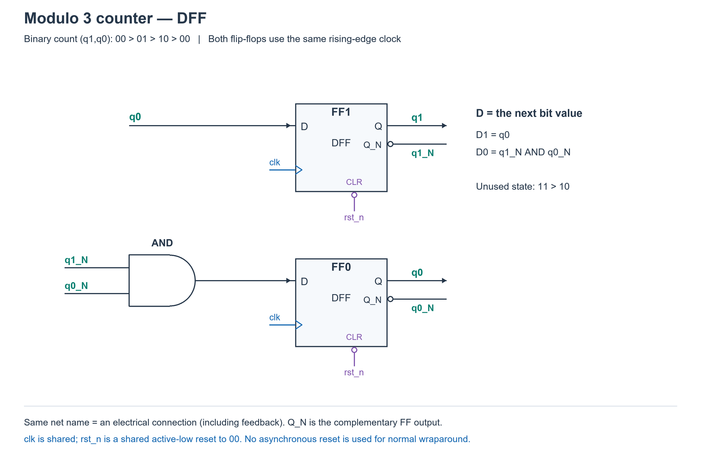
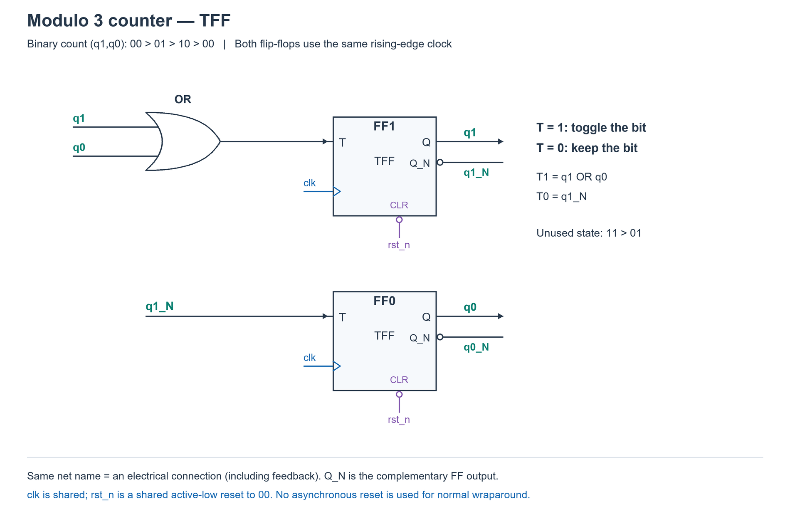
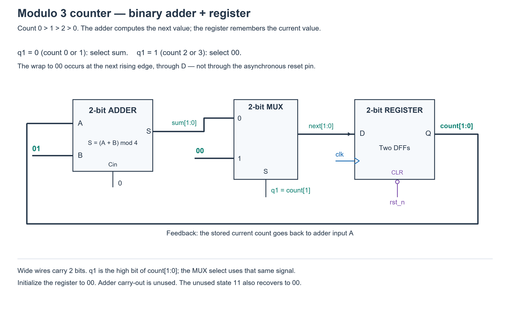

# PREP-010 — דרך תכנון, מוצאים מהופכים ומוני מודולו 3

הרחבה ל״הצעה לפתרון״, לפי בקשת הראל. נוסח שאלת המקור ושיוכי החברות אינם משתנים. השרטוטים וההסברים הם תוכן לימודי נוסף.

## איך ניגשים לשאלות כאלה?

1. **מגדירים מה מבקשים לראות במוצא.** במונה: רצף המספרים. במחלק תדר: זמן המחזור וזמן גבוה/נמוך. כאן תדר חלקי 3 ו־50% פירושם 3T למחזור ו־1.5T לכל רמה.
2. **קובעים מה צריך לזכור.** שלושה מצבים דורשים לפחות שני ביטי זיכרון, כי ביט אחד מבחין רק בין שני מצבים.
3. **כותבים את רצף המצבים ואת טבלת המעברים לפני שמציירים שערים.** מגדירים גם מה קורה באיפוס ובמצב שלא משתמשים בו.
4. **מתרגמים את הטבלה לסוג ה־FF.** ב־DFF, הכניסה D היא ערך הביט הרצוי בצעד הבא. ב־TFF, הכניסה T היא 1 אם הביט צריך להתהפך ו־0 אם עליו להישאר.
5. **מפשטים את משוואות הכניסות.** משתמשים באלגברה בוליאנית או במפת קרנו, וב־Q_NOT אם הוא זמין ברכיב. לא מניחים מראש אילו שערים צריך.
6. **מחברים ובודקים מחזור שלם.** כל FF באותה חזית קורא את הערכים הישנים; הם מתעדכנים יחד. בודקים בנפרד את המוצא ואת תזמונו, ולא מסתפקים בכך שהמונה סופר נכון.

במחלק התדר צריך גם FF בחזית יורדת כדי לקבל את חצי המחזור הנוסף; שני FF של המונה לבדם לא נותנים DC של 50%.

## Q ו־Q_NOT

Q הוא הביט השמור ו־Q_NOT הוא ההיפוך שלו: אם Q=0 אז Q_NOT=1, ולהפך. אלה אינם שני ביטי זיכרון עצמאיים. בתרגיל נניח שמוצא מהופך זמין; לא בכל רכיב פיזי יש פין כזה.

חוק דה־מורגן נותן:

`NOT(q1 OR q0) = q1_NOT AND q0_NOT`

לכן אפשר להחליף את שער ה־NOR ב־AND המקבל את המוצאים המהופכים ישירות. שני המימושים מבצעים בדיוק אותה פונקציה; בלי מידע על ספריית תאים לא קובעים שאחד מהיר או קטן יותר.

## מחלק התדר באמצעות AND

במחלק הזה בחרנו את המצבים `00 → 10 → 01 → 00`. הסדר מספיק כדי לחזור פעם בשלושה מחזורים; הוא אינו רצף המספרים העולה של מונה בינארי.

החיבורים הם:

```text
D1      = q1_NOT AND q0_NOT
D0      = q1
D_DELAY = q1       (FF בחזית יורדת)
out     = q1 OR delayed
```

מתחילים ב־q1=q0=delayed=0; המוצאים המהופכים של המונה הם אוטומטית 1.

| המצב לפני חזית עולה | D1: האם שני הביטים 0? | D0: הערך הישן של q1 | המצב אחרי החזית |
| --- | --- | --- | --- |
| 00 | 1 | 0 | 10 |
| 10 | 0 | 1 | 01 |
| 01 | 0 | 0 | 00 |

לכן q1 גבוה מחזור אחד מתוך שלושה. ה־FF בחזית היורדת מחזיק עותק שלו שמאחר בחצי מחזור. כש־q1 יורד, העותק עדיין גבוה עוד חצי מחזור. שער OR משאיר את המוצא גבוה עד שגם העותק יורד. מתקבלים 1.5T גבוה ו־1.5T נמוך.


נדרש שעון כניסה בעל DC של 50% כדי לקבל את הזמנים האלה במודל האידאלי. כאשר הקלט אינו סימטרי, המימוש עדיין מחלק את התדר ב־3, אך ה־DC שלו יהיה (1+d)/3, כאשר d הוא החלק הגבוה של מחזור הכניסה.

## מונה מודולו 3: 0 → 1 → 2 → 0

מודולו 3 פירושו שלושה ערכים, 0,1,2. מונה שמציג גם 3 למשך מחזור שלם ואז חוזר ל־0 הוא מודולו 4.

לשלוש הגרסאות הבאות נבחר קידוד בינארי רגיל: q1 הוא הביט המשמעותי ו־q0 הוא הביט הפחות משמעותי.

| ספירה נוכחית | מצב נוכחי | מצב הבא | D1 | D0 | T1 | T0 |
| --- | --- | --- | --- | --- | --- | --- |
| 0 | 00 | 01 | 0 | 1 | 0 | 1 |
| 1 | 01 | 10 | 1 | 0 | 1 | 1 |
| 2 | 10 | 00 | 0 | 0 | 1 | 0 |

### א. שני DFF ושער AND

**D הוא מה שרוצים לשמור בחזית הבאה.**

```text
D1 = q0
D0 = q1_NOT AND q0_NOT
```

- ב־00, רק הביט הנמוך צריך לעלות: ה־AND מזהה ששני הביטים 0.
- ב־01, מעתיקים את q0=1 לביט הגבוה, ובמקביל הביט הנמוך יורד.
- ב־10, q0=0 וה־AND=0, ולכן שני הביטים חוזרים ל־0.

במצבים החוקיים, הערך הבא של q1 שווה תמיד ל־q0 הנוכחי, ולכן מספיק חוט ללא שער נוסף. בחרנו להשאיר את הפישוט גם במצב 11; הוא עובר ל־10 ומשם חוזר למסלול התקין. אין כאן הנחה שהמצב 11 הוא מצב ספירה רגיל.



### ב. שני TFF ושער OR

TFF פועל כך: T=0 שומר את הביט, ו־T=1 הופך אותו. באופן אלגברי `T = Q XOR Q_next`.

**שואלים על כל ביט: האם צריך לשנות אותו?**

- 00 → 01: רק הביט הנמוך משתנה, לכן T1T0=01.
- 01 → 10: שני הביטים משתנים, לכן T1T0=11.
- 10 → 00: רק הביט הגבוה משתנה, לכן T1T0=10.

מתקבל:

```text
T1 = q1 OR q0
T0 = q1_NOT
```

כל עוד q1=0, הביט הנמוך מתהפך; כשהגענו ל־2 (10), q1=1 ולכן הביט הנמוך נשאר 0. הביט הגבוה מתהפך בכל מצב חוקי חוץ מ־00. המצב הלא־בשימוש 11 עובר ל־01.



### ג. מחבר בינארי, MUX ואוגר של שני ביטים

כן, אפשר להשתמש במחבר, אבל **מחבר אינו זוכר את הספירה**. צריך אוגר של שני ביטים, כלומר שני DFF.

1. האוגר מחזיק את הספירה הנוכחית `count`.
2. מחבר של שני ביטים מחשב `sum = count + 01`; Cin=0 והנשא היוצא אינו בשימוש.
3. MUX בוחר בין sum לבין 00.
4. בחזית העולה האוגר שומר את הבחירה.

```text
next = 00       if q1 == 1
next = count+1  if q1 == 0
```

למה q1 מספיק בתור בחירה? במצבים החוקיים, q1=1 רק במספר 2. לכן ב־0 וב־1 בוחרים תוספת 1, וב־2 בוחרים 0. זה גם מחזיר את המצב הלא־בשימוש 3 ל־0.



החזרה ל־0 מתבצעת דרך כניסות D בחזית הבאה, ולא באמצעות הפעלת כניסת האיפוס האסינכרונית בכל ספירה. איפוס rst_n משמש לאתחול. למונה קטן כזה, פתרון DFF עם AND אחד קומפקטי יותר מתרשים המחבר וה־MUX המפורש; כלי סינתזה עשוי לפשט את שתי צורות התיאור לאותה לוגיקה.

## סימונים ובדיקה

בשרטוטים Q_N פירושו Q_NOT. תוויות זהות הן חיבורים לאותה רשת חשמלית; למשל q1_N בכניסת השער מחובר למוצא q1_N של FF1. כל clk הוא אותו שעון, וכל rst_n הוא אותו איפוס פעיל בנמוך. במונים כולם פועלים בחזית עולה; רק במחלק התדר ה־FF השלישי פועל בחזית יורדת.

[בדיקת הגרסאות](../checks/check_prep_010_variants.py) בדקה שקילות AND/NOR בכל ארבעת מצבי המונה, את מחלק התדר מכל שמונת מצבי ה־FF ההתחלתיים, ואת כל ארבעת המצבים ו־120 צעדי ספירה בכל מימוש מונה. כל הבדיקות עברו. אלה בדיקות משוואות ב־Python, לא סימולציית HDL ולא תזמון פיזי. ארבעת השרטוטים נבדקו מול המשוואות.

[מודלי המונים](../solutions/prep_010_mod3_variants.py) · [מחולל שרטוטי המונים](../solutions/draw_prep_010_mod3_counters.py) · [מחולל המחלק — שימוש בדגל --and](../solutions/draw_prep_010_circuit.py)

## שינוי ה־Duty Cycle

יש להבחין בין ה־DC הרצוי במוצא לבין ה־DC של שעון הכניסה.

### DC אחר במוצא, עדיין חלוקת תדר ב־3

נניח תחילה ששעון הכניסה נשאר בעל DC של 50%. זמן המחזור במוצא נשאר 3T, ורק החלוקה לזמן גבוה ונמוך משתנה. עבור DC רצוי r, מחשבים `T_high = r*3T` ו־`T_low = (1-r)*3T`.

האות p=q1 מהמונה גבוה T פעם בכל 3T. delayed הוא העותק שמתקבל מה־FF בחזית יורדת, ולכן מפגר בחצי מחזור. אפשר לשמור את המונה ולבחור פונקציית מוצא אחרת:

| DC רצוי במוצא | זמן גבוה | זמן נמוך | פונקציית מוצא |
| --- | --- | --- | --- |
| 1/6 ≈ 16.7% | 0.5T | 2.5T | `p AND NOT(delayed)` |
| 1/3 ≈ 33.3% | T | 2T | `p` |
| 1/2 = 50% | 1.5T | 1.5T | `p OR delayed` |
| 2/3 ≈ 66.7% | 2T | T | `NOT(p)` |
| 5/6 ≈ 83.3% | 2.5T | 0.5T | `NOT(p AND NOT(delayed))` |

האינטואיציה: המונה כבר נותן 33.3%; היפוך האות נותן 66.7%; OR מאריך את הפולס בחצי מחזור ונותן 50%; AND עם ההיפוך של העותק משאיר רק את חצי המחזור הראשון, עד שהעותק עולה. היפוך הפולס הקצר נותן 83.3%.

ל־33.3% ול־66.7% אין צורך ב־FF בחזית יורדת או בשער OR של הרחבת הפולס. אם Q_NOT זמין, אפשר לקחת ממנו ישירות את NOT(p). גם NOT(delayed) יכול להגיע ממוצא מהופך של FF ההשהיה. טבלת השערים נותנת בניות תקינות, ולא טוענת למינימום שטח בכל ספריית תאים. במוצאים המהופכים המוצא עשוי להיות 1 בזמן איפוס, אף שכל Q מאופסים; יש להגדיר את רמת המוצא באיפוס אם היא חלק מהדרישה.

### האם אפשר כל אחוז?

במודל שבו המוצא יכול להשתנות רק בחזיתות שעון הכניסה, משתמשים ברשת זמנים קבועה. עם חזיתות עולות בלבד, המרווח הוא T, ולכן במוצא שמחזורו 3T אפשר לבחור זמני גבוה T או 2T. עם שתי חזיתות של שעון סימטרי, המרווח הוא T/2, ולכן האפשרויות הלא־קבועות הן כפולות של 1/6: 16.7%, 33.3%, 50%, 66.7%, 83.3%.

למשל, 25% מחייב זמן גבוה 0.75T. זה אינו על רשת חצאי המחזור ולכן לא ניתן לקבלו במעגל שמוגבל לרשת הזאת. צריך רזולוציית תזמון נוספת, כגון שעון מהיר יותר או פאזת שעון מתאימה. שינוי אורך הפולס בין מחזורים עשוי לתת ממוצע 25%, אבל לא פולס זהה של 25% בכל מחזור. 0% ו־100% הם רמות קבועות, לא שעון בתדר f/3.

### DC אחר בכניסה, אותו מעגל OR של פתרון 50%

אם שעון הכניסה גבוה dT, החזית היורדת מגיעה dT אחרי החזית העולה. לכן העותק מתעכב dT ולא בהכרח T/2. במעגל `p OR delayed` מתקבל:

`T_high = (1+d)T`, `T_low = (2-d)T`, `DC_out = (1+d)/3`.

כניסה של 40% נותנת במימוש הזה מוצא של כ־46.7%; כניסה של 60% נותנת כ־53.3%. חלוקת התדר ב־3 נשמרת, אבל 50% במוצא תלוי בהנחת 50% בכניסה. אין להניח שהמעגל הזה מתקן אוטומטית כל DC של קלט ל־50%.

[בדיקת פונקציות המוצא](../checks/check_prep_010_duty_cycles.py) אימתה 350 מחזורי מוצא: חמש פונקציות שער, שבעה ערכי DC בכניסה ועשרה מחזורים לכל צירוף. בכל מקרה המחזור היה 3T וזמני הגבוה תאמו לנוסחאות. הבדיקה היא במודל אידאלי בלבד.
