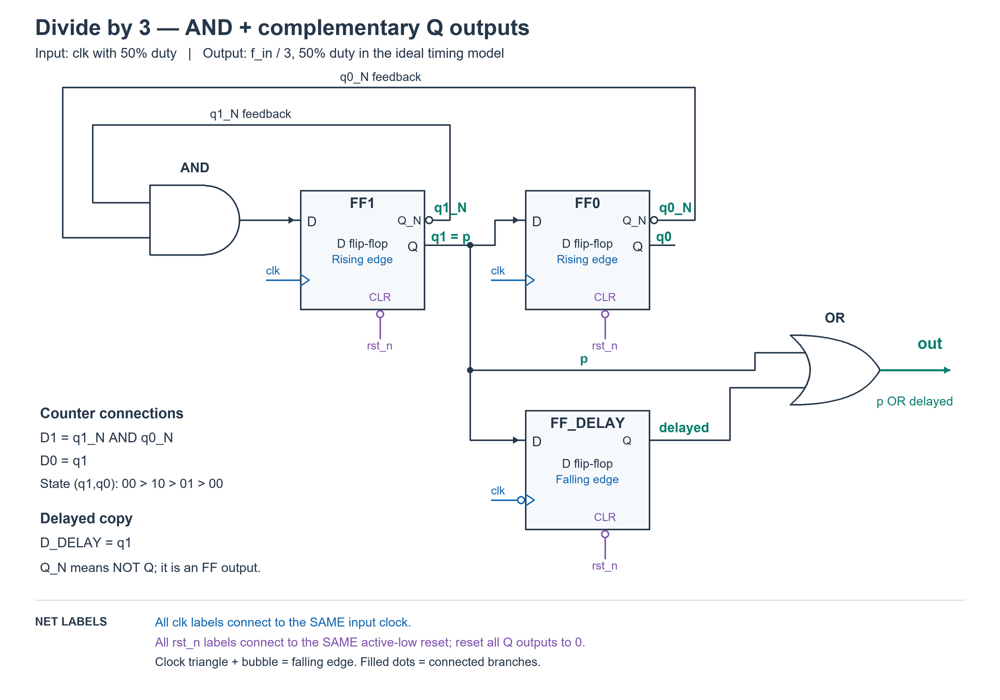
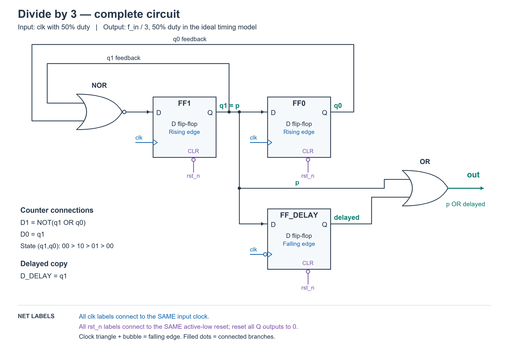
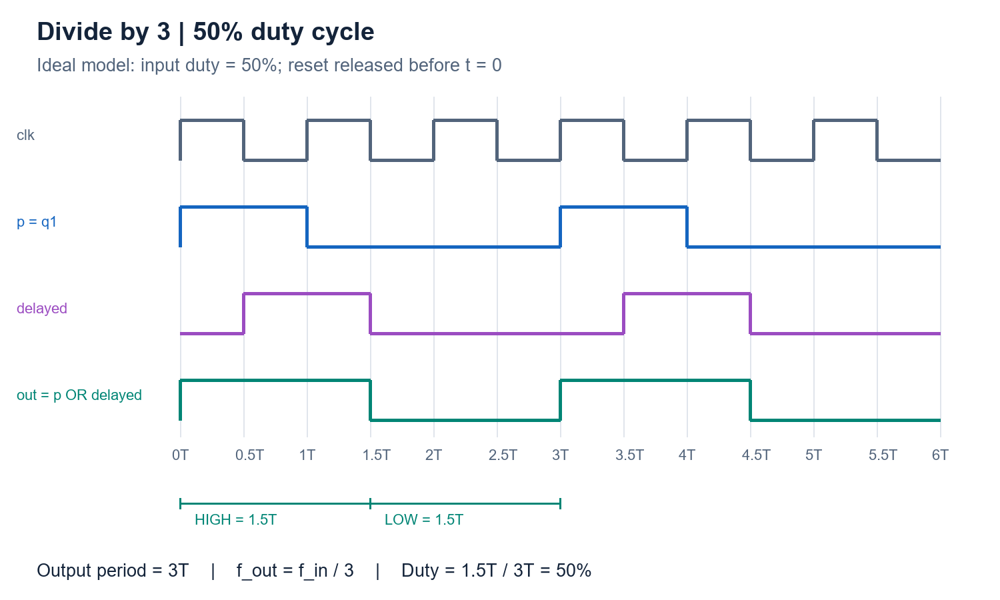

# PREP-010 — מחלק תדר ב־3 עם Duty Cycle של 50%

## השאלה המקורית

ממש מחלק תדר 1:3 עם DC של 50%

## קטגוריות וחברות

- תגית מקור: hardware.
- סיווג נוסף: מערכות לוגיות ספרתיות, שעונים, מחלקי תדר, Duty Cycle, מונים ו־Flip-Flops.
- חברות המופיעות במקור: Amazon, proteanTecs, Qualcomm, Apple, Rafael.
- תווית ראשית: ״אפל״. השיוכים נשמרו לפי המקור בלבד, ללא אימות עצמאי.
- התגית tag-3 נשמרה כתגית לא מפוענחת, ולא כחברה או נושא.
- שאלה מקבילה: [VHW-004](../../verify_example_questions/hardware/digital_logic_and_clocking/vhw-004-divide-by-three.md). שם יש רמז מפורש לשתי חזיתות; אין להוסיף אותו לנוסח המקור כאן או למזג שיוכי חברות.

## שלושה רמזים מדורגים

1. אם מחזור שעון הכניסה הוא T, מה צריך להיות מחזור המוצא אחרי חלוקה ב־3? וכמה זמן מתוכו המוצא צריך להיות ב־1 כדי לקבל Duty Cycle של 50%?

2. כדי לקבל חצי ממחזור של 3T צריך לשנות את המוצא גם אחרי מחצית של מחזור כניסה. האם שימוש רק בחזיתות עולות יכול להספיק, או שכדאי להשתמש גם בחזית יורדת?

3. התחל מאות שעולה למשך T פעם בכל 3T. צור עותק שלו המושהה בחצי מחזור באמצעות FF בחזית יורדת. איזה שער יחבר את שני הפולסים החופפים לפולס אחד שאורכו 1.5T?

## הצעה לפתרון

**המטרה:** אם שעון הכניסה משלים שלושה מחזורים, המוצא ישלים מחזור אחד. אם מחזור הכניסה הוא T, מחזור המוצא צריך להיות 3T: גבוה במשך 1.5T ונמוך במשך 1.5T.

**הנחה שחסרה בצילום:** שעון הכניסה בעל Duty Cycle של 50%, מותר להשתמש בשתי החזיתות, ומחשבים תזמון אידאלי. DC כאן פירושו Duty Cycle — החלק היחסי מהמחזור שבו האות גבוה.

**הרעיון האינטואיטיבי:** קודם יוצרים פולס באורך T שחוזר פעם בכל שלושה מחזורים. אחר כך מאריכים אותו בעוד חצי מחזור. כך מקבלים בדיוק 1.5T גבוה מתוך 3T.

**1. מונה מודולו 3 בשני FF בחזית עולה.** נסמן את המצב (q1,q0), ונשתמש בסדר:
`00 → 10 → 01 → 00`.
משוואות הכניסות הן `D1 = q1_NOT AND q0_NOT` ו־`D0 = q1`. שני ה־FF מתעדכנים יחד בחזית העולה, לפי הערכים הישנים. האות `p=q1` גבוה במצב 10 בלבד: מחזור אחד גבוה ושני מחזורים נמוכים. אין צורך במפענח קומבינטורי למצב — לוקחים ישירות מוצא FF. המצב הלא־חוקי 11 עובר ל־01 וחוזר למחזור התקין.

**2. FF שלישי בחזית יורדת.** מחברים ל־D שלו את p, וקוראים למוצאו delayed. הוא מעתיק את השינוי של p בחזית היורדת הקרובה, כלומר חצי מחזור מאוחר יותר כאשר שעון הכניסה סימטרי.

**3. שער OR.** המוצא הוא `out = p OR delayed`.

נבחן את הפולס הראשון אחרי איפוס ושחרורו לפני חזית עולה:
- בזמן 0, p עולה ולכן out עולה.
- בזמן 0.5T, delayed עולה; out נשאר גבוה.
- בזמן T, p יורד, אבל delayed עדיין גבוה ולכן out נשאר גבוה.
- בזמן 1.5T, delayed יורד ולכן out יורד.
- בזמן 3T, p עולה שוב ומתחיל המחזור הבא.

לכן המוצא גבוה 1.5T, נמוך 1.5T, ותדרו `f_in/3` עם Duty Cycle של 50%.

**הרכיבים:** שני DFF בחזית עולה, DFF אחד בחזית יורדת, שער AND למשוב המונה המקבל את מוצאי Q_NOT ושער OR למוצא. כל ה־FF מאופסים ל־0. אין לכתוב משתנה אחד בשני בלוקי always ואין צורך ב־FF שמתעדכן בשתי החזיתות.

**למה אי אפשר להשתמש רק בחזית עולה?** שינויים יהיו במרווחים שהם כפולות של T; המרווח 1.5T מחייב גם חזית אחרת במודל הזה.

**יעילות ומינימום:** שלושה DFF הם מינימום במודל של FF רגילים, שכל אחד מופעל בחזית קבועה של שעון הכניסה, לוגיקה קומבינטורית של מוצאי Q בלבד, ללא שימוש ישיר ב־clk בשער המוצא או ברכיבי השהיה/PLL/זיכרון נוספים. עם שני FF באותה חזית אין מעבר אחרי 1.5T. עבור FF בכל חזית, הבדיקה המצורפת ממצה את כל פונקציות המצב הבא, פונקציות המוצא והמצבים ההתחלתיים, ולא מוצאת פתרון. זו אינה טענת מינימום לכל ספריית תאים או מודל מעגל אחר.

**דיוק ותזמון:** אם החלק הגבוה של שעון הכניסה הוא dT, הפולס המתקבל כאן הוא `(1+d)T` גבוה ו־`(2-d)T` נמוך, ולכן `DC_out=(1+d)/3`. בדיוק 50% מתקבל בשיטה הזאת כאשר d=0.5. במודל אידאלי החפיפה בין p ל־delayed מונעת נפילה באמצע הפולס. במימוש אמיתי צריך לעמוד בתזמון המסלול מהחזית העולה ליורדת ובדרישות האיפוס, ולהביא בחשבון השהיות תאים וניתוב; 50% הוא ערך אידאלי ולא הבטחת מדידה פיזית מדויקת. אם המוצא משמש שעון, יש להגדירו ולנתבו בהתאם לכלי ולפלטפורמה.

כאשר מוצאי Q_NOT זמינים, חוק דה־מורגן מאפשר להשתמש ב־AND במקום NOR: NOT(q1 OR q0) = q1_NOT AND q0_NOT. אלה מוצאים מהופכים של אותם FF, לא ביטי זיכרון נוספים. במאגר מצורפת הרחבה עם דרך תכנון ושירטוטי מונה מודולו 3 ב־DFF, ב־TFF ובמחבר בינארי עם אוגר.

### שרטוט המעגל — AND עם מוצאים מהופכים

[הסבר דרך התכנון ושלוש גרסאות למונה מודולו 3, כולל כל השרטוטים](prep-010-design-method-and-mod3-counters.md).

### שרטוט קודם — חלופת NOR השקולה

השרטוט הוא חלק מ״הצעה לפתרון״. שני ה־FF העליונים יוצרים את המונה; ה־FF התחתון יוצר את העותק המושהה. כל הסימונים `clk` מחוברים **לאותו שעון כניסה**, וכל הסימונים `rst_n` מחוברים **לאותו איפוס פעיל בנמוך**, שמאפס את שלושת המוצאים ל־0. שמות הרשת הזהים מציינים חיבור חשמלי משותף, גם בלי לצייר חוט ארוך ביניהם. העיגול בכניסת השעון של ה־FF התחתון מסמן פעולה בחזית יורדת; אין להוסיף מהפך חיצוני בנוסף לסימון הזה. הנקודות המלאות הן הסתעפויות מחוברות.

משוואות החיבורים: `D1 = NOT(q1 OR q0)`, `D0 = q1`, `D_DELAY = q1`, `out = q1 OR delayed`. השרטוט נבדק חזותית מול קוד SystemVerilog והמשוואות של המודל הבדוק. [מחולל השרטוט](../solutions/draw_prep_010_circuit.py) נשמר כדי לאפשר עדכון ושחזור.

### תרשים תזמון

### מימוש

[SystemVerilog](../solutions/prep_010_divide_by_three.sv) — מימוש באמצעות שלושה FF.
[מודל Python](../solutions/prep_010_divide_by_three.py) — חישוב אותות בחזיתות לצורך בדיקה ואיור.

### בדיקות ותחום האופטימליות

[בדיקת המודל](../checks/check_prep_010.py) עברה על 300 מחזורי כניסה, כל שמונת המצבים ההתחלתיים וחמישה ערכי Duty Cycle בכניסה. בנוסף נבדקו כל 16,384 הצירופים האפשריים של שתי פונקציות מצב הבא, פונקציית מוצא ומצב התחלתי לשני FF בחזיתות הפוכות. בכל צירוף נבדקו 48 חצאי מחזור; 24 הראשונים הושמטו כדי לעבור כל מצב מעבר אפשרי במערכת בעלת שמונה מצבים מורחבים (שני ביטי Q ופאזת שעון). לא נמצא מוצא מחזורי בעל שלושה חצאי מחזור גבוהים ושלושה נמוכים באף פאזה. זה מוכיח את חסם מספר ה־FF במודל המצומצם שתואר; במקרה של שני FF באותה חזית, מיקום החזיתות לבדו שולל 1.5T.

הבדיקות הן למודל משוואות אידאלי ב־Python. לא נמצא סימולטור HDL ב־PATH; קוד SystemVerilog לא קומפל ולא הורצה עליו סימולציית HDL. לא בוצעו סינתזה או בדיקות תזמון פיזי. התרשים נוצר מהמודל ונבדק חזותית.

## תשובה קצרה לראיון

מחזור המוצא צריך להיות 3T, ולכן זמן גבוה של 1.5T. אבנה מונה מודולו 3 בשני FF בחזית עולה, ואקח ממנו פולס של T פעם בשלושה מחזורים. FF בחזית יורדת ייצור עותק מושהה בחצי מחזור, ו־OR בין המקור לעותק ייתן 1.5T גבוה ו־1.5T נמוך. נדרש שעון כניסה בעל DC של 50%; בסך הכול שלושה FF.

## טעויות נפוצות

- מונה מודולו 3 לבדו מחלק את התדר, אבל אינו מבטיח DC של 50%.
- שימוש רק בחזית עולה לא מייצר מרווח של 1.5T במודל הנתון.
- השמטת ההנחה ששעון הכניסה בעל DC של 50%.
- חיבור XOR במקום OR בין שני הפולסים החופפים.
- הוספת FF מיותר ליצירת p אף שהוא כבר מוצא q1 רשום.
- נהיגה של אותו משתנה RTL משני בלוקי always בחזיתות שונות.
- טענת מינימום גורפת בלי להגדיר אילו רכיבים ומקורות תזמון מותרים.

## English

Implement a 1:3 frequency divider with a 50% duty cycle.

Hint 1: If the input period is T, what is the divided output period? How much of that period must the output be high for a 50% duty cycle?

Hint 2: Half of 3T ends halfway through an input cycle. Can rising edges alone generate all required transitions, or is a falling edge useful?

Hint 3: Start with a pulse high for T every 3T, and sample it with a falling-edge FF to create a half-cycle-delayed copy. Which gate combines the overlapping pulses into a pulse lasting 1.5T?

For input period T, the target output period is 3T with 1.5T high and 1.5T low. Assume a 50%-duty input clock, both input edges available and ideal timing; the screenshot does not state these assumptions. Use two rising-edge DFFs cycling (q1,q0) through 00,10,01,00, with D1=q1_NOT AND q0_NOT and D0=q1. The illegal state 11 goes to 01. Take p directly from q1: high for T every 3T. A third, falling-edge DFF samples p to form delayed. Set out=p OR delayed. After reset, release before a rising edge: p rises at 0, delayed rises at 0.5T, p falls at T, delayed falls at 1.5T, and the next output rising edge is at 3T. The overlapping pulses give the required 50% duty and one-third frequency. Hardware is three ordinary DFFs, one AND feedback gate using the complementary FF outputs and one OR output gate. Reset all FFs to zero. Three FFs are minimal in the restricted fixed-input-edge, Q-only combinational model: same-edge FFs cannot produce 1.5T intervals; exhaustive enumeration rules out every two-FF opposite-edge Boolean circuit in that model. This does not claim optimality across arbitrary cell libraries, clock-dependent output gates or additional timing resources. For input high fraction d, output high duration is (1+d)T, low duration (2-d)T, and duty (1+d)/3, so this implementation needs d=0.5 for exact ideal 50%. Physical implementation requires half-cycle timing closure, valid reset release at both edges, and proper generated-clock treatment if used as a clock; real propagation delays affect the duty. Tests cover the ideal Python equation model, not compiled HDL or physical timing. De Morgan makes this identical to the previous NOR form. Q_NOT availability is an explicit hardware assumption. A stored extension explains the design method and binary modulo-three DFF, TFF and adder/register variants.

הפתרון נוצר בסיוע AI, נבדק במסגרת המתוארת וממתין לסקירת תוכן. טרם פורסם באתר.
