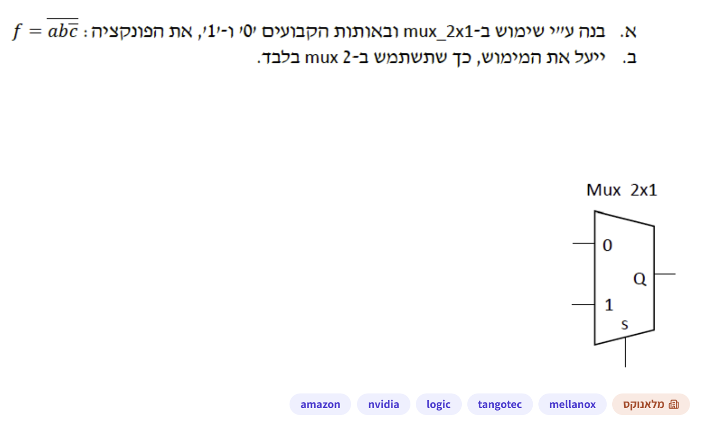
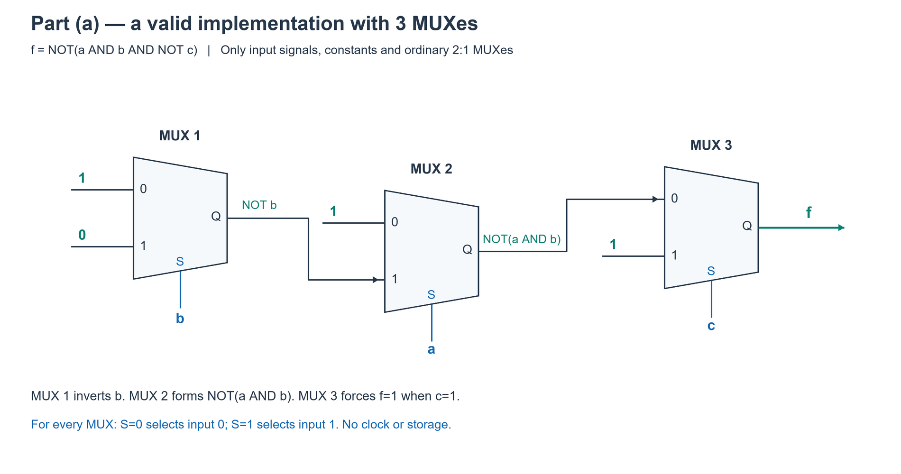
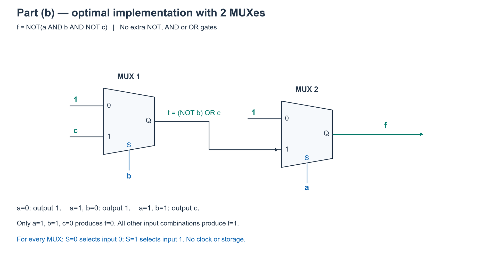
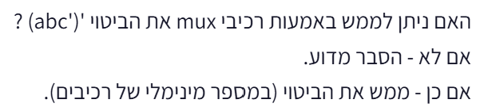
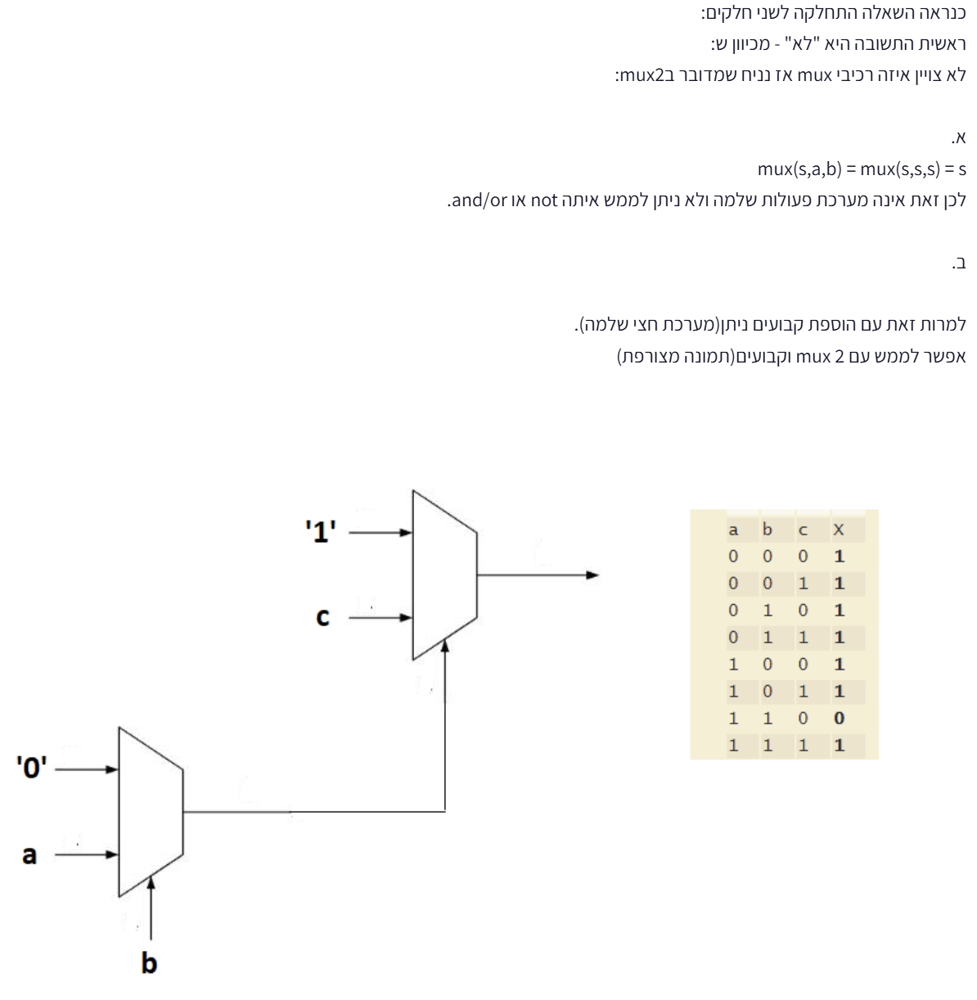

# PREP-011 — מימוש פונקציה בוליאנית באמצעות שני MUX

## השאלה המקורית והשרטוט

א. בנה ע״י שימוש ב־mux_2x1 ובאותות הקבועים '0' ו־'1', את הפונקציה: f = NOT(a AND b AND NOT(c)).
ב. ייעל את המימוש, כך שתשתמש ב־2 mux בלבד.

הנוסחה המקורית בסימון מתמטי: $f=\overline{ab\overline{c}}$. הנוסח הטקסטואלי לעיל פורש את סימוני השלילה לצורך נגישות; צילום המקור נשמר ללא שינוי.

## קטגוריות וחברות

- תגית מקור: logic.
- סיווג נוסף: חומרה, מערכות לוגיות ספרתיות, מעגלים קומבינטוריים, MUX, אלגברה בוליאנית, הרחבת שאנון ומזעור לוגיקה.
- חברות לפי צילום המקור: Amazon, NVIDIA, TangoTec, Mellanox.
- תווית ראשית: ״מלאנוקס״. השיוכים מהמקור בלבד, ללא אימות עצמאי.
- שאלות קשורות אך שונות: [VHW-001](../../verify_example_questions/hardware/digital_logic_and_clocking/vhw-001-mux-functions.md), [HW-004](../../example_question/hardware/combinational_circuits/hw-004-mux-tree-eight-inputs.md).

## שלושה רמזים מדורגים

1. חשוב על MUX בתור משפט if: כאשר S=0 הוא מעביר את I0, וכאשר S=1 הוא מעביר את I1. בחר משתנה בתור S ובדוק למה הפונקציה מצטמצמת בכל אחד משני המקרים.

2. שים לב לשתי השלילות בנוסחה: אחת על c ואחת על כל המכפלה. בדוק קודם באיזה צירוף יחיד של a,b,c מתקבל f=0, ומה מתקבל כש־a=0.

3. אפשר להתחיל מבחירה לפי a: כש־a=0 המוצא קבוע 1; כש־a=1 נשארת פונקציה של b,c. בדוק אותה שוב לפי b: כש־b=0 היא 1, וכש־b=1 היא c.

## הצעה לפתרון

**קריאת הנוסחה:** f = NOT(a AND b AND NOT(c)), כלומר \(f=\overline{ab\overline{c}}\). יש שלילה חיצונית על כל המכפלה ושלילה פנימית על c. לפי דה־מורגן אפשר לכתוב f = NOT(a) OR NOT(b) OR c. זהו שוויון אלגברי לצורך הסבר; במעגלים שלהלן אין שערי NOT/AND/OR נפרדים.

**איך MUX פועל:** MUX(S,I0,I1) מחזיר I0 כאשר S=0 ואת I1 כאשר S=1. המספרים 0 ו־1 על ציור הרכיב מסמנים את כניסות הנתונים הנבחרות, ולא מחייבים לחבר אליהן דווקא את הקבועים האלה. זהו מעגל קומבינטורי, ללא שעון או זיכרון.

**סעיף א — מימוש תקין בשלושה MUX.** נתחיל מהפירוק לפי c: כאשר c=1 המוצא 1, וכאשר c=0 המוצא NOT(a AND b). אפשר לממש זאת כך:

| רכיב | S | I0 | I1 | מוצא |
| --- | --- | --- | --- | --- |
| MUX 1 | b | 1 | 0 | n1 = NOT(b) |
| MUX 2 | a | 1 | n1 | n2 = NOT(a AND b) |
| MUX 3 | c | n2 | 1 | f |

הרכיב הראשון מממש היפוך באמצעות בחירה בין קבועים. השני מחזיר 1 אם a=0, אחרת NOT(b), ולכן הוא NAND של a,b. השלישי מחזיר 1 כש־c=1, אחרת את ה־NAND. אין צורך במהפך נוסף. זה מימוש אפשרי לסעיף א, לא טענה ששלושה רכיבים הכרחיים.

**סעיף ב — שני MUX בלבד.** בוחרים סדר פירוק נוח יותר: לפי a ואז לפי b.

- אם a=0, המכפלה בתוך השלילה מתאפסת ולכן f=1.
- אם a=1 אבל b=0, שוב f=1.
- אם a=b=1, נשאר f=NOT(NOT(c))=c.

לכן אפשר לכתוב: `if a==0: return 1; else: if b==0: return 1; else: return c`.

בונים תחילה את הבחירה הפנימית לפי b, ואז את החיצונית לפי a:

| רכיב | S | I0 | I1 | מוצא |
| --- | --- | --- | --- | --- |
| MUX 1 | b | 1 | c | t = NOT(b) OR c |
| MUX 2 | a | 1 | t | f |

המימוש דורש בדיוק שני MUX, ללא יצירת NOT(c) או NOT(a) או NOT(b) בחוטים נפרדים. כל הביטויים מתממשים מתוך פעולת הבחירה של הרכיבים עצמם. אפשר להחליף בין תפקידי a ו־b בגלל הסימטריה שלהם.

**בדיקה אינטואיטיבית:** רק a=1,b=1,c=0 מחזיר 0. בכל צירוף אחר מתקבל 1. זה בדיוק התנאי של הפונקציה המקורית.

**למה שניים הם מינימום?** במעגל עם MUX יחיד כל פין יכול לקבל רק 0,1,a,b,c. בחירה קבועה נותנת רק חוט או קבוע. אם S=a, בענף a=1 נדרשת הפונקציה NOT(b) OR c, שאינה אף חוט או קבוע זמין. אם S=b, בענף b=1 נדרשת NOT(a) OR c. אם S=c, בענף c=0 נדרשת NOT(a AND b). לכן אף בחירה לא מאפשרת מימוש ברכיב יחיד. בדיקה ממצה של כל 5^3=125 חיבורי הפינים מאשרת זאת. המסלול הארוך במימוש המצומצם עובר בשני MUX, לעומת שלושה במימוש הראשון, בהנחת תאים רגילים וללא ספירת חיווט.

**שיטת פתרון כללית:** בוחרים משתנה, מציבים בו 0 ו־1 ומפשטים את שני הענפים. מחברים אותם ל־I0 ו־I1 ואת המשתנה ל־S. אם ענף הוא קבוע או משתנה יחיד, מחברים אותו ישירות. אם הוא פונקציה מורכבת, מפרקים שוב. בחירת סדר המשתנים יכולה לשנות את מספר הרכיבים; כאן פירוק לפי a או b חוסך רכיב לעומת הבנייה שהתחילה לפי c. זו הרחבת שאנון, שאפשר להבין פשוט כעץ החלטות.

### שרטוט סעיף א

### שרטוט סעיף ב

### טבלת אמת

| a | b | c | f |
| --- | --- | --- | --- |
| 0 | 0 | 0 | 1 |
| 0 | 0 | 1 | 1 |
| 0 | 1 | 0 | 1 |
| 0 | 1 | 1 | 1 |
| 1 | 0 | 0 | 1 |
| 1 | 0 | 1 | 1 |
| 1 | 1 | 0 | 0 |
| 1 | 1 | 1 | 1 |

### קוד ובדיקה

[מודל שני המימושים](../solutions/prep_011_mux_function.py) · [בדיקה ממצה](../checks/check_prep_011.py) · [מחולל שרטוטים](../solutions/draw_prep_011_mux.py).

נבדקו כל שמונת צירופי הקלט עבור שני המימושים. בנוסף נבדקו כל 125 החיבורים האפשריים ברכיב יחיד וכל חמש האפשרויות ללא רכיב. לא נמצא מימוש בפחות משני MUX. שני השרטוטים נבדקו חזותית מול החיבורים. זוהי בדיקת לוגיקה בוליאנית, לא סימולציית HDL או בדיקת השהיות פיזית.

## תשובה קצרה לראיון

אפרק את הפונקציה לפי a: אם a=0 המוצא 1. אחרת אפרק לפי b: אם b=0 המוצא 1, ואם b=1 המוצא c. לכן MUX פנימי עם S=b וכניסות 1,c, ומעליו MUX עם S=a וכניסות 1 ומוצא הרכיב הפנימי. כך מקבלים שני MUX בלבד בלי מהפכים נוספים.

## English

(a) Use 2:1 MUXes and constants 0 and 1 to implement f=NOT(a AND b AND NOT(c)). (b) Optimize the implementation to use only two MUXes. The attached source also shows a standard MUX with inputs labelled 0 and 1, output Q and select S.

Hint 1: Think of a MUX as if/else: S=0 passes I0, while S=1 passes I1. Choose a variable as S and simplify the function for each of its values.

Hint 2: Notice the two negations: one on c and one on the entire product. Find the single a,b,c combination producing f=0, then check what happens when a=0.

Hint 3: Choose a first: a=0 forces output 1; a=1 leaves a function of b,c. Split that function on b: b=0 gives 1 and b=1 gives c.

Interpret the source formula as f=NOT(a AND b AND NOT(c)): the outer bar covers the product and the inner bar covers c only. Equivalently f=NOT(a) OR NOT(b) OR c, but no separate logic gates are allowed in the constructions. MUX(S,I0,I1) returns I0 when S=0 and I1 when S=1; it is combinational and needs no clock.

Part (a), a valid three-cell realization: n1=MUX(b,1,0)=NOT(b); n2=MUX(a,1,n1)=NOT(a AND b); f=MUX(c,n2,1). This is a possible initial implementation, not a lower bound.

Part (b), optimal two-cell realization: t=MUX(b,1,c), f=MUX(a,1,t). When a=0 the output is 1; when a=1,b=0 it is also 1; when a=b=1 it equals c. Only input 110 produces 0. The negations are implicit in selection, not extra inverter cells. a and b may be exchanged.

Minimality: one MUX with pins drawn from 0,1,a,b,c cannot implement f. Constant select reduces to an available wire/constant. For select a, the a=1 cofactor is NOT(b) OR c, which is neither a single available input nor a constant; select b has the analogous obstruction; select c requires the two-variable NAND(a,b) when c=0. All 125 one-MUX pin assignments were exhaustively checked, as were all five zero-cell direct outputs. Both proposed constructions match the eight-row truth table. The optimized network has two MUX levels on its longest path versus three in the initial network.

General method: Shannon expansion is if/else on a selected variable. Simplify both cofactors, wire constants or single signals directly, recursively implement only nontrivial branches, and compare variable orders to reduce cell count. Assume ordinary non-inverting 2:1 MUXes, no free complementary inputs or additional gates, and an acyclic combinational network. Tests concern ideal Boolean behavior, not analog glitches or propagation timing.

התוכן נוצר בסיוע AI וממתין לסקירת תוכן; טרם פורסם באתר.

## נוסח נוסף שהתקבל ב־27 בספטמבר 2026

האם ניתן לממש באמצעות רכיבי mux את הביטוי (abc')' ?
אם לא — הסבר מדוע.
אם כן — ממש את הביטוי (במספר מינימלי של רכיבים).

זו אותה פונקציה של PREP-011: גרש אחרי c שולל את c, והגרש אחרי הסוגריים שולל את כל המכפלה. לכן הנוסח נוסף כמקור חלופי ולא כשאלה עצמאית נוספת. נשמרו שלושת הרמזים, ההצעה לפתרון והשרטוטים שכבר הוכנו.

בצילום החדש אין תגיות נושא או חברות. הסיווג שלנו הוא חומרה, מערכות לוגיות ספרתיות, לוגיקה קומבינטורית, MUX ואלגברה בוליאנית. שמות החברות ברשומה הראשית שייכים לצילום הקודם בלבד, ואין לייחס אותם לצילום הזה.

**הנחות לנוסח החדש:** הצילום אינו מפרט את גודל ה־MUX או זמינות הקבועים. התשובה השמורה — שני רכיבי MUX — מתייחסת ל־MUX מסוג 2:1, עם כניסות a,b,c וקבועים 0,1 זמינים וללא לוגיקה נוספת, כמו בשאלה המקורית. אי אפשר להציג מינימום רכיבים בלי להגדיר את סוג הרכיב. אם מותר MUX 4:1, רכיב אחד מספיק: קווי הבחירה a,b, כניסות נתונים I00=I01=I10=1 ו־I11=c. כאן החיבור הוכח בטבלת אמת לכל שמונת הקלטים. הבחירה היא בינארית לפי ab, ולכן רק כאשר ab=11 מועבר c. אין שינוי לפתרון ולמינימליות במודל 2:1 המקורי.

**רלוונטיות להכנה:** עדיפות גבוהה להבנת יסודות לוגיקה ספרתית ותכנון עם MUX, כחלק מהכנה לתפקיד שבבים. זו הערכת הכנה על סמך תיאור התפקיד, לא תחזית לשאלות ב־Marvell.

The alternate screenshot received 2026-09-27 gives the same formula but omits mux size and constants. The existing two-component minimum assumes 2:1 muxes with a,b,c,0,1 available. If a 4:1 mux is allowed, one component suffices: select ab and data (1,1,1,c). All eight tuples verified. No company/topic tags appear in the new image; earlier reported companies belong only to the earlier source.

### האם מותר להשתמש בקבועים? ומה אם לא?

בצילום החדש לא נאמר במפורש שקבועים מותרים או אסורים, וגם גודל ה־MUX לא מוגדר. אין לקבוע מה התכוון מחבר השאלה. בראיון כדאי לשאול: ״האם מותר לחבר לכניסות קבוע לוגי 1, והאם מדובר ב־MUX 2:1?״ אפשר גם להציג את שתי הפרשנויות. נקודת אספקת המתח של רכיב אינה רשות אוטומטית להשתמש בקבוע לוגי ככניסת נתונים במודל החידה.

**אם אסור להשתמש בקבועים וכל האותות הזמינים הם a,b,c ומוצאי MUX רגילים ללא היפוך — אין פתרון קומבינטורי, בשום מספר של MUX.** מציבים a=b=c=0. כל MUX ברמה הראשונה מקבל רק אפסים בכניסות הנתונים, ולכן מוציא 0. כל MUX בהמשך מקבל גם הוא רק אפסים, ולכן מוציא 0. באינדוקציה לאורך הרשת, המוצא הסופי חייב להיות 0. אבל הפונקציה המבוקשת נותנת NOT(0 AND 0 AND NOT(0))=NOT(0)=1. זו סתירה. אותה הוכחה תקפה לכל גודל MUX רגיל. היא מניחה מעגל צירופי ללא משוב או מצב התחלתי, וללא כניסות משלימות או מוצא מהופך זמינים בחינם. גם הוספת קבוע 0 בלבד אינה עוזרת. הכתיב c' בפונקציה אינו אומר שהחוט NOT(c) כבר נתון לנו.

**אם קבוע 1 מותר, מספיקים שני MUX 2:1, ואין צורך בקבוע 0.** קוראים את הביטוי f=(abc')' בתור f=NOT(a AND b AND NOT(c)). מפרקים בהצבות, בלי לדלג על שלבים:

1. a=0: בתוך הסוגריים 0×b×NOT(c)=0, ולכן f=NOT(0)=1.
2. a=1: נשאר f=NOT(b AND NOT(c)). כעת אם b=0, שוב המכפלה 0 ולכן f=1.
3. a=1,b=1: נשאר f=NOT(NOT(c))=c.

מכאן בונים בחירה פנימית t: אם b=0 אז t=1; אם b=1 אז t=c. זהו MUX ראשון עם S=b, I0=1, I1=c. הבחירה החיצונית מחזירה 1 כאשר a=0, ואת t כאשר a=1. זהו MUX שני עם S=a, I0=1, I1=t. החיבור S הוא בוחר ולא כניסת נתונים; התוויות I0,I1 מציינות איזו כניסה נבחרת, לא את הערך שחייבים להזין בה.

| רכיב | בוחר S | כניסת I0 | כניסת I1 | מוצא |
|---|---|---|---|---|
| MUX 1 | b | הקבוע 1 | c | t |
| MUX 2 | a | הקבוע 1 | t | f |

**מדוע שניים הם מינימום?** ברכיב אחד פין הבחירה יכול לקבל רק משתנה גולמי או קבוע. אם בוחרים לפי a, בענף a=1 צריך לחשב NOT(b AND NOT(c)), שתלוי בשני משתנים ואינו חוט בודד או קבוע. בחירה לפי b נכשלת מאותה סיבה. אם בוחרים לפי c, בענף c=0 צריך NOT(a AND b), שוב פונקציה של שני משתנים שאינה חוט או קבוע. בחירה קבועה רק מעבירה אחת מכניסות הנתונים. לכן MUX יחיד לא מספיק, ושני הרכיבים שבשרטוט הם מינימום במודל הזה. כל 125 החיבורים האפשריים לרכיב יחיד עם a,b,c,0,1 זמינים כבר נבדקו, כך שהטענה תקפה גם במודל המצומצם שנותן רק קבוע 1.

אם מותר MUX 4:1 וקבוע 1, מספיק רכיב אחד, כפי שתועד בנוסח הקודם: בחירה ab וכניסות (1,1,1,c). לכן יש לציין במפורש שהמינימום שניים הוא עבור 2:1.

**מקור וייחוס מעודכנים:** התמונה המלאה הנוספת כוללת תגיות hardware ו־verification, וחברות Amazon, NVIDIA, Apple, Mellanox; תווית ראשית ״מלאנוקס״. אלה דיווחי המקור בלבד, ללא אימות עצמאי. TangoTec מופיעה בצילום הישן של השאלה, ולא בתמונה החדשה. המקורות נשמרים בנפרד כדי שלא לערבב את הייחוסים.

### Constants and the complete alternate source

The new prompt neither explicitly permits nor forbids constants, and does not specify mux size. Ask whether logic 1 and ordinary 2:1 muxes are allowed, or present both interpretations. Power pins do not by themselves authorize logic-constant data inputs in an abstract puzzle.

With only raw a,b,c and non-inverting mux outputs available in an acyclic combinational network, realization is impossible regardless of mux count or fan-in. At a=b=c=0 all first-level data inputs are zero, hence all outputs are zero. Inductively every subsequent mux also outputs zero. The required function NOT(a AND b AND NOT(c)) instead outputs one at 000, a contradiction. Constant zero alone cannot help. This proof excludes free complemented input/output signals, feedback and initialized state. The notation c' does not grant a precomputed NOT(c) wire.

Allowing constant one suffices: t=MUX(b,1,c), f=MUX(a,1,t), using the convention MUX(S,I0,I1). Substituting a=0 gives one; with a=1,b=0 the result is also one; with a=b=1 double negation leaves c. No constant zero or separate inversion is needed. A single 2:1 mux cannot implement the function: selection by a or b leaves a nontrivial two-variable cofactor, and selection by c leaves NAND(a,b) for c=0. Constant selection can only forward a raw wire or constant. Earlier exhaustive checking of all 125 one-mux wirings verifies this bound. The existing two-mux diagram is the full optimal circuit under this model. If a 4:1 mux is allowed, one suffices with select ab and data (1,1,1,c).

The complete alternate image reports hardware, verification and companies Amazon, NVIDIA, Apple, Mellanox, with Mellanox badge. Attribution is source-reported and unverified. TangoTec belongs to the earlier image only. All source-specific metadata is retained separately.

### פתרון חיצוני נוסף: AND באמצעות MUX ואז בחירה לפי התוצאה

צילום הפתרון שסופק נשמר כמקור לדיון, ולא כהוראות. במקור טענה כללית על אי־שלמות MUX ללא קבועים ושרטוט חלופה בשני רכיבים. נבחין בין המעגל התקין לבין ניסוחים שדורשים תיקון.

**המעגל תקין**, בהנחה שהכניסה העליונה בכל MUX היא I0 והתחתונה I1 (המספרים לא סומנו בציור). ברכיב התחתון S=b, I0=0, I1=a, ולכן t=MUX(b,0,a)=a AND b. כאשר b=0 המוצא 0; כאשר b=1 הוא a. הרכיב העליון משתמש ב־t ככניסת בחירה, עם I0=1 ו־I1=c. לכן אם a AND b=0 הוא מחזיר 1, ואם a AND b=1 הוא מחזיר c. זה בדיוק f=NOT(a AND b AND NOT(c)). החיבור בין הרכיבים מגיע לכניסת הבחירה של הרכיב העליון, בשונה מהפתרון הקודם שבו המוצא הפנימי הגיע לכניסת נתונים.

המעגל שקול פונקציונלית לפתרון השמור MUX(a,1,MUX(b,1,c)), אבל החיווט שונה: בפתרון המצורף מחשבים קודם a AND b, ומשתמשים בתוצאה לבחירת 1 או c. בשניהם שני MUX 2:1, וזה מינימום תחת המודל שכבר הוגדר והוכח. כאן משתמשים בקבועים 0 ו־1, בעוד הפתרון הקודם זקוק לקבוע 1 בלבד. אין להסיק מי מהיר יותר בלי השהיות מסלולי בחירה ונתונים של הרכיב ומידע על הגעת הקלטים; אין להסיק חיסכון שטח פיזי מקבוע אחד לעומת שניים בלבד.

**תיקון לטענות מעל הציור:** בלי קבועים, MUX רגיל אינו מערכת שלמה פונקציונלית. לדוגמה אי אפשר לייצר NOT עם MUX בלבד מקלט גולמי x: כש־x=0 כל הרשת חייבת להוציא 0, אף ש־NOT(x)=1. אך אי־שלמות אינה אומרת שלא ניתן לממש AND או OR! לפי MUX(S,I0,I1):

* AND(a,b)=MUX(a,a,b): אם a=0 מועבר a=0; אם a=1 מועבר b.
* OR(a,b)=MUX(a,b,a): אם a=0 מועבר b; אם a=1 מועבר a=1.

אלה חיבורים של חוטי a,b בלבד, בלי חוט קבוע 0 או 1. הערכים 0 ו־1 בהסבר הם ערכי הקלט a במקרים השונים, ולא חיבורים לקבועים. בנוסף השוויון MUX(s,a,b)=MUX(s,s,s)=s אינו זהות כללית: למשל s=0,a=1,b=0 נותן MUX=1 ולא s. הניסוח הנכון הוא שאם כל שלושת הפינים מקבלים את אותו אות x, אז MUX(x,x,x)=x; אפשר להרחיב זאת באינדוקציה לרשת שכל כניסותיה הראשוניות שוות ל־x. כדי להראות שהפונקציה המסוימת אינה ניתנת למימוש ללא קבועים, משתמשים בעדות a=b=c=0 ו־f=1, ולא מסתפקים באמירה שהמערכת אינה שלמה.

עם MUX וקבועי 0,1 ניתן לממש NOT, AND ו־OR, ולכן זו מערכת שלמה פונקציונלית. אין צורך במונח ״חצי שלמה״ שמופיע במקור. אין דרך להסיק מהצילום בלבד שהשאלה המקורית אכן חולקה לשני שלבים; זו השערת הכותב.

**בדיקה:** כל שמונת הקלטים נבדקו למעגל החיצוני מול הפונקציה המבוקשת והמימוש הקודם; כל ארבעת הקלטים נבדקו לחיבורי AND/OR ללא קבועים. טבלת האמת בצילום תואמת לפונקציה. המיפוי I0/I1 הונח לפי הסידור המקובל העליון/התחתון, כי אינו מצוין בציור.

### Review of supplied external answer

Assuming the upper data pin is I0 and the lower I1, the drawn circuit is correct: t=MUX(b,0,a)=a AND b, followed by f=MUX(t,1,c). Unlike the previous circuit, the first mux output drives the second mux's select, not a data input. This gives exactly NOT(a AND b AND NOT(c)) on all eight inputs. Both circuits use the proven minimum two ordinary 2:1 muxes under the raw-input/constant model. The new version uses constants 0 and 1; the previous version needs only 1. No physical timing/area advantage follows without cell and arrival data.

Some prose in the supplied answer is inaccurate. MUX without constants is not functionally complete, but it CAN implement AND(a,b)=MUX(a,a,b) and OR(a,b)=MUX(a,b,a) without any constant wires. It cannot implement NOT from raw inputs alone in an acyclic non-inverting mux network. MUX(s,a,b)=s is not a general identity; only MUX(x,x,x)=x when the inputs are identified. A counterexample to the asserted general identity is s=0,a=1,b=0. The specific target's impossibility follows from its value 1 at input 000 versus zero preservation of all such networks. MUX with both 0 and 1 constants is functionally complete, so describing that set as half-complete is misleading. The original interview having two stages is the external author's speculation.

Verified all eight circuit inputs against both the target and prior solution, and all four inputs for the constant-free AND/OR realizations. The source truth table matches the target; unlabeled data-pin orientation remains a stated assumption.
