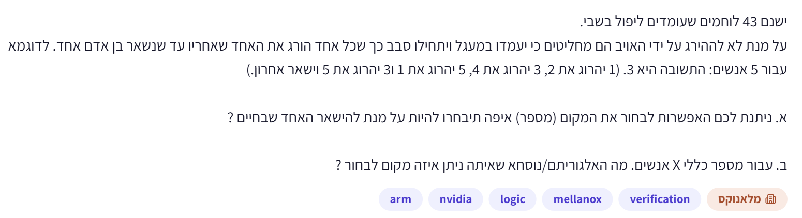
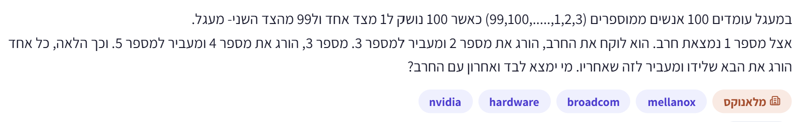

# PREP-012 — בעיית יוספוס — האחרון במעגל של 43

## השאלה המקורית

ישנם 43 לוחמים שעומדים ליפול בשבי.
על מנת לא להיהרג על ידי האויב הם מחליטים כי יעמדו במעגל ויתחילו סבב כך שכל אחד הורג את האחד שאחריו עד שנשאר בן אדם אחד. לדוגמא עבור 5 אנשים: התשובה היא 3. (1 יהרוג את 2, 3 יהרוג את 4, 5 יהרוג את 1 ו־3 יהרוג את 5 וישאר אחרון.)

א. ניתנת לכם האפשרות לבחור את המקום (מספר), איפה תיבחרו להיות על מנת להישאר האחד שבחיים?
ב. עבור מספר כללי X אנשים. מה האלגוריתם/נוסחא שאיתה ניתן איזה מקום לבחור?



## קטגוריות וחברות

- תגיות מקור: logic, verification.
- סיווג נוסף: חידות היגיון, אלגוריתמים, נוסחאות נסיגה, חזקות של 2, ייצוג בינארי והוצאה ממעגל.
- חברות לפי המקור: Arm, NVIDIA, Mellanox.
- תווית ראשית: ״מלאנוקס״; אין אימות עצמאי לשיוך החברות.
- לא נמצאה שאלה זהה בחיפוש במאגרים המקומיים הקיימים.

## שלושה רמזים מדורגים

1. נסה לכתוב את סדר ההוצאה עבור מעגלים קטנים, לפי הדוגמה: 1 מוציא את 2, ואז התור עובר ל־3. עקוב במיוחד אחרי מי שמתחיל את התור הבא כשהמעגל מצטמצם.

2. בדוק בנפרד מעגלים בגודל 2, 4, 8 ו־16. מי נשאר בהם, והאם לאחר סבב אפשר למספר מחדש את הנשארים ולקבל את אותה בעיה במעגל קטן יותר?

3. חפש את חזקת 2 הגדולה ביותר שאינה עולה על מספר המשתתפים. כמה הוצאות ראשונות יקטינו את המעגל לגודל הזה, ומי יתחיל לפעול מיד לאחריהן?

## הצעה לפתרון

**סעיף א: המקום הנכון הוא 23.** מניחים שהמספור הוא 1 עד 43 בכיוון ההתקדמות, ש־1 מוציא את 2 ראשון, ושהתור הבא עובר למשתתף החי הבא — כמו בדוגמה של חמישה אנשים. זו בעיית יוספוס עם דילוג קבוע של 2; להלן נשתמש במונח ״הוצאה מהמעגל״.

**איך מגיעים לזה בלי לנחש?**

**1. מתחילים ממקרה פשוט: מספר המשתתפים הוא חזקת 2.** אם יש 8 אנשים, הסבב הראשון מוציא את 2,4,6,8. נשארים 1,3,5,7, והתור חוזר ל־1. אחרי מספור מחדש זה מעגל של 4 אנשים, כשהראשון עדיין אותו אדם. שוב מתקבל מעגל של 2 ושוב של 1. לכן בחזקת 2 נשאר האדם שמתחיל את התהליך. אותו נימוק עובד עבור כל חזקה של 2, לא רק 8.

**2. מצמצמים 43 לחזקת 2.** החזקה הקרובה מלמטה היא 32, ולכן צריך להוציא 43−32=11 אנשים. אחת־עשרה ההוצאות הראשונות הן 2,4,6,...,22. הפעולה האחרונה ברשימה היא ש־21 מוציא את 22. כעת נשארו 32 אנשים, והתור הבא שייך ל־23.

**3. מתחילים לחשוב מחדש על המעגל הנותר.** מסמנים את 23 כ״ראשון״ וממשיכים במספור חדש לפי סדר האנשים שעדיין במעגל. יש 32 אנשים, וזו חזקת 2. לפי מה שכבר הוכחנו, הראשון במעגל הזה נשאר — ולכן המספר המקורי שנשאר הוא 23. אין צורך ששמות המשתתפים שנותרו יהיו מספרים עוקבים; רק סדר הישיבה ומי שמתחיל קובעים.

**סעיף ב: נוסחה לכל X חיובי.** נסמן ב־P את חזקת 2 הגדולה ביותר שאינה עולה על X, וב־R את ההפרש X−P:

`P = 2^floor(log2(X))`, `R = X−P`.

אז התשובה במספור שמתחיל ב־1 היא:

`J(X) = 2R+1 = 2*(X−P)+1`.

הסבר: מוציאים תחילה R משתתפים — 2,4,...,2R — עד שנותרים P אנשים. האדם שמתחיל כעת הוא 2R+1. המעגל הנותר בגודל חזקת 2, ולכן האדם הזה נשאר. מכיוון ש־0≤R<P, כל ההוצאות האלה אכן מתרחשות לפני שעוברים את סוף המספור המקורי. אם R=0, לא מוציאים אף אחד לצורך הצמצום, והראשון המקורי נשאר.

עבור 43: `P=32`, `R=11`, ולכן `J(43)=2*11+1=23`.
עבור הדוגמה שבשאלה: `J(5)=2*(5−4)+1=3`, וסדר ההוצאה הוא בדיוק 2,4,1,5.

**דרך אלגוריתמית שקל לעקוב אחריה:** מתחילים מ־P=1 ומכפילים ב־2 כל עוד החזקה הבאה אינה גדולה מ־X. אחר כך מחזירים 2*(X−P)+1. במודל פעולות על מילה זה O(log X) צעדים ו־O(1) מילות עזר.

**דרך ישירה באמצעות ביטים:** מספר הביטים של X מזהה את החזקה הרצויה בלי חישוב לוגריתם בנקודה צפה. בקוד Python: `P = 1 << (X.bit_length()-1)`, ואז מחזירים `2*(X-P)+1`. זה מספר קבוע של פעולות על מספרים; O(1) זמן במודל מילה קבועה עם פעולת איתור הביט העליון. ב־Python מספרים יכולים להיות ארוכים כרצוננו, ולכן אין לטעון שעלות הזמן/הזיכרון אינה תלויה באורך שלהם.

**קיצור בינארי שקול:** כותבים X בבינארי ומעבירים את ה־1 המוביל לסוף. הסיבה היא ש־X=P+R: הסרת ה־1 המוביל משאירה R, והוספת 1 מימין נותנת 2R+1. למשל 43 הוא 101011, והסיבוב נותן 010111, כלומר 23. זו דרך לייצג את אותה נוסחה, לא ניחוש נוסף.

**אם רוצים נוסחת נסיגה:** `J(1)=1`, `J(2m)=2J(m)−1`, `J(2m+1)=2J(m)+1` עבור m≥1. במקרה הזוגי נשארים 1,3,...,2m−1, וממפים מקום j למקום 2j−1. במקרה האי־זוגי, אחרי הוצאת הזוגיים גם האחרון מוציא את 1; נשארים 3,5,...,2m+1, ולכן המיפוי הוא 2j+1.

**אופטימליות:** אם מבקשים רק את המקום האחרון, אין צורך לייצר את כל סדר ההוצאה. הנוסחה הישירה משתמשת במספר קבוע של פעולות במודל המילה שהוגדר, וזה מיטבי אסימפטוטית. אם רוצים גם את כל סדר ההוצאה, צריך להפיק X−1 תוצאות, וסימולציה בתור דו־צדדי עושה זאת ב־O(X) פעולות ו־O(X) זיכרון. קוד המבוסס על מחיקה מאמצע רשימת Python עלול להיות O(X²).

### קוד Python — חישוב ישיר

```python
def survivor(n: int) -> int:
    if n < 1:
        raise ValueError("n must be a positive integer")
    power = 1 << (n.bit_length() - 1)
    return 2 * (n - power) + 1
```

### קוד Python — גרסת לולאה להסבר

```python
def survivor_with_loop(n: int) -> int:
    if n < 1:
        raise ValueError("n must be a positive integer")
    power = 1
    while power * 2 <= n:
        power *= 2
    return 2 * (n - power) + 1
```

[קוד מלא, כולל סימולציה](../solutions/prep_012_josephus.py) · [בדיקות](../checks/check_prep_012.py).

נבדקו הדוגמה וסדר ההוצאה עבור 5, כל הגדלים מ־1 עד 2048 מול סימולציה, גבולות סביב חזקות של 2 עד מעריך 1024, ערכים לא חיוביים, וכן התשובה וסדר ההוצאות הראשונות במקרה 43. כל הבדיקות עברו. ההוכחה הכללית מתוארת בפתרון ואינה מוחלפת בבדיקות הסופיות.

## תשובה קצרה לראיון

כאשר מספר האנשים הוא חזקה של 2, הראשון נשאר: כל סבב משאיר את המקומות האי־זוגיים ומקטין את הבעיה בחצי. מ־43 אוציא תחילה 11 אנשים, שהם 2,4,...,22. נשארים 32 והתור של 23, ולכן הוא נשאר. באופן כללי, אם X=P+R כאשר P חזקת 2 הגדולה ביותר שאינה עולה על X, המקום הוא 2R+1.

## English

43 fighters, facing capture, stand in a circle and eliminate the next person until only one remains. For five people, the survivor is 3: 1 eliminates 2, 3 eliminates 4, 5 eliminates 1, and 3 eliminates 5. (a) Which numbered position should you choose to be the survivor? (b) For a general number X of people, give an algorithm/formula for choosing the position.

Hint 1: Simulate small circles using the given order: 1 removes 2, then the next actor is 3. Carefully track who acts next when the circle shrinks.

Hint 2: Examine sizes 2,4,8,16. Who survives, and can a round be relabelled into the same problem on a smaller circle?

Hint 3: Find the largest power of two no greater than the population. How many initial removals reduce the circle to that size, and who acts next at that point?

Part (a): choose position 23. Assume labels 1..43 follow the circle, person 1 removes 2 first, and the next surviving person becomes the next actor, exactly as in the supplied five-person example. This is the step-two Josephus problem.

For a power-of-two population, the starting person survives: the first round removes every even position, leaving a half-sized circle whose first person is still the same. Repeating reaches one survivor. For 43 people, remove the first 11 even positions 2,4,...,22. There are now 32 survivors and the next actor is original position 23. Relabel this remaining circle starting at 23; its power-of-two size makes the new first position survive. Original labels need not be consecutive after removals.

Part (b): let P be the largest power of two <= X, and R=X-P. The one-based survivor is J(X)=2R+1. The first R eliminations remove 2,4,...,2R, leaving P people and next actor 2R+1. Since 0<=R<P, this reduction is completed before wrapping beyond the original labels. R=0 means no preliminary removals and survivor 1. For 43, P=32,R=11 gives 23; for 5, P=4 gives 3 and exact removal order 2,4,1,5.

Find P by repeatedly doubling from 1 for an O(log X)-step teaching algorithm. Alternatively use P=1 << (X.bit_length()-1), followed by 2*(X-P)+1. This uses a constant number of integer operations and is O(1) in a fixed-word model with highest-set-bit support; Python arbitrary-precision costs depend on bit length. Avoid floating-point log2 for large exact integers. Binary equivalent: move the leading 1 to the end, because removing it leaves R and appending 1 produces 2R+1. Thus 101011 becomes 010111, giving 23.

Optional recurrence: J(1)=1; J(2m)=2J(m)-1; J(2m+1)=2J(m)+1 for m>=1. Even-size survivors map j to 2j-1; odd-size elimination also removes original 1 before relabelling remaining 3,5,...,2m+1, mapping j to 2j+1. The closed form is asymptotically optimal under the stated fixed-word model when only the survivor is needed. Producing the entire removal order requires X-1 outputs, achievable by deque simulation in O(X) operations and O(X) storage. Middle deletion in a Python list may take quadratic total time.

נוצר בסיוע AI וממתין לסקירת תוכן; טרם פורסם באתר.


## וריאציה: 100 אנשים וחרב במעגל

במעגל עומדים 100 אנשים ממוספרים (99,100,......,1,2,3) כאשר 100 נושק ל־1 מצד אחד ול־99 מהצד השני — מעגל.
אצל מספר 1 נמצאת חרב. הוא לוקח את החרב, הורג את מספר 2 ומעביר למספר 3. מספר 3 הורג את מספר 4 ומעביר למספר 5, וכך הלאה. כל אחד הורג את הבא שלידו ומעביר לזה שאחריו. מי ימצא לבד ואחרון עם החרב?



זו אותה בעיית יוספוס עם צעד 2 כמו PREP-012, אך עם 100 אנשים במקום 43. אין ליצור שאלה עצמאית כפולה. הנוסח מבהיר שהסדר בתחילה 1 מוציא את 2, התור עובר ל־3 שמוציא את 4; בהמשך מדלגים על מי שכבר הוצא, והתור עובר תמיד לחי הבא אחרי מי שהוצא. שינוי בכיוון, במתחיל או בסדר העברת החרב היה משנה את התשובה.

**הצעה לפתרון לווריאציה:** האחרון הוא **73**. חזקת 2 הגדולה ביותר שאינה עולה על 100 היא 64. צריך להוציא 100−64=36 אנשים כדי להישאר עם מעגל בגודל חזקת 2. 36 ההוצאות הראשונות הן 2,4,6,...,72. לאחר הוצאת 72 החרב עוברת ל־73. עכשיו יש 64 אנשים חיים, והמתחיל בתת־הבעיה הוא 73. במעגל בגודל חזקת 2, כאשר כל שני מוצא, המתחיל הוא השורד; לכן 73 נשאר אחרון. המספרים המקוריים של החיים כבר אינם רציפים, אבל מספורם מחדש לפי סדרם במעגל אינו משנה את המשחק.

לפי הנוסחה השמורה: J(n)=2(n−2^floor(log2 n))+1, ולכן J(100)=2(100−64)+1=73. אין להסיק זאת מספירת ההוצאות בלבד בלי להוכיח את מקרה חזקת 2: בסבב מלא יוצאים הזוגיים, נשאר חצי מספר האנשים, והתור חוזר למתחיל המקורי, שוב ושוב עד אדם אחד.

שלושת הרמזים הקיימים מתאימים גם כאן: להתחיל ממעגלים קטנים, לזהות התנהגות בחזקות של 2, ולצמצם את 100 לחזקה הקרובה מלמטה. התשובה לווריאציה נפרדת מהתשובה 23 לשאלה המקורית עם 43 אנשים.

**ייחוס המקור החדש:** תגית hardware; חברות NVIDIA, Broadcom, Mellanox; תווית ראשית מלאנוקס. תגית hardware נשמרת כפי שהופיעה, אך הסיווג התוכני שלנו הוא חידת היגיון/אלגוריתמים, יוספוס, מעגלים וחזקות של 2. אין בכך הוכחה לשאלה על תכנון חומרה. השיוך לחברות לא אומת עצמאית; חברות מהמקור הקודם נשארות מיוחסות למקור ההוא.

**בדיקה:** סימולציית כל 99 ההוצאות עבור n=100 הושוותה לנוסחה והחזירה 73; כל הוצאה ייחודית, 36 הראשונות 2..72 בצעדים של 2, ויחד עם השורד מכסות את כל 1..100. נעשה שימוש בקוד המקורי שכבר נבדק ל־n=1..2048.

**תעדוף לראיון:** עדיפות נמוכה בזמן מוגבל, בעיקר כחזרה על חידה שכבר נלמדה. הערכת הכנה בלבד, לא תחזית לשאלות הראיון.


100-person variant of existing PREP-012, same step-two turn order: 1 removes 2, then 3 removes 4, continuing among living participants. Survivor is 73. The largest power of two <=100 is 64; eliminate the first 36 even labels 2..72, leaving 64 participants with 73 as next actor. In a power-of-two circle the actor starting that subproblem survives, since each round halves the circle while preserving its first actor. Hence J(100)=2(100-64)+1=73. The original n=43 answer remains 23; do not replace it with the variant's answer. Existing hints and proof apply.

New source reports hardware and companies NVIDIA, Broadcom, Mellanox, with Mellanox badge, unverified. Content classification remains a Josephus/algorithmic reasoning puzzle despite the source hardware tag. Simulation of all 99 removals verifies final survivor, uniqueness, first 36 removals and full participant coverage. Preparation priority is low under limited time, primarily revision of an already covered puzzle.
