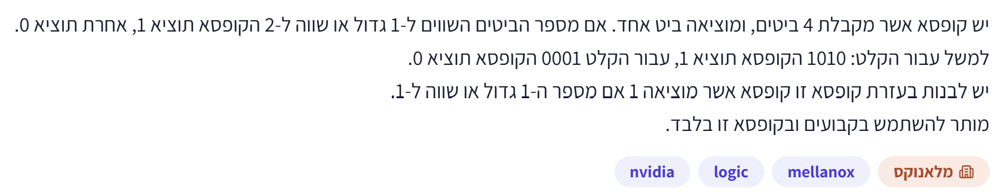
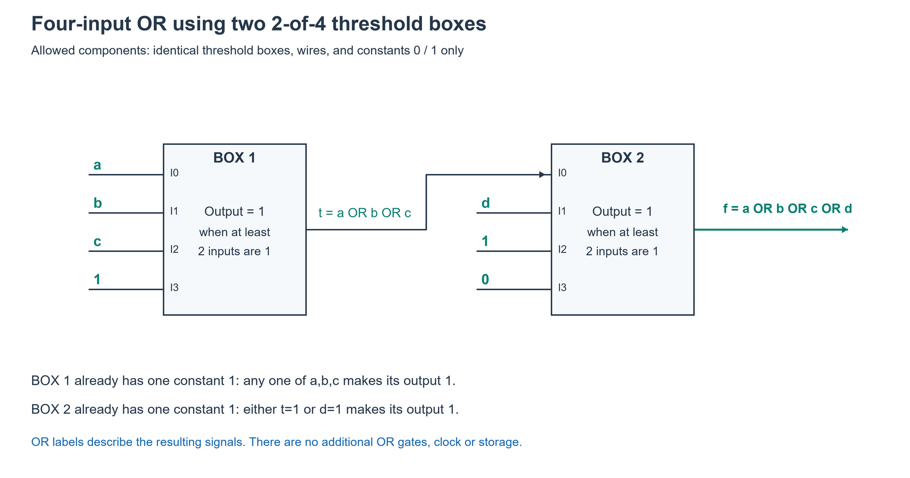

# PREP-013 — מימוש OR לארבעה ביטים באמצעות קופסאות סף

## השאלה המקורית

יש קופסא אשר מקבלת 4 ביטים, ומוציאה ביט אחד. אם מספר הביטים השווים ל־1 גדול או שווה ל־2 הקופסא תוציא 1, אחרת תוציא 0.
למשל עבור הקלט: 1010 הקופסא תוציא 1, עבור הקלט 0001 הקופסא תוציא 0.
יש לבנות בעזרת קופסא זו קופסא אשר מוציאה 1 אם מספר ה־1 גדול או שווה ל־1.
מותר להשתמש בקבועים ובקופסא זו בלבד.

## קטגוריות וחברות

- תגית מקור: logic.
- סיווג נוסף: חומרה, מערכות לוגיות ספרתיות, מעגלים קומבינטוריים, לוגיקת סף, קבועים והרכבת פונקציות.
- חברות לפי המקור: NVIDIA, Mellanox.
- תווית ראשית: ״מלאנוקס״. השיוך מהמקור בלבד, ללא אימות עצמאי.
- [HW-001](../../example_question/hardware/boolean_logic/hw-001-sensor-majority.md) עוסקת גם בסף לוגי, אך היא שאלה אחרת. PREP-011 קשורה לשימוש ברכיב מוגבל ובקבועים.

## שלושה רמזים מדורגים

1. הקופסה הנתונה דורשת שני ביטים שערכם 1. חשוב מה יקרה לדרישה הזאת אם אחת הכניסות שלה תהיה מחוברת תמיד לקבוע 1.

2. עם קבוע 1 באחת הכניסות, מספיק שאחת משלוש הכניסות האחרות תהיה 1. שים לב שכך טיפלת בשלושה ביטים — אבל בשאלה יש ארבעה.

3. אפשר לרכז תחילה את המידע משלושה ביטים לתוצאה אחת, ואז לצרף אליה את הביט הרביעי בעותק נוסף של הקופסה. בחר את הקבועים בשלב השני כך שאחד משני האותות יספיק להפעיל את המוצא.

## הצעה לפתרון

**המטרה:** לקבל ארבעה ביטים a,b,c,d ולהחזיר 1 אם לפחות אחד מהם הוא 1. זו הפונקציה OR של ארבע כניסות, אבל אסור להוסיף שער OR כרכיב — צריך לממש אותה רק באמצעות הקופסאות הנתונות וקבועים.

נסמן את הקופסה הנתונה B(x1,x2,x3,x4). היא מחזירה 1 כאשר סכום ארבעת הביטים לפחות 2. הפתרון מניח שמותר להשתמש בכמה עותקים של סוג הקופסה הנתון; השאלה אינה מגבילה לעותק יחיד.

**הרעיון:** ״מספקים מראש״ אחד משני ה־1 שהקופסה דורשת, באמצעות חיבור כניסה לקבוע 1.

**קופסה ראשונה:** מחברים אליה a,b,c,1 וקוראים למוצא t.

- אם a=b=c=0, הקופסה רואה 0,0,0,1: יש רק 1 אחד, ולכן t=0.
- אם לפחות אחד מ־a,b,c הוא 1, יש בנוסף אליו את הקבוע 1: יש לפחות שניים, ולכן t=1.

לכן t=a OR b OR c. זה תיאור של האות שהקופסה יצרה, ולא שער OR נוסף. בשלב הזה עדיין לא בדקנו את d, כי הקבוע תפס את הכניסה הרביעית.

**קופסה שנייה:** מחברים אליה t,d,1,0 וקוראים למוצא f.

- אם t=d=0, הקופסה רואה 0,0,1,0: רק 1 אחד, ולכן f=0.
- אם t=1 או d=1, יחד עם הקבוע 1 יש לפחות שניים, ולכן f=1.
- אם שניהם 1, יש שלושה אחדים והפלט נשאר 1. הדרישה היא ״לפחות שניים״, לא ״בדיוק שניים״.

לכן f=t OR d, ומכיוון ש־t=a OR b OR c, נקבל f=a OR b OR c OR d.

**החיבורים המלאים:**

| רכיב | כניסה 0 | כניסה 1 | כניסה 2 | כניסה 3 | מוצא |
| --- | --- | --- | --- | --- | --- |
| קופסה 1 | a | b | c | קבוע 1 | t |
| קופסה 2 | t | d | קבוע 1 | קבוע 0 | f |

הקבוע 0 בקופסה השנייה משלים את מספר הכניסות בלי להוסיף עוד 1. אסור לחבר שם עוד קבוע 1: שני קבועי 1 היו מפעילים את המוצא תמיד, גם עבור a=b=c=d=0.

**דוגמאות בדיקה:**
- 0000: הראשונה מקבלת 0001 ומחזירה 0; השנייה מקבלת 0010 ומחזירה 0.
- 1000: הראשונה מקבלת 1001 ומחזירה 1; השנייה מקבלת 1010 ומחזירה 1.
- 0001: הראשונה מקבלת 0001 ומחזירה 0; השנייה מקבלת 0110 ומחזירה 1.
- 1111: שתי הקופסאות מחזירות 1.

**מספר הקופסאות המינימלי הוא 2.** הראינו בנייה עם שתיים. כדי לממש OR של ארבע כניסות בקופסה אחת, המוצא חייב להיות תלוי בכל אחד מארבעת המשתנים, ולכן כל אחד מהם חייב להתחבר לפחות לפין אחד. לקופסה רק ארבע כניסות, ולכן לא נשאר מקום לקבועים או להכפלת משתנה: היא חייבת לקבל בדיוק a,b,c,d בסדר כלשהו. אבל במקרה של 1 יחיד היא תחזיר 0 במקום 1. לכן קופסה אחת לא יכולה להספיק. בדיקה ממצה של כל 6^4=1296 חיבורי הפינים מתוך a,b,c,d,0,1, כולל חיבורים חוזרים, מאשרת זאת.

**איך חושבים על שאלות מהסוג הזה?** מפרידים בין מה שהרכיב דורש לבין מה שהמערכת צריכה לזהות. כאן הרכיב דורש שני אחדים, והמערכת צריכה לזהות אפילו אחד. קבוע 1 מקטין את מספר האחדים שצריך לקבל מהאותות, אבל צורך כניסה. לכן מצמצמים קודם קבוצת קלטים לתוצאת ביניים, ומצרפים את הקלט שנשאר בשלב הבא. זהו מעגל קומבינטורי, ללא שעון, FF או זיכרון.

### שרטוט המעגל

הכיתוב OR על החוטים מתאר את האותות המחושבים; הוא אינו מייצג שערים נוספים. כל ארבע הכניסות בכל קופסה מחוברות במפורש.

### קוד, אימות ומינימליות

[מודל המעגל](../solutions/prep_013_threshold_or.py) · [בדיקה ממצה](../checks/check_prep_013.py) · [מחולל שרטוט](../solutions/draw_prep_013_threshold_or.py).

נבדקו שתי הדוגמאות לפעולת הקופסה, כל 16 צירופי הקלט של המעגל, כל 1296 החיבורים האפשריים של קופסה אחת מתוך a,b,c,d,0,1 כולל חזרות, וכל ששת החוטים/הקבועים האפשריים ללא קופסה. המימוש עם שתיים תקין ואין מימוש קטן יותר במודל שהוגדר. השרטוט נבדק חזותית מול רשימת החיבורים. זוהי בדיקת לוגיקה אידאלית ולא בדיקת תזמון פיזי או סימולציית HDL.

## תשובה קצרה לראיון

אחבר את a,b,c וקבוע 1 לקופסה הראשונה, ולכן המוצא שלה אומר אם לפחות אחד משלושתם הוא 1. לקופסה השנייה אחבר את המוצא הזה, את d ואת הקבועים 1,0. כך מספיק אחד משני האותות כדי לעבור את הסף, והתוצאה היא OR של כל ארבעת הקלטים. דרושות שתי קופסאות.

## English

A box takes four bits and outputs one bit: 1 if at least two inputs are 1, otherwise 0. For example, 1010 produces 1 and 0001 produces 0. Using this box type, build a box that outputs 1 when at least one input is 1. Only constants and the given box are allowed.

Hint 1: The given box requires two asserted inputs. What happens to that requirement if one input is permanently tied to constant 1?

Hint 2: With one constant 1, any asserted bit among the remaining three is enough. But that handles only three original inputs, while the requested function has four.

Hint 3: First combine information from three bits into one signal, then combine it with the fourth bit in another copy of the box. Choose constants so either signal alone can assert the second output.

The desired four-input function is OR(a,b,c,d). OR here describes the behavior; no separate OR gates are permitted. Let B(x1,x2,x3,x4) be the supplied threshold box, outputting 1 iff at least two inputs are 1. Assume multiple identical copies of the box type are allowed, as the prompt gives no one-instance limit.

Use t=B(a,b,c,1). The fixed 1 supplies one of the two required asserted inputs. If a=b=c=0, the total is one and t=0; if any is 1, the total is at least two and t=1. Thus t=a OR b OR c. This first box leaves the fourth original bit d unprocessed.

Then use f=B(t,d,1,0). If t=d=0, only the fixed 1 is present and f=0. If either is 1, there are at least two and f=1. Consequently f=t OR d=OR(a,b,c,d). The final 0 occupies the unused pin without changing the threshold; replacing it by a second 1 would force output 1 even for the all-zero original input.

Two boxes are minimal. A single-box circuit must depend on all four original bits, so each must appear on at least one pin. With only four pins, that leaves no constants or repeated signals. The resulting direct threshold-of-four fails every singleton input. Exhaustive enumeration of all 1296 assignments of a,b,c,d,0,1 to four pins, with repetition allowed, confirms impossibility; all six direct zero-box sources are also ruled out. Both source examples and all sixteen inputs of the proposed two-box network were checked.

Examples: 0000 produces t=0,f=0; 1000 gives t=1,f=1; 0001 gives t=0,f=1; 1111 gives both 1. General method: use constants to adjust how many asserted variable inputs the primitive still needs, account for the pins consumed by constants, then combine partial results to cover remaining inputs. This is an acyclic combinational network with no clocks, storage, inverters or extra gates. The criterion is box count; the longest dependency path has two box stages.

התוכן נוצר בסיוע AI וממתין לסקירת תוכן; טרם פורסם באתר.

