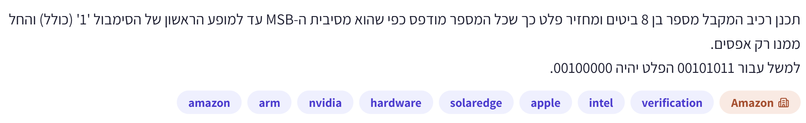
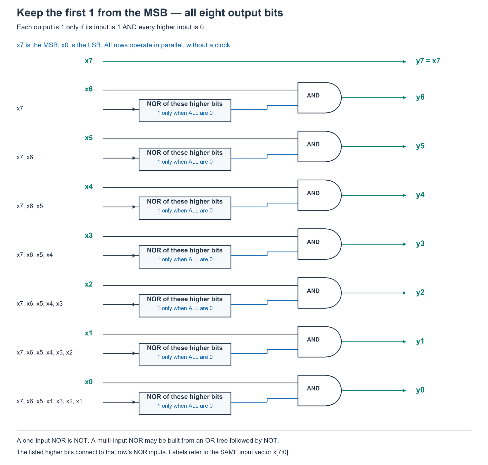
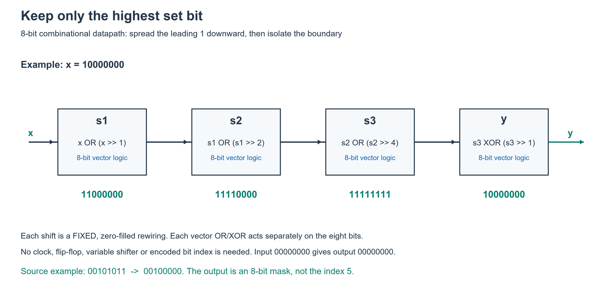
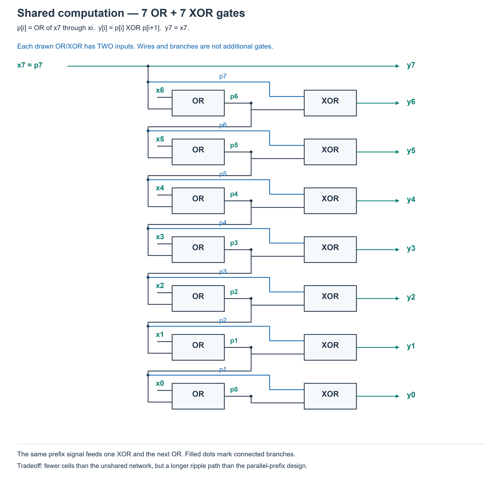
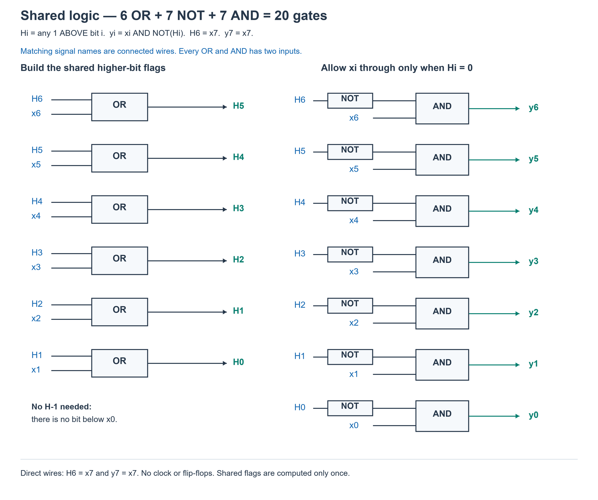
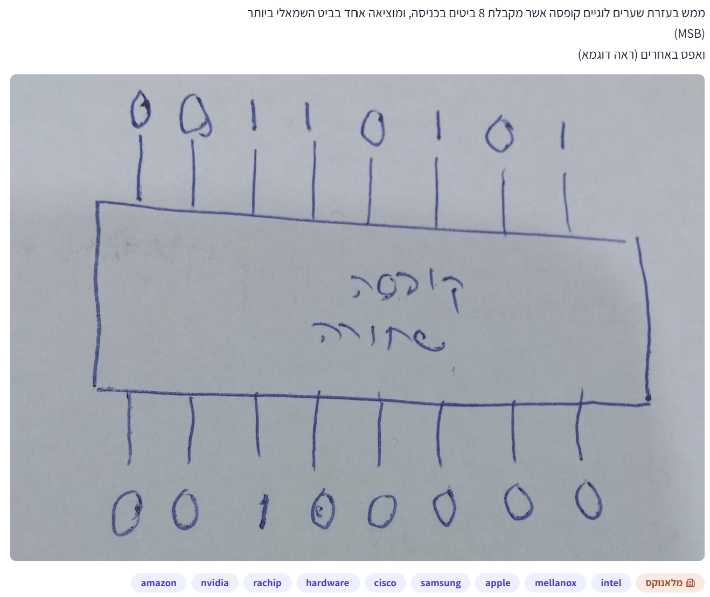

# PREP-014 — השארת ה־1 המשמעותי ביותר במספר בן 8 ביטים

## השאלה המקורית

תכנן רכיב המקבל מספר בן 8 ביטים ומחזיר פלט כך שכל המספר מודפס כפי שהוא מסיבית ה־MSB עד למופע הראשון של הסימבול '1' (כולל) והחל ממנו רק אפסים.
למשל עבור 00101011 הפלט יהיה 00100000.



## קטגוריות וחברות

- תגיות מקור: hardware, verification.
- סיווג נוסף: מעגלים קומבינטוריים, לוגיקת עדיפות, פלט one-hot, OR מצטבר ופעולות על ביטים.
- חברות לפי המקור: Amazon, Arm, NVIDIA, SolarEdge, Apple, Intel.
- תווית ראשית: Amazon; שיוך החברות מהצילום בלבד, ללא אימות עצמאי.
- שאלות קשורות: [HW-005](../../example_question/hardware/combinational_circuits/hw-005-interrupt-priority.md), [VHW-003](../../verify_example_questions/hardware/digital_logic_and_clocking/vhw-003-priority-encoder.md), [VSW-002](../../verify_example_questions/software/bit_manipulation/vsw-002-power-two-msb.md). הן אינן כפילות מדויקת; חלקן מחזירות אינדקס ולא מסכה.

## שלושה רמזים מדורגים

1. הסתכל על ביט מסוים בפלט: לא מספיק שביט הקלט באותו מקום יהיה 1. איזה מידע על הביטים שמשמאלו קובע אם מותר להשאיר אותו?

2. ה־1 שנשמר הוא זה שאין אף 1 משמאלו. לכן ביט פלט צריך להיות 1 רק אם ביט הקלט שלו הוא 1 וכל הביטים המשמעותיים יותר הם 0.

3. אפשר לחשב לכל מיקום דגל שאומר ״כבר יש 1 בביטים הגבוהים יותר״ בעזרת OR של אותם ביטים. שתף את חישובי ה־OR בין המיקומים, ובכל ביט שלב את הקלט עם ההיפוך של הדגל.

## הצעה לפתרון

**מה מבקשים?** להשאיר רק את ה־1 המשמעותי ביותר בקלט בן שמונה ביטים, ולאפס את כל הביטים שמתחתיו. הפלט נשאר וקטור בן שמונה ביטים. למשל 00101011 הופך ל־00100000. הדוגמה מבהירה שה־1 הראשון עצמו נשמר, למרות הביטוי ״והחל ממנו״ בנוסח. עבור 00000000 נגדיר פלט 00000000.

נסמן את הקלט x[7:0] ואת הפלט y[7:0], כאשר x7 הוא הביט השמאלי, ה־MSB.

**הכלל לכל ביט:** מותר ל־yi להיות 1 רק אם xi=1 ואין אף 1 במקומות המשמעותיים יותר.

לכן:
```text
y7 = x7
y6 = x6 AND NOT(x7)
y5 = x5 AND NOT(x7 OR x6)
y4 = x4 AND NOT(x7 OR x6 OR x5)
...
y0 = x0 AND NOT(x7 OR x6 OR x5 OR x4 OR x3 OR x2 OR x1)
```

כל מעבר כאן נובע מאותו כלל: קודם דורשים שהביט עצמו יהיה 1, ואז חוסמים אותו אם כבר יש 1 משמאלו. זהו בורר עדיפות בעל מוצא one-hot, כלומר לכל היותר ביט אחד דולק. הפלט אינו האינדקס של הביט; לדוגמה לא מחזירים 5 אלא את המסכה 00100000.

**למה הכלל נכון?** כל ביט מעל ה־1 הראשון הוא 0 מלכתחילה. ה־1 הראשון עובר כי אין מעליו אף 1. כל ביט שמתחתיו נחסם כי יש מעליו לפחות את ה־1 הראשון. אם אין בכלל אחדים, כל ביט פלט 0.

**מימוש פשוט עם שיתוף חישובים:** נגדיר H7=0, ונחשב מהמקום הגבוה לנמוך:
`yi = xi AND NOT(Hi)`, `H(i−1) = Hi OR xi`.
הדגל Hi מציין אם יש 1 מעל מקום i. זו שרשרת קומבינטורית, לא סדר פעולות בשעון ולא FF. השטח גדל לינארית ברוחב, אך מסלול ההשהיה הארוך עלול להיות לינארי.

**מימוש מקביל יעיל יותר מבחינת עומק לוגי:** מחשבים את ה־OR המצטבר בשלוש שכבות בעזרת הזזות קבועות ו־OR, ואז מבודדים את הגבול בעזרת XOR.

```text
s1 = x  OR (x  >> 1)
s2 = s1 OR (s1 >> 2)
s3 = s2 OR (s2 >> 4)
y  = s3 XOR (s3 >> 1)
```

ההזזות הן ימינה, ממולאות באפסים, והפעולות הן לכל ביט בנפרד. בכל שלב משתמשים בתוצאה של השלב הקודם, ולא שוב בקלט המקורי.

**למה שלוש שכבות ה־OR עובדות?** בשכבה הראשונה כל ביט רואה את עצמו ואת השכן מעליו. בשנייה כל ביט רואה עד ארבעה ביטים מהקלט המקורי; בשלישית עד שמונה. לכן בסוף s3 כל הביטים החל מה־1 המשמעותי ביותר ועד ה־LSB הופכים ל־1, וכל הביטים שמעליו נשארים 0.

למשל:
```text
x       = 10000000
s1      = 11000000
s2      = 11110000
s3      = 11111111
s3 >> 1 = 01111111
XOR     = 10000000
```

**למה XOR משאיר בדיוק את הביט הרצוי?** אחרי המילוי, בתוך רצף האחדים שני הווקטורים מכילים 1, ו־1 XOR 1 הוא 0. מעל הרצף שניהם 0, ו־0 XOR 0 הוא 0. רק במקום של ה־1 הגבוה ביותר יש 1 ב־s3 ו־0 בעותק המוזז, ולכן רק שם מתקבל 1. גם בקלט אפס שני הווקטורים אפס. באותה נקודה אפשר גם לחשב `s3 AND NOT(s3 >> 1)`, אך ה־XOR מבטא ישירות את זיהוי הגבול.

בדוגמה המקורית x=00101011, כבר אחרי השכבה הראשונה מתקבל 00111111; גם אחרי השנייה והשלישית הוא נשאר כך. ה־XOR מול 00011111 מחזיר 00100000.

**מה יש בחומרה?** שלוש שכבות של שערי OR לכל ביט ושכבת XOR סופית. הזזה במרחק קבוע היא חיווט בין מיקומים וחיבור אפסים בקצוות; אין צורך במחולל הזזה משתנה, בשעון או בזיכרון. הווקטורים הם חוטים קומבינטוריים ברוחב שמונה ביטים.

**מה פירוש יעיל כאן?** במודל שערים בעלי שתי כניסות, המימוש נותן לכל היותר שלוש שכבות OR ועוד XOR. בהרחבה לרוחב N העומק הוא O(log N), לעומת שרשרת פשוטה בעומק O(N). זה סדר גודל מיטבי לעומק: y0 תלוי בכל N הקלטים, ואחרי d שכבות של שערים בעלי שתי כניסות אפשר להיות תלויים לכל היותר ב־2^d קלטים, ולכן נדרש לפחות log2(N) עומק. עבור שמונה ביטים הטיעון נותן חסם תחתון של שלוש שכבות; אין כאן הוכחה שארבע שכבות הן המינימום המדויק לכל ספריית שערים.

הרשת המקבילית המפורשת יכולה להשתמש ב־O(N log N) שערים לפני פישוט, בעוד שרשרת ה־OR המשותפת היא O(N) בשטח. לכן זו בחירה לטובת עומק לוגי, ולא טענת מינימום שטח. רוחב השערים המותרים וספריית התאים יכולים לשנות את ההשוואה.

### שרטוט מפורש של התנאי לכל ביט



בכל שורה בלוק NOR מקבל את כל ביטי הקלט המופיעים משמאלו ומחזיר 1 רק אם כולם 0. את התוצאה מחברים בשער AND עם ביט הקלט של אותה שורה. בשורת y6 יש רק ביט גבוה אחד ולכן בלוק ה־NOR הוא למעשה NOT של x7. בשורת y7 אין אף ביט גבוה יותר ולכן זהו חיבור ישיר. שמות x7 עד x0 בכל השורות מתייחסים לאותו וקטור קלט; רשימת שמות משמאל לבלוק היא קבוצת כניסות ולא חיבור שלהן יחד על חוט אחד.

לדוגמה, ב־00101011 מתקיים x7=x6=0 ו־x5=1. לכן y5=1 AND NOT(0 OR 0)=1. בכל שורה שמתחת ל־y5, קבוצת הביטים הגבוהים כוללת את x5=1, ולכן ה־NOR מחזיר 0 וה־AND מאפס את הביט. הביטים y7,y6 אפס כי הקלטים שלהם אפס. התוצאה היא 00100000.

השרטוט הזה מציג את הפונקציה של כל פלט במפורש כדי להקל על ההבנה. הוא אינו טענת מינימום שטח: יש חישובי OR חופפים שאפשר לשתף. המימוש המקביל המשותף המתואר בהמשך נותן חלופה בעלת עומק לוגריתמי. בלוק NOR רחב יכול להתממש כעץ OR ואחריו NOT, בהתאם לספריית השערים.

[מחולל שרטוט התנאים](../solutions/draw_prep_014_priority_gates.py). השרטוט נבדק מול המשוואה yi=xi AND NOT(OR של כל הביטים הגבוהים ממנו), והמשוואה הישירה נבדקה מול כל 256 הקלטים.

### תרשים המימוש המקביל



כל בלוק בתרשים מייצג פעולה על וקטור של שמונה ביטים, ולא שער בודד בעל שמונה כניסות. זהו תרשים זרימת אותות קומבינטורי; השלבים אינם מחזורי שעון.

### צמצום מספר השערים באמצעות שיתוף חישובים

השרטוט המורחב הקודם מחשב מחדש OR של ביטים גבוהים בכל שורה. אפשר לחסוך באמצעות OR מצטבר: p7=x7, ולאחר מכן pi=xi OR p(i+1), עבור i=6 עד 0. למשל p6=x6 OR x7, ואילו p5=x5 OR p6; אין צורך לחשב שוב x6 OR x7. כל pi אומר האם יש לפחות 1 אחד מה־MSB ועד למיקום i, כולל.

כדי להשאיר רק את ה־1 הראשון, נחבר yi=pi XOR p(i+1), עבור i=6 עד 0, ואת y7 נחבר ישירות ל־x7.

למה זה נכון? מעל ה־1 הראשון שני אותות ה־p הם 0 ולכן XOR מחזיר 0. במקום ה־1 הראשון, לפני הכנסת הביט ל־OR המצטבר הערך הוא 0 ואחריה 1, ולכן XOR מחזיר 1. בכל מקום נמוך יותר כבר נמצא 1, ולכן שני האותות 1 וה־XOR מחזיר 0. בקלט שכולו אפסים כל המוצאים נשארים אפס. אין שעון או זיכרון; זו שרשרת קומבינטורית.

```text
x       = 00101011
p       = 00111111
p >> 1  = 00011111
y       = 00100000
```

**ספירת שערים:** השרשרת משתמשת ב־7 שערי OR וב־7 שערי XOR בעלי שתי כניסות: 14 שערים כאשר XOR הוא תא בסיסי יחיד וחיווט והסתעפויות אינם נספרים. זו אינה הוכחה ש־14 הוא המינימום המוחלט, וספירה זו אינה מדידת שטח סיליקון: XOR עשוי להיות יקר יותר מ־OR.

השוואה מפורשת, לאחר מיפוי שערים רחבים לשערים בסיסיים בעלי שתי כניסות:

| מימוש | שערים | סך הכול |
|---|---|---|
| התנאי לכל פלט בנפרד, ללא שיתוף | 21 OR + 7 NOT + 7 AND | 35 |
| שיתוף OR מצטבר, וחסימת כל ביט עם AND ו־NOT | 6 OR + 7 NOT + 7 AND | 20 |
| שיתוף OR מצטבר וזיהוי הגבול ב־XOR | 7 OR + 7 XOR | 14 |

המעבר מ־35 ל־20 משווה אותה ספריית AND/OR/NOT. בשורה האחרונה נוסף XOR כשער בסיסי. אם NOR רחב נחשב שער יחיד, הספירה של השרטוט הקודם שונה; אין להשוות מספר בלוקים מצוירים בלי להגדיר מספר כניסות ושערים מותרים. מימוש ה־14 הוא חלופה פשוטה וחסכונית בספירת תאים, ולא הוכחה למינימום טכנולוגי.

יש מחיר בעומק: השרשרת המצוירת כוללת מסלול של עד 7 OR ועוד XOR, לעומת לכל היותר 3 OR ועוד XOR במימוש המקביל. מספר שכבות אינו מדידת השהיה פיזית; ספריית התאים והעומסים משפיעים גם הם.



[מחולל השרטוט](../solutions/draw_prep_014_shared_prefix.py) · [בדיקת המעגלים וספירת השערים](../checks/check_prep_014_gate_counts.py).

שלושת המימושים נבנו כרשימות שערים ונבדקו על כל 256 הקלטים מול המפרט. ספירת השערים נבדקה מתוך אותן רשימות, ולא מתוך מספר הבלוקים בתרשים. לא בוצעה סינתזה או מדידת שטח פיזי.

### פירוט המימוש באמצעות AND, OR ו־NOT בלבד

נגדיר Hi: האם יש לפחות 1 אחד בביטים שמעל xi, בלי לכלול את xi עצמו? זה שונה מה־pi במימוש XOR, שכלל גם את הביט הנוכחי. מספיק ש־Hi=1 כדי לחסום את xi. לכן yi=xi AND NOT(Hi): ה־NOT מחזיר 1 כאשר אין שום 1 גבוה יותר, וה־AND דורש שגם xi עצמו יהיה 1.

```text
y7 = x7                 H6 = x7
y6 = x6 AND NOT(H6)      H5 = H6 OR x6
y5 = x5 AND NOT(H5)      H4 = H5 OR x5
y4 = x4 AND NOT(H4)      H3 = H4 OR x4
y3 = x3 AND NOT(H3)      H2 = H3 OR x3
y2 = x2 AND NOT(H2)      H1 = H2 OR x2
y1 = x1 AND NOT(H1)      H0 = H1 OR x1
y0 = x0 AND NOT(H0)
```

כל דגל H מחושב פעם אחת בלבד ומשמש גם את הפלט באותה שורה וגם את שער ה־OR שמחשב את הדגל הבא. לדוגמה H5=x7 OR x6, ולכן H4=H5 OR x5 חוסך חישוב מחדש של x7 OR x6. אין צורך לחשב דגל אחרי x0, כי אין ביט נוסף לחסום.

בדוגמה 00101011: H6=0 ולכן y6=0 AND 1=0; H5=0 ולכן y5=1 AND 1=1. כעת H4=H5 OR x5=0 OR 1=1. גם כל דגלי H שמתחתיו יהיו 1, ולכן ה־NOT שלהם מחזיר 0 וכל הפלטים התחתונים נחסמים. y7=x7=0, ולכן התוצאה 00100000.

הספירה היא 6 OR לבניית H5 עד H0, ועוד 7 NOT ו־7 AND עבור y6 עד y0: בסך הכול 20 שערים. y7 ו־H6 הם חיבורים ישירים. זהו מעגל קומבינטורי; המילה ״הבא״ מתייחסת לביט הבא ולא למחזור שעון.



בשרטוט, הופעות של אותו שם H מציינות את אותו חוט. בצד שמאל מחשבים את ששת הדגלים המשותפים, ובצד ימין מחשבים את שבעת הפלטים הנמוכים. [מחולל השרטוט](../solutions/draw_prep_014_shared_basic.py). מימוש shared_basic בבדיקת רשימות השערים עבר את כל 256 הקלטים.

### קוד ובדיקה

[SystemVerilog](../solutions/prep_014_isolate_msb.sv) · [מודל Python ושיטת שרשרת](../solutions/prep_014_isolate_msb.py) · [בדיקה ממצה](../checks/check_prep_014.py) · [מחולל התרשים](../solutions/draw_prep_014_isolate_msb.py).

נבדקו כל 256 הקלטים מול המפרט ומול מימוש שרשרת נפרד. נבדקו כל ביט בכל שכבת OR, תכונת one-hot או אפס, דוגמת המקור וקלטים מחוץ לטווח. השרטוט נבדק חזותית. בדיקות Python עברו; קוד HDL לא קומפל או סומלץ ולא נעשתה בדיקת תזמון פיזי.

## תשובה קצרה לראיון

ביט פלט יהיה 1 רק אם ביט הקלט שלו 1 וכל הביטים המשמעותיים ממנו 0. אפשר לחשב OR מצטבר ולחסום כך את כל הביטים שמתחת ל־1 הראשון. למימוש בעומק לוגריתמי אמלא אחדים מתחת ל־1 הגבוה באמצעות OR עם הזזות ימינה ב־1,2,4, ואז אעשה XOR עם עותק המוזז בביט אחד. רק ה־1 הגבוה יישאר; גם קלט אפס מטופל.

## English

Design a component accepting an eight-bit number. Copy the input from the MSB through the first occurrence of 1 (inclusive), and make the remaining lower bits zero. For example, 00101011 produces 00100000.

Hint 1: For a particular output bit, its input being 1 is not enough. What information about the more significant bits determines whether it may remain set?

Hint 2: The retained 1 has no other 1 to its left. An output bit should be 1 only if its input is 1 and all more significant inputs are 0.

Hint 3: Compute, for each position, a flag saying that some more significant input is 1, using OR. Share prefix computations between positions and combine each input with the inverted flag.

Keep only the highest set bit of the eight-bit input, returning an eight-bit one-hot-or-zero mask. The example fixes the interpretation: the first 1 is retained; only lower bits are cleared. Define all-zero input to return zero. With x7 the MSB, yi=xi AND NOT(OR of x7 through x(i+1)); y7=x7. Bits above the first 1 are already zero, the first 1 has no asserted higher input and passes, and all lower bits are blocked. This returns a mask, not an encoded index.

A shared ripple implementation uses H7=0, yi=xi AND NOT(Hi), H(i-1)=Hi OR xi. It is combinational, with O(N) size and potentially O(N) depth. For logarithmic depth, use s1=x OR (x>>1), s2=s1 OR (s1>>2), s3=s2 OR (s2>>4), and y=s3 XOR (s3>>1). Shifts are fixed logical zero-filled wiring, and all operations are bitwise on eight-bit unsigned vectors. Each stage depends on the preceding one. After stages 1,2,3 each bit sees up to 2,4,8 original bits at or above it. Thus s3 is zero above the highest input 1 and all ones below and including it. XOR with its one-bit-right-shifted copy removes the overlapping ones and leaves only the leading boundary. The all-zero case remains zero. An equivalent final expression is s3 AND NOT(s3>>1).

Example 10000000 becomes 11000000,11110000,11111111, then XOR with 01111111 gives 10000000. For the source example 00101011, the first OR stage already yields 00111111 and the final result is 00100000.

The explicit parallel circuit has at most three two-input OR levels and one XOR level. For N bits it has O(log N) depth, asymptotically optimal under bounded fan-in: y0 depends on all N inputs, while depth d can cover at most 2^d inputs. This is not a claim of exact minimum four-level depth for N=8 or minimum cell area. The straightforward parallel network can have O(N log N) gates before simplification; the ripple version shares gates for O(N) area. No clock, FF, variable shifter or priority-index decoder is required. Python equation models were exhaustively verified for all 256 inputs; SystemVerilog is supplied but no HDL simulation or physical timing closure is claimed.

Gate-sharing alternative: define p7=x7 and pi=xi OR p(i+1) for i=6..0. Output y7=x7 and yi=pi XOR p(i+1). Prefixes are 0 above the highest 1, first change to 1 at that position, then remain 1, so XOR isolates exactly that boundary. This uses seven two-input OR and seven two-input XOR cells. With two-input AND/OR and one-input NOT, the independently expanded conditions use 35 cells (21 OR, 7 NOT, 7 AND), while shared higher-bit prefixes use 20 (6 OR, 7 NOT, 7 AND). The 14-cell alternative assumes XOR is a primitive cell; it is not an equal-area comparison or a globally minimal circuit proof. Wide NOR primitives change the counting model. The ripple construction has a path of seven OR plus XOR, trading depth against the parallel-prefix circuit. All three explicit gate netlists passed all 256 inputs; no synthesis or physical area measurement was performed.

התוכן נוצר בסיוע AI וממתין לסקירת תוכן; טרם פורסם באתר.


## נוסח נוסף עם שרטוט — 27 בספטמבר 2026

ממש בעזרת שערים לוגיים קופסא אשר מקבלת 8 ביטים בכניסה, ומוציאה אחד בביט השמאלי ביותר (MSB) ואפס באחרים (ראה דוגמא).



**קריאת הדוגמה בשרטוט:** 00110101 → 00100000. לכן הכוונה להשאיר את ה־1 השמאלי ביותר שקיים בקלט, ולא להוציא תמיד 10000000. המוצא הוא וקטור בן שמונה ביטים ולא אינדקס מקודד. זהה לפונקציה של PREP-014; נשמר מקור נוסף בלי ליצור שאלה כפולה. ההנחה לקלט אפס נשארת 00000000, שכן המקרה לא הוגדר במקור החדש.

הצילום החדש מבקש במפורש שערים לוגיים. פתרון AND/OR/NOT שכבר נשמר ברשומה מתאים ישירות: y7=x7 ולכל i<7 הביט yi הוא xi AND NOT של OR כל הביטים שמשמאלו. חישובי OR משותפים מונעים שכפול עבודה. גם שאר החלופות הקומבינטוריות והשרטוטים שכבר נשמרו נשארים זמינים, בכפוף לספריית השערים והעדפת שטח לעומת עומק. אין כאן טענה חדשה למינימום שערים מוחלט.

**קטגוריות:** תגית מקור hardware. סיווג נוסף שלנו: מערכות לוגיות ספרתיות, לוגיקה קומבינטורית, עדיפות ובידוד הביט המשמעותי ביותר. **חברות בתמונה הזאת:** Amazon, NVIDIA, Rachip, Cisco, Samsung, Apple, Mellanox, Intel. תווית ראשית: מלאנוקס. השיוך מהמקור בלבד ולא אומת עצמאית; חברות ותגיות מהצילום הישן אינן מיוחסות אוטומטית לצילום החדש.

**עדיפות גבוהה להכנה:** השאלה מתרגלת יסודות חומרה, פירוק תנאי לביט בודד, שיתוף לוגיקה ובדיקת מקרי קצה, הרלוונטיים להכנה לתפקיד ולידציית שבבים. זו הערכת הכנה לפי תיאור המשרה, לא תחזית לשאלות הראיון.

שלושת הרמזים, הפתרונות, השרטוטים ובדיקת כל 256 הקלטים ברשומה הקיימת חלים גם על הנוסח הזה. הדוגמה החדשה נבדקה ישירות בעת הקליטה.


Alternate supplied source: the handwritten example is 00110101 → 00100000, identifying the highest set bit rather than forcing the physical MSB to one. This is the same PREP-014 function with an explicit logic-gate requirement. Existing AND/OR/NOT solutions, hints, diagrams and exhaustive checks apply. Zero input is assumed to yield zero, not explicitly specified in the new source. New source tag: hardware; reported companies: Amazon, NVIDIA, Rachip, Cisco, Samsung, Apple, Mellanox, Intel; badge Mellanox. These are unverified source reports. Original-source companies remain separately attributed. High preparation relevance is an assessment of digital-hardware foundations, not an interview prediction.


### הפתרון המלא לפי AND עם NOR של הביטים הקודמים

הרעיון נכון: yi=xi AND NOR של כל הביטים שמשמאלו. שני התנאים חייבים להתקיים יחד: הביט עצמו 1, ואף ביט משמעותי יותר אינו 1. y7=x7 כי אין ביט שמשמאל ל־x7. אין לערבב בין שמו של ביט הקלט xi לבין שמו של ביט הפלט yi.

```text
y7 = x7
y6 = x6 AND NOT(x7)
y5 = x5 AND NOT(x7 OR x6)
y4 = x4 AND NOT(x7 OR x6 OR x5)
y3 = x3 AND NOT(x7 OR x6 OR x5 OR x4)
y2 = x2 AND NOT(x7 OR x6 OR x5 OR x4 OR x3)
y1 = x1 AND NOT(x7 OR x6 OR x5 OR x4 OR x3 OR x2)
y0 = x0 AND NOT(x7 OR x6 OR x5 OR x4 OR x3 OR x2 OR x1)
```

כדי לחסוך שערים, לא בונים את כל הביטויים הארוכים בנפרד. נגדיר Hi בתור OR של כל הביטים שמשמאל ל־xi: הוא 1 אם כבר יש שם אחד. נשתף את תוצאות הביניים:

```text
H6 = x7
H5 = H6 OR x6
H4 = H5 OR x5
H3 = H4 OR x4
H2 = H3 OR x3
H1 = H2 OR x2
H0 = H1 OR x1
yi = xi AND NOT(Hi)   for i=6..0
y7 = x7
```

למשל H4=x7 OR x6 OR x5, ולכן H3=H4 OR x4 מוסיף רק את x4 לבדיקה הקיימת. y3=x3 AND NOT(H3) הוא בדיוק ה־AND עם NOR של ארבעת הביטים הקודמים שהוצע. Hi הוא שם חוט, לא רגיסטר או תא זיכרון. זה מעגל קומבינטורי ללא שעון.


קריאת השרטוט: צד שמאל מייצר את חוטי H המשותפים; צד ימין משתמש בהם לפלטים. כל הופעה של אותו שם H היא אותו חוט. החיבורים H6=x7 ו־y7=x7 ישירים, ומצוינים בכותרת ובתחתית.

בדוגמה 00110101: x7=x6=0 ולכן y7=y6=0. x5=1 ואין אחד משמאלו, ולכן y5=1. לכל ביט מתחת ל־x5 כבר יש אחד משמאל (x5), ולכן ה־NOT של Hi נותן 0 וה־AND חוסם את הביט. מתקבל 00100000. בקלט 00000000 כל yi=0 כי כל xi=0.

**דיוק לגבי אופטימליות:** בתנאי ששערי AND/OR הם בעלי שתי כניסות ו־NOT שער נפרד, המימוש המשותף משתמש ב־6 OR, 7 NOT ו־7 AND: עשרים שערים, לעומת 35 בבנייה עצמאית של כל ביטוי עם שרשראות OR נפרדות. הספירה נבדקה ברשימת שערים על כל 256 הקלטים. זה מימוש חסכוני עם שיתוף חישובים, לא הוכחה למינימום שערים מוחלט. NOR רחב כשער בסיסי משנה את הספירה; XOR כשער בסיסי מאפשר את חלופת 14 התאים שכבר נשמרה; ועץ OR מקביל יכול להקטין עומק לעומת השרשרת. אין להכריז על מינימום שטח או השהיה בלי להגדיר ספריית שערים ומטרת האופטימיזציה. לראיון, הפתרון מבוסס AND/NOR עונה ישירות על המפרט ושיתוף OR מדגים צמצום לוגיקה בלי להחליף את דרך החשיבה.


Full AND/NOR explanation: yi=xi AND NOT(OR of all more significant bits), with y7=x7. To avoid duplicating each prefix, define H6=x7 and H(i-1)=Hi OR xi for i=6..1. Then yi=xi AND NOT(Hi), i=6..0. For example H3=H4 OR x4=x7 OR x6 OR x5 OR x4. H labels are shared combinational wires, not registers. The existing full 20-gate diagram shows their generation on the left and output masking on the right. Example 00110101 yields 00100000 because bit 5 is the first one and blocks every lower bit; all-zero input yields zero.

Under two-input AND/OR and separate NOT cells, shared implementation costs 6 OR+7 NOT+7 AND=20 gates versus 35 for independently expanded outputs, as previously exhaustively verified for all 256 inputs. This is an efficient shared construction, not a proof of globally minimum area or delay. Wide NOR primitives, XOR primitives (existing 14-cell alternative) and parallel-prefix topology change the tradeoffs. The unspecified source gate library does not establish one uniquely optimal implementation.


### שימוש ב־NOR כשער בסיסי: קוטביות תוצאת הביניים

בהמשך לבקשת הראל, כשאין הגבלה מפורשת יש להתייחס גם ל־NOR ול־NAND כשערים זמינים בפני עצמם, ולא לפרק אותם אוטומטית ל־OR/AND ו־NOT. עדיין יש לציין מספר כניסות וספריית שערים כשסופרים רכיבים או טוענים לאופטימליות.

הנוסח Y7=X7, Y6=X6 AND NOT(X7), N5=NOR(X6,X7), Y5=X5 AND N5 תקין. אבל N4=NOR(N5,X5) אינו ההמשך הנכון: N5=1 פירושו שאין שום 1 ב־X7,X6, בעוד שחוט OR מצטבר היה מציין את ההפך. NOR נוסף על N5 אינו מרחיב את אותה בדיקה.

דוגמה נגדית: X7=1,X6=0,X5=0,X4=1 (אפשר להשלים לקלט 10010000). מתקבל N5=0, ואז NOR(N5,X5)=NOR(0,0)=1, ולכן הנוסח השגוי מוציא גם Y4=1, אף ש־X7 כבר היה ה־1 השמאלי ביותר.

ההמשך הנכון שומר על המשמעות ״כל הביטים הגבוהים אפס״:
N6=NOT(X7);
N5=NOR(X7,X6);
N4=N5 AND NOT(X5);
N3=N4 AND NOT(X4);
N2=N3 AND NOT(X3);
N1=N2 AND NOT(X2);
N0=N1 AND NOT(X1);
Yi=Xi AND Ni עבור i=6..0, ו־Y7=X7.

באופן שקול, N4=NOR(NOT(N5),X5), ולא NOR(N5,X5). אם רוצים לרשום את הפונקציה ישירות בשער NOR רחב, N4=NOR(X7,X6,X5), N3=NOR(X7,X6,X5,X4), וכן הלאה. אלה שערים מרובי כניסות, ויש לציין שמותר להשתמש בהם; פירוק לשערים דו־כניסתיים מחייב טיפול נכון בקוטביות. לא ניתן פשוט לשרשר NOR כאילו היה OR.

חלופת NOR רחב: Y7 חוט ישיר; Y6 דורש NOT ו־AND; Y5..Y0 דורשים כל אחד NOR ברוחב מתאים ו־AND. אם NOR ברוחב 2..7 הוא תא בסיסי יחיד ו־NOT תא יחיד, הספירה היא 6 NOR+1 NOT+7 AND=14 תאים. זו ספירה במודל שונה ממודל 20 שערי AND/OR/NOT דו־כניסתיים, ואינה טענה למינימום פיזי או לשטח שווה לכל שער. המקרה של Y0 נכלל — יש שמונה יציאות, לא שבע.

בדיקה: מודל התנאי המצטבר המתוקן וה־NOR הישיר עברו את כל 256 הקלטים מול בידוד ה־1 הגבוה ביותר; הדוגמה הנגדית להמשך השגוי נבדקה.


NOR/NAND are treated as available primitive gates unless explicitly restricted; fan-in and the gate library must still be stated for counts. N5=NOR(X7,X6) means all higher bits are zero. Thus the proposed recurrence N4=NOR(N5,X5) is wrong: at input 10010000, N5=0 and the proposed N4=1 incorrectly passes bit 4. Correct recurrence is N4=N5 AND NOT(X5), equivalently NOR(NOT(N5),X5). In general Ni=N(i+1) AND NOT(X(i+1)), with N6=NOT(X7), yi=xi AND Ni and y7=x7. Direct wide NOR of all higher inputs is also valid; NOR is not associative like OR. Under an explicit library containing 2..7-input NOR primitives, the direct design has six NOR, one NOT and seven AND cells (14), not an equal-area or global optimality claim. Include y0. All 256 inputs checked for corrected recurrence and direct formulation; invalid recurrence has a tested counterexample.
