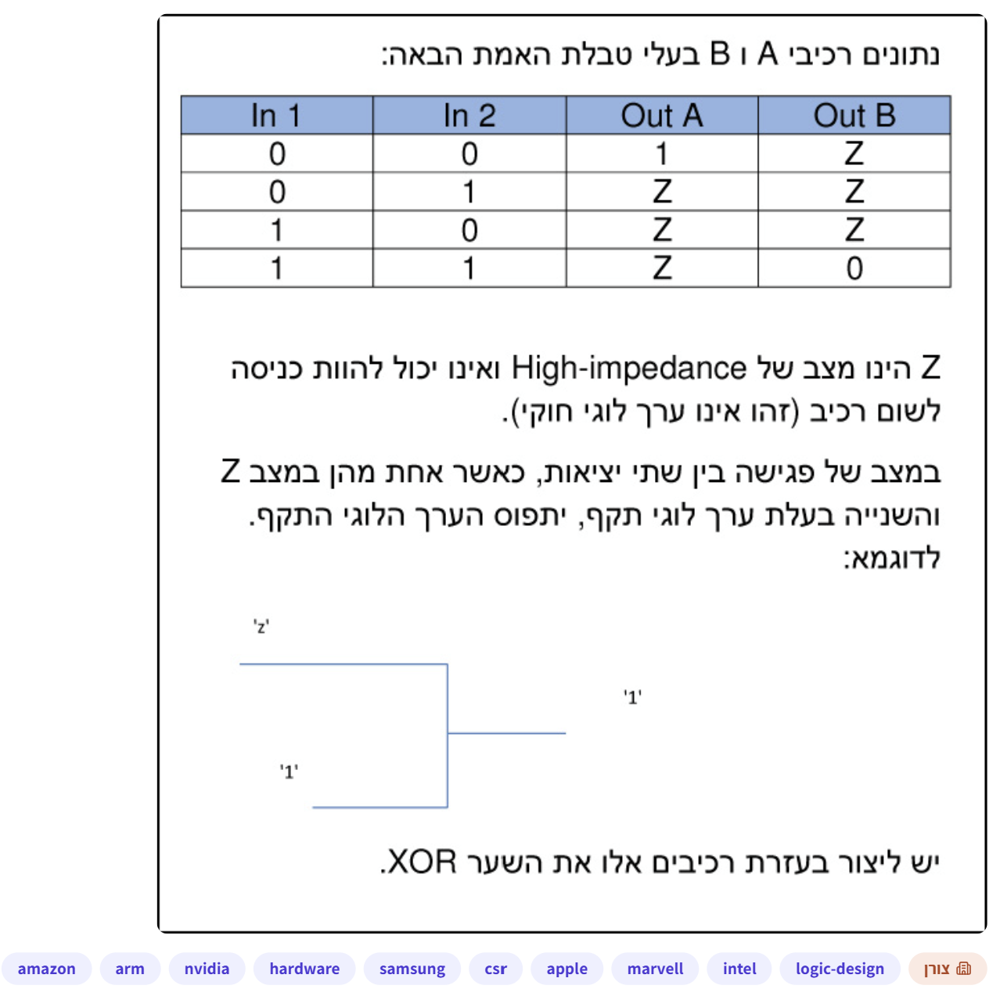
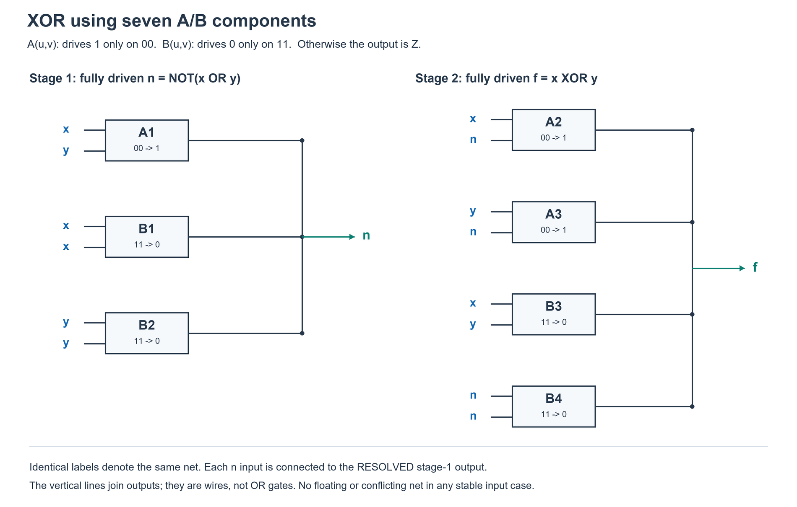

# PREP-015 — מימוש XOR באמצעות רכיבי A/B עם High-impedance

## השאלה המקורית

נתונים רכיבי A ו־B בעלי טבלת האמת הבאה:

| In 1 | In 2 | Out A | Out B |
|---|---|---|---|
| 0 | 0 | 1 | Z |
| 0 | 1 | Z | Z |
| 1 | 0 | Z | Z |
| 1 | 1 | Z | 0 |

Z הינו מצב של High-impedance ואינו יכול להוות כניסה לשום רכיב (זהו אינו ערך לוגי חוקי).
במצב של פגישה בין שתי יציאות, כאשר אחת מהן במצב Z והשנייה בעלת ערך לוגי תקף, יתפוס הערך הלוגי התקף.
לדוגמא: חיבור יציאה במצב Z ליציאה במצב 1 נותן 1, כמוצג בשרטוט שבצילום.
יש ליצור בעזרת רכיבים אלו את השער XOR.

## קטגוריות וחברות

תגיות מקור: hardware, logic-design. סיווג נוסף: מעגלים קומבינטוריים, tri-state, עכבה גבוהה, XOR וטבלאות אמת.

חברות לפי תגיות המקור: Amazon, Arm, NVIDIA, Samsung, CSR, Apple, Marvell, Intel. התווית הראשית היא צורן (Zoran). השיוך מהצילום בלבד ולא אומת עצמאית.

## שלושה רמזים מדורגים

1. Z אינו 0: הוא אומר שהיציאה אינה קובעת את ערך החוט. כדי ליצור חוט שאפשר להזין לרכיב אחר, צריך שבכל צירוף קלט לפחות יציאה אחת תקבע לו 0 או 1, בלי שיציאה אחרת תקבע את ההפך.

2. מותר לחבר את אותו אות לשתי כניסות של רכיב. בדוק מתי B(x,x) מוציא 0, ומתי B(y,y) מוציא 0. האם יחד עם A(x,y) אפשר ליצור אות פנימי שתמיד מוגדר?

3. בחיבור היציאות A(x,y), B(x,x), B(y,y) מתקבל n=NOT(x OR y). השתמש ב־n כדי להפריד את 00 מהמקרים 01 ו־10. כעת תכנן מי מוציא 1 בשני המקרים השונים, ומי מוציא 0 ב־00 וב־11.

## הצעה לפתרון

נסמן את שני הקלטים של המעגל x,y, כדי שלא לבלבל בינם לבין שמות הרכיבים A,B. רכיב A מוציא 1 רק כששתי כניסותיו 0; רכיב B מוציא 0 רק כששתי כניסותיו 1. בשאר המקרים היציאה אינה מניעה את החוט (Z). חיבור יציאות כאן הוא חיבור חשמלי לפי כללי השאלה, לא שער OR.

**שלב 1 — יוצרים אות פנימי חוקי n בשלושה רכיבים.** מחברים לאותו חוט את יציאות A(x,y), B(x,x), B(y,y).

- כאשר x=y=0: רק A מוציא 1 ושני רכיבי B במצב Z; לכן n=1.
- כאשר x=1: הרכיב B(x,x) מוציא 0, ורכיב A במצב Z; לכן n=0.
- כאשר y=1: הרכיב B(y,y) מוציא 0, ורכיב A במצב Z; לכן n=0.
- כאשר שניהם 1: שני רכיבי B מוציאים 0, כלומר מסכימים על אותו ערך.

לכן n=NOT(x OR y). זה אינו שער NOR נוסף: שלושת רכיבי A/B מממשים אותו. בכל צירוף קלט החוט n הוא 0 או 1, אף שביציאות הבודדות יכול להיות Z. רק החוט המשותף והמוגדר מחובר לכניסות בשלב הבא.

**שלב 2 — ארבעה רכיבים מחוברים לאותו חוט פלט f.**

| רכיב | הכניסות | מתי הוא מניע את הפלט? |
|---|---|---|
| A2 | x,n | מוציא 1 רק עבור x=0,y=1 |
| A3 | y,n | מוציא 1 רק עבור x=1,y=0 |
| B3 | x,y | מוציא 0 רק עבור x=y=1 |
| B4 | n,n | מוציא 0 רק עבור x=y=0 |

למה A(x,n) מתאים ל־01? הוא מוציא 1 כש־x=0 וגם n=0. העובדה ש־n=0 אומרת שלפחות אחד מבין x,y הוא 1. מאחר שכבר ידוע ש־x=0, בהכרח y=1. באותה דרך A(y,n) מזהה את 10. הרכיב B(n,n) מוציא 0 כש־n=1, וזה קורה רק ב־00.

**בדיקה מלאה של הנהגים:**

| x | y | n | A2(x,n) | A3(y,n) | B3(x,y) | B4(n,n) | f |
|---|---|---|---|---|---|---|---|
| 0 | 0 | 1 | Z | Z | Z | 0 | 0 |
| 0 | 1 | 0 | 1 | Z | Z | Z | 1 |
| 1 | 0 | 0 | Z | 1 | Z | Z | 1 |
| 1 | 1 | 0 | Z | Z | 0 | Z | 0 |

זהו XOR. בפלט הסופי יש בדיוק נהג פעיל אחד בכל שורה; אין פלט צף ואין מאבק בין 0 ל־1. סך הכול 3 רכיבי A ו־4 רכיבי B: **7 רכיבים**, בשתי שכבות של חוטים לוגיים מוגדרים. אין צורך בשערים נוספים או בקבועים.

**יעילות והנחות:** שבעה הוא מספר הרכיבים המינימלי במודל שנבדק: מעגל קומבינטורי ללא משוב, שכל כניסה לרכיב מחוברת לקלט ראשי או לחוט פנימי המוגדר 0/1 בכל ארבעת הצירופים; מותר לחבר כמה יציאות, לפצל חוט ולהזין אותו לשתי כניסות. אסורים משיכות חיצוניות, רכיבים נוספים וקלט משלים חופשי. חיפוש ממצה של מעגלים במודל הזה מצא מינימום 7, גם כאשר קבועים 0/1 זמינים בחינם. זו הוכחה חישובית מוגבלת למודל המוצהר, ולא טענה על מעגלי משוב, מעגלים אנלוגיים או שטח טרנזיסטורים.

החיפוש מייצג כל חוט חוקי באמצעות טבלת אמת בת ארבעה ביטים. מכל קבוצת פונקציות זמינה הוא בודק את כל זוגות הקלטים לכל רכיב ואת מספר הנהגים המינימלי הדרוש כדי לכסות את שורות ה־1 ושורות ה־0 של כל פונקציה חדשה, ללא התנגשות. חיפוש בעלות עולה על קבוצות הפונקציות מוצא את XOR לראשונה בעלות 7. שיתוף חוטים נכלל במודל; חוט נוסף עם אותה פונקציה אינו מועיל כאשר הסתעפות חופשית.

הבדיקה היא של מצבים יציבים בטבלת אמת. השאלה לא מספקת השהיות, ולכן אין כאן הבטחה להיעדר מצבי מעבר צפים או התנגשויות רגעיות בזמן שינוי קלטים.

[בדיקת נכונות וחיפוש מינימום](../checks/check_prep_015.py) · [מחולל השרטוט](../solutions/draw_prep_015_tristate_xor.py).

### למה כל קופסה פעילה דווקא במצב שמופיע בטבלה?

צריך להבחין בין קלט המעגל כולו x,y ובין שתי הכניסות של קופסה מסוימת. A(x,n) אינה מקבלת x,y אלא x,n. לכן כאשר קלט המעגל הוא 01, הקופסה הזאת מקבלת דווקא 00: x=0 וגם n=0, כי n הוא 1 רק כאשר x,y שניהם אפס. הסימון A(x,n) מתאר חיבור חוטים, ולא קופסה חדשה עם טבלת אמת אחרת.

תמיד משתמשים באותם שני כללים: A מוציאה 1 על זוג הכניסות המקומי 00, ובשאר הזוגות Z; B מוציאה 0 על זוג הכניסות המקומי 11, ובשאר הזוגות Z.

נבחן קודם רק את A(x,n):

| קלט המעגל x,y | n | מה נכנס בפועל ל־A(x,n)? | יציאתה |
|---|---|---|---|
| 00 | 1 | 01 | Z |
| 01 | 0 | 00 | 1 |
| 10 | 0 | 10 | Z |
| 11 | 0 | 10 | Z |

כך רואים שהיא מוציאה 1 רק כשהמעגל מקבל 01. למה הבחירה הזאת הגיונית? כאשר x=0 יש רק שתי אפשרויות: 00 או 01. n מבדיל ביניהן: הוא 1 ב־00 ו־0 ב־01. A דורשת גם x=0 וגם n=0, ולכן בוחרת בדיוק את 01. החלפת x ב־y נותנת את A(y,n), שבוחרת בדיוק את 10.

כעת מציבים בכל ארבע הקופסאות. בכל תא רשום זוג הכניסות המקומי ואחריו ערך היציאה:

| x,y | n | B(x,y) | B(n,n) | A(x,n) | A(y,n) | הפלט המשותף |
|---|---|---|---|---|---|---|
| 00 | 1 | 00 → Z | 11 → 0 | 01 → Z | 01 → Z | 0 |
| 01 | 0 | 01 → Z | 00 → Z | 00 → 1 | 10 → Z | 1 |
| 10 | 0 | 10 → Z | 00 → Z | 10 → Z | 00 → 1 | 1 |
| 11 | 0 | 11 → 0 | 00 → Z | 10 → Z | 10 → Z | 0 |

למשל ב־01 רק A(x,n) מקבלת 00 ומוציאה 1. הקופסה B(x,y) מקבלת 01 ולכן Z, הקופסה B(n,n) מקבלת 00 ולכן Z, והקופסה A(y,n) מקבלת 10 ולכן Z. חיבור ארבע היציאות נותן 1. בכל שאר השורות פועלת בדיוק קופסה אחת באותו אופן. לכן אין התנגשות או פלט צף, והפלט המשותף הוא XOR.

[צילום טבלת ההסבר שסופק](../sources/prep-015-driver-table-clarification.png).

### חלופה שהובאה בשיחה: שמונה רכיבים עם שלילות מפורשות

החלופה תקינה ומממשת את אותו XOR, אך אינה אותו מעגל: היא משתמשת בשמונה רכיבים במקום שבעה. השאלה המקורית אינה דורשת במפורש מינימום רכיבים, ולכן היא עונה על הדרישה. לצורך לימוד זו דרך ישירה יותר: קודם מייצרים את ההפכים של שני הקלטים, ואחר כך מקצים קופסה לכל שורה בטבלת האמת. ההסבר הזה עצמאי ואינו משתמש באות העזר n של המימוש הקודם.

**יצירת ההפכים:** נחבר יחד את A(x,x) ואת B(x,x) כדי לקבל nx=NOT(x). אם x=0, הראשון מוציא 1 והשני Z, ולכן nx=1. אם x=1, הראשון Z והשני מוציא 0, ולכן nx=0. באותה דרך A(y,y) ו־B(y,y) יוצרים ny=NOT(y). בסך הכול ארבעה רכיבים, ושני החוטים nx,ny תמיד מוגדרים.

**מה מנסים לעשות בפלט?** להוציא 1 במקרים 01 ו־10, ו־0 במקרים 00 ו־11. A מסוגלת להוציא 1, לכן נשתמש בה לשני המקרים הראשונים. B מסוגלת להוציא 0, לכן נשתמש בה לשני האחרונים.

למקרה 01: צריך רכיב A שמקבל 00 דווקא כאשר x=0,y=1. x כבר 0, וההפך של y הוא 0, ולכן מחברים A(x,ny). התנאים להפעלתו הם x=0 וגם ny=0; מאחר ש־ny הוא ההפך של y, זה אומר בדיוק x=0,y=1.

למקרה 10: x=1 ולכן nx=0, ו־y=0 כבר. מחברים A(nx,y); היא מקבלת 00 ומוציאה 1 רק במצב הזה.

למקרה 11: מחברים B(x,y), שמקבלת 11 ומוציאה 0 בדיוק במצב הזה.

למקרה 00: שני ההפכים nx,ny הם 1. מחברים B(nx,ny), שמקבלת 11 ומוציאה 0 בדיוק במצב הזה.

מחברים את ארבע היציאות לחוט הפלט Y. A1,A2,B1,B2 כאן הם ארבעת רכיבי שלב הפלט בלבד; ארבעת רכיבי המהפכים נוספים עליהם.

| x | y | nx | ny | A1(x,ny) | A2(nx,y) | B1(x,y) | B2(nx,ny) | Y |
|---|---|---|---|---|---|---|---|---|
| 0 | 0 | 1 | 1 | Z | Z | Z | 0 | 0 |
| 0 | 1 | 1 | 0 | 1 | Z | Z | Z | 1 |
| 1 | 0 | 0 | 1 | Z | 1 | Z | Z | 1 |
| 1 | 1 | 0 | 0 | Z | Z | 0 | Z | 0 |

למשל עבור x=0,y=1 נקבל nx=1,ny=0. הזוגות שנכנסים לארבע קופסאות הפלט הם בהתאמה 00,11,01,10. רק A1 מוציאה 1; היתר Z. בפרט A2 שמקבלת 11 אינה מוציאה 0 אלא Z: כל סוג רכיב פועל רק לפי טבלת האמת המקורית שלו.

בכל שורה בדיוק אחד מארבעת רכיבי הפלט פעיל. כל שאר היציאות Z, ולכן אין התנגשות או פלט צף. גם חוטי ההיפוך nx ו־ny תמיד בעלי ערך חוקי. הספירה: שני A ושני B למהפכים, ועוד שני A ושני B לפלט — ארבעה מכל סוג, שמונה בסך הכול.

בדיקת Python ממצה לכל ארבעת הקלטים אימתה גם את שתי השלילות, גם את ארבע היציאות הבודדות, גם נהג פעיל יחיד בפלט וגם את התאמת Y ל־XOR. החלופה נוספה ל־checks/check_prep_015.py. זו בדיקת מצבים יציבים ולא בדיקת תזמון פיזי.

User-proposed alternative: join A(x,x) with B(x,x) to produce nx=NOT(x), and A(y,y) with B(y,y) to produce ny=NOT(y). These use four cells and always resolve to binary signals. Join A(x,ny), A(nx,y), B(x,y), B(nx,ny) for the final output. They respectively drive 1 at 01, 1 at 10, 0 at 11, and 0 at 00, with exactly one active final driver per case. Total eight cells (four A, four B). This is functionally equivalent to the seven-cell solution but a different, more direct construction; the source does not explicitly request a minimum. Exhaustive Python checks cover both inversions, individual drivers, unique final driver and XOR output on all four input cases. Static correctness only.

## תשובה קצרה לראיון

אבנה תחילה n=NOT(x OR y) מחיבור A(x,y), B(x,x), B(y,y). אחר כך אחבר A(x,n), A(y,n), B(x,y), B(n,n) לפלט אחד. הם מכסים בהתאמה את 01,10,11,00 עם הערכים 1,1,0,0. כל חוט פנימי חוקי וכל מצב מכוסה ללא התנגשות; סך הכול שבעה רכיבים.

## English

Given two component types A and B with this truth table: for inputs 00, A outputs 1 and B outputs Z; for 01 and 10 both output Z; for 11, A outputs Z and B outputs 0. Z denotes high impedance and cannot be an input to any component. When outputs are joined and one is Z while the other drives a valid logic value, the valid value prevails. The source illustrates Z joined with 1 yielding 1. Construct an XOR gate using these components.

Hint 1: Z is not zero: that output is not driving the wire. Every net feeding another component must have at least one valid driver in every input case, without an opposing driver.

Hint 2: You may connect one signal to both inputs of a component. When do B(x,x) and B(y,y) drive zero? Can they be joined with A(x,y) to form an always-defined intermediate net?

Hint 3: Joining A(x,y), B(x,x), B(y,y) produces n=NOT(x OR y). Use n to distinguish 00 from 01 and 10, then provide 1 drivers for the unequal cases and 0 drivers for 00 and 11.

Let the external inputs be x,y. Join A(x,y), B(x,x), B(y,y) to make n. At 00, A drives 1; at any other input at least one B drives 0 and A is Z. Thus n=NOT(x OR y), always defined without conflicting drivers. Both B cells may drive the same zero at 11.

Join four more outputs for f: A(x,n), A(y,n), B(x,y), B(n,n). These drive respectively 1 at 01, 1 at 10, 0 at 11, and 0 at 00. In every input case the other three are Z. Hence f=x XOR y with exactly one active final driver. Only the resolved, fully driven n feeds component inputs, never an isolated Z output. Total: three A and four B cells, seven overall; no extra gates or constants.

Exhaustive truth-table checks verify all intermediate and final nets. An exact increasing-cost search over sets of available two-input Boolean functions establishes a seven-cell minimum for acyclic circuits whose component inputs are always-valid Boolean nets, with free fanout and allowed tied inputs. It enumerates all A/B driver masks and their minimum covers for each new function. The same minimum holds with or without free constants. No extra components, free complemented inputs, pull resistors or feedback are allowed. This is a scoped computational minimum, not a claim about transistor area or arbitrary analog/sequential circuits. Static correctness does not establish hazard-free behavior during physical input transitions.

שאלה קשורה: VHW-001 — מימוש XOR באמצעות MUX; רכיבים ואילוצים שונים.

התוכן נוצר בסיוע AI וממתין לסקירה; טרם פורסם באתר.
