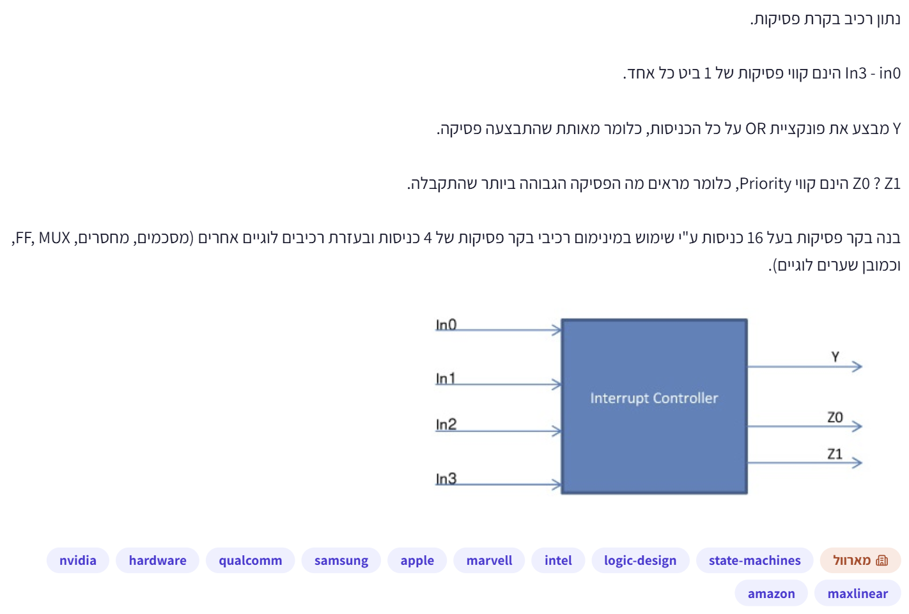
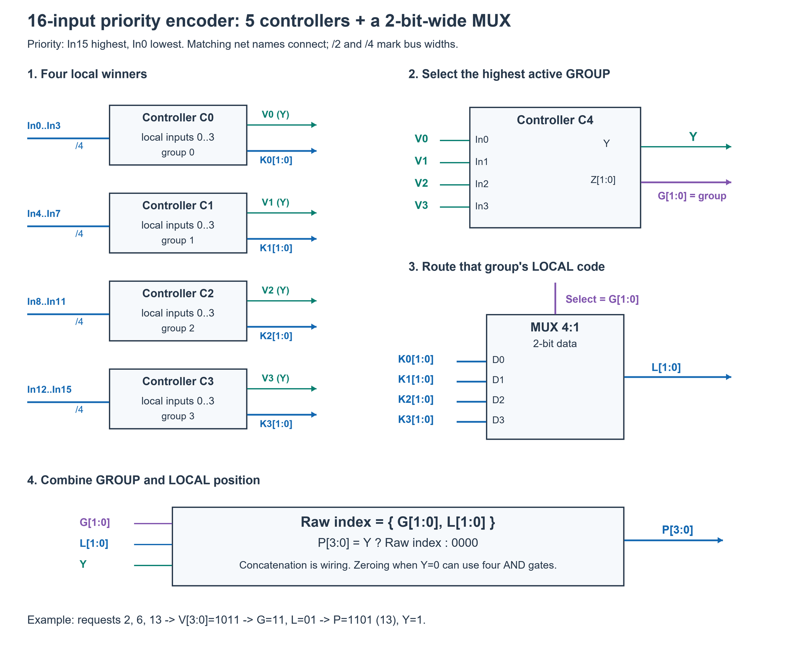
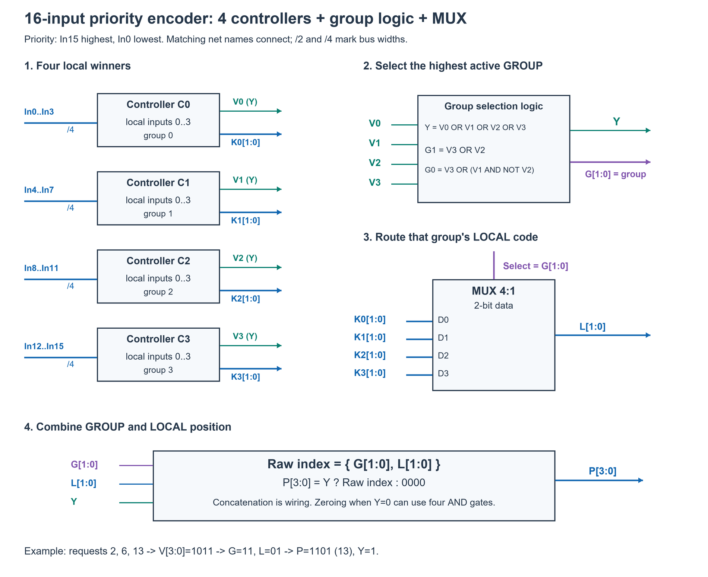

# PREP-016 — בניית בקר פסיקות של 16 כניסות

## השאלה המקורית

נתון רכיב בקרת פסיקות.
In0–In3 הינם קווי פסיקות של 1 ביט כל אחד.
Y מבצע את פונקציית OR על כל הכניסות, כלומר מאותת שהתבצעה פסיקה.
Z1 ו־Z0 הינם קווי Priority, כלומר מראים מה הפסיקה הכי גבוהה ביותר שהתקבלה.
בנה בקר פסיקות בעל 16 כניסות ע״י שימוש במינימום רכיבי בקר פסיקות של 4 כניסות ובעזרת רכיבים לוגיים אחרים (מסכמים, מחסרים, MUX, FF, וכמובן שערים לוגיים).
בתרשים: ארבע כניסות In0, In1, In2, In3 לרכיב Interrupt Controller, ושלוש יציאות Y, Z0, Z1.



## קטגוריות וחברות

תגיות מקור: hardware, logic-design, state-machines. סיווג נוסף: מעגלים קומבינטוריים, מקודדי עדיפות, בקרי פסיקות, תכנון היררכי ו־MUX. למרות תגית המקור state-machines, התפקוד המתואר אינו מחייב מכונת מצבים.

חברות לפי המקור: NVIDIA, Qualcomm, Samsung, Apple, Marvell, Intel, Amazon, MaxLinear. התווית הראשית: מארוול. שיוך מהצילום בלבד, ללא אימות עצמאי.

## שלושה רמזים מדורגים

1. נסה לחלק את 16 הכניסות לקבוצות. בכל קבוצה צריך לדעת שני דברים: האם יש בכלל פסיקה פעילה, ומה מיקומה של הפסיקה בעדיפות הגבוהה ביותר בתוך הקבוצה.

2. אחרי שכל קבוצה נותנת אות Y משלה, אותות אלה יכולים לעזור לבחור את הקבוצה המנצחת. לא מספיק לקודד את הקבוצה: צריך להעביר גם את קוד הפסיקה המקומי של אותה קבוצה בלבד.

3. מספר בין 0 ל־15 דורש ארבעה ביטים: שניים למספר הקבוצה ושניים למיקום בתוכה. בחר ב־MUX את הקוד המקומי לפי הקבוצה המנצחת. את בחירת הקבוצה אפשר לבצע בבקר נוסף או בשערים — וזה משנה את ספירת הבקרים.

## הצעה לפתרון

**פירוש הרכיב:** Y הוא אות תקפות, ו־Z הוא מספר הכניסה הפעילה בעלת העדיפות הגבוהה ביותר, לא וקטור one-hot. נניח ש־In3 בעדיפות הגבוהה ביותר ברכיב, ובהרחבה In15 היא הגבוהה ביותר. נסמן Z1 כביט המשמעותי ו־Z0 כביט הנמוך. סדר העדיפויות ומשמעות שמות הביטים אינם מוגדרים במפורש בצילום, ולכן זו הנחת עבודה. במקרה שאין פסיקות נדרוש Y=0 ונבחר קוד פלט 0000; המקור אינו מחייב קוד מסוים במצב זה. מדובר במעגל קומבינטורי, ללא צורך ב־FF או שעון.

**הבנייה ההיררכית:** נחלק את הכניסות לארבע קבוצות, ונחבר כל קבוצה לבקר בן ארבע כניסות:

| קבוצה g | הכניסות המקוריות | פלט הבקר |
|---|---|---|
| 0 | In0..In3 | V0, L0[1:0] |
| 1 | In4..In7 | V1, L1[1:0] |
| 2 | In8..In11 | V2, L2[1:0] |
| 3 | In12..In15 | V3, L3[1:0] |

Vg הוא פלט Y של הבקר המקומי: האם יש פסיקה בקבוצה g. Lg הוא הקוד המקומי 0..3. בתוך כל קבוצה מחברים את In(4g+j) לכניסה המקומית j, כדי לשמור על סדר העדיפויות.

כעת בוחרים את הקבוצה הגבוהה ביותר שעבורה Vg=1. לדוגמה, אם קבוצות 1 ו־3 פעילות, קבוצה 3 זוכה ללא קשר למיקום הפסיקה בתוך קבוצה 1: כל מספר בקבוצה 3 גבוה מכל מספר בקבוצה 1.

**בחירת הקבוצה באמצעות שערים — ארבעה בקרים מקומיים:** נסמן את קוד הקבוצה G1,G0. אז:

```text
Y  = V3 OR V2 OR V1 OR V0
G1 = V3 OR V2
G0 = V3 OR (V1 AND NOT(V2))
```

הסבר: אם V3=1 בוחרים 11; אחרת אם V2=1 בוחרים 10; אחרת אם V1=1 בוחרים 01; אחרת בוחרים 00. G1 דולק כאשר נבחרת אחת משתי הקבוצות העליונות. G0 דולק בקבוצה 3, או בקבוצה 1 בתנאי שקבוצה 2 אינה פעילה; אם קבוצה 3 פעילה האיבר V3 כבר מכריע לטובת 11.

נחבר MUX 4:1 ברוחב שני ביטים. כניסות הנתונים שלו הן L0,L1,L2,L3, וקווי הבחירה שלו הם G1,G0. פלטו L הוא הקוד המקומי של הקבוצה שנבחרה. אפשר לממשו גם כשני MUX של ביט אחד, בעלי אותם קווי בחירה.

```text
L = MUX(G, L0, L1, L2, L3)
אם Y=1: P[3:0] = {G1,G0,L1,L0}
אם Y=0: P[3:0] = 0000
```

כאן L1,L0 בשורת השרשור הם שני הביטים של מוצא ה־MUX, ולא הקודים המקומיים של קבוצות 1 ו־0. בכתיב חד־משמעי: P={G[1:0], L[1:0]}. זהו שרשור חוטים. אין צורך במחבר: האינדקס הוא 4g+l, והכפלה ב־4 מזיזה את g בשני ביטים למעלה; l ממלא את שני הביטים הנמוכים ללא נשא. אם רוצים קוד אפס כש־Y=0, אפשר לחסום את ארבעת ביטי P עם Y. אסור לעשות OR פשוט בין הקודים המקומיים במקום בחירה ב־MUX.

**דוגמה:** נניח In2, In6 ו־In13 פעילים. אז קבוצה 0 מדווחת קוד מקומי 2, קבוצה 1 קוד 2, קבוצה 2 אינה פעילה, וקבוצה 3 קוד 1. הקבוצה המנצחת היא 3, כלומר G=11; ה־MUX מעביר את הקוד המקומי 01 שלה; הפלט 1101 הוא 13. Y=1. עבור In0 בלבד נקבל Y=1,P=0000; כאשר כל הכניסות אפס נקבל Y=0,P=0000. לכן Y חיוני להבחנה בין שני המצבים.

**החלופה המקובלת עם חמישה בקרים:** במקום משוואות G ו־Y, מחברים V0..V3 לארבע כניסותיו של בקר חמישי, לפי אותו סדר. ה־Y שלו הוא Y הכללי, וה־Z שלו הוא G. שאר המעגל זהה: MUX בוחר את הקוד המקומי, ואז משרשרים. זה פתרון מודולרי תקין ופשוט, אך אינו מינימום מספר הבקרים כאשר מותר להחליף את הבקר החמישי בשערים.

**דיוק בנוגע למינימום — יש עמימות בשאלה:**

- בארכיטקטורה של בקר אחד לכל קבוצת ארבע כניסות משתמשים בארבעה בקרים ובשערים לבחירת הקבוצה. זה המינימום תחת ההגבלה שכל 16 הכניסות הגולמיות יכוסו ישירות בבקרים המקומיים: לכל בקר רק ארבע כניסות. זו אינה הגבלה שמופיעה במפורש במקור.
- אם דורשים שכל שלבי הכרעת העדיפות יתבצעו רק באמצעות בקרים במבנה עץ, הפתרון הוא חמישה: ארבעה מקומיים ואחד מעליהם. לעץ בעל לכל היותר ארבעה ילדים לכל צומת פנימי, B צמתים פנימיים מכסים לכל היותר 1+3B עלים. עבור 16 עלים נדרש B>=5. הטיעון חל על ארכיטקטורת עץ זו בלבד.
- אם שערים אחרים באמת מותרים ללא הגבלה, וממזערים רק את מספר רכיבי הבקר הנתונים, אפשר לבנות את כל המקודד בשערים בלבד: לכן המינימום במודל זה הוא **אפס בקרים**. אם מפרשים ״שימוש ברכיבי בקר״ כחובה להשתמש בלפחות אחד, אפשר להשתמש באחד ולממש את השאר בשערים. אין לטעון ש־4 או 5 הם מינימום מוחלט מהנוסח הנתון.

מימוש מפורש ללא בקרים: נגדיר לכל ביט Wi=Ini AND NOT(OR של כל הכניסות הגבוהות ממנו). W15=In15. לכל היותר Wi אחד הוא 1. Y הוא OR של כל הקלטים. לכל ביט קוד k, הפלט Pk הוא OR של כל Wi שעבורם ביט k במספר i הוא 1. למשל P3=OR(W8..W15), P0=OR(W1,W3,W5,W7,W9,W11,W13,W15). זה מממש את אותה פונקציה עם שערים בלבד ומוכיח שאפס בקרים אפשרי כאשר שערים אינם מוגבלים. לא נטען שמימוש זה ממזער שטח או השהיה.

בראיון כדאי להציג את החלוקה לקבוצות וה־MUX, ולהסביר במפורש מה נספר ומה מותר להחליף בשערים. הפתרון של ארבעה בקרים הוא הצעה הנדסית ישירה לשימוש בבקרים המקומיים; חמשת הבקרים הם חלופה היררכית, והמינימום המילולי תלוי בפרשנות האילוץ.

**בדיקה:** נבדקו כל 65,536 וקטורי הקלט מול האינדקס הפעיל הגבוה ביותר, בשלוש חלופות: ארבעה בקרים עם משוואות הקבוצה, חמישה בקרים, ושערים בלבד. בשתי החלופות ההיררכיות נבדקו גם כל ארבע אפשרויות הקוד המוחזר מבקר לא פעיל. רק קוד מקבוצה פעילה נבחר כאשר Y=1, ובמצב ללא בקשות הפלט מאופס במפורש. בדיקת Python עברה; לא בוצעה סימולציית HDL או סינתזה.

[מודל Python](../solutions/prep_016_interrupt_controller.py) · [בדיקה ממצה](../checks/check_prep_016.py).

### פתרון הפרד ומשול עם שרטוט מלא

נניח שכניסה בעלת מספר גבוה יותר מקבלת עדיפות גבוהה יותר. ארבעת הבקרים המקומיים C0..C3 מקבלים בהתאמה את In0..3, In4..7, In8..11, In12..15. נסמן את פלט Y של כל קבוצה ב־Vg, ואת קוד Z המקומי בן שני הביטים ב־Kg. שינוי השמות רק נועד להבחין בין החוטים של ארבעת הבקרים.

בקר חמישי C4 מקבל את V0..V3. כל כניסה שלו מייצגת קבוצה: 1 אומר שבקבוצה יש לפחות בקשה אחת. לכן קוד Z שלו, שנסמן G, מזהה את הקבוצה הפעילה בעלת המספר הגבוה ביותר. פלט Y שלו הוא אות Y הכללי: יש לפחות בקשה אחת באחת הקבוצות. אם קבוצה 3 פעילה היא עדיפה על כל קבוצה נמוכה יותר, גם אם הקוד המקומי של הקבוצה הנמוכה גדול יותר.

ארבעת הקודים K0..K3 מחוברים לארבע כניסות הנתונים של MUX 4:1, ברוחב שני ביטים לכל כניסה. קוד G מחובר לבחירה: G=00 מעביר K0; G=01 מעביר K1; G=10 מעביר K2; G=11 מעביר K3. נסמן את מוצא ה־MUX ב־L[1:0]. אפשר להשתמש בשני MUX 4:1 של ביט אחד, עם אותם קווי בחירה, במקום בבלוק אחד ברוחב שני ביטים.

ליצירת הקוד הסופי, G הוא שני הביטים העליונים ו־L הוא שני הביטים התחתונים. לכן P={G,L}. זה חיווט, לא שער חיבור. הסיבה היא שאינדקס הפסיקה שווה 4 כפול מספר הקבוצה ועוד המיקום המקומי. ארבע כפול G הוא הזזה בשני ביטים: GG00. המיקום המקומי בין 0 ל־3 ממלא את שני האפסים האלה, ללא נשא. למשל G=10 הוא קבוצה 2, ולכן בסיס הקבוצה הוא 1000 (8); L=01 מוסיף את המיקום 1 ונותן 1001 (9).

דוגמה נוספת: In2,In6,In13 פעילים. C0 מדווח V0=1,K0=10, ו־C1 מדווח V1=1,K1=10. C2 מדווח V2=0 והקוד שלו אינו רלוונטי. C3 מדווח V3=1,K3=01, כי In13 הוא במקום המקומי 1 בקבוצה שמתחילה ב־In12. C4 בוחר קבוצה 3: G=11,Y=1. ה־MUX מעביר את K3=01. הפלט P=1101 הוא 13.



כל שמות החוטים החוזרים בשרטוט מציינים את אותו חיבור. קווי K,G,L הם בני שני ביטים. קו קבוצת הקלט הוא ארבעה חוטים נפרדים, לא OR ביניהם. אותות Y,Vg הם בני ביט אחד. כאשר Y=0, אפשר לאפס את ארבעת ביטי P באמצעות ארבעה AND עם Y, כפי שמצוין בבלוק האחרון. זו בחירה כדי לתת פלט מוגדר; השאלה אינה דורשת קוד מסוים כשאין פסיקה. Y נותר 0, וכך מבדילים מ־In0 פעיל שמחזיר גם הוא קוד 0000 אבל Y=1. אין FF ואין שעון.

**צמצום לארבעה בקרים במסגרת החלוקה לקבוצות:** מאחר שמותר להוסיף שערים, אפשר להחליף רק את C4 במעגל הבא, ולהשאיר את ארבעת הבקרים המקומיים, ה־MUX והשרשור ללא שינוי:

```text
Y  = V0 OR V1 OR V2 OR V3
G1 = V3 OR V2
G0 = V3 OR (V1 AND NOT(V2))
```

אם V3=1 נקבל G=11. אם V3=0,V2=1 נקבל G=10. אם שניהם אפס ו־V1=1 נקבל G=01. אחרת G=00; Y מבדיל בין קבוצה 0 פעילה לבין היעדר פסיקות. כך נוסחת G0 אינה מאפשרת לקבוצה 1 לעקוף את קבוצה 2.



חמישה בקרים הם מימוש היררכי תקין, וארבעה הם שיפור כששומרים בקר לכל קבוצה ומחליפים את הבחירה העליונה בשערים. אין לטעון שארבעה הם מינימום מוחלט לפי המקור: אם אין הגבלה על השערים הנוספים, אפשר לממש את כל הפונקציה בשערים ולהשתמש באפס בקרים, או באחד אם עצם השימוש בבקר הוא חובה. לפירוט מודלי העלות ראו את דיון המינימום לעיל.

שני השרטוטים נבדקו חזותית מול מודלי המשוואות שעברו בדיקה ממצה על כל 65,536 הקלטים. [מחולל השרטוטים](../solutions/draw_prep_016_hierarchy.py).

### איך מגיעים למשוואות שמחליפות את הבקר החמישי?

כל Vg הוא ביט יחיד שאומר אם יש בקשה כלשהי בקבוצה g. הוא אינו מספר הפסיקה ולא מספר הקבוצה. רוצים לחשב שני ביטים G1,G0 שמייצגים את מספר הקבוצה הפעילה בעלת העדיפות הגבוהה ביותר. G1 הוא הביט השמאלי בקוד ו־G0 הימני. נניח שקבוצה 3 בעדיפות הגבוהה ביותר ואחריה 2,1,0.

| הקבוצה שנבחרת | G1 | G0 |
|---|---|---|
| 0 | 0 | 0 |
| 1 | 0 | 1 |
| 2 | 1 | 0 |
| 3 | 1 | 1 |

הבקר החמישי מקבל בדיוק את V0..V3 ומחשב את הטבלה הזאת עם עדיפות. לכן אפשר להחליפו במעגל קומבינטורי שמחשב את אותן יציאות.

**Y:** אנחנו רוצים לדעת אם לפחות קבוצה אחת פעילה. זו הגדרת OR: Y=V0 OR V1 OR V2 OR V3. כאשר כולן 0 נקבל Y=0; אחרת Y=1.

**G1:** מסתכלים על הביט השמאלי בקודים. הוא 1 רק לקבוצות 2 או 3. אם V3=1, קבוצה 3 מנצחת ולכן G1=1. אם V2=1, הזוכה היא קבוצה 2 או קבוצה 3 אם גם היא פעילה; בשני המקרים G1=1. אם שתיהן לא פעילות, אפשר לבחור רק קבוצה 0 או 1, שהביט השמאלי שלהן 0. לכן G1=V3 OR V2.

**G0:** הביט הימני הוא 1 לקבוצות 1 או 3, אבל 0 לקבוצות 0 או 2. אסור לכתוב רק V3 OR V1: אם קבוצות 1 ו־2 פעילות וקבוצה 3 אינה פעילה, הזוכה היא 2 והקוד חייב להיות 10, לא 11.

נכתוב קודם תנאים מלאים: קבוצה 3 מנצחת אם V3=1; קבוצה 1 מנצחת אם V1=1, V2=0 וגם V3=0. לכן:

```text
G0 = V3 OR (V1 AND NOT(V2) AND NOT(V3))
```

אפשר להשמיט את NOT(V3) מהסוגריים, אבל צריך להסביר למה. כאשר V3=1, האיבר הראשון של ה־OR כבר קובע G0=1, כך שערך הסוגריים לא משנה. כאשר V3=0, מתקיים NOT(V3)=1, ו־AND עם 1 אינו משנה את שאר הביטוי. לכן בשני המקרים נקבל אותה תוצאה אם נכתוב:

```text
G0 = V3 OR (V1 AND NOT(V2))
```

במילים: קבוצה 3 מדליקה את הביט הימני תמיד; קבוצה 1 יכולה להדליק אותו כשקבוצה 2 אינה פעילה. אם קבוצה 3 פעילה היא ממילא מנצחת ומדליקה את הביט הזה, ולכן אין צורך לחסום את האיבר של V1 בעזרתה.

**בדיקה מוחשית:** V3=0,V2=1,V1=1,V0=0. G1=0 OR 1=1. G0=0 OR (1 AND NOT(1))=0 OR (1 AND 0)=0. מתקבל G=10, כלומר קבוצה 2; זו הקבוצה הנכונה למרות שגם קבוצה 1 פעילה.

**למה V0 לא מופיע במשוואות של G?** קבוצה 0 מקודדת כ־00, ולכן אינה דורשת להדליק אף ביט בקוד. אם קבוצות 1,2,3 לא פעילות, G יוצא 00 בכל מקרה. אם V0=1 זו קבוצה 0 פעילה ו־Y=1; אם V0=0 אין בקשות בכלל ו־Y=0. אות Y הוא שמבדיל בין שני המצבים.

בחומרה: עבור G1 מחברים V3,V2 ל־OR. עבור G0 מעבירים V2 דרך NOT, את התוצאה עם V1 דרך AND, ואת תוצאת ה־AND עם V3 דרך OR. עבור Y עושים OR של ארבעת V. הפלט G ממשיך להפעיל את קווי הבחירה של ה־MUX וגם ליצור את שני הביטים העליונים של האינדקס; שאר המעגל אינו משתנה.

[צילום המשוואות שסופק לצורך ההסבר](../sources/prep-016-group-logic-clarification.png).

## תשובה קצרה לראיון

אחלק לארבע קבוצות ואשתמש בבקר מקומי לכל אחת. אבחר את הקבוצה הפעילה הגבוהה לפי אותות Y, ואשתמש בקוד הקבוצה לבחירת הקוד המקומי ב־MUX. אשרשר את שני קודי שני הביטים לקבלת אינדקס בן ארבעה ביטים. בחירת הקבוצה דורשת בקר חמישי או שערים. מאחר ששערים אחרים מותרים, אין מינימום מוחלט של ארבעה או חמישה בקרים ללא אילוץ נוסף על הארכיטקטורה.

## English

A four-input interrupt controller accepts one-bit interrupt lines In0 through In3. Y is the OR of all inputs, indicating an interrupt request. Priority outputs Z1 and Z0 identify the highest-priority asserted input. Build a sixteen-input interrupt controller using the minimum number of four-input controller components and other logic components (adders, subtractors, multiplexers, flip-flops and logic gates). The supplied diagram shows In0..In3 and outputs Y,Z0,Z1.

Hint 1: Split the sixteen requests into groups. Each group must report both whether any request is active and the local index of its highest-priority request.

Hint 2: Use the groups' Y outputs to choose the winning group. Also route only that group's local priority code to the output.

Hint 3: A 0..15 index has four bits: two for the group and two for the position within it. Use a mux to select the local code. Group priority can use another controller or logic gates, changing the controller count.

Assume the highest numbered input has highest priority and Z1 is the MSB of the two-bit local index. The source leaves these conventions and the invalid index unspecified. Return a four-bit index P and valid Y; choose P=0 when Y=0. No sequential behavior or flip-flops are needed.

Split requests into four consecutive groups, each using one four-input controller. Group g receives In(4g)..In(4g+3), with preserved local ordering, and produces valid Vg and local index Lg. Choose the highest active group using G1=V3 OR V2, G0=V3 OR (V1 AND NOT V2), Y=V3 OR V2 OR V1 OR V0. A two-bit-wide 4:1 mux selected by G routes Lg to L. When valid, concatenate P={G,L}; otherwise force P=0. This encodes 4g+l without an adder. Example requests 2,6,13 select group 3 and local position 1, producing P=1101 (13).

An alternative uses a fifth controller on V0..V3 to produce G and Y; the same mux and concatenation follow. This is a valid modular hierarchy but not a minimum controller count with unrestricted auxiliary gates.

The minimum is ambiguous in the source. Four controllers are minimal only under the additional architecture constraint that every raw request be covered directly by a local four-input controller. Five are minimal in a tree where all priority decisions use these controller nodes: B nodes with fan-in at most four cover at most 1+3B leaves, so 16 leaves need B>=5. With unrestricted ordinary gates and an objective counting only the given controller components, zero controllers suffice. Explicitly form winner Wi=Ini AND NOT(any higher request), then each binary index bit is the OR of winners whose index contains that bit; valid is the OR of requests. If at least one controller must be used, one plus gates is possible. No universal four-/five-controller or minimum-area claim is justified by the source wording.

All 65,536 inputs were checked for the four-controller, five-controller and gates-only constructions against a highest-set-bit-index specification. All four possible invalid local output codes were covered; invalid final index is explicitly forced to zero. Python verification passed; no HDL simulation or synthesis was performed.

## שאלות קשורות

HW-005 ו־VHW-003 עוסקות במקודד ארבע כניסות; PREP-014 עוסקת בבחירת הביט המשמעותי אך מחזירה one-hot. זו שאלת הרחבה ולא כפילות זהה.

התוכן נוצר בסיוע AI וממתין לסקירה; טרם פורסם באתר.
