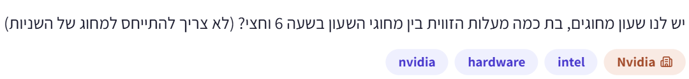

# PREP-017 — הזווית בין מחוגי השעון בשעה 6:30

## השאלה המקורית

יש לנו שעון מחוגים, בת כמה מעלות הזווית בין מחוגי השעון בשעה 6 וחצי? (לא צריך להתייחס למחוג של השניות)

## קטגוריות וחברות

תגית מקור: hardware. סיווג נוסף: חידות היגיון, גאומטריה, זוויות בשעון ותנועה יחסית. חברות לפי המקור: NVIDIA, Intel. תווית ראשית: Nvidia. שיוך החברות מהצילום בלבד, ללא אימות עצמאי.

## שלושה רמזים מדורגים

1. מחוג הדקות קל למיקום בשעה וחצי. אבל האם מחוג השעות נשאר בדיוק על הספרה 6 במשך כל השעה?

2. בשעון יש 12 מרווחים שווים סביב מעגל של 360 מעלות. חשב כמה מעלות מפרידות בין שתי ספרות סמוכות, ואז חשוב איזה חלק מהמרווח הזה עובר מחוג השעות בחצי שעה.

3. בשעה 6:30 מחוג הדקות מצביע על 6, ומחוג השעות נמצא בדיוק באמצע בין 6 ל־7. לכן הזווית הקטנה ביניהם היא חצי מהזווית שבין שתי ספרות סמוכות.

## הצעה לפתרון

הזווית הקטנה היא **15 מעלות**.

בשעה 6:30 מחוג הדקות מצביע על הספרה 6, כי עברו 30 דקות, שהן חצי מסיבוב של 60 דקות. אבל מחוג השעות אינו נשאר על 6: הוא נע בהדרגה לכיוון 7. בחצי שעה הוא עובר חצי מהדרך בין 6 ל־7.

סיבוב מלא הוא 360 מעלות ובשעון יש 12 מרווחים שווים בין סימוני השעות. לכן כל מרווח הוא 360/12=30 מעלות. מחוג השעות נמצא באמצע המרווח בין 6 ל־7, ולכן הוא במרחק 30/2=15 מעלות מהספרה 6. מחוג הדקות נמצא בדיוק על 6. מכאן שהזווית ביניהם היא 15 מעלות.

בדיקה באמצעות מיקום כל מחוג, בכיוון השעון מהספרה 12: מחוג הדקות נמצא ב־30×6=180 מעלות. מחוג השעות נמצא ב־6×30+30×0.5=195 מעלות. ההפרש הוא 195−180=15 מעלות. הקצב של מחוג השעות הוא 30 מעלות בשעה, כלומר חצי מעלה בדקה; בחצי שעה הוא מתקדם 15 מעלות.

ההנחה היא שעון רגיל בעל תנועת שעות רציפה. כשאומרים ״הזווית בין המחוגים״ נבחר בדרך כלל בזווית הקטנה. הזווית האחרת, הגדולה, היא 360−15=345 מעלות. אין צורך להתייחס למחוג השניות. הטעות הנפוצה היא למקם את שני המחוגים על 6 ולהשיב 0, כאילו מחוג השעות קופץ רק בתחילת כל שעה.

לזמן כללי h:m: מיקום מחוג הדקות הוא 6m מעלות ומיקום מחוג השעות הוא 30(h mod 12)+m/2 מעלות. מחשבים d כהפרש המוחלט ביניהם, והזווית הקטנה היא min(d,360−d). עבור זמן אחד זו נוסחה ישירה, O(1) בזמן ובזיכרון; אין צורך בסימולציה. שאלת המקור עצמה דורשת רק את הערך ב־6:30.

בדיקת Python בחשבון שברים מדויק אימתה את 6:30 ואת מיקום שני המחוגים, דוגמאות נוספות, ואת כל 720 מיקומי הדקות במחזור של 12 שעות מול חישוב נפרד של המהירות היחסית (5.5 מעלות בדקה). נבדקה גם מחזוריות של 12 שעות.

[מודל Python](../solutions/prep_017_clock_angle.py) · [בדיקה](../checks/check_prep_017.py).

## תשובה קצרה לראיון

ב־6:30 מחוג הדקות על 6, אבל מחוג השעות כבר באמצע הדרך ל־7. בין שתי ספרות יש 30 מעלות, ולכן חצי המרווח הוא 15 מעלות.

## English

An analog clock shows 6:30. What is the angle in degrees between the clock hands? Ignore the seconds hand.

Hint 1: The minute hand is easy to locate at half past the hour. Does the hour hand stay exactly on 6 for the entire hour?

Hint 2: The dial divides 360 degrees into 12 equal hour intervals. Find the angle per interval, then the fraction the hour hand travels in half an hour.

Hint 3: At 6:30 the minute hand points to 6 while the hour hand is halfway between 6 and 7. The smaller angle is half an hour-mark interval.

The smaller angle is 15 degrees. At 6:30 the minute hand points at 6. The hour hand moves continuously and is halfway from 6 to 7. Adjacent hour marks are 360/12=30 degrees apart, so half an interval is 15 degrees.

Measured clockwise from 12, the minute hand is at 30*6=180 degrees. The hour hand is at 6*30+30*0.5=195 degrees. Their difference is 15 degrees. The other, reflex angle is 345 degrees. Assuming an ordinary continuous hour hand is essential; treating it as fixed at 6 incorrectly gives zero.

Generally, for h:m, minute angle=6m, hour angle=30(h mod 12)+m/2; let d be their absolute difference and return min(d,360-d). This takes O(1) time and space per query. Exact-fraction Python checks cover the source time, additional examples, all 720 minute positions against relative angular motion at 5.5 degrees per minute, and 12-hour periodicity.

התוכן נוצר בסיוע AI וממתין לסקירה; טרם פורסם באתר.
