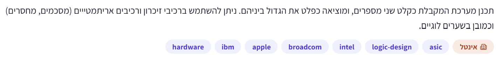
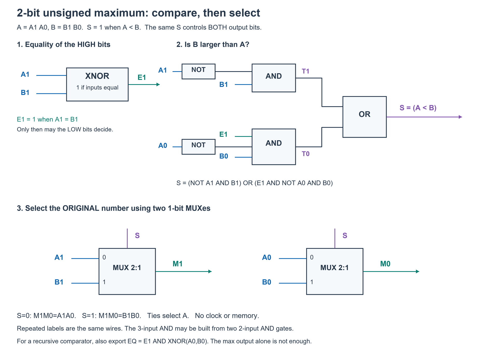
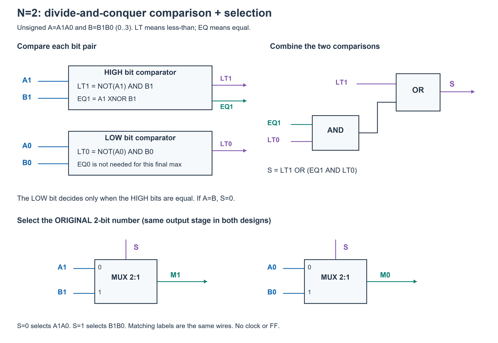
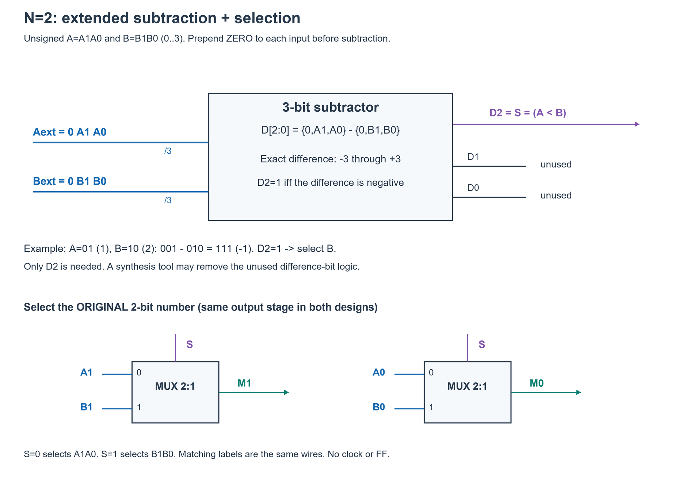

# PREP-018 — מעגל המחזיר את הגדול מבין שני מספרים

## השאלה המקורית

תכנן מערכת המקבלת כקלט שני מספרים, ומוציאה כפלט את הגדול ביניהם. ניתן להשתמש ברכיבי זיכרון ורכיבים אריתמטיים (מסכמים, מחסרים) וכמובן בשערים לוגיים.



## קטגוריות וחברות

תגיות מקור: hardware, logic-design, asic. סיווג נוסף: מעגלים קומבינטוריים, משווים, חיסור בינארי, MUX, מספרים מסומנים ולא מסומנים וגלישה. חברות לפי המקור: IBM, Apple, Broadcom, Intel. התווית הראשית היא אינטל. השיוך מהצילום בלבד, ללא אימות עצמאי.

## שלושה רמזים מדורגים

1. אפשר להפריד את הבעיה לשניים: קודם להחליט איזה מספר גדול יותר, ואחר כך להעביר את המספר הזה לפלט. אין צורך לחשב מחדש את הערך שלו.

2. מה אפשר ללמוד מההפרש A−B? חשוב כיצד מייצרים ממנו ביט בחירה, ואיזה מעגל יכול לבחור בין שני קלטים לפי ביט אחד.

3. אפשר להרחיב את המספרים בביט אחד לפני החיסור, כדי שההפרש לא יגלוש. ביט הסימן של ההפרש יבחר בין A ל־B ב־MUX. חשוב להבחין בין הרחבת אפס למספרים לא מסומנים לבין הרחבת סימן למספרים במשלים ל־2.

## הצעה לפתרון

**הרעיון:** מחליטים מי גדול באמצעות חיסור, ואז בוחרים את אחד המספרים המקוריים ומעבירים אותו לפלט. הפלט הוא המספר עצמו, ולא רק ביט שאומר מי גדול. אין צורך בזיכרון או בשעון; די במעגל קומבינטורי.

המקור אינו מגדיר רוחב או סוג מספרים. נתחיל משני מספרים שלמים לא מסומנים A,B ברוחב N ביטים. רוצים פלט M=max(A,B) באותו רוחב. במקרה שוויון נבחר A; שתי הבחירות נותנות אותו ערך.

**1. מרחיבים בביט אפס:** Aext={0,A}, Bext={0,B}. כעת כל אחד ברוחב N+1. זה אינו משנה את ערך המספרים.

**2. מחסרים ברוחב N+1:** D=Aext−Bext. אם A קטן מ־B, ההפרש שלילי; אם A גדול או שווה ל־B, ההפרש אינו שלילי. הטווח של ההפרש הוא מ־−(2^N−1) ועד 2^N−1, ולכן כולו ניתן לייצוג במשלים ל־2 ב־N+1 ביטים. אין כאן גלישה חתומה. הביט העליון D[N] הוא 1 בדיוק כאשר A<B.

**3. בוחרים את הפלט:** נגדיר S=D[N]. נחבר ל־MUX 2:1 ברוחב N ביטים את A לכניסה 0 ואת B לכניסה 1, ואת S לכניסת הבחירה. אם S=0, המוצא הוא A; אם S=1, המוצא הוא B. ה־MUX מעביר את המספר המקורי, לא את ההפרש.

```text
A,B -> הרחבה ל־N+1 -> מחסר -> S = D[N]
A   -> כניסת נתונים 0 של MUX
B   -> כניסת נתונים 1 של MUX
S   -> כניסת הבחירה
MUX -> M = max(A,B)
```

השאלה מתירה שערים לוגיים ולכן אין צורך להניח MUX כרכיב נוסף שניתן בחינם: עבור כל ביט i מממשים Mi=(Ai AND NOT S) OR (Bi AND S). NOT S משותף לכל הביטים. אם S=0, הענף של A פתוח ושל B חסום; אם S=1, להפך.

**דוגמאות:** ב־N=4, A=9,B=5: ההפרש בחמישה ביטים הוא 00100 (4), ולכן S=0 ונבחר A=1001. אם A=5,B=9: ההפרש הוא 11100, כלומר −4 במשלים ל־2, ולכן S=1 ונבחר B=1001. אם A=B ההפרש אפס ו־S=0; הפלט A הוא גם B.

**למה לא להסתכל פשוט על הביט העליון של חיסור ב־N ביטים?** במספרים לא מסומנים זו אינה בדיקת A<B. לדוגמה A=15,B=1 ברוחב 4: התוצאה 1110 היא 14. הביט העליון הוא 1, אבל A דווקא גדול מ־B! אחרי הרחבה התוצאה היא 01110, והסימן הנכון 0. לחלופין, מחסר ברוחב N עם דגל borrow תקין יכול לספק את ביט הבחירה ישירות. אם מממשים חיסור כמחבר A+NOT(B)+1 ברוחב N, carry-out=1 פירושו שאין borrow, ולכן S=NOT(carry-out). יש להגדיר את מוסכמת הדגל, ולא לבלבל carry עם סימן.

**אם המספרים מסומנים במשלים ל־2:** מרחיבים בסימן במקום באפס: Aext={A[N−1],A}, Bext={B[N−1],B}. שוב מחסרים ב־N+1 ביטים ומשתמשים ב־D[N]. ההרחבה משמרת את הערכים השליליים וגם מאפשרת לייצג כל הפרש בין שני מספרים ברוחב N. אין להסתמך על סימן הפרש ברוחב N ללא טיפול בגלישה: למשל 7−(−8)=15 אינו נכנס בארבעה ביטים חתומים. נוסחה חלופית להשוואה חתומה עם מחסר N ביטים היא sign(D) XOR overflow, אך הרחבה מפורשת ברורה יותר להסבר.

**יעילות:** מערכת של מחסר/משווה ומבחר ברוחב N היא בנייה ישירה. אפשר לשתף את אות הבחירה בכל הביטים, ואין צורך ב־FF. במימוש ripple מספר השערים גדל כ־O(N) והעומק יכול להיות O(N); משווה או חישוב carry/borrow מאוזן יכולים להשיג O(log N) עומק בשערים בעלי fan-in מוגבל. ייתכן שאפשר לוותר על יציאות ההפרש הנמוכות ולהפיק רק דגל השוואה. השאלה אינה מגדירה ספריית תאים או יעד שטח/תזמון, ולכן אין טענה שמחסר N+1 הוא מינימום שערים מוחלט. ההרחבה נבחרה להבטחת נכונות ולהסבר פשוט.

**בדיקה:** נבדקו באופן ממצה כל זוגות הקלטים ברוחבים 1 עד 8, גם בפורמט לא מסומן וגם במשלים ל־2: 174,760 זוגות. בכל זוג נבדקו ביט הבחירה, המקסימום, והפרש מתמטי מדויק לאחר פענוח N+1 ביטים. נכללו שוויון, קצוות הטווח ודוגמאות הממחישות טעות עקב קיצוץ ההפרש. מודל Python עבר; לא בוצעו סימולציית HDL, סינתזה או בדיקת תזמון פיזי.

[מודל Python](../solutions/prep_018_maximum_two.py) · [בדיקה ממצה](../checks/check_prep_018.py).

### חלופת הפרד ומשול: מעגל בסיסי עבור N=2

הפתרון המקורי שהוכן משתמש במחסר מורחב וב־MUX. החלופה כאן משווה קודם את החלק העליון, ופונה לחלק התחתון רק במקרה של שוויון. זהו המבנה של משווה רקורסיבי; במקרה של שני ביטים כל חלק הוא ביט יחיד. נניח מספרים ללא סימן A=A1A0 ו־B=B1B0, שערכיהם 0..3. הפלט M=M1M0 הוא המספר הגדול בשלמותו.

הביטים A1,B1 שווים במשקלם ל־2, ואילו A0,B0 שווים במשקלם ל־1. לכן אם B1=1 ו־A1=0, B בהכרח גדול יותר: הוא לפחות 2 ואילו A לכל היותר 1. אם A1=1 ו־B1=0, A בהכרח גדול יותר. רק כאשר הביטים העליונים שווים צריך להשוות את התחתונים.

נגדיר E1=XNOR(A1,B1), שמחזיר 1 עבור 00 או 11 ו־0 עבור 01 או 10. אם משתמשים רק ב־AND/OR/NOT, אפשר לממש E1=(A1 AND B1) OR (NOT A1 AND NOT B1).

נבנה אות בחירה S שמשמעותו A<B, כלומר צריך לבחור את B:

```text
T1 = NOT(A1) AND B1
T0 = E1 AND NOT(A0) AND B0
S  = T1 OR T0
```

T1 מזהה שהביט העליון של B גדול מזה של A. T0 מזהה שהביטים העליונים שווים, ובביט התחתון B גדול מ־A. ה־E1 חוסם הכרעה שגויה של הביט התחתון כאשר כבר יש הכרעה למעלה. למשל A=10,B=01: למטה B0=1 ו־A0=0, אבל E1=0 ולכן T0=0, וגם T1=0. מתקבל S=0 ונבחר A=10, כפי שנדרש. עבור A=10,B=11 הביטים העליונים שווים, E1=1, ולכן T0=1 ונבחר B=11. בשוויון מלא T1=T0=0 ולכן בוחרים A, שערכו זהה ל־B.

נחבר שני MUX 2:1 של ביט אחד עם אותו S: בראשון D0=A1,D1=B1 והמוצא M1; בשני D0=A0,D1=B0 והמוצא M0. כך שני הביטים נלקחים יחד מאותו מספר. אין לבחור בנפרד את הביט הגדול מכל זוג: עבור A=10,B=01 בחירה כזאת תייצר 11, שאינו אף אחד מהקלטים.

```text
M1 = (A1 AND NOT S) OR (B1 AND S)
M0 = (A0 AND NOT S) OR (B0 AND S)
```



השרטוט כולל XNOR, שני מהפכים, שני תנאי AND, OR ושני MUX עם אות בחירה משותף. AND בעל שלוש כניסות ניתן לפצל לשני AND בעלי שתי כניסות. שמות חוטים חוזרים מתייחסים לאותו חיבור. זהו מימוש ישיר לצורך ההסבר, ללא טענת מינימום שערים מדויק.

**ממשק שימושי להמשך הרקורסיה:** יחידת ההשוואה צריכה להוציא LT=(A<B), שהוא S, וגם EQ=(A=B). כאן EQ=E1 AND XNOR(A0,B0). שרשור שני ערכי מקסימום מקומיים אינו מספיק; צריך מידע על תוצאת ההשוואה ועל השוויון. בחיבור חצי עליון H וחצי תחתון L, מחשבים LT=LT_H OR (EQ_H AND LT_L), ו־EQ=EQ_H AND EQ_L. מקרה הבסיס המתמטי הוא ביט אחד, שבו LT=NOT A AND B ו־EQ=XNOR(A,B). עץ מאוזן של יחידות השוואה נותן O(N) שערים ועומק O(log N) במודל שערים בעלי מספר כניסות חסום; בחירת שני המספרים המלאים נעשית לפי LT הסופי. אין צורך בשעון או בזיכרון.

בדיקות: כל 16 זוגות הקלטים ב־N=2 נבדקו עבור המשוואות המדויקות בשרטוט, כולל השוואה, שוויון והפלט. נוסחת החיבור הרקורסיבית נבדקה באופן ממצה ב־87,380 זוגות ברוחבים 1 עד 8. מדובר בבדיקת מודל Python ולא בסימולציית HDL או סינתזה.

[מחולל השרטוט](../solutions/draw_prep_018_two_bit.py) · [מודל ובדיקה רקורסיבית](../checks/check_prep_018_recursive.py).

Two-bit unsigned alternative: E1=XNOR(A1,B1), T1=NOT(A1) AND B1, T0=E1 AND NOT(A0) AND B0, and S=T1 OR T0. S means A<B. Feed A1/B1 to data inputs 0/1 of one mux and A0/B0 to another, both selected by S. Thus the entire original A or B is returned; ties select A. For recursive composition also export EQ=E1 AND XNOR(A0,B0). Larger blocks combine LT=LT_H OR (EQ_H AND LT_L), EQ=EQ_H AND EQ_L; one-bit base LT=NOT(A) AND B and EQ=XNOR(A,B). A balanced comparator has O(N) size and O(log N) bounded-fan-in depth. Do not concatenate independent local maxima. All 16 two-bit gate cases and all 87,380 unsigned pairs at widths 1..8 passed. No HDL simulation or synthesis claimed.

### השוואת שני המעגלים עבור N=2: הפרד ומשול מול מחסר

בשני השרטוטים מניחים A=A1A0,B=B1B0 ללא סימן, בטווח 0..3. אות הבחירה S הוא 1 כאשר A<B. אותו S מפעיל את שני ה־MUX של המוצא: כניסה 0 היא ביט מ־A וכניסה 1 היא הביט המקביל מ־B. לכן מתקבל מספר מקורי שלם; בשוויון נבחר A. אין שעון או FF.

**המעגל בשיטת הפרד ומשול:** שני תתי־משווים מטפלים בזוגות הביטים. LT1=NOT(A1) AND B1 מציין שהביט העליון של A קטן יותר, EQ1=XNOR(A1,B1) מציין שוויון למעלה, ו־LT0=NOT(A0) AND B0 מציין שהביט התחתון של A קטן יותר. מחברים S=LT1 OR (EQ1 AND LT0). פירושו: B מנצח אם הוא גדול למעלה, או אם למעלה יש שוויון והוא גדול למטה. עבור המקסימום הסופי ברוחב 2 לא צריך EQ0 או EQ של המספר כולו, ולכן הם אינם ממומשים בשרטוט. כאשר היחידה משמשת כתת־משווה בתוך רקורסיה גדולה יותר, יש להחזיר גם EQ=EQ1 AND XNOR(A0,B0).



**המעגל עם מחסר:** מוסיפים אפס משמאל לשני המספרים ומחסרים D[2:0]={0,A1,A0}−{0,B1,B0}. זה מחסר ברוחב שלושה ביטים, לא שניים. טווח ההפרש הוא −3..3, ולכן הוא נכנס בשלושה ביטים במשלים ל־2. S=D2, ושני ביטי ההפרש האחרים אינם משמשים לתוצאה. לדוגמה A=01,B=10 נותן 001−010=111, כלומר −1, ולכן S=1 ובוחרים B=10. הרחבת אפס מתאימה כאן כי המספרים ללא סימן.



**איזה פתרון יעיל יותר?** הבחירה הסופית בשני הפתרונות זהה, לכן משווים בעיקר את חישוב S. תכנון משווה ייעודי מבטא ישירות את המידע הדרוש — מי גדול — ואינו מחייב לחשב את כל ביטי ההפרש. אם משתמשים במחסר מלא כמכלול קבוע שאינו מפושט, חלק מהיציאות והלוגיקה שלו מיותרות למשימה. אבל אין להסיק מכך שהגישה הרקורסיבית תמיד קטנה או מהירה יותר: כאשר כלי סינתזה יכול לפשט את המחסר לפי היציאה היחידה שנצרכת, הלוגיקה יכולה להיות זהה.

אפשר לראות את השקילות במפורש. בחיסור A−B, ההשאלה מהביט התחתון היא borrow0=NOT(A0) AND B0, בדיוק LT0. ההשאלה מהביט העליון היא:

```text
borrow1 = (NOT(A1) AND B1) OR (XNOR(A1,B1) AND borrow0)
```

כאשר A1=0,B1=1 צריך השאלה בלי קשר לביט הקודם. כאשר A1=B1, השאלה שנכנסת ממשיכה הלאה. כאשר A1=1,B1=0 אין צורך בהשאלה יוצאת. לכן borrow1 הוא בדיוק LT1 OR (EQ1 AND LT0), כלומר S של המעגל הרקורסיבי. הביט D2 של המחסר המורחב שווה להשאלה הזאת. למשימה אין צורך לחשב D0,D1 כלל.

במימוש המפורש של המשווה בשרטוט, ובהנחה ש־XNOR הוא תא אחד, יש 2 NOT, 3 AND בעלי שתי כניסות, OR אחד ו־XNOR אחד לחישוב S — שבעה שערים — ועוד שני MUX של ביט אחד לבחירת המספר. זו ספירת המימוש המוצג, לא הוכחת מינימום ל־N=2 ולא השוואת שטח טרנזיסטורים. אפשר לפשט עוד או למפות אחרת לפי ספריית התאים. לדוגמה, בפונקציית max הלא מסומנת הביט העליון M1 שווה A1 OR B1, אך שני השרטוטים משאירים במכוון את אותה דרגת MUX כדי להשוות את שיטות ההכרעה בלי לשנות גם את צד הנתונים.

ברוחב כללי N, עץ השוואה מאוזן לפי LT/EQ נותן O(log N) עומק ו־O(N) גודל במודל שערים בעלי מספר כניסות חסום. מחסר ripple יכול לתת O(N) עומק, אך מחסר עם carry/borrow lookahead או חישוב prefix יכול גם הוא להשיג O(log N) עומק. לכן ההשוואה היא בין מבנים מסוימים, ולא בין המילים ״רקורסיה״ ו״חיסור״. קביעת שטח או השהיה בפועל דורשת ספריית תאים וסינתזה, שלא בוצעו כאן.

שני השרטוטים נבדקו חזותית, וכל 16 צירופי שני המספרים נבדקו לשקילות של נוסחת ההשוואה, השאלה בחיסור, ביט הסימן המורחב והפלט. [מחולל השרטוטים](../solutions/draw_prep_018_comparison.py). בדיקת השקילות נמצאת בתחילת [סקריפט העדכון](../solutions/update_prep_018_comparison.py).

For unsigned N=2, the divide-and-conquer comparator produces LT1=~A1&B1, EQ1=XNOR(A1,B1), LT0=~A0&B0, then S=LT1|(EQ1&LT0). EQ0 is unnecessary for this top-level maximum; a reusable recursive comparator also exports whole-word equality. The alternative zero-extends both operands to three bits, subtracts, and selects using D2. Both diagrams use the same two one-bit muxes to select the original A or B, ties choosing A.

An unpruned full subtractor computes unused D1,D0, whereas a dedicated comparator only needs S. However, borrow-only subtraction yields borrow0=~A0&B0 and borrow1=(~A1&B1)|(XNOR(A1,B1)&borrow0), exactly the recursive comparator equation. Synthesis can therefore make the designs identical; no unconditional area or delay superiority is claimed. The drawn comparator uses seven primitive cells if XNOR counts as one (2 NOT, 3 AND, 1 OR, 1 XNOR), plus two muxes; this is not a minimum-cell or physical-area proof. Balanced recursive comparison has O(log N) depth versus O(N) for ripple subtraction, but lookahead/prefix subtraction can also have O(log N) depth. Actual physical efficiency needs a concrete library and synthesis. All 16 two-bit cases passed equivalence checks; both schematics visually reviewed.

## תשובה קצרה לראיון

ארחיב את שני הקלטים בביט אחד ואחשב A−B. ביט הסימן של ההפרש יבחר ב־MUX את B אם ההפרש שלילי ואת A אחרת. ללא סימן מרחיבים באפס, ובמשלים ל־2 מרחיבים בסימן. ההרחבה מונעת גלישה; אין צורך בזיכרון.

## English

Design a system that accepts two numbers and outputs the larger one. Memory elements, arithmetic components (adders, subtractors), and logic gates may be used.

Hint 1: Separate the task into deciding which number is larger and routing that original number to the output.

Hint 2: What does A−B tell you? Consider a comparison flag and a circuit that selects one of two inputs using that flag.

Hint 3: Extend the operands by one bit before subtracting so the difference cannot overflow. Use its sign as a mux select. Unsigned inputs need zero extension; two's-complement signed inputs need sign extension.

Assume two unsigned N-bit integers A,B; the source leaves width and signedness unspecified. Zero-extend both to N+1 bits and subtract D={0,A}−{0,B}. The exact mathematical difference lies in [−(2^N−1),2^N−1], which fits signed N+1-bit two's complement. Thus S=D[N] is 1 exactly when A<B. Route A to a width-N mux data input 0, B to input 1, and S to select. The output is max(A,B); ties choose A. No memory or clock is required.

The mux can be made using allowed gates: Mi=(Ai AND NOT S) OR (Bi AND S), sharing NOT S. Do not route the difference as the result. Do not use the MSB of a truncated N-bit unsigned subtraction as a comparison flag: 15−1=1110 at width 4 has MSB 1 although A>B. An N-bit borrow flag can instead select B; with A+NOT(B)+1, carry-out=1 means no borrow, so S=NOT(carry-out).

For signed two's-complement inputs, sign-extend instead of zero-extending, subtract at N+1 bits, and again select using the difference sign. This avoids signed subtraction overflow. With only an N-bit signed subtractor, signed less-than is sign(D) XOR overflow.

This is a direct combinational compare-and-select design, not a universal minimum-cell claim. A ripple implementation has O(N) area and potentially O(N) depth; a balanced comparator/borrow computation can reduce depth to O(log N). Only the comparison flag is needed, so unused difference outputs can be omitted by an appropriate implementation. Exhaustive exact-bit-vector tests passed 174,760 pairs over widths 1..8, both unsigned and signed, checking comparison, output and the extended mathematical difference. No HDL simulation or synthesis is claimed.

שאלה קשורה: [PREP-005 — רשתות מיון](prep-005-sorting-networks.md); שם רכיב max/min נתון מראש, וכאן מממשים את בחירת המקסימום.

התוכן נוצר בסיוע AI וממתין לסקירה; טרם פורסם באתר.
