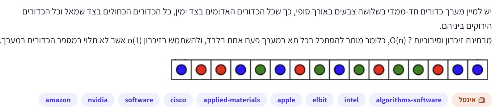

# PREP-019 — מיון שלושה צבעים בזמן לינארי ובזיכרון קבוע

## השאלה המקורית

יש למיין מערך כדורים חד־ממדי בשלושה צבעים באורך סופי, כך שכל הכדורים האדומים בצד ימין, כל הכדורים הכחולים בצד שמאל וכל הכדורים הירוקים ביניהם.
מבחינת זיכרון וסיבוכיות: O(n), כלומר מותר להסתכל בכל תא במערך פעם אחת בלבד, ולהשתמש בזיכרון O(1) אשר לא תלוי במספר הכדורים במערך.



## קטגוריות וחברות

תגיות מקור: software, algorithms-software. סיווג נוסף: מערכים, חלוקה לשלוש קבוצות, עבודה במקום, סיבוכיות זמן וזיכרון ואינווריאנטים של לולאה. חברות לפי המקור: Amazon, NVIDIA, Cisco, Applied Materials, Apple, Elbit, Intel. תווית ראשית: אינטל. השיוך לא אומת עצמאית; Marvell אינה מופיעה בתגיות.

## רלוונטיות להכנה לראיון

מומלץ לתרגל כשאלת יסוד בתכנות ומערכים, בהתבסס על Python ואוטומציית בדיקות בתיאור המשרה שסופק. אין מכאן ראיה שהשאלה עצמה תישאל. גם [משרת ולידציה אחרת ב־Marvell](https://marvell.wd1.myworkdayjobs.com/en-US/MarvellCareers/job/Hardware-Validation-Intern---Master-s-Degree_2502387) מזכירה Python ובדיקות אוטומטיות. זו תמיכה ברלוונטיות המיומנות, לא זיהוי של המשרה הספציפית. המלצה: ניסיון ממוקד של 15–20 דקות, ואז הבנה ומימוש; לא להקדיש שעות על חשבון יסודות Python, דיבוג ותכנון בדיקות.

## שלושה רמזים מדורגים

1. לא צריך למיין לפי השוואות בין כל זוג כדורים. יש רק שלוש קבוצות, והסדר בתוך כל צבע אינו חשוב. אילו צבעים אפשר להעביר מיד לקצוות?

2. נסה להחזיק גבול לאזור הכחול משמאל, גבול לאזור האדום מימין ואינדקס שסורק את האזור שטרם סווג. חשוב איזה אזור כבר ידוע כירוק.

3. כחול מעבירים לגבול השמאלי, ירוק משאירים ומתקדמים, ואדום מחליפים עם סוף האזור הלא מסווג. אחרי החלפה עם הצד הימני, האם כבר ידוע הצבע של הכדור שהגיע למיקום הסריקה?

## הצעה לפתרון

זו בעיית חלוקה לשלושה צבעים (Dutch National Flag), על מערכים ואלגוריתמים במקום. הסדר הרצוי הוא כחול, ירוק, אדום. אין צורך לשמור על הסדר היחסי של כדורים מאותו צבע, אך נרצה לשמר את הכדורים עצמם ולא ליצור במקומם אובייקטים חדשים.

**הרעיון:** מחזיקים שלושה אינדקסים low,mid,high. בתחילה low=mid=0 ו־high=n−1. בכל שלב מתקיימת החלוקה:

```text
[0, low)       כחולים שכבר סודרו
[low, mid)     ירוקים שכבר סודרו
[mid, high]    כדורים שטרם סווגו
(high, n)      אדומים שכבר סודרו
```

כל עוד mid<=high בודקים את צבע הכדור במקום mid:

- כחול: מחליפים עם low ומקדמים גם low וגם mid. כאשר low<mid, הכדור שהיה ב־low הוא ירוק שכבר סווג, ולכן אין צורך לבדוק אותו שוב אחרי ההחלפה. כאשר low=mid זו החלפה של התא עם עצמו.
- ירוק: מקדמים רק mid. הכדור מצטרף לאזור הירוק.
- אדום: מחליפים עם high ומקטינים high. לא מקדמים mid! הכדור שהגיע מימין שייך לאזור הלא מסווג, ולכן צריך לבדוק אותו בסיבוב הבא.

בסיום mid>high ואין אזור לא מסווג. האזורים הידועים מכסים את כל המערך ומתקבל הסדר המבוקש.

```python
def sort_colors(a):
    low = mid = 0
    high = len(a) - 1
    while mid <= high:
        color = a[mid]
        if color == 'B':
            a[low], a[mid] = a[mid], a[low]
            low += 1
            mid += 1
        elif color == 'G':
            mid += 1
        elif color == 'R':
            a[mid], a[high] = a[high], a[mid]
            high -= 1
        else:
            raise ValueError('Expected B, G or R')
    return a
```

הקוד המלווה תומך גם באובייקטים באמצעות פונקציית key לקבלת הצבע. כל ההחלפות בתוך אותו מערך. הזיכרון הנוסף הוא שלושה אינדקסים ומשתנים זמניים קבועים בלבד: O(1), בהנחת מודל RAM שבו אינדקס נכנס במילת מכונה. אין מערך עזר ואין רקורסיה.

**הוכחת זמן ונכונות:** בכל איטרציה אורך האזור הלא מסווג high−mid+1 קטן בדיוק באחד: או שמקדמים mid, או שמקטינים high. לכן יש בדיוק n איטרציות, וכל אחת דורשת עבודה קבועה. הזמן O(n). תנאי החלוקה של ארבעת האזורים נשמר בכל אחד משלושת המקרים; הוא נכון בתחילה כי האזורים המסווגים ריקים, ובסיום כל הכדורים מסווגים. נשמר גם אוסף הכדורים כי מבצעים החלפות בלבד. יש חסם תחתון Omega(n) במקרה הגרוע: ללא בדיקה/טיפול בקלט כולו אין דרך להבטיח שהצבעים מסודרים עבור מערך שרירותי. לכן זמן הריצה מיטבי אסימפטוטית, והזיכרון הנוסף קבוע.

**דיוק בניסוח המקור:** O(n) אינו אומר שכל כתובת במערך נקראת פעם אחת בלבד. אחרי החלפת אדום עם כדור מימין, אפשר לבדוק שוב את אותו אינדקס mid, אבל נמצא בו כדור אחר. במימוש הזה כל כדור מקורי עובר בדיקת צבע אחת, ומספר האיטרציות הכולל n; פעולות החלפה עצמן כוללות קריאות וכתיבות, וכתובות יכולות להופיע שוב. לכן זה פתרון למעבר חלוקה יחיד בזמן לינארי, ולא הוכחה לעמידה באיסור מילולי על יותר מגישה אחת לכל תא פיזי. אם זו דרישה קשיחה, צריך לברר את מודל הקריאה והכתיבה; אין להציג את שתי הדרישות כשקולות.

פתרון של ספירת שלושת הצבעים ולאחר מכן כתיבה מחדש גם הוא O(n) זמן ו־O(1) זיכרון אם הערכים הם צבעים בלבד, אבל דורש שני מעברים ואינו משמר בהכרח זהות של אובייקטי כדורים. לכן אינו החלופה העיקרית כאן. האלגוריתם המוצע אינו יציב: אין הבטחה לשמור על הסדר היחסי של כדורים בעלי אותו צבע.

**בדיקות:** נבדקו כל 9,841 מערכי הצבעים באורכים 0 עד 8, דוגמת הצילום ומקרים ארוכים: צבע יחיד, מערך מסודר ומערך בסדר הפוך. נבדקו הסדר, זהות המערך, שימור כל אובייקטי הקלט, ובדיקת צבע אחת לכל אובייקט מקורי. הקוד עבר. אין מעקב אחר שימוש ברמזים בשיחה.

[קוד Python](../solutions/prep_019_three_colors.py) · [בדיקות](../checks/check_prep_019.py).

## תשובה קצרה לראיון

אחזיק גבול לכחולים, גבול לאדומים ומצביע לאזור הלא מסווג. אעביר כחול שמאלה, אדום ימינה וירוק אשאיר באמצע. אחרי החלפה מימין לא אקדם את הסורק, כי הגיע כדור שטרם נבדק. בכל צעד האזור הלא מסווג קטן באחד, ולכן הזמן לינארי והזיכרון קבוע.

## English

Rearrange a finite one-dimensional array of balls of three colors so all blue balls are on the left, all green balls are in the middle, and all red balls are on the right. Require O(n) time and O(1) extra memory independent of the number of balls. The source also says that each array cell may be looked at only once; this wording needs to be distinguished from linear-time or single-pass partitioning.

Hint 1: You have only three groups and need not preserve order within a color. Which colors can be placed immediately at the ends?

Hint 2: Maintain a left blue boundary, a right red boundary and an index scanning the unclassified region. Identify which region is already known to be green.

Hint 3: Move blue to the left boundary, advance past green, and swap red with the end of the unknown region. After a right-side swap, is the replacement at the scan position already classified?

Use Dutch National Flag three-way partition with blue left, green middle and red right. Maintain low=mid=0 and high=n−1. Invariant: [0,low) blue; [low,mid) green; [mid,high] unknown; (high,n) red. Blue at mid swaps with low and advances both; green advances mid; red swaps with high and decrements high without advancing mid, since the replacement is unknown. If low<mid, a blue swap brings a previously classified green from low, so advancing mid is safe.

Each iteration shrinks the unknown region by one, giving exactly n iterations and O(n) time, with O(1) auxiliary words and no recursion. Swaps preserve original objects; the algorithm is not stable. The worst-case linear bound is asymptotically optimal for arbitrary inputs. The source conflates O(n) with a literal single access to each array cell: array positions can be revisited after swaps. Every original ball is classified once, but reads/writes for swaps still occur. If a strict one-access-per-address restriction is intended, its access model needs clarification. Counting colors and overwriting uses constant space and linear time but two passes, and can lose object identity.

Exhaustive tests covered 9,841 arrays of lengths 0..8, the source example, monochrome and long sorted/reversed cases. Checks verify ordering, list identity, preservation of all original objects and exactly one key/color classification per original object.

התוכן נוצר בסיוע AI וממתין לסקירה; טרם פורסם באתר.
