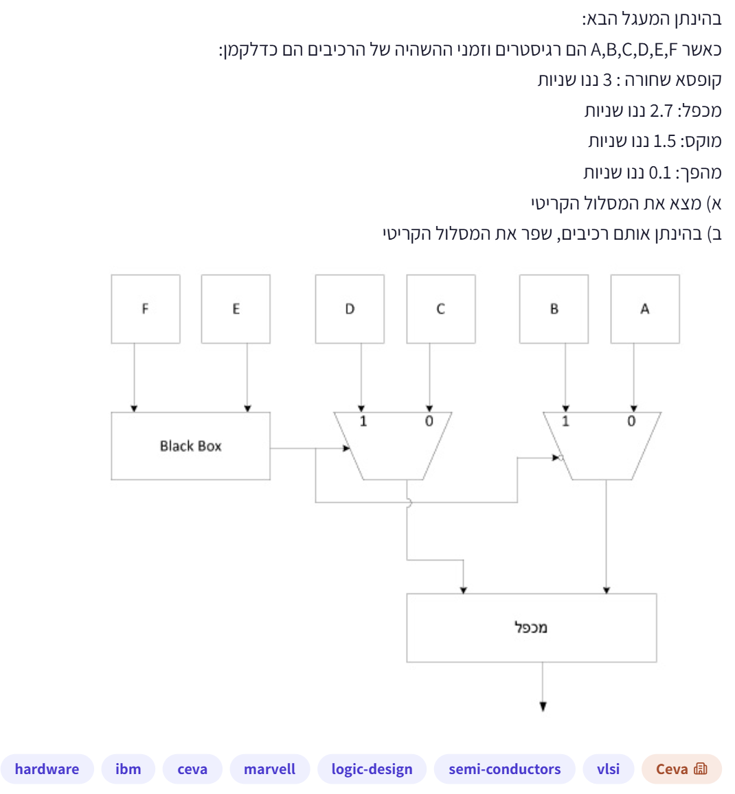
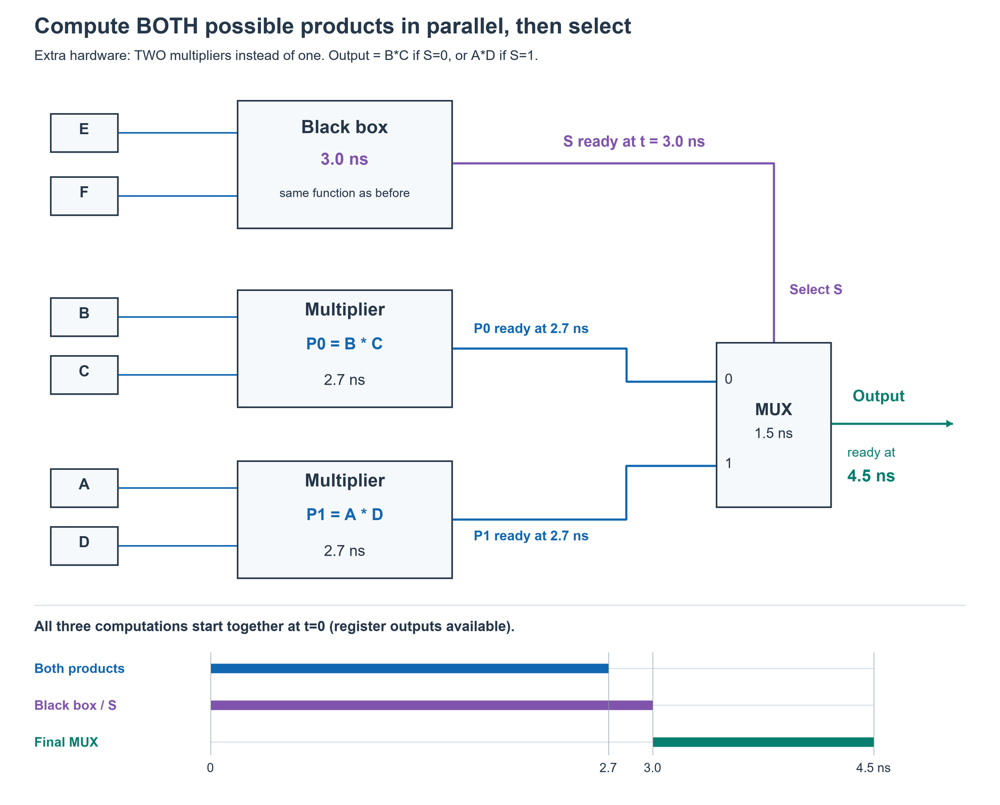

# PREP-020 — מסלול קריטי במעגל MUX ומכפל

## השאלה המקורית

בהינתן המעגל הבא:
כאשר A,B,C,D,E,F הם רגיסטרים וזמני ההשהיה של הרכיבים הם כדלקמן:
קופסה שחורה: 3 ננו שניות
מכפל: 2.7 ננו שניות
מוקס: 1.5 ננו שניות
מהפך: 0.1 ננו שניות
א) מצא את המסלול הקריטי.
ב) בהינתן אותם רכיבים, שפר את המסלול הקריטי.
המעגל נתון בתרשים המצורף.



## קטגוריות וחברות

תגיות מקור: hardware, logic-design, semi-conductors, vlsi. סיווג נוסף: מסלול קריטי, זמני התפשטות, MUX, אופטימיזציה קומבינטורית ופשרות משאבים/השהיה. חברות לפי המקור: IBM, CEVA, Marvell. תווית ראשית: Ceva. השיוך מהצילום בלבד, ללא אימות עצמאי.

## רלוונטיות להכנה לראיון

**עדיפות גבוהה להכנה.** זו הערכת חשיבות על בסיס יסודות החומרה ותיאור משרת הוולידציה שסופק, ולא תחזית לשאלות הראיון. מטרות: לזהות מסלולים דרך נתונים ובחירה, לחשב זמני הגעה, להסביר שינוי תפקודי שקול ולדייק באילוצי משאבים. Marvell מופיעה בתגיות, אך השיוך לא אומת.

## שלושה רמזים מדורגים

1. מסלול יכול להגיע למוצא דרך כניסת נתונים של MUX או דרך כניסת הבחירה שלו. עקוב מכל רגיסטר עד המוצא, וחבר רק השהיות שנמצאות זו אחרי זו באותו מסלול.

2. שני ה־MUX עובדים במקביל, אך הקלטים לבחירה שלהם מגיעים מהקופסה השחורה. בדוק גם את ההיפוך בכניסת הבחירה של ה־MUX הימני: האם הוא מוסיף השהיה למסלול אחד?

3. כתוב מה המכפל מחשב כאשר אות הבחירה 0 וכאשר הוא 1. אפשר להסיר היפוך בכניסת בחירה אם מחליפים את שתי כניסות הנתונים של אותו MUX. אם מותר להוסיף מכפל נוסף, בדוק גם חישוב שתי התוצאות במקביל ובחירה ביניהן בסוף.

## הצעה לפתרון

**קריאת התרשים והנחות:** נסמן S כמוצא הקופסה השחורה המוזנת מ־E,F. ה־MUX השמאלי מקבל C בכניסה 0 ו־D בכניסה 1, ובחירתו S. בכניסת הבחירה של ה־MUX הימני מופיעה בועת היפוך קטנה; נפרש אותה כמהפך בעל ההשהיה שניתנה, כך שבחירתו NOT S, והוא מקבל A בכניסה 0 ו־B בכניסה 1. פלטי ה־MUX מוזנים במקביל לשתי כניסות מכפל אחד. בקו היורד מה־MUX השמאלי יש גשר מעל קו הבחירה: זו חציית חוטים ללא חיבור. התמונה המקורית נשמרה, והמספרים להלן מותנים בפירוש בועת הבחירה כמהפך. אם אין שם היפוך, ההשהיה המקורית היא 7.2 ns והפונקציה אחרת.

נניח שההשהיות שניתנו הן השהיות התפשטות מקסימליות, ול־MUX אותה השהיה מנתונים ומבחירה. זמני clock-to-Q, חיווט ועומס אינם נתונים ולכן לא מוסיפים להם ערכים מומצאים. אין בתרשים רגיסטר קליטה במוצא. אנו מחשבים השהיה קומבינטורית מבנית מהמוצאים של הרגיסטרים אל המוצא, ולא תדר שעון מובטח או בדיקת setup/hold מלאה. תפקוד הקופסה השחורה אינו ידוע, לכן גם אי אפשר להוכיח שהמסלול רגיש לכל שינוי קלט או לשלול false paths לפי הפונקציה הפנימית.

**א. המסלול הקריטי:**

| מקור ומסלול | חישוב | השהיה |
|---|---|---|
| A או B → כניסת נתונים של MUX ימני → מכפל | 1.5+2.7 | 4.2 ns |
| C או D → כניסת נתונים של MUX שמאלי → מכפל | 1.5+2.7 | 4.2 ns |
| E או F → קופסה שחורה → בחירת MUX שמאלי → מכפל | 3+1.5+2.7 | 7.2 ns |
| E או F → קופסה שחורה → מהפך → בחירת MUX ימני → מכפל | 3+0.1+1.5+2.7 | **7.3 ns** |

המסלול הקריטי המבני הוא האחרון. אין לחבר את השהיות שני ה־MUX: הם עובדים במקביל. מוצא המכפל מוכן אחרי המאוחר משני קלטיו ועוד 2.7 ns. מוצא ה־MUX השמאלי זמין לאחר max(0,3)+1.5=4.5 ns, והימני לאחר max(0,3.1)+1.5=4.6 ns. לכן מוצא המכפל זמין לאחר max(4.5,4.6)+2.7=7.3 ns.

**ב. שיפור ללא הוספת רכיבים:** נחליף את מיקומי A,B בכניסות ה־MUX הימני ונחבר את S ישירות לכניסת הבחירה, ללא מהפך:

```text
לפני: MUX(select=NOT S, data0=A, data1=B)
אחרי: MUX(select=S,     data0=B, data1=A)
```

כאשר S=0, לפני השינוי NOT S=1 ולכן נבחר B; אחרי השינוי בחירה 0 מעבירה את B שחובר לכניסה 0. כאשר S=1, לפני השינוי NOT S=0 ולכן נבחר A; אחרי השינוי בחירה 1 מעבירה את A שחובר לכניסה 1. ההתנהגות זהה בכל מצב. ה־MUX השמאלי והמכפל אינם משתנים. אין חובה להשתמש במהפך שהתייתר; השיפור אינו דורש רכיב חדש.

ההשהיה לאחר שינוי החיבור היא 3+1.5+2.7=**7.2 ns**: שיפור של 0.1 ns. זהו שיפור מוכח תחת מגבלת מלאי של מכפל אחד וללא הוספת רכיבים, ולא הוכחת מינימום לכל ארכיטקטורה אפשרית. כלים יכולים לעיתים לספוג היפוך בבחירת MUX גם בזמן מיפוי; כאן עובדים במודל הרכיבים הנתון.

**חלופה מהירה יותר, רק אם מותר להוסיף עותק של מכפל:** נחשב את הפונקציה לפי S. אם S=0, נבחרים C ו־B ולכן התוצאה BC. אם S=1, נבחרים D ו־A ולכן התוצאה AD. לכן ניתן לחשב במקביל P0=B×C ו־P1=A×D, ולהשתמש ב־MUX אחד במוצא: כניסה 0 מקבלת P0, כניסה 1 מקבלת P1, ו־S בוחר ביניהן.

בחלופה זו הכפל והקופסה השחורה עובדים במקביל, במקום שהכפל ימתין לבחירה. שתי המכפלות מוכנות לאחר 2.7 ns, ואות הבחירה לאחר 3 ns. המוצא מוכן לאחר max(2.7,3)+1.5=**4.5 ns**. זמן מסלול הנתונים דרך מכפל ו־MUX הוא 4.2 ns, וזמן מסלול הבחירה דרך קופסה שחורה ו־MUX הוא 4.5 ns. משתמשים בשני מכפלים במקום אחד וב־MUX אחד במקום שניים; יש מחיר משאבים ואפשרות ליותר פעילות מיתוג בכפלים. אין לקבוע שטח או הספק מדויקים מהתרשים.

הניסוח ״בהינתן אותם רכיבים״ עמום: אם הכוונה לאותו מלאי, אסור להציג הכפלת מכפלים כאילו לא הוספנו רכיב. אם הכוונה לאותם סוגי רכיבים ללא מגבלת כמות, חלופת 4.5 ns מתאימה. רצוי להציג את שתי הפרשנויות ולציין את המחיר במפורש. רוחב ה־MUX הסופי צריך להתאים לרוחב תוצאת הכפל; הנחת השהיית 1.5 ns מחייבת שהנתון חל גם על רוחב זה. אין כאן הוכחה ש־4.5 ns הוא מינימום מוחלט לכל מימוש אפשרי, במיוחד כשהקופסה השחורה אטומה.

אי אפשר פשוט להעביר MUX אחד אחרי המכפל בלי לחשב את שתי המכפלות או לשנות את התפקוד. הוספת רגיסטרי pipeline היא גם שינוי של משאבים ולטנטיות; היא אינה אותה מערכת קומבינטורית תחת מגבלת המלאי הנתונה. אין להפוך כניסות של הקופסה השחורה כדי לקבל את היפוך מוצאה בלי לדעת את הפונקציה שלה.

**בדיקות:** נבדקו 8,192 צירופי A,B,C,D בטווח 0..7 ו־S בשני המצבים. הפונקציה המקורית, החלפת כניסות ה־MUX והחלופה עם שני מכפלים נותנות אותו פלט. נבדקו גם חשבונות ההשהיה במודל max-plus עם שברים מדויקים. זו בדיקת פונקציה ומודל השהיות אידאלי; לא הורצו STA, סימולציית HDL, סימולציה פיזית או בדיקות גליצ׳ים.

### חלופה שהציע הראל: Retiming והשהיה מרבית של 4.2 ns

זהו כיוון תקין בתנאי שמותר להזיז את רגיסטרי הכניסה ולשנות את חלוקת תקציבי התזמון מול הסביבה. הפתרונות הקודמים של 7.2 ו־4.5 ns השאירו את גבול הרגיסטרים המקורי קבוע. הם אינם שוללים שיפור באמצעות retiming, שהיה חסר בדיון המקורי. אין צורך במכפל נוסף בחלופה הזאת.

נבטל תחילה את המהפך באמצעות החלפת A,B בכניסות ה־MUX הימני, כפי שכבר הוצע. כעת נבצע forward retiming דרך הקופסה השחורה: נסיר את שני רגיסטרי הקלט E,F מהחיבור שלפניה, ונכניס רגיסטר RS אחד אחרי מוצאה. הכניסות שהזינו קודם את E,F יזינו כעת ישירות את הקופסה השחורה. אין להשאיר את E,F במקומם ורק להוסיף RS.

```text
לפני:
e_in -> [E] --               Black Box -> S -> MUXים -> מכפל -> מוצא
f_in -> [F] --/
a_in..d_in -> [A,B,C,D] -------> נתוני ה־MUXים

אחרי:
e_in -------             Black Box -> [RS] -> S -> MUXים -> מכפל -> מוצא
f_in -------/
a_in..d_in -------> [A,B,C,D] -------> נתוני ה־MUXים
```

בכל חזית שעון A,B,C,D דוגמים את ארבעת ערכי הנתונים של אותה עסקה. RS דוגם את f(e_in,f_in) של אותה עסקה, שכבר חושב לפני החזית. לכן לאחר החזית, אות הבחירה והנתונים מתאימים זה לזה. פורמלית, במקור S[k]=f(E[k],F[k]); לאחר retiming RS[k]=f(e_in[k],f_in[k]), כאשר E[k],F[k] במקור הם בדיוק הדגימות e_in[k],f_in[k]. לכן הפונקציה הנצפית לאחר כל חזית נשמרת, בתנאי שהקלטים עומדים בתזמון החדש.

אם במקום זאת משאירים E,F ומוסיפים אחריהם RS, הוא ידגום בחזית את f(E[k−1],F[k−1]) בעוד A..D כבר דגמו את עסקה k. אז יש ערבוב בין בחירה ישנה לנתונים חדשים. למשל עם A=2,B=3,C=4,D=5, מעבר S מ־0 ל־1 צריך לשנות את המוצא מ־12 ל־10; רגיסטר בחירה נוסף בלבד ישאיר בחירה 0 ויחזיר 12. אפשר לפתור pipeline כזה בעיכובים תואמים לנתונים, אבל זה כבר דורש משאבים/לטנטיות אחרים.

אחרי ההזזה, המקטע שלפני RS מכיל רק את הקופסה השחורה: 3 ns. המקטע שמיציאות A..D ו־RS עד המוצא מכיל MUX ואז מכפל: 1.5+2.7=4.2 ns. לכן ההשהיה המרבית בין גבולות הדגימה/הממשק היא max(3,4.2)=**4.2 ns** במודל האידאלי, בהנחה שהסביבה מקצה מחזור למקטע הקלט ומחזור למקטע המוצא ושהגבולות ניתנים להזזה. יש לוודא שכל מסלולי המערכת, כולל הממשקים, עומדים בתקציב זה.

השרטוט המקורי אינו כולל רגיסטר קליטה במוצא ואינו נותן clock-to-Q, setup, hold, skew או זמני הגעת קלטים. לכן 4.2 ns הוא המקסימום הקומבינטורי של המקטעים, ולא זמן מחזור פיזי מובטח מהנתונים בלבד. בתכנון סינכרוני מלא מוסיפים clock-to-Q ו־setup ובודקים את האילוצים. התזמון החדש מחייב שהקלטים e_in,f_in יהיו זמינים מוקדם מספיק לפני דגימת RS: יש כעת קופסה של 3 ns לפניה. לא ניתן להזיז רגיסטרים המוגדרים כגבולות I/O קשיחים בלי להתאים את הממשק.

אין צורך לתאר זאת אוטומטית כ״הוספת שני מחזורי שעון״. זו הזזה של גבול דגימה: בכל מסלול מהקלט החיצוני אל המוצא נשאר רגיסטר אחד, וניתן לשמור על מספר מחזורי ההשהיה הלוגי. מוסיפים לטנטיות רק אם מוסיפים שלב דגימה נוסף במקום להזיז ולמזג את הרגיסטרים הקיימים. ההשהיה הפיזית מרגע קלט נתון ועד פלט מושפעת גם ממיקומו ביחס לחזית השעון.

**מספר הרגיסטרים:** לאחר מיזוג רגיסטרי E,F דרך פונקציה קומבינטורית בעלת מוצא בחירה יחיד, מספיקים ארבעת רגיסטרי הנתונים ורגיסטר RS: חמישה בלוקים לוגיים, לא בהכרח שישה בשימוש. מותר להותיר משאב עודף לא מחובר אם הדרישה היא לא להוסיף רכיבים. אין להסיק מכך ספירת FF פיזיים, משום שרוחבי E,F ורגיסטרי הנתונים אינם נתונים. אם רוצים להציב את הרגיסטר העודף במוצא, צריך לבדוק גם את רוחב המכפלה וגם את השינוי בלטנטיות/ממשק; אין להניח שרגיסטר קיים צר מתאים למכפלה רחבה.

Retiming מחייב גם שהקופסה השחורה קומבינטורית, שרגיסטרי E,F ניתנים להזזה ושאין להם שימושים נוספים שלא טופלו, ושיש התאמה של clock, enable ו־reset. במקרה של אתחול ידוע, צריך לאתחל RS לערך f(E_reset,F_reset); איפוס אוטומטי של RS ל־0 אינו נכון לכל פונקציה שחורה. בפונקציה לא ידועה לא ניתן לקבוע את ערך האתחול הזה ללא מידע נוסף. זה אינו פוסל את הרעיון אלא מגדיר את תנאי שקילותו.

המסקנה: אם השאלה מתירה retiming של הרגיסטרים הנתונים, זו חלופה טובה יותר מבחינת המקטע הקריטי האידאלי מהחלופות שהוצגו קודם: **4.2 ns עם מכפל אחד**. היא משנה את מיקום הרגיסטרים ותקציב התזמון של הממשק, בעוד חלופת **4.5 ns עם שני מכפלים** משאירה את רגיסטרי המקור במקומם. לכן חשוב לציין מה מותר לשנות. אין כאן הוכחת מינימום מוחלט.

מקורות טכניים: [Intel — שילוב רגיסטרי כניסה לרגיסטר אחרי לוגיקה באמצעות Retiming](https://www.intel.com/programmable/technical-pdfs/683230.pdf), ו־[Intel — מגבלות Retiming, אתחול וממשקים](https://www.intel.com/content/www/us/en/docs/programmable/683236/23-4/retiming-restrictions-and-workarounds.html). המקורות מתארים את הטכניקה והמגבלות הכלליות; תוצאת 4.2 ns נגזרת מנתוני השאלה.

בדיקת מודל: כל 16 פונקציות בוליאניות אפשריות של קופסה שחורה עם שני קלטי ביט, וכל 16,384 צירופי עסקה עם A..D בני שני ביטים, נתנו אותה תוצאה לפני ואחרי retiming נכון. נוסף מקרה נגדי להוספת RS בלבד. מיפוי האתחול ותנאי יציבות הקלטים מתועדים; אין כאן אימות setup/hold, STA או בדיקת חומרה פיזית. [בדיקת המודל](../checks/check_prep_020_retiming.py).


[בדיקת פונקציה והשהיות](../checks/check_prep_020.py).

### הסבר אינטואיטיבי לשיפור ל־4.5 ns ושרטוט מלא

החלופה דורשת שני מכפלים במקום אחד. הרעיון הוא לחשב מראש את שתי התוצאות האפשריות בזמן שהקופסה השחורה מחליטה איזו מהן צריך. אין ניחוש של S ואין שינוי בפונקציה; עושים עבודה כפולה בחומרה ובוחרים בסוף תוצאה אחת.

ראשית נגזור את שתי התוצאות מהמעגל המקורי. כאשר S=0, ה־MUX השמאלי בוחר C, והימני מקבל NOT S=1 ובוחר B. לכן המכפל מחזיר B×C. כאשר S=1, השמאלי בוחר D והימני מקבל NOT S=0 ובוחר A. לכן התוצאה A×D. אין במעגל המקורי אפשרות של A×C או B×D עבור אות בחירה משותף זה.

נחבר B ו־C ישירות למכפל הראשון, ואת A ו־D ישירות למכפל שני. את מוצא הראשון P0=B×C נחבר לכניסה 0 של MUX במוצא, ואת מוצא השני P1=A×D לכניסה 1. אות S, שמגיע מאותה קופסה שחורה עם אותם קלטי E,F, מחובר ישירות לבחירת ה־MUX. S=0 מעביר P0; S=1 מעביר P1. שני ה־MUX שהיו לפני המכפל אינם נחוצים במבנה הזה, ואין צורך במהפך.

דוגמה: A=2,B=3,C=4,D=5. שני המכפלים מחשבים במקביל 3×4=12 ו־2×5=10. עוד לא צריך לדעת מה S. כאשר הוא מתייצב, ה־MUX מעביר 12 אם S=0 או 10 אם S=1. אלו אותן תוצאות שהמעגל המקורי היה מחשב לאחר בחירת זוג הכניסות.

**ציר הזמן במודל השאלה:** ברגע 0 קלטי הרגיסטרים זמינים ביציאותיהם; הקופסה השחורה ושני המכפלים מקבלים את קלטיהם במקביל. אחרי 2.7 ns שתי המכפלות מוכנות. אחרי 3 ns גם S מוכן, ובשלב הזה שתי כניסות הנתונים של ה־MUX כבר יציבות. מהמאוחר מבין זמני הנתונים והבחירה מוסיפים 1.5 ns של MUX. לכן המוצא יציב אחרי max(2.7,3)+1.5=4.5 ns.

לא מחברים 3+2.7, כי המכפלים אינם ממתינים לקופסה השחורה. לעומת זאת במימוש 7.2 ns המכפל ממתין לפלטי ה־MUX, שממתינים ל־S: קופסה שחורה 3, בחירה 1.5, כפל 2.7. במימוש החדש הכפל כבר הסתיים בזמן ההמתנה ל־S, ונשאר רק להעביר את התוצאה הנכונה דרך MUX.



הפסים בציר הזמן ממחישים מתי האותות מובטחים כיציבים במודל ההשהיות; הם אינם מחזורי שעון או פקודות התחלה של פעולות. כל המעגל קומבינטורי. ההנחות הקודמות נשמרות: השהיית MUX של 1.5 ns חלה גם על רוחב המכפלה, השהיות חיווט ו־clock-to-Q אינן נתונות, והוספת מכפל מותרת רק אם אילוצי המשאבים מאפשרים אותה. המסלול הקריטי החדש הוא E/F → קופסה שחורה → בחירת MUX → מוצא, באורך 4.5 ns. מסלול דרך כל אחד מהמכפלים אל המוצא הוא 2.7+1.5=4.2 ns.

[מחולל השרטוט](../solutions/draw_prep_020_parallel_products.py). השרטוט נבדק חזותית מול הפונקציה BC/AD ובדיקת ההשהיות הקיימת.

Compute both possible outputs while the black box computes S: P0=B*C and P1=A*D, using two multipliers. Feed P0/P1 to mux inputs 0/1, with direct select S. The original inverted right select produces BC for S=0 and AD for S=1, so this preserves behavior. Example A=2,B=3,C=4,D=5 gives candidate results 12 and 10; S chooses one after they have both been computed. Inputs are available at t=0, both products at 2.7 ns, and S at 3 ns; final output is stable after max(2.7,3)+1.5=4.5 ns. The timeline denotes combinational arrival times, not clocked steps. This adds a multiplier and assumes the given mux delay applies at product width. Figure includes all six source registers and the three parallel paths.

## תשובה קצרה לראיון

המסלול הקריטי המקורי הוא 7.3 נ״ש. החלפת כניסות המוקס מסירה מהפך ונותנת 7.2. ברגיסטרים קבועים, מכפל נוסף מאפשר חישוב שתי התוצאות במקביל ו־4.5. אם מותר retiming, מעבירים את גבול הדגימה מ־E,F אל מוצא הקופסה השחורה, תוך התאמת הדגימות והממשק; מתקבלים מקטעים של 3 ו־4.2 נ״ש עם מכפל אחד, ללא הוספת מחזור בהכרח.

## English

Given the circuit in the attached diagram, A,B,C,D,E,F are registers. Component delays are: black box 3 ns; multiplier 2.7 ns; mux 1.5 ns; inverter 0.1 ns. (a) Find the critical path. (b) Using the same components, improve the critical path.

Hint 1: A path can reach a mux output through a data input or its select input. Trace each register-to-output path and add only delays in series.

Hint 2: The two muxes work in parallel, but their select comes from the black box. Account for the inversion shown on the right mux select.

Hint 3: Write the function for select 0 and 1. Swapping a mux's data inputs removes a select inversion. If an extra multiplier is allowed, also consider computing both possible products before the final selection.

Interpret the small bubble on the right mux select as the given 0.1 ns inverter. Let S be the black-box output. Left mux is MUX(S,C,D); right mux is MUX(NOT S,A,B). Their outputs feed one multiplier in parallel. The crossover bridge is not a wire junction. If the bubble is not inversion, the interpretation and result change; preserve the source image.

Assume the given delays apply to all relevant paths, including mux select, and omit unspecified register clock-to-Q, wiring/load and output setup. No capture register is drawn, so this is structural combinational delay, not a guaranteed clock frequency or complete setup/hold result. Unknown black-box functionality prevents functional false-path analysis.

Data paths from A..D are 1.5+2.7=4.2 ns. From E/F through black box and left mux: 3+1.5+2.7=7.2 ns. Through the right select inverter: 3+0.1+1.5+2.7=7.3 ns, the structural critical path. The two mux delays are not added together; multiplier output arrival is max(4.5,4.6)+2.7.

Without adding components, swap A and B on the right mux and drive its select directly with S: MUX(NOT S,A,B)=MUX(S,B,A). This preserves the function and removes the inverter delay, giving 7.2 ns. This is a valid improvement, not an unconditional global minimum proof.

If adding a multiplier copy is allowed, the function is BC for S=0 and AD for S=1. Compute both products in parallel and select them with one output mux controlled by S. Delay becomes max(2.7,3)+1.5=4.5 ns. This uses two multipliers instead of one and assumes the 1.5 ns mux delay also applies to the product width. It is valid only if 'same components' means permitted component types, not the original inventory. Adding pipeline stages changes latency/resources. Neither exact area/power nor absolute optimum is established.

8,192 operand/select combinations verified equivalence of the three constructions. Exact-rational arrival-time checks confirm 7.3, 7.2 and 4.5 ns under the stated model. No physical STA or HDL timing simulation was performed.

User-proposed forward retiming is valid if the input registers and interface timing may change. Remove E,F from before the combinational black box and put a selector register RS after it. Raw e_in,f_in now feed the box; A..D remain registered. RS captures f(e[k],f[k]) on the same edge that A..D capture transaction k, preserving cycle values under the new setup requirements. Merely appending RS while retaining E,F misaligns old select with new data unless matching delays are added.

After eliminating select inversion by swapping mux data inputs, the pre-RS segment is 3 ns and the post-register mux/multiplier segment is 4.2 ns. Their ideal maximum is 4.2 ns, with one multiplier. This is conditional on a synchronous environment allocating appropriate input/output timing budgets; the source omits an output capture register and register/setup/wiring delays, so it is not a proven physical clock period. Forward retiming need not add cycles: each primary-input-to-output path still has one register. Only four data registers plus RS are logically required, so the six original register blocks need not all remain in use; physical widths and spare output-register feasibility are unspecified.

Preserve reset via RS_reset=f(E_reset,F_reset), clocks/enables and any other E/F fanouts. Fixed I/O boundaries can prohibit the move. Previous 7.2/4.5 ns options assumed fixed register placement; the discussion is corrected to include this legitimate alternative. No global minimum claim. Exact transaction-value checks covered 16,384 cases across all 16 two-input Boolean BB functions, plus a counterexample for appended-only RS. No STA or physical setup/hold verification.

התוכן נוצר בסיוע AI וממתין לסקירה; טרם פורסם באתר.
