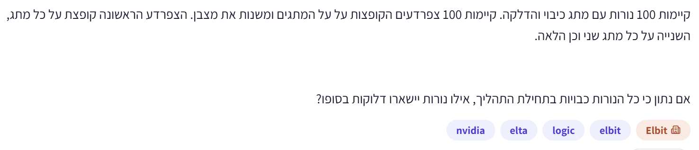

# PREP-021 — 100 צפרדעים ו־100 נורות

## השאלה המקורית

קיימות 100 נורות עם מתג כיבוי והדלקה. קיימות 100 צפרדעים הקופצות על המתגים ומשנות את מצבן. הצפרדע הראשונה קופצת על כל מתג, השנייה על כל מתג שני וכן הלאה.
אם נתון כי כל הנורות כבויות בתחילת התהליך, אילו נורות יישארו דלוקות בסופו?

## קטגוריות וחברות

תגית מקור: logic. סיווג נוסף: חשיבה מתמטית, זוגיות, מחלקים, ריבועים שלמים והיפוך מצב. חברות לפי הצילום בלבד: NVIDIA, Elta, Elbit. תווית ראשית: Elbit. השיוך לא אומת עצמאית.

## רלוונטיות לראיון

שאלת העשרה בחשיבה מתמטית; אינה בעדיפות גבוהה במיוחד ביחס ללוגיקה ספרתית, תזמון, Python ודיבוג לפי תיאור המשרה שסופק. זו הערכת הכנה, לא תחזית לראיון.

## הנחות

מספור מ־1 עד 100; צפרדע k משנה פעם אחת את מצב כל מתג שמספרו כפולה של k. כל הנורות כבויות בהתחלה.

## שלושה רמזים מדורגים

1. במקום לעקוב אחרי כל הצפרדעים יחד, בחר נורה אחת ושאל: אחרי מספר זוגי של לחיצות מה מצבה, ואחרי מספר אי־זוגי?

2. אילו צפרדעים מגיעות לנורה שמספרה 12? בדוק את הקשר בין מספר הצפרדע למספר הנורה. עכשיו נסה נורה שמספרה 9.

3. אפשר לסדר את המחלקים של מספר בזוגות שהמכפלה שלהם היא המספר עצמו. מתי שני המחלקים בזוג הם בעצם אותו מספר, ולכן סופרים אותו פעם אחת בלבד?

## הצעה לפתרון

**תשובה:** הנורות שמספריהן **1, 4, 9, 16, 25, 36, 49, 64, 81, 100** יישארו דלוקות — עשר נורות.

**כך מגיעים לזה:** נמספר את הנורות ואת הצפרדעים מ־1 עד 100. צפרדע מספר k קופצת על הנורות k, 2k, 3k וכן הלאה, וכל קפיצה הופכת את המצב: כבוי נהפך לדלוק ודלוק נהפך לכבוי. לכן שתי קפיצות מבטלות זו את זו. נורה שהתחילה כבויה תישאר דלוקה רק אם מספר הקפיצות עליה אי־זוגי.

מי מגיע לנורה מספר n? בדיוק הצפרדעים שמספרן מחלק את n ללא שארית. לדוגמה, על נורה 12 קופצות צפרדעים 1, 2, 3, 4, 6, 12: שש קפיצות, ולכן בסוף היא כבויה. את המחלקים אפשר לצמד: (1,12), (2,6), (3,4). כל זוג תורם שתי קפיצות.

על נורה 9 קופצות צפרדעים 1, 3, 9: שלוש קפיצות, ולכן היא דלוקה. הזוג (1,9) תורם שתי קפיצות, אבל 3×3=9: צפרדע 3 קיימת רק פעם אחת, ולא סופרים אותה פעמיים. נשארת קפיצה אחת ללא בת זוג.

זה קורה בדיוק בריבועים שלמים. לכל מחלק d יש בן זוג n/d. הם שונים, חוץ מהמקרה d=n/d, כלומר n=d². לכן מספר שאינו ריבוע שלם מקבל מספר זוגי של קפיצות, וריבוע שלם מקבל מספר אי־זוגי. הריבועים מ־1 עד 100 הם 1² עד 10², ואלה הנורות הדלוקות. גם 1 ו־100 נכללות.

**הכללה ויעילות:** עבור N נורות ו־N צפרדעים, הנורות הדלוקות הן k² עבור k=1..⌊√N⌋. אם צריך רק כמה נורות דלוקות, התשובה היא ⌊√N⌋. כדי להפיק את רשימת המספרים אין צורך לדמות את כל הקפיצות: יצירת הריבועים אורכת Θ(√N) פעולות במודל שבו אריתמטיקה על מספרים בגודל הקלט עולה זמן קבוע, וזה מיטבי לרשימה מפורשת בעלת Θ(√N) איברים. אפשר להפיק איבר־איבר עם O(1) זיכרון עזר, מעבר לפלט. סימולציה ישירה מבצעת Σ⌊N/k⌋=Θ(N log N) החלפות ודורשת O(N) זיכרון. אם נדרש דווקא מערך מצב של כל N הנורות, עצם הפלט דורש Θ(N) מקום וכתיבות. החידה המקורית מבקשת זיהוי של הנורות, לא מימוש או ניתוח סיבוכיות.

**בדיקה:** סימולציית כל הקפיצות הושוותה לרשימת הריבועים לכל N מ־0 עד 200, ובנוסף ל־N=255,256,257,999,1000. עבור N=100 התקבלו בדיוק עשר הנורות הרשומות. נבדקו גם מספרי ריבוע ושכניהם והקשר בין זוגיות מספר המחלקים לבין ריבוע שלם לכל מספר מ־1 עד 1000.

## תשובה קצרה לראיון

נורה n מתהפכת פעם לכל מחלק של n. מחלקים באים בזוגות, חוץ מהשורש כאשר n ריבוע שלם. לכן רק הריבועים 1,4,9,16,25,36,49,64,81,100 נשארים דלוקים.

[קוד בדיקה](../checks/check_prep_021.py)

## English

There are 100 lamps with on/off switches, and 100 frogs that toggle them. The first frog jumps on every switch, the second on every second switch, and so on. All lamps are initially off. Which lamps remain on at the end?

Hint 1: Focus on one lamp. What happens after an even number of toggles, and after an odd number?

Hint 2: Which frogs visit lamp 12? Relate each frog number to the lamp number, then try lamp 9.

Hint 3: Pair each divisor d of a number with n/d. When do both members of a pair coincide and count as just one divisor?

The lit lamps are 1, 4, 9, 16, 25, 36, 49, 64, 81, 100: ten lamps.

Number frogs and lamps from 1 to 100. Frog k toggles lamps k, 2k, 3k, etc. Since lamps start off, a lamp finishes on exactly when it is toggled an odd number of times. Lamp n is visited precisely by frogs whose numbers divide n.

Divisors come in pairs (d,n/d). Lamp 12 has pairs (1,12), (2,6), (3,4), hence six toggles and finishes off. Lamp 9 has divisors 1,3,9: (1,9) is a pair, while 3 is its own partner and is counted only once. Thus it receives three toggles and finishes on. An unpaired divisor exists exactly when d²=n, so precisely perfect-square-numbered lamps stay on, including 1 and 100.

For N lamps and N frogs the list is k² for k=1..floor(sqrt(N)), containing floor(sqrt(N)) entries. Explicitly generating that list costs Θ(sqrt(N)) word-arithmetic operations, optimal in its output size, with O(1) auxiliary space when streamed. Materializing the list requires output space. Direct simulation costs Θ(N log N) toggles and O(N) space. A full N-lamp state-vector output instead requires Θ(N) space/writes. Counting alone requires the integer square root, not generating the list.

The direct process was checked against generated squares for every N=0..200 and for 255,256,257,999,1000. Divisor parity was checked independently for n=1..1000. The original N=100 case yields exactly the ten listed lamps.

התוכן נוצר בסיוע AI וממתין לסקירה; טרם פורסם באתר.
