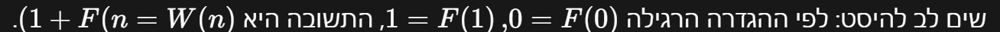

# PREP-024 — חרגול על סולם

## השאלה המקורית

חרגול מטפס על סולם, ועולה בכל פעם שלב אחד או שניים. בכמה דרכים שונות יכול החרגול להגיע לשלב ה־n?


## קטגוריות וחברות

תגית מקור: logic. סיווג נוסף: קומבינטוריקה, נוסחאות נסיגה, רקורסיה, תכנון דינמי ופיבונאצ׳י. חברות לפי התמונה: Apple, Marvell, Mellanox, Intel; תווית ראשית אינטל. השיוך מהמקור בלבד, ללא אימות עצמאי.

## רלוונטיות לראיון

עדיפות בינונית: תרגול חשיבה אלגוריתמית וקוד Python פשוט. הערכת הכנה לפי התפקיד, לא תחזית לשאלה שתישאל.

## שלושה רמזים מדורגים

1. נסה לרשום את כל הדרכים להגיע לשלב 2 ואז לשלב 3. דרך היא סדרת קפיצות: האם קפיצה של 1 ואחריה 2 היא אותה דרך כמו 2 ואחריה 1?

2. הסתכל דווקא על הקפיצה האחרונה בדרך לשלב n: מאיזה שלב החרגול היה יכול להגיע, אם מותר לקפוץ רק 1 או 2?

3. חלק את הדרכים לשתי קבוצות לפי גודל הקפיצה האחרונה. אם כבר ידוע כמה דרכים יש להגיע לכל אחד משני השלבים הקודמים, איך תקבל את מספר הדרכים לשלב הנוכחי? קבע גם את מקרי הבסיס.

## הצעה לפתרון

**הנחות:** החרגול מתחיל על הקרקע, כלומר בשלב 0. n הוא מספר שלם אי־שלילי, ומגיעים בדיוק לשלב n באמצעות עליות של 1 או 2 בלבד. סדר הקפיצות חשוב: (1,2) ו־(2,1) הן דרכים שונות. המקור לא מציין במפורש את שלב ההתחלה; אם מתחילים בשלב 1, צריך לספור מרחק n−1 במקום n. אין מגבלת יעילות מפורשת בשאלה.

**דוגמאות קטנות:** לשלב 1 יש דרך אחת: (1). לשלב 2 יש שתיים: (1,1), (2). לשלב 3 יש שלוש: (1,1,1), (1,2), (2,1). לשלב 4 יש חמש: (1,1,1,1), (1,1,2), (1,2,1), (2,1,1), (2,2).

**הרעיון:** נסמן W(n) כמספר הדרכים לשלב n. הקפיצה האחרונה היא או קפיצה של 1 מהשלב n−1, או קפיצה של 2 מהשלב n−2. לכל דרך שמגיעה ל־n−1 אפשר להוסיף קפיצה אחת של 1, ולכל דרך שמגיעה ל־n−2 אפשר להוסיף קפיצה אחת של 2. שתי הקבוצות זרות, משום שהקפיצה האחרונה שלהן שונה, והן כוללות את כל הדרכים האפשריות. לכן מחברים ולא מכפילים:

W(n)=W(n−1)+W(n−2), עבור n≥2.

מקרי הבסיס: W(0)=1 — דרך ריקה אחת, כלומר לא לקפוץ; W(1)=1. מכאן W(2)=2, W(3)=3, W(4)=5, W(5)=8. הגדרת W(0)=1 אינה אומרת שקפצנו קפיצה: היא מאפשרת לספור נכון את הדרך היחידה (2) לשלב 2. עבור n=0 התשובה היא אחת לפי הגדרת המסלול הריק.

**התשובה הכללית:** W(n)=F(n+1), כאשר F(0)=0 ו־F(1)=1 הם מספרי פיבונאצ׳י. לכן זו נוסחת נסיגה, ולא מספר יחיד שאפשר לתת בלי ערך n. דרך ההגעה לנסיגה חשובה יותר משם הסדרה.

**מימוש ברור ויעיל לראיון:** מחשבים מלמטה למעלה, ושומרים רק את שני הערכים האחרונים. מתחילים previous=W(0)=1,current=W(1)=1; לכל שלב מ־2 ועד n מחליפים בו־זמנית ל־previous=current,current=previous+current. ההשמה המקבילית בפייתון משתמשת בשני הערכים הישנים לפני ההחלפה. הפונקציה count_ways בקובץ הקוד מממשת זאת. זמן O(n) פעולות חיבור ומספר קבוע של משתני ספירה; אין צורך במערך של כל התוצאות. רקורסיה נאיבית מחשבת שוב את אותן תת־בעיות ועולה בזמן מעריכי; memoization מצמצם לחישוב לכל שלב אך דורש אחסון O(n) ערכים ועומק קריאות עד O(n).

**אופטימליות ודיוק:** O(n) הוא פתרון בסיסי יעיל וברור, אבל אינו מינימום מוחלט במספר פעולות אריתמטיות. אם n גדול מאוד אפשר להשתמש בהכפלה מהירה של פיבונאצ׳י: כאשר a=F(k),b=F(k+1), אז F(2k)=a(2b−a), ו־F(2k+1)=a²+b². סריקת הביטים של n+1 ובניית הזוג המתאים נותנות O(log n) פעולות אריתמטיות; count_ways_fast מממשת זאת בדיוק במספרים שלמים. הזהויות נובעות מנוסחת החיבור F(p+q)=F(p−1)F(q)+F(p)F(q+1), ובפרט F(k−1)=b−a. קוד ההכפלה אינו דרוש כדי להסביר את החידה.

בפייתון ערך התשובה מכיל Θ(n) ביטים עבור n גדול. לכן שני משתני ספירה אינם O(1) ביטים, ופעולות אריתמטיות עליהם אינן זמן קבוע. הפתרון הלינארי מבצע O(n) חיבורים, אך עלות הביטים המצטברת היא O(n²) במודל חיבור לינארי; גרסת ההכפלה מבצעת O(log n) פעולות על מספרים הולכים וגדלים ולא מבטיחה זמן פיזי O(log n). סריקת bin בקוד ההכפלה משתמשת בנוסף ב־O(log n) תווי אינדקס. אין טענת מינימום זמן פיזי או מספר הוראות. לא משתמשים בנוסחת פיבונאצ׳י בנקודה צפה בלי טיפול בשגיאות עיגול.

**נוסחה קומבינטורית נוספת לבדיקה:** אם יש k קפיצות של 2, יש n−2k קפיצות של 1, ובסך הכול n−k קפיצות. בוחרים את k המקומות לקפיצות של 2 מתוך n−k, ולכן W(n)=Σ C(n−k,k), עבור k=0..⌊n/2⌋. זו חלופה נכונה, אבל הנסיגה פשוטה יותר להסבר.

**בדיקות:** נמנו כל המסלולים ל־n=0..16 ונבדקו ייחודיות והגעה מדויקת; שני המימושים הושוו לסכום הבינומי לכל n=0..300 וביניהם גם ל־n=1000,10000. נבדקו קלטים לא תקינים.

```python
"""Count ordered 1/2-step paths from level zero to level n, exactly."""


def _validate(n):
    if not isinstance(n, int) or isinstance(n, bool) or n < 0:
        raise ValueError('n must be a nonnegative integer')


def count_ways(n: int) -> int:
    """Linear arithmetic-operation count, two running count values."""
    _validate(n)
    previous, current = 1, 1  # W(0), W(1)
    if n == 0:
        return previous
    for _ in range(2, n + 1):
        previous, current = current, previous + current
    return current


def count_ways_fast(n: int) -> int:
    """Return F(n+1) by iterative doubling: O(log n) big-integer operations."""
    _validate(n)
    a, b = 0, 1  # F(k), F(k+1), initially k=0
    for bit in bin(n + 1)[2:]:
        c = a * (2 * b - a)   # F(2k)
        d = a * a + b * b     # F(2k+1)
        if bit == '0':
            a, b = c, d
        else:
            a, b = d, c + d
    return a
```

[קוד](../solutions/prep_024_grasshopper_stairs.py) · [בדיקות](../checks/check_prep_024.py)

## תשובה לראיון

בהנחה שמתחילים בשלב 0, הקפיצה האחרונה לשלב n מגיעה מ־n−1 או מ־n−2. לכן W(n)=W(n−1)+W(n−2), עם W(0)=W(1)=1. זו F(n+1). אפשר לחשב בלולאה עם שני משתנים בלי לחזור על תתי־בעיות.

## English

A grasshopper climbs a ladder, ascending one or two rungs at a time. In how many different ways can it reach rung n?

Hint 1: List the paths to rung 2 and rung 3. Is jumping 1 then 2 the same path as jumping 2 then 1?

Hint 2: Consider the final jump into rung n. From which rung can it originate if jumps have length 1 or 2?

Hint 3: Partition paths by final jump size. Combine the counts for the two possible previous rungs, and specify the base cases.

Assume the grasshopper starts at ground level 0, n is a nonnegative integer, and paths are ordered sequences of upward jumps of size 1 or 2 reaching exactly n. Starting on rung 1 would instead require counting distance n-1. The source leaves the starting point implicit. Order matters: (1,2) and (2,1) differ.

Let W(n) count paths. Partition them by final jump: append a 1-jump to every path to n-1, or a 2-jump to every path to n-2. These classes are disjoint and exhaustive, hence W(n)=W(n-1)+W(n-2), n>=2. Base values are W(0)=1 (the empty path) and W(1)=1. Counts for n=0..5 are 1,1,2,3,5,8. Thus W(n)=F(n+1), with F(0)=0,F(1)=1. There is no single numerical answer until n is given.

The recommended basic interview implementation iterates bottom-up keeping two previous counts: O(n) additions, a constant number of count variables, no full DP array. Naive recursion repeats subproblems exponentially; memoization retains O(n) counts and can use O(n) call depth. Linear iteration is not an absolute arithmetic-operation optimum: fast doubling uses F(2k)=a(2b-a), F(2k+1)=a²+b² for a=F(k),b=F(k+1). Scanning the bits of n+1 produces F(n+1) in O(log n) arithmetic operations, implemented as count_ways_fast. These identities follow from the Fibonacci addition identity.

Exact result size is Θ(n) bits, so arbitrary-precision operations are not constant time and a constant number of big integers is not constant bit-space. Linear iteration costs O(n²) bit operations under linear-cost addition; fast doubling's bit cost depends on multiplication, not merely its O(log n) operation count. The implementation's binary index string uses O(log n) characters. No global physical-time optimum is claimed.

Independent combinatorial formula: W(n)=sum_{k=0..floor(n/2)} C(n-k,k), choosing positions of k double jumps among n-k total jumps. Exhaustive path enumeration for n=0..16, independent binomial comparisons for n=0..300, and cross-checks at n=1000/10000 passed, plus invalid-input checks.

התוכן נוצר בסיוע AI וממתין לסקירה; טרם פורסם באתר.




### מה פירוש W(n)=F(n+1), ומה עץ הרקורסיה סופר?

בצילום ההסבר המצורף הנוסחה עלולה להיראות משובשת בגלל ערבוב עברית ומתמטיקה. הסימון המדויק משמאל לימין הוא `W(n) = F(n + 1)`. W(n) הוא מספר הדרכים לשלב n; F(k) הוא האיבר במקום k בסדרת פיבונאצ׳י עם F(0)=0,F(1)=1. אין הכוונה ל־F(n)+1 ואין הכוונה להוסיף שלב לסולם: זו רק התאמה בין שתי סדרות עם מספור שונה.

| n | F(n) | W(n) |
|---|---|---|
| 0 | 0 | 1 |
| 1 | 1 | 1 |
| 2 | 1 | 2 |
| 3 | 2 | 3 |
| 4 | 3 | 5 |
| 5 | 5 | 8 |

לדוגמה, W(4)=5=F(5), ו־W(5)=8=F(6). שתי הסדרות מקיימות אותו חיבור שני קודמים, אך מקרי הבסיס של W הם 1,1 ולא 0,1.

**התשובה הסופית הכללית:** W(0)=1, W(1)=1, W(n)=W(n−1)+W(n−2) עבור n≥2. שקול ל־W(n)=F(n+1). מאחר שלא ניתן n מספרי, אין תשובה מספרית אחת. לדוגמה, אם n=4 התשובה 5, ואם n=10 התשובה 89.

**עץ רקורסיה לדוגמה n=4:**

```text
W(4) = 5
├── W(3) = 3
│   ├── W(2) = 2
│   │   ├── W(1) = 1
│   │   └── W(0) = 1
│   └── W(1) = 1
└── W(2) = 2
    ├── W(1) = 1
    └── W(0) = 1
```

כל צומת מתפצל לפי שתי האפשרויות לקפיצה האחרונה: קפיצה של 1 נותנת ילד W(n−1), וקפיצה של 2 נותנת ילד W(n−2). ערך האב הוא סכום ערכי הילדים. עוצרים ב־W(1)=1 או W(0)=1, ולכן בכל עלה נספרת דרך אחת. בעץ הזה יש חמישה עלים, ולכן W(4)=5. W(1) כעלה אומר שנותרה השלמה יחידה בקפיצה של 1; W(0) אומר שכבר הושלם המרחק וההמשך הריק אפשרי בדרך אחת. קריאת הענפים מהשורש מתארת קפיצות אחרונות לאחור; היא אינה רשימת צעדים כרונולוגית מהקרקע.

חמש הדרכים הן (1,1,1,1), (1,1,2), (1,2,1), (2,1,1), (2,2). העץ מסביר את הספירה אבל מחשב W(2) פעמיים, ולכן בנייה נאיבית שלו אינה המימוש היעיל. לחישוב משתמשים בקוד הלולאה עם שני משתנים שכבר נשמר. עץ יכול לתת מספר מדויק לכל n נתון, אך גודלו גדל במהירות; הנסיגה מאפשרת לחשב בלי לבנות את העץ.


Index clarification: W(n)=F(n+1), not F(n)+1. F uses base values 0,1; W uses 1,1, so W(4)=5=F(5). With unspecified n there is no single numeric answer: the exact general answer is W(0)=W(1)=1 and W(n)=W(n-1)+W(n-2), equivalently F(n+1). Examples: n=4 gives 5 and n=10 gives 89.

The complete W(4) recursion tree splits into W(3) and W(2), stopping at W(1) and W(0), each worth one. It has five leaves. W(1) represents the unique remaining one-step completion, while W(0) represents the empty completion. Branches describe final jumps in reverse chronological order. The tree's repeated W(2) illustrates why naive recursion is inefficient; bottom-up iteration avoids repeated subproblems. The tree explains exact counting, not a need to enumerate the tree to compute the answer.


### ביטוי סגור כתלות ב־n

כן. בהנחת התחלה בשלב 0, עבור n שלם אי־שלילי:

W(n) = [((1+sqrt(5))/2)^(n+1) - ((1-sqrt(5))/2)^(n+1)] / sqrt(5).

זוהי נוסחת בינה לפיבונאצ׳י עם היסט באינדקס. אם מסמנים phi=(1+sqrt(5))/2 ו־psi=(1−sqrt(5))/2, מקבלים W(n)=(phi^(n+1)−psi^(n+1))/sqrt(5). זהו שוויון מדויק, לא קירוב, וההפרש מבטל את החלק האי־רציונלי כך שמתקבל מספר שלם. למשל W(4)=5,W(5)=8,W(10)=89. גם n=0 נותן 1.

מקור הנוסחה: מנסים פתרון r^n לנוסחת הנסיגה W(n)=W(n−1)+W(n−2). הצבה וחלוקה ב־r^(n−2) נותנות r²=r+1, ששורשיה phi ו־psi. שתי החזקות מקיימות את הנסיגה, ולכן גם הצירוף בנוסחה. עבור n=0 מתקבל (phi−psi)/sqrt(5)=1; עבור n=1 מתקבל (phi²−psi²)/sqrt(5)=(phi−psi)(phi+psi)/sqrt(5)=1. ההתאמה לשני מקרי הבסיס ולנסיגה מוכיחה שהיא W(n).

אפשר גם לכתוב W(n)=round(phi^(n+1)/sqrt(5)) בחשבון ממשי מדויק: |psi|<1 ולכן גודל האיבר שהושמט קטן מ־1/2 לכל n≥0. זו זהות מתמטית עם עיגול לשלם הקרוב, לא הבטחת דיוק עבור float במחשב. עבור n גדול, חישוב בנקודה צפה יכול לעגל לא נכון או לגלוש; לחישוב קוד מדויק עדיפים חיבורי מספרים שלמים או הכפלה מהירה שכבר נשמרו. עצם קיום נוסחה סגורה אינו מוכיח זמן O(1) במחשב: גם חזקות וגודל התוצאה עולים עבודה.

נוסחה מדויקת נוספת עם מספרים שלמים בלבד: W(n)=Σ C(n−k,k) עבור k=0..⌊n/2⌋. היא סוכמת לפי מספר הקפיצות הכפולות; נוסחת בינה היא הביטוי ללא סכום.

בדיקת נוסחת בינה בוצעה בדיוק בחשבון a+b√5 באמצעות שברים רציונליים, ללא float, לכל n=0..100 מול קוד הספירה הקיים.


Closed form (Binet): W(n)=(phi^(n+1)-psi^(n+1))/sqrt(5), where phi=(1+sqrt(5))/2 and psi=(1-sqrt(5))/2. For nonnegative integer n and start at level zero this is exact, not approximate. It follows since phi and psi solve r²=r+1, the expression satisfies the recurrence, and both base values are 1. Examples W(4)=5, W(5)=8, W(10)=89. In exact real arithmetic it also equals round(phi^(n+1)/sqrt(5)) because the omitted term has magnitude below 1/2. Ordinary floating-point computation can fail for large n; exact integer DP or doubling remains preferable for code. Closed form does not imply constant computational cost for powers or unbounded results. The existing binomial sum is an alternative exact integer expression. Verified Binet exactly with rational pairs a+b√5 for n=0..100, without floating point.
