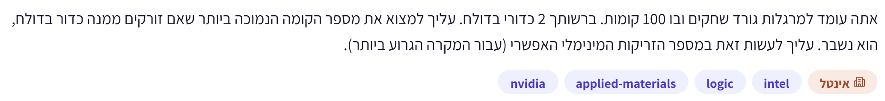

# PREP-025 — שני כדורי בדולח ו־100 קומות

## השאלה המקורית

אתה עומד למרגלות גורד שחקים ובו 100 קומות. ברשותך 2 כדורי בדולח. עליך למצוא את מספר הקומה הנמוכה ביותר שאם זורקים ממנה כדור בדולח, הוא נשבר. עליך לעשות זאת במספר הזריקות המינימלי האפשרי (עבור המקרה הגרוע ביותר).

## קטגוריות וחברות

תגית מקור: logic. סיווג נוסף: ניתוח מקרה גרוע, חיפוש סף, minimax, מספרים משולשיים ותכנון דינמי. חברות לפי המקור: NVIDIA, Applied Materials, Intel. תווית ראשית: אינטל. השיוך לא אומת עצמאית.

## רלוונטיות להכנה

עדיפות בינונית: תרגול ניסויים במשאבים מוגבלים ומקרה גרוע; הערכת הכנה, לא תחזית לראיון.

## שלושה רמזים מדורגים

1. מה משתנה אחרי שהכדור הראשון נשבר? עם כדור אחד בלבד, איך תוכל לבדוק טווח קומות בלי להסתכן בכך שתאבד את היכולת למצוא את הקומה המדויקת?

2. אם תקפוץ כל פעם באותו מספר קומות, מה יקרה למספר הזריקות הכולל כשהכדור הראשון יישבר מאוחר? איך כדאי לשנות את גודל הקפיצות כדי לפצות על הזריקות שכבר נוצלו?

3. נניח שמותרות לכל היותר k זריקות. אם הכדור הראשון נשבר בבדיקה הראשונה, נשארות k−1 בדיקות לכדור השני. ואם הוא נשבר בבדיקה השנייה, נשארות k−2. נסה לבנות קפיצות הולכות וקטנות ולסכם כמה קומות אפשר לכסות.

## הצעה לפתרון

**התשובה: 14 זריקות במקרה הגרוע.** נניח ששני הכדורים זהים, שקיימת התנהגות מונוטונית ודטרמיניסטית: כדור נשבר החל מקומה F ומעלה, ומתחתיה אינו נשבר; כדור שלא נשבר ניתן לשימוש חוזר. קומה 0 בטוחה. המקור משתמע כמבטיח קומה שוברת בטווח 1..100; הפתרון שלהלן מטפל גם במקרה שבו אין קומה כזאת, באמצעות ערך F=101.

**למה חיפוש בינארי רגיל אינו מתאים?** אם הכדור הראשון נשבר בקומה 50, נשאר כדור אחד לטווח שמתחת ל־50. כדי להיות בטוחים בזיהוי הקומה המדויקת, צריך לבדוק מלמטה למעלה: דילוג עם הכדור האחרון עלול לשבור אותו ולהשאיר כמה קומות שלא ניתן להבחין ביניהן.

**האסטרטגיה:** זורקים את הכדור הראשון בקומות 14, 27, 39, 50, 60, 69, 77, 84, 90, 95, 99, 100, כל עוד הוא לא נשבר. הקפיצות המתוכננות הן 14,13,12,11,...; בסוף מקטינים את הקפיצה כדי לא לעבור את קומה 100. כשהכדור הראשון נשבר, לוקחים את השני ומתחילים קומה אחת מעל הקומה האחרונה שכבר נבדקה ונמצאה בטוחה. עולים קומה־קומה, עד שהכדור השני נשבר או שמגיעים לקומה שלפני זו שכבר ידוע ששברה את הכדור הראשון. אין לזרוק שוב מהקומה שכבר ידוע ששוברת.

**למה דווקא מקטינים את הקפיצה?** כל זריקה נוספת של הכדור הראשון צורכת חלק מהתקציב, ולכן צריך להשאיר פחות קומות לבדיקה עם הכדור השני. אם רוצים לכל היותר k זריקות:
* בבדיקה הראשונה מותר להיבחן בקומה k: אם נשבר, נשארות k−1 קומות לבדיקה ו־k−1 זריקות.
* אחרי הישרדות, בבדיקה השנייה מותר להתקדם לכל היותר k−1 קומות: אם נשבר, נשארו k−2 קומות לא ידועות בין שתי הבדיקות ו־k−2 זריקות.
* כך הלאה: המרווחים המקסימליים הם k,k−1,...,1.

דוגמאות: אם נשבר ב־14, משתמשים בכדור השני בקומות 1..13: לכל היותר 1+13=14 זריקות. אם שרד ב־14 ונשבר ב־27, בודקים 15..26: לכל היותר 2+12=14. אם נשבר ב־39 אחרי שתי הישרדות, בודקים 28..38: לכל היותר 3+11=14. אם הכדור השני נשבר מוקדם, עוצרים מוקדם. אם כל הקומות הפנימיות בטוחות, הקומה ששברה את הכדור הראשון היא התשובה, ואין צורך בזריקה נוספת.

**הוכחת מינימום:** עם כדור אחד ו־t זריקות אפשר לבדוק לכל היותר t קומות לא ידועות. לכן עם שני כדורים ו־k זריקות אפשר לכסות לכל היותר k+(k−1)+...+1=k(k+1)/2 קומות. באורח פורמלי, נסמן C(e,k) כמספר הקומות המקסימלי עם e כדורים ו־k זריקות: הזריקה הראשונה מחלקת לענף שבירה עם e−1 כדורים ולענף הישרדות עם e כדורים, ולכן C(e,k)=C(e−1,k−1)+1+C(e,k−1), עם C(1,k)=k ו־C(e,0)=0. מכאן C(2,k)=k(k+1)/2. עבור 13 זריקות הכיסוי 91 בלבד; עבור 14 הוא 105, מספיק ל־100. לכן 14 הוא מינימום, והאסטרטגיה משיגה אותו.

אם מניחים מראש שקומה 100 שוברת בוודאות, יש 100 ערכי סף אפשריים ולא 101. עדיין 13 זריקות אינן מספיקות: עץ אסטרטגיה עם שני כדורים ו־k זריקות יכול להבחין לכל היותר ב־1+k(k+1)/2 ערכי סף, ולכן 13 מאפשרות לכל היותר 92 אפשרויות <100. כך מסקנת המינימום אינה תלויה באפשרות ״אין שבירה״; ההבחנה הזו מונעת שגיאת off-by-one בהוכחה.

**הכללה:** עבור N קומות כשמותר גם שאין שבירה, מספר הזריקות המינימלי הוא המספר השלם הקטן ביותר k שעבורו k(k+1)/2≥N, כלומר ceil((sqrt(1+8N)−1)/2). בקוד נוח לחשב בסכום שלמים כדי להימנע מעיגול float. זו אופטימליות של מספר ניסויים פיזיים במקרה הגרוע, לא של תוחלת בהנחת הסתברות כלשהי. חישוב האסטרטגיה שונה ממספר הזריקות.

**בדיקה:** סימולציה לכל סף אפשרי, כולל ללא שבירה, לכל N=0..200; התוצאה הושוותה לתכנון דינמי minimax עצמאי. נבדק שאין שימוש חוזר בכדור שבור, שאין חריגה מהבניין, שהסף מוחזר בדיוק ושמספר הזריקות המקסימלי שווה לאופטימום. עבור 100 קומות כל 101 האפשרויות נפתרות בעד 14 זריקות, ויש מקרים הדורשים 14. שמירת trace בקוד היא לצורך המחשה ובדיקה, ואינה דרישה של האסטרטגיה.

[קוד הסימולציה](../solutions/prep_025_two_crystal_balls.py) · [בדיקות](../checks/check_prep_025.py)

## תשובה לראיון

המינימום הוא 14. אבדוק עם הכדור הראשון בקפיצות 14,13,12,... קומות; אחרי שבירה אסרוק עם השני מהקומה הבטוחה האחרונה ומעלה. כך הזריקות שכבר נוצלו והסריקה שנותרה מסתכמות בעד 14. 13 זריקות מכסות רק 91 קומות, ו־14 מכסות 105, ולכן 14 מספיק וגם הכרחי.

## English

You stand at a 100-floor skyscraper with two crystal balls. Find the lowest floor from which a dropped ball breaks, using the minimum possible number of drops in the worst case.

Hint 1: After the first ball breaks, how can the remaining ball search an interval without losing the ability to identify the exact threshold?

Hint 2: With equal floor gaps, late breakage increases total drops already spent. How could you adjust later gaps to compensate?

Hint 3: Suppose the worst-case budget is k drops. Breakage on the first drop leaves k-1 tests, and on the second leaves k-2. Try decreasing gaps and sum the covered floors.

Answer: 14 drops in the worst case. Assume identical reusable-until-broken balls, deterministic monotone breakage at threshold F, ground level 0 safe. The source implies a threshold within 1..100; the construction also handles no breakage, represented by F=101.

Drop the first ball at floors 14,27,39,50,60,69,77,84,90,95,99,100 until it breaks. Intended gaps decrease as 14,13,12,...; cap the final floor at 100. After a break, scan with the second ball from one above the last known-safe floor to one below the known-breaking floor. Stop at its first break; if all interior floors survive, infer the already-known upper threshold without retesting it. A break at 14 costs at most 1+13=14 drops; at 27, at most 2+12=14; at 39, at most 3+11=14. Binary search is inappropriate after a break because only one ball remains.

Optimality: with one ball and t drops, cover at most t unknown floors. General coverage recurrence C(e,k)=C(e-1,k-1)+1+C(e,k-1) yields C(2,k)=k(k+1)/2. Thirteen drops cover only 91 floors, fourteen cover 105. Equivalently, the number of distinguishable threshold cases is at most 1+k(k+1)/2. Even if floor 100 is guaranteed breaking, 13 drops distinguish at most 92 cases, fewer than the 100 possibilities, so 14 remains necessary. The strategy attains this bound.

For N floors with a possible no-break case, minimum k is the least integer satisfying k(k+1)/2>=N, or ceil((sqrt(1+8N)-1)/2). Integer accumulation avoids floating-point rounding. The objective is worst-case physical drops, not expected drops under a prior distribution or minimum CPU time. All thresholds for N=0..200 were simulated and compared with independent minimax DP, validating exact answers, legal floors, no broken-ball reuse and attained worst-case bounds. Trace storage is only for teaching/testing.

התוכן נוצר בסיוע AI וממתין לסקירה; טרם פורסם באתר.

### איך מספר הכדורים משנה את התשובה?

עבור אותו בניין של 100 קומות, מספר הזריקות המינימלי במקרה הגרוע הוא:

| מספר כדורים | מותר שלא תהיה קומה שוברת | מובטח שיש קומה שוברת ב־1..100 |
|---|---|---|
| 1 | 100 | 99 |
| 2 | 14 | 14 |
| 3 | 9 | 9 |
| 4 | 8 | 8 |
| 5 ומעלה | 7 | 7 |

ההבדל בכדור אחד: אם מובטח שיש קומה שוברת וקומות 1..99 שרדו, אפשר להסיק ש־100 היא הסף בלי לזרוק ממנה. אם ייתכן שאף קומה לא שוברת, חייבים לבדוק גם אותה כדי להבחין בין F=100 ל־F=101. תוצאות 2 כדורים ומעלה בטבלה אינן משתנות. האמירה ״מובטח שיש סף״ יחד עם מונוטוניות שקולה לידיעה שקומה 100 שוברת.

**האינטואיציה:** עם שני כדורים, השבירה הראשונה משאירה כדור אחד ומחייבת סריקה קומה־קומה. עם שלושה כדורים, השבירה הראשונה משאירה שניים, ואפשר להשתמש באסטרטגיית שני הכדורים בטווח שמתחת. לכן מותר להעז ולקפוץ רחוק יותר בהתחלה. לדוגמה, עם שלושה כדורים ותקציב תשע זריקות, אפשר להתחיל בקומה 37: אם נשבר נשארו 36 קומות, שני כדורים ושמונה זריקות, המספיקות כי 8+7+...+1=36. אם שרד, נשארו 63 קומות, שלושה כדורים ושמונה זריקות — מספיק, כי הכיסוי שלהן הוא 8+28+56=92. זו אסטרטגיה תקפה, לא בחירה יחידה לקומה הראשונה. ככל שנשארים יותר כדורים אחרי שבירה, אפשר לבדוק טווח גדול יותר במשאבים שנותרו.

**הכלל המדויק:** C(b,t) הוא מספר הקומות הלא־ידועות המרבי שאפשר לבדוק עם b כדורים ועד t זריקות, כולל יכולת להבחין במקרה שבו אין שבירה. בזריקה הבאה:
* אם נשבר, נשארים b−1 כדורים ו־t−1 זריקות לטווח התחתון.
* אם שרד, נשארים b כדורים ו־t−1 זריקות לטווח העליון.
* הקומה שנבדקה תורמת עוד 1.

לכן C(b,t)=C(b−1,t−1)+1+C(b,t−1), עם C(0,t)=C(b,0)=0. הפתרון הוא C(b,t)=Σ C(t,j), j=1..min(b,t), כאשר C(t,j) בסכום הוא המקדם הבינומי, לא אותה פונקציית כיסוי. כדי להימנע מערבוב סימונים, אפשר לכתוב את המקדם binom(t,j).

בחירת t המינימלי שעבורו C(b,t)≥100 נותנת את הטבלה במודל שבו אין הבטחת שבירה. אם ידוע שקומה 100 שוברת, יש רק 99 קומות לא ידועות ומספיק C(b,t)≥99. לשלושה כדורים: C(3,8)=92 לעומת C(3,9)=129, ולכן תשע זריקות. לארבעה: C(4,7)=98 לעומת C(4,8)=162, לכן שמונה. לחמישה: C(5,6)=62 לעומת C(5,7)=119, לכן שבע.

לא יורדים משבע גם עם הרבה כדורים: כל זריקה נותנת שתי תוצאות בלבד. שש זריקות מבחינות לכל היותר ב־2^6=64 אפשרויות, פחות מ־100 ערכי סף (או 101 כשמותר ללא שבירה). חשוב: ״חמישה כדורים מספיקים לשבע״ לא אומר שחיפוש בינארי רגיל שרירותי תמיד ישמור על תקציב חמישה כדורים. צריך לבחור קומות לפי כיסוי שני הענפים. עם מלאי כדורים מספיק גם חיפוש בינארי רגיל משיג את חסם שבע הזריקות.

קוד כללי נשמר ב־solutions/prep_025_multiple_balls.py. הוא בוחר בכל מצב קומה מעל הקומה הבטוחה האחרונה לפי C(b−1,t−1)+1, תוך חיתוך לטווח הנוכחי. נבדקו כל 606 תרחישי הסף לבניין 100 קומות עם 1..6 כדורים, והאופטימום הושווה בנפרד לתכנון דינמי minimax לכל 0..150 קומות ו־1..6 כדורים. נבדקו גם נוסחת הכיסוי וההבדל בין קומה עליונה ידועה לשוברת לבין מקרה ללא הבטחה.

[קוד כללי](../solutions/prep_025_multiple_balls.py) · [בדיקת האופטימום](../checks/check_prep_025_multiple.py)

For 100 floors, optimal worst-case drop counts by ball count are: one ->100 (99 if floor 100 is known breaking); two ->14; three ->9; four ->8; five or more ->7. Guaranteed existence of a breaking floor plus monotonicity means the top floor is known breaking, leaving 99 unknown floors. Without that guarantee there are 101 threshold cases and 100 unknown floors.

The extra ball matters after breakage: three balls leave two, enabling interval jumps instead of a one-ball linear scan. With three balls and nine drops one valid first floor is 37. Breakage leaves 36 lower floors, two balls and eight drops (capacity 36); survival leaves 63 upper floors, three balls and eight drops (capacity 92).

Coverage C(b,t)=C(b-1,t-1)+1+C(b,t-1), with zero balls or zero drops giving zero coverage. Equivalently C(b,t)=sum binom(t,j), j=1..min(b,t). Seek minimum t with coverage >=100, or >=99 for a known-breaking top. C(3,8)=92,C(3,9)=129; C(4,7)=98,C(4,8)=162; C(5,6)=62,C(5,7)=119. Six binary-result drops distinguish at most 64 outcomes, less than 100 or 101 threshold possibilities; hence seven is a lower bound regardless of additional balls. Five balls suffice with a capacity-aware strategy, not necessarily an arbitrary balanced binary-search tree constrained to five balls.

Verified 606 complete 100-floor threshold scenarios for 1..6 balls and independent minimax DP for 0..150 floors with 1..6 balls, plus recurrence and guaranteed-top conventions. Code and checks linked in the extension.
