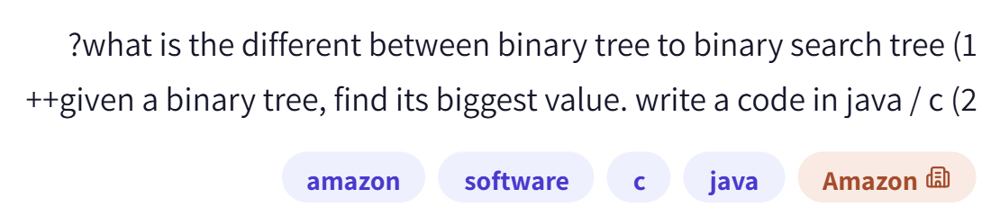

# PREP-026 — עץ בינארי מול BST ומציאת מקסימום

## השאלה המקורית

1) what is the different between binary tree to binary search tree?
2) given a binary tree, find its biggest value. write a code in java / c++

1. מה ההבדל בין עץ בינארי לעץ חיפוש בינארי?
2. בהינתן עץ בינארי, מצא את הערך הגדול ביותר בו. כתוב קוד ב־Java או C++.



## קטגוריות וחברות

תגיות מקור software,c,java; בנוסח עצמו C++ ולכן נשמר גם cpp כסיווג נוסף. עצים בינאריים, BST, DFS וסיבוכיות. חברה לפי המקור: Amazon; תווית Amazon. השיוך לא אומת עצמאית.

## תעדוף לראיון

עדיפות נמוכה יחסית בזמן הכנה קצר. כדאי להכיר את העקרונות בחזרה של 5–10 דקות אם מתאפשר, ולא לפתוח עכשיו לימוד עצים מעמיק או Java. עדיפות לתרגול Python, תכנון בדיקות ודיבוג, יסודות רשתות ולוגיקה רלוונטית לפי המשרה שסופקה. אין להניח שהמראיין יודע או לא יודע על קורס מסוים, ואין בכך הבטחה שלא תופיע שאלת קוד. גם [משרת ולידציה קשורה באתר הרשמי של Marvell](https://marvell.wd1.myworkdayjobs.com/en-US/MarvellCareers/job/Hardware-Design-Intern_2502459) מזכירה Python/C++ ואוטומציה; זה מקור הקשר בלבד, לא המשרה המדויקת או מידע על שאלות הראיון.

## שלושה רמזים מדורגים

1. הפרד בין מגבלה על מספר הילדים של צומת לבין כלל שמסדר את הערכים בעץ. האם עץ בינארי רגיל מבטיח משהו על מיקום הערך הגדול?

2. בסעיף השני כתוב עץ בינארי, ולא בהכרח עץ חיפוש. האם אפשר לפסול תת־עץ בלי לבדוק את הערכים שבתוכו? חשוב על מעבר שמבקר בכל צומת.

3. במהלך המעבר שמור את הערך הגדול ביותר שנראה עד עכשיו. אתחל מערך קיים בעץ ולא מאפס, וחשוב מה מחזירים כשהעץ ריק ואיך מנהלים את הצמתים שעוד צריך לבקר.

## הצעה לפתרון

**סעיף 1 — ההבדל:** עץ בינארי הוא עץ שבו לכל צומת לכל היותר שני ילדים, לרוב מסומנים שמאל וימין. אין דרישה שהערכים מסודרים. עץ חיפוש בינארי (BST) הוא עץ בינארי עם אינווריאנט סדר: בהנחת מפתחות ייחודיים, כל הערכים בכל תת־העץ השמאלי קטנים מערך הצומת וכל הערכים בכל תת־העץ הימני גדולים ממנו. הכלל חל על כל תת־העץ, לא רק על הילדים הישירים, וחל בכל צומת. אם מותרות כפילויות צריך לקבוע מדיניות; במימוש מקובל אפשר למשל לשמור מונה באותו צומת. BST אינו בהכרח עץ מאוזן.

**סעיף 2:** נתון עץ בינארי כללי, לכן אין הצדקה ללכת רק ימינה. לדוגמה שורש 3, ילד שמאלי 99 וילד ימני 4: המקסימום דווקא משמאל. צריך לבקר בכל הצמתים ולשמור מקסימום. מימוש DFS איטרטיבי משתמש במחסנית: מכניסים שורש, מוציאים צומת, מעדכנים מקסימום ומכניסים ילדים קיימים; ממשיכים עד שהמחסנית מתרוקנת. סדר שמאל/ימין אינו משנה את המקסימום.

**הנחות ומקרי קצה:** עץ סופי תקין ללא מעגלים, ערכים שלמים בני השוואה, ולא גרף עם שיתוף צמתים. לעץ ריק אין מקסימום; נחזיר optional ריק במקום מספר שעלול להיות ערך חוקי. בעץ לא ריק מאתחלים best לערך השורש, לא ל־0, כדי לטפל בעץ שכל ערכיו שליליים וגם ב־INT_MIN. כפילויות אינן מפריעות למציאת המקסימום. מחסנית מפורשת חוסכת את מגבלת עומק מחסנית הקריאות ברקורסיה, אך עדיין צורכת זיכרון.

**נכונות:** אחרי כל ביקור best הוא המקסימום בין כל הצמתים שבוקרו. כל ילד קיים מוכנס פעם אחת, וכל צומת בעץ נגיש מהשורש. עם סיום המעבר כולם בוקרו, לכן best הוא המקסימום בכל העץ. בעץ כללי ללא מידע נוסף, אם אלגוריתם לא קורא ערך של צומת כלשהו, ניתן לשנות אותו לערך גדול מכל האחרים מבלי לשנות את מה שהאלגוריתם ראה. לכן נדרשות Ω(n) קריאות במקרה הגרוע, והמעבר Θ(n) מיטבי בזמן. זיכרון מחסנית DFS הוא O(h) כחסם עליון, כאשר h גובה העץ, ובמקרה הגרוע O(n). אין כאן הוכחת מינימום זיכרון מוחלט; קיימות שיטות שעוברות דרך שינוי זמני של קישורים, שאינן נדרשות כאן.

**אם במקום זאת היה נתון BST:** המקסימום הוא הצומת הימני ביותר. מתחילים בשורש וממשיכים לילד ימני עד שאין כזה. זה O(h) זמן ו־O(1) זיכרון עזר באיטרציה. בעץ מאוזן h=O(log n), אבל ב־BST מנוון h=O(n); אין להבטיח O(log n) בלי איזון.

נשמרו קוד C++17 עם std::optional<int>, קוד Java עם OptionalInt ו־ArrayDeque, ומודל Python שנבדק. לא נמצאו g++, clang++ או javac ב־PATH בעת ההכנה: קוד C++ ו־Java לא קומפל ולא הורץ. מודל Python המקביל נבדק על כל צורות העצים בגודל 0..5 עם ערכים −1,0,1 (11,497 עצים מסומנים), דוגמאות שליליות ולא־BST, גבולות int ועץ בעומק 3,000. בדיקות המודל אינן תחליף לקומפילציה של המקורות האחרים.

```cpp
// C++17. General binary tree: no BST ordering is assumed.
#include <optional>
#include <vector>

struct Node {
    int value;
    const Node* left = nullptr;
    const Node* right = nullptr;
};

std::optional<int> maximum(const Node* root) {
    if (root == nullptr) return std::nullopt;
    int best = root->value;
    std::vector<const Node*> pending{root};
    while (!pending.empty()) {
        const Node* node = pending.back();
        pending.pop_back();
        if (node->value > best) best = node->value;
        if (node->right) pending.push_back(node->right);
        if (node->left) pending.push_back(node->left);
    }
    return best;
}
```

```java
import java.util.ArrayDeque;
import java.util.Deque;
import java.util.OptionalInt;

public final class Prep026TreeMax {
    static final class Node {
        final int value;
        Node left;
        Node right;
        Node(int value) { this.value = value; }
    }

    public static OptionalInt maximum(Node root) {
        if (root == null) return OptionalInt.empty();
        int best = root.value;
        Deque<Node> pending = new ArrayDeque<>();
        pending.push(root);
        while (!pending.isEmpty()) {
            Node node = pending.pop();
            best = Math.max(best, node.value);
            if (node.right != null) pending.push(node.right);
            if (node.left != null) pending.push(node.left);
        }
        return OptionalInt.of(best);
    }
}
```

[בדיקת מודל Python](../checks/check_prep_026.py) — Java ו־C++ לא קומפלו או הורצו.

## English

Hint 1: Distinguish the limit on children per node from an ordering rule on values. Does an ordinary binary tree constrain where its largest value lies?

Hint 2: Part two says binary tree, not necessarily BST. Can you discard a subtree without examining it? Consider visiting every node.

Hint 3: Track the largest visited value, initialized from an actual node rather than zero. Specify empty-tree behavior and how to keep unvisited nodes.

A binary tree has at most two children per node, with no value-order guarantee. A BST additionally maintains a global subtree ordering: with unique keys, every key in the left subtree is smaller than the node and every key in the right subtree is larger, recursively. State a duplicate-key policy if needed. BST does not imply balanced.

For the general binary tree in part two, traverse every node and track the maximum, initializing from the root rather than zero. An iterative DFS stack avoids recursion-depth limits. Return an empty optional for an empty tree, not an ambiguous sentinel. Assume a finite proper acyclic tree with comparable integer values. Non-BST counterexample: root 3, left 99, right 4; rightmost is not the maximum. Negative-only trees and INT_MIN are handled by root initialization.

The invariant is that best equals the maximum of visited nodes. Traversal reaches every node once, so at termination it is the maximum. Time Θ(n) is optimal for unrestricted unaugmented binary trees: an unseen node could contain a larger value. Explicit DFS stack has O(h) auxiliary-space upper bound, O(n) worst case. No globally optimal-space claim is made. For a BST only, walk right to the rightmost node: O(h) time and O(1) iterative space, O(log n) time only if balanced.

Stored C++17 optional/vector and Java OptionalInt/ArrayDeque implementations were reviewed but not compiled or run: g++, clang++ and javac were not found on PATH. A Python reference was checked on all 11497 labelled binary trees of sizes 0..5 with labels -1,0,1, plus non-BST, all-negative, int-boundary and depth-3000 cases. Reference tests do not establish compiled-language execution.

התוכן נוצר בסיוע AI וממתין לסקירה; טרם פורסם באתר.
