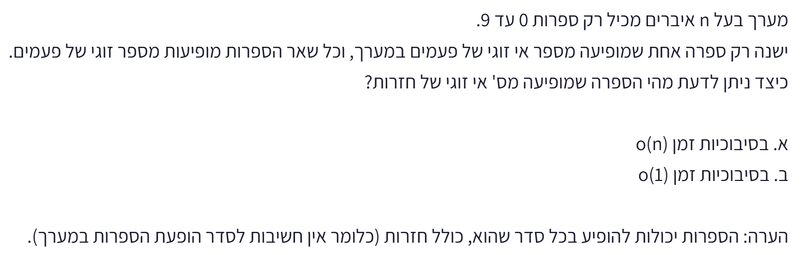

# PREP-027 — הספרה בעלת מספר ההופעות האי־זוגי

## השאלה המקורית

מערך בעל n איברים מכיל רק ספרות 0 עד 9.
ישנה רק ספרה אחת שמופיעה מספר אי זוגי של פעמים במערך, וכל שאר הספרות מופיעות מספר זוגי של פעמים.
כיצד ניתן לדעת מהי הספרה שמופיעה מס׳ אי זוגי של חזרות?
א. בסיבוכיות זמן o(n)
ב. בסיבוכיות זמן o(1)
הערה: הספרות יכולות להופיע בכל סדר שהוא, כולל חזרות (כלומר אין חשיבות לסדר הופעת הספרות במערך).



## קטגוריות וחברות

אין תגיות נושא או חברות בתמונה. הסיווג שלנו: תוכנה, מערכים, XOR, זוגיות, פעולות ביטיות וסיבוכיות. אין להסיק שיוך לחברה מהמשרה שלקראתה מתכוננים.

## רלוונטיות להכנה

עדיפות גבוהה לתרגול קצר של 10–15 דקות: יסודות קוד וביטים ובדיקת דרישות. זו הערכת הכנה לפי תיאור התפקיד שסופק, לא תחזית לשאלות הראיון.

## שלושה רמזים מדורגים

1. נסה להתחיל מספירת הופעות: יש רק עשר ספרות אפשריות. איזה מידע על מספר ההופעות של כל ספרה באמת חשוב לשאלה?

2. חפש פעולה על ביטים שבה שילוב של מספר עם עצמו מבטל אותו, ושינוי סדר השילוב אינו משנה את התוצאה. מה יישאר אחרי שכל הזוגות יתבטלו?

3. שים לב שבסעיף ב׳ כתוב זמן קבוע, לא זיכרון קבוע. האם אפשר להבטיח תשובה נכונה בלי לקרוא תא כלשהו במערך? נסה לשנות רק את התא שלא נקרא, תוך שמירה על ההבטחה של השאלה.

## הצעה לפתרון

**קריאת הנוסח:** בצילום מופיע o קטן. לפי ההקשר נפרש את הבקשה כ־O(n) ו־O(1) במובן המקובל בשאלות ראיון, אך נשמור את המקור. אם הכוונה באמת ל־little-o(n), אז גם סעיף א בלתי אפשרי במודל מערך רגיל, בגלל חסם Ω(n). o(1) בזמן בדיד הוא דרישה חזקה אף יותר ואינו הפתרון המקובל. הסעיף השני מציין במפורש סיבוכיות זמן ולא מקום — אין להחליף את הדרישה בשקט.

**סעיף א — זמן Θ(n), מקום עזר O(1):** מבצעים XOR של כל איברי המערך, עם מצבר התחלתי 0. התכונות: x XOR x=0, x XOR 0=x, והפעולה אסוציאטיבית וקומוטטיבית. כל ספרה שמופיעה מספר זוגי של פעמים מתבטלת בזוגות. הספרה שמופיעה מספר אי־זוגי של פעמים משאירה עותק אחד, וזה הפלט. אין צורך שהזוגות יהיו צמודים או שהמערך יהיה ממוין. בפייתון:

```python
def odd_digit(values):
    result = 0
    for value in values:
        result ^= value
    return result
```

הסימן ^ הוא XOR ביטי, ו־result ^= value שקול ל־result = result ^ value. ^ אינו חזקה בפייתון. לדוגמה [2,7,2,4,7] מחזיר 4. גם הספרה 0 יכולה להיות התשובה: [0,6,6] מחזיר 0, ואין לפרש זאת כ״לא נמצא״. מספר ההופעות האי־זוגי יכול להיות 3,5,... ולא רק פעם אחת.

חלופה פשוטה: מערך של עשרה מונים או עשרה דגלי זוגיות. סורקים את הקלט, מעדכנים לפי הספרה ובסוף עוברים על עשר הספרות. זמן Θ(n)+O(10)=Θ(n), מקום O(10)=O(1) במודל מילות מכונה. עשרה דגלי זוגיות אינם גדלים עם n; מונים מדויקים דורשים O(log n) ביטים כל אחד אם מודדים ברמת ביטים. XOR משתמש במצבר בגודל קבוע כי כל הקלטים בני ארבעה ביטים. קוד odd_digit_checked עם מונים בודק גם תקינות תחום והבטחת יחידות, בניגוד לגרסת XOR המניחה את ההבטחה.

**סעיף ב — O(1) זמן אינו אפשרי לנתונים כפי שנמסרו.** העובדה שיש רק עשרה ערכים אפשריים אינה מבטלת את הצורך לקרוא n מקומות. הוכחה: קח n אי־זוגי ומערך שכולו אפסים. זהו קלט חוקי, והתשובה 0. נניח שהאלגוריתם לא קרא תא כלשהו. שנה רק אותו מ־0 ל־1. כעת יש n−1 אפסים (מספר זוגי) ו־1 אחד (אי־זוגי), ולכן גם זה קלט חוקי אבל התשובה 1. בכל התאים שהאלגוריתם קרא הערכים זהים, ולכן הוא לא יכול להבחין בין המקרים. מכאן שעל מסלול הקלט שכולו אפסים הוא חייב לקרוא את כל n התאים, אפילו אם הבחירה בתאים אדפטיבית. זה חסם Ω(n) בזמן תחת גישה לתא בודד בזמן קבוע. יחד עם XOR נקבל זמן מיטבי Θ(n).

יש להבחין בין זמן למקום: הפתרון הוא O(n) בזמן ו־O(1) במקום עזר. ייתכן שכוונת מחבר סעיף ב הייתה מקום קבוע, או בדיקה של היכולת לזהות דרישה בלתי אפשרית; אין דרך לדעת מהצילום ואין להציג השערה כעובדה. אם ניתן XOR מצטבר מראש, קריאת הסיכום היא O(1), אך בנייתו צורכת Θ(n) קריאות; זה מידע נוסף שאינו נתון. עיבוד מקבילי בחומרה עם כמות שערים הגדלה עם n הוא מודל שונה ואינו מוכיח זמן O(1) בתוכנה.

**מקרי קצה:** תחת ההבטחה n חייב להיות אי־זוגי ולפחות 1, כי סכום תדירויות זוגיות ותדירות אי־זוגית הוא אי־זוגי. מערך ריק או באורך זוגי אינו קלט חוקי לפי ההבטחה. אורך אי־זוגי לבדו לא מספיק להבטיח ספרה יחידה בתדירות אי־זוגית: [1,2,3] אינו עומד בהבטחה. בלי ההבטחה XOR לבדו אינו מזהה שגיאה ויכול להחזיר ספרה שלא מהווה תשובה תקפה. מותר לקרוא את הקלט בלי לשנות אותו.

**בדיקות:** לכל המערכים באורכים 1,3,5,7 מעל הספרות 0..3 נבדקה ההבטחה מול ספירה עצמאית; מקרים חוקיים הושוו לשני המימושים ומקרים לא חוקיים נדחו על ידי המימוש הבודק. נבדקו גם כל 1000 שלשות הספרות 0..9, כל עשר אפשרויות הספרה האי־זוגית, קלטים לא תקינים ודוגמאות לזוג הקלטים שבהוכחת התא שלא נקרא. החסם התחתון הוא הוכחה כללית, לא מסקנה סטטיסטית מבדיקות.

[קוד](../solutions/prep_027_odd_digit.py) · [בדיקות](../checks/check_prep_027.py)

## תשובה לראיון

אעבור על המערך עם XOR מצטבר. זוגות מתבטלים והספרה בעלת מספר ההופעות האי־זוגי נשארת. זמן Θ(n) וזיכרון עזר O(1). סעיף ב כפי שנכתב, זמן O(1), אינו אפשרי בלי מידע נוסף: תא שלא נקרא יכול לשנות את התשובה גם תוך שמירה על ההבטחה.

## English

An array of n elements contains only digits 0 through 9. Exactly one digit occurs an odd number of times, and all other digits occur an even number of times. Find the odd-frequency digit: (a) in o(n) time; (b) in o(1) time. Digits can occur in any order with repetitions. The source uses lowercase o; the likely intended notation is big-O, discussed explicitly in the solution.

Hint 1: Start by counting occurrences: only ten possible digits exist. Which aspect of each frequency matters?

Hint 2: Find a bit operation where combining a value with itself cancels it and order does not matter. What remains after all pairs cancel?

Hint 3: Part (b) asks for constant time, not constant space. Could an unread array cell change the answer while preserving the promise?

The source prints lowercase o(n), o(1); likely intended as big-O interview notation, explicitly not silently corrected. Literal little-o(n) would also be impossible by the Ω(n) lower bound. Part (b) explicitly says time, not space.

Part (a): XOR all values starting from zero. Since x XOR x=0 and x XOR 0=x, and XOR is associative/commutative, all even-frequency digits cancel and the unique odd-frequency digit remains, regardless of ordering. Python uses ^= for XOR accumulation, not exponentiation. Example [2,7,2,4,7] returns 4; [0,6,6] returns 0. Odd frequency need not mean exactly once. Time Θ(n), constant auxiliary XOR state because values are digits. Ten frequency counters or ten parity flags are also linear-time/constant-word-space alternatives; exact counters grow in bit length, whereas parity flags do not. The checked implementation validates values and the promise; the XOR version assumes them.

Part (b), constant time, is impossible for an ordinary unsummarized array with constant-time single-cell access. For odd n, the all-zero array is valid with answer zero. If any cell remains unread, changing only that cell to one produces another valid input: n-1 zeroes and one one, answer one. All observations are identical, so any always-correct algorithm must inspect all n cells on this path, even with adaptive probing. Hence Ω(n), and the XOR solution is time-optimal. A constant alphabet limits state, not necessary input reads. Constant-space may have been intended or the impossibility may be deliberate; neither speculation is established by the source. A precomputed XOR summary supports constant-time lookup but requires linear preprocessing and additional input assumptions. Parallel hardware is a different model.

Valid input length is odd and positive, although odd length alone does not establish the promise (e.g. [1,2,3]). Without the promise XOR does not validate its own result. All arrays of lengths 1,3,5,7 over digits 0..3 were checked against independent counts, plus all 1000 triples of digits 0..9, all ten target digits, invalid inputs and unread-cell witness examples. The lower bound is mathematical, not inferred from the tests.

התוכן נוצר בסיוע AI וממתין לסקירה; טרם פורסם באתר.


### XOR TREE לעומת הלולאה, והאם סכום המערך מספיק?

הקוד עם מצבר XOR הוא צבירה סדרתית, לא עץ מאוזן: result מתעדכן פעם אחת לכל איבר, ולכן זמן הריצה O(n). מאחר ש־XOR אסוציאטיבי, אפשר לארגן את החישוב כעץ מאוזן. לדוגמה, לשמונה איברים: ארבע פעולות XOR בזוגות בשכבה הראשונה, שתי פעולות בשנייה ואחת בשלישית. זה שלוש שכבות, אבל 4+2+1=7 פעולות בסך הכול. בחישוב סדרתי גם עץ כזה דורש Θ(n) עבודה/זמן. בחומרה עם מספיק יחידות מקבילות עומק העץ הוא ceil(log2 n) ושיעור החומרה הוא n−1 רכיבי XOR וקטוריים, או ארבעה שערים ביטיים לכל רכיב עבור ספרות המקודדות בארבעה ביטים; זו ספירת מימוש, לא הוכחת מינימום של כל הפונקציה תחת הבטחת הקלט. במודל מעבדים מקבילי עם מספיק משאבים אפשר לקבל O(log n) עומק חישוב, אך זה מודל שונה מהלולאה ומשאלת הזמן הסדרתית. טעינה סדרתית של הקלט עדיין דורשת O(n) קריאות. אין סתירה לחסם Ω(n) על סך התאים שצריך לקרוא; עומק מקבילי שונה מסך העבודה.

סכום רגיל של הערכים אינו מספיק למציאת הספרה האי־זוגית. שני קלטים חוקיים באותו אורך נותנים אותו סכום ותשובות שונות:
[1,2,2] — סכום 5, הספרה האי־זוגית 1;
[3,1,1] — סכום 5, הספרה האי־זוגית 3.
לכן שום חישוב שמקבל רק את הסכום (ואפילו גם את n) אינו יכול להבחין בין שני הקלטים. מבחינת הסיבוכיות, סריקת סכום היא O(n) זמן ו־O(1) משתנים במודל מילות מכונה, אבל האלגוריתם אינו נכון.

אם ״שארית מחלוקה ב־2״ היא sum % 2, התוצאה היא רק 0 או 1 והכפלה ב־2 נותנת רק 0 או 2. אם הכוונה לחלק השברי של sum/2 ואז הכפלה ב־2, מתקבלת רק 0 או 1. אף פירוש אינו מחזיר ספרה כללית 0..9. הסכום מודולו 2 אכן מגלה אם הספרה המבוקשת זוגית או אי־זוגית: כל ספרה בתדירות זוגית תורמת סכום זוגי, והספרה בתדירות אי־זוגית קובעת את הזוגיות. אבל הוא אינו מגלה איזו ספרה זו. XOR מבטל כל זוג ערכים זהים כערכים ביטיים שלמים, ולכן שומר את כל ביטי הספרה הנותרת ולא רק את הזוגיות שלה.

הזיכרון של מצבר יחיד נקרא O(1) זיכרון עזר, גם ללא מערך נוסף. עבור סכום בגודל בלתי מוגבל נדרשים יותר ביטים כש־n גדל; במודל המקובל מונים מילים/משתנים. הדוגמה הנגדית נבדקה מול המימוש שנשמר; סכומי הקלטים שווים ותשובות ה־XOR שונות.


The accumulator loop is serial O(n), not a balanced XOR tree. Associativity permits a balanced tree: eight operands require layers of 4,2,1 operations, depth 3 but total work 7. In general n-1 pairwise operations and ceil(log2 n) depth. Sequential evaluation is Θ(n); sufficiently parallel hardware/processors achieve O(log n) reduction depth with growing resources, a different model. Digits need four-bit XOR units. Sequential input loading still costs linear reads; the total-read lower bound does not forbid logarithmic parallel depth.

Ordinary sum loses required information. Valid equal-length inputs [1,2,2] and [3,1,1] both sum to 5 but have answers 1 and 3, so no function of only sum and length can solve the problem. (sum % 2)*2 yields only 0 or 2; multiplying the fractional part of sum/2 by 2 yields only 0 or 1. Sum parity reveals target parity, not its identity. XOR cancels equal values across all bit positions. Sum scanning has the proposed linear time and constant word-variable count, but is incorrect; one accumulator is O(1) auxiliary space, not zero memory. Exact unbounded sums grow in bit length. Counterexamples checked against saved XOR implementation.
