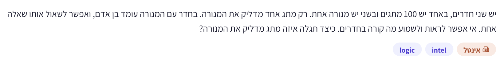

# PREP-028 — 100 מתגים ושאלה אחת

## השאלה המקורית

יש שני חדרים, באחד יש 100 מתגים ובשני יש מנורה אחת. רק מתג אחד מדליק את המנורה. בחדר עם המנורה עומד בן אדם, ואפשר לשאול אותו שאלה אחת. אי אפשר לראות ולשמוע מה קורה בחדרים. כיצד תגלה איזה מתג מדליק את המנורה?

## קטגוריות וחברות

תגית מקור: logic. סיווג נוסף: קידוד מידע, ייצוג בינארי, תכנון ניסוי ובירור הנחות. חברה ותווית לפי המקור: Intel/אינטל; השיוך לא אומת עצמאית.

## רלוונטיות להכנה

עדיפות נמוכה בזמן מוגבל: חידת העשרה על הנחות וכמות מידע. הערכת הכנה בלבד, לא תחזית לראיון.

## שלושה רמזים מדורגים

1. האם שאלה אחת חייבת לקבל תשובה של כן או לא? חשוֹב איזה מידע האדם שבחדר יכול למסור בתשובה אחת.

2. האדם יכול אולי לצפות במה שקרה למנורה לאורך זמן, ולא רק במצב שלה ברגע האחרון. איך תוכל לתת לכל מתג התנהגות מזוהה משלו?

3. מספר את המתגים. נסה להפעיל כל מתג מספר פעמים שונה, ובדוק איזה מספר יחיד האדם יכול למסור בסוף כדי לזהות את המתג.

## הצעה לפתרון

**הנחות שבלעדיהן השאלה אינה מוגדרת היטב:** מותר להפעיל את המתגים מספר פעמים; לכל מתג מצב ON/OFF ידוע וניתן להתחיל כשכולם OFF; המתג היחיד השולט מתנהג באופן רגיל (ON מדליק ו־OFF מכבה), ללא תקלות. האדם ליד המנורה מסוגל לראות אותה לאורך הניסוי, סופר או מתעד לפי פרוטוקול מוסכם ומשיב בכנות. איסור הראייה והשמיעה מפורש כאיסור עלינו לקבל תצפית ישירה/אותות מהחדר השני, מלבד השאלה והתשובה המותרות; אם האיסור חל גם על האדם ליד המנורה או אוסר אפילו קבלת תשובתו, צריך הבהרה. ״שאלה אחת״ אינה מוגבלת במקור לשאלת כן/לא. אפשר לתת את ההנחיה כחלק מאותה שאלה לפני תחילת הניסוי, ולבקש את התשובה רק בסופו, עם התחלה/סיום מוסכמים; אין צורך לשאול שאלות ביניים.

**פתרון פשוט ומדויק:** מספר את המתגים 1..100 והתחל מכולם כבויים. שאל את האדם פעם אחת: ״במהלך הניסוי שאבצע עכשיו, כמה פעמים המנורה תעבור מכבוי לדלוק? מנה ודווח לי בסיום.״ כעת הפעל את מתג 1 במחזור הדלקה־כיבוי אחד, את מתג 2 בשני מחזורי הדלקה־כיבוי, וכן הלאה, ואת מתג 100 במאה מחזורים. המתן מספיק זמן בכל מצב כדי שאפשר יהיה להבחין בו, וסיים כל מחזור במצב כבוי. כל המתגים חוץ מהמתג המחובר אינם משפיעים על המנורה. לכן אם המתג המחובר הוא k, האדם יראה בדיוק k הדלקות, ותשובתו היא מספר המתג. לדוגמה, 37 הדלקות פירושן מתג 37.

יש לספור מעברים OFF→ON או מחזורי הבהוב שלמים, לא מספר נגיעות במתג. כדי להבהב k פעמים עושים k הדלקות ו־k כיבויים: 2k שינויי מצב. לכן בתכנית הפשוטה יש 1+2+...+100=5050 מחזורים ו־10100 שינויי מצב בסך הכול, מעבר להעמדה ההתחלתית. זו דרך להוכיח היתכנות, לא מינימום פעולות או זמן. זמן כולל עולה גם לפי משך המתנה בין פעולות. ההנחות על תיאום ותצפית נדרשות ואינן פרטים שנאמרו במפורש בצילום.

**חלופה יעילה במספר סבבי תצפית — קידוד בינארי:** אם מותר פרוטוקול של זמנים ידועים מראש, שבעה סבבים מספיקים. רשום כל מספר מתג 1..100 בשבעה ביטים. בסבב הראשון הדלק בדיוק את המתגים שהביט המשמעותי ביותר במספרם הוא 1; בסבב הבא לפי הביט הבא, וכן הלאה. האדם רושם 1 אם המנורה דולקת ו־0 אם כבויה בכל חלון תצפית, ומחזיר בתשובה אחת את כל שבע התוצאות. הרצף הוא המספר הבינארי של המתג המחובר. לדוגמה, 0100101 הוא 37. מצבי המתגים נקבעים בכל סבב לפי הקוד, ולא מחליפים אוטומטית את כל מצביהם. ממתינים עד שהשינויים הסתיימו לפני התצפית; מה שנראה בזמן מעבר בין סבבים אינו ביט בקוד. הסבבים חייבים להיות מתואמים גם אם שני סבבים סמוכים נותנים אותה תוצאה ואי אפשר לזהות ביניהם שינוי מנורה.

שבעה סבבים הם מינימום תחת מודל מוגדר של תצפית בינארית אחת לכל סבב: שישה מספקים לכל היותר 2^6=64 רצפים, ושבעה 2^7=128, מספיק למאה מתגים. אלה שבע תצפיות ותשובה אחת, ולא שבע שאלות לאדם. אין טענה למינימום שינויי מצב ידניים, דקות או לכל פרוטוקול המשתמש בזמן רציף/ספירה; עבור מספר מתגים משתנה N מדובר ב־ceil(log2 N) סבבים. הכנת תכניות המתגים והפעלתן אינן בחינם.

**אם מותרת רק תשובת כן/לא אחת:** אי אפשר לזהות בוודאות אחד ממאה מתגים ללא מידע נוסף או ערוץ צד. לשתי תשובות יש רק שתי אפשרויות, בעוד צריך להבחין בין מאה. גם היסטוריה שהאדם ראה לא מועילה לנו אם הוא רשאי להעביר רק ביט אחד. שימוש בזמן ההמתנה לתשובה כקידוד מוסיף ערוץ צד ואינו עומד במודל ביט יחיד. אם מותר רק לדווח על מצב המנורה ברגע אחד, אותה אי־אפשרות תקפה. זו הסיבה להבחין בין מספר השאלות לבין כמות המידע בתשובה.

**בדיקה:** נבדקו במודל אידאלי כל מאה המתגים האפשריים; ספירת ההדלקות שווה למספר המתג, וכל שבעת ביטי התצפיות מייצרים קוד ייחודי. לא נעשתה בדיקה פיזית של מנורה, זמני תגובה או שגיאות ספירה. לא נדרש שימוש בחום המנורה או כניסה לחדר השני.

[בדיקת הפרוטוקולים](../checks/check_prep_028.py)

## English

There are two rooms: one has 100 switches and the other has one lamp. Only one switch controls the lamp. A person stands in the lamp room and may be asked one question. You cannot see or hear what happens in the rooms. How can you identify the switch controlling the lamp?

Hint 1: Does one question necessarily imply a yes/no answer? What information could the observer convey in one reply?

Hint 2: If the person watches over time, the lamp has a history, not just a final state. Can each switch have a distinct observable signature?

Hint 3: Number the switches and operate each a different number of times. What one count could identify the controlling switch?

The prompt is underspecified. Assume repeated switch operation is allowed, switches have known ON/OFF states and start OFF, exactly one ordinary switch controls a reliable lamp, and the nearby person can observe over time and report truthfully. Interpret the no-see/hear restriction as no direct cross-room observations except the permitted question/reply, not as blinding the observer or forbidding the reply itself. One question need not mean a yes/no answer. Instructions can be included in the single question before a prearranged experiment, with a reply afterward; observation start/end must be agreed.

Simple protocol: number switches 1..100, ask once how many OFF-to-ON transitions occur during the experiment, and cycle switch i ON then OFF exactly i times. All unconnected switches have no effect; if switch k controls the lamp the observer reports k illuminations, identifying it. Leave each cycle OFF and allow perceptible pauses. Count complete illuminations, not toggles: this uses 5050 cycles/10100 state changes, excluding initialization, so it demonstrates feasibility rather than minimum action count or time.

If synchronized observation slots are allowed, seven binary rounds suffice. Encode each switch number in seven bits and set each switch ON in the rounds where its corresponding bit is one. The observer samples only after each configuration stabilizes and returns all seven states in one answer; 0100101 identifies 37. Framing is essential even if consecutive bits match. Seven is minimum for one binary sample per round because 2^6<100<=2^7. It is not a minimum for arbitrary analog/timing or pulse-count encodings, nor for manual switching operations. These are seven observations but only one question/reply.

If the only permitted communication is a single yes/no answer (and no timing side channel), identification among 100 candidates is impossible: only two response outcomes are available. A single final lamp-state observation has the same limitation. The source does not explicitly resolve these constraints, so state them rather than silently assume them. Abstract tests cover all 100 candidates for each protocol; no physical lamp, timing or observer-reliability test was performed.

התוכן נוצר בסיוע AI וממתין לסקירה; טרם פורסם באתר.
