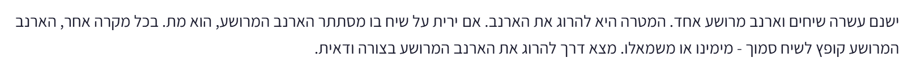

# PREP-029 — ארנב נע בין עשרה שיחים

## השאלה המקורית

ישנם עשרה שיחים וארנב מרושע אחד. המטרה היא להרוג את הארנב. אם ירית על שיח בו מסתתר הארנב המרושע, הוא מת. בכל מקרה אחר, הארנב המרושע קופץ לשיח סמוך — מימינו או משמאלו. מצא דרך להרוג את הארנב המרושע בצורה ודאית.



## קטגוריות וחברות

אין תגיות או חברות בצילום. סיווג שלנו: חידות היגיון, זוגיות, אינווריאנטים וחיפוש מול יריב. אין שיוך לחברה בלי מקור.

## רלוונטיות להכנה

עדיפות נמוכה בזמן מוגבל; חידת העשרה על זוגיות והוכחת ודאות. זו הערכת הכנה ולא תחזית לראיון.

## שלושה רמזים מדורגים

1. מספר את השיחים 1 עד 10. בכל קפיצה לשיח סמוך, מה קורה לזוגיות מספר השיח שבו נמצא הארנב?

2. נניח לרגע שאתה יודע שהארנב התחיל בשיח זוגי. נסה לסרוק את השיחים הפנימיים מ־2 לכיוון 9, בירייה אחת לכל שיח. האם הוא יכול לעבור מצד אחד של הסריקה לצד השני בלי להיתפס?

3. סריקה אחת מכסה רק אחת משתי אפשרויות הזוגיות ההתחלתית. בסוף הסריקה נסה לירות שוב באותו שיח לפני שמתחילים לסרוק בחזרה; בדוק איך זה משנה את התאמת הזוגיות בינך לבין הארנב.

## הצעה לפתרון

**הנחות:** עשרת השיחים מסודרים בשורה, ממוספרים 1..10. יש ירייה אחת בכל תור. אם החטאנו, הארנב חייב לזוז בדיוק צעד אחד לשכן, לפני הירייה הבאה; אסור לו להישאר במקום או לקפוץ יותר מצעד. בשיחי הקצה יש שכן אחד בלבד ואין חיבור מעגלי בין 1 ל־10. הירי מדויק, הארנב נשאר בשורה, מיקומו ההתחלתי לא ידוע, והוא רשאי לבחור כיוון לרעתנו ואף לדעת את כל התכנית. איננו רואים את כיוון התנועה. הפתרון אינו חל ללא שינוי אם מותר לו להמתין, אם יש סידור מעגלי או אם סדר הירייה/התנועה שונה. המקור מבקש ודאות ולא מינימום; בנוסף נבדק מינימום תחת המודל הזה.

**תכנית היריות:**

```text
2, 3, 4, 5, 6, 7, 8, 9, 9, 8, 7, 6, 5, 4, 3, 2
```

לכל היותר 16 יריות. חשוב: יורים בשיח 9 פעמיים ברציפות בשני תורים נפרדים. אם הראשונה החטיאה, הארנב מבצע ביניהן קפיצה רגילה. אין יריות בשיחים 1 ו־10, אין צורך בהמתנה מיוחדת ואין צורך לראות את הארנב.

**התובנה — זוגיות:** בכל תנועה לשכן, הארנב מחליף זוגיות: זוגי הופך לאי־זוגי ולהפך. גם רצף היריות 2,3,4,...,9 מחליף זוגיות בכל צעד. לכן אם הארנב התחיל בזוגי, בכל אחת משמונה היריות הראשונות מיקומו והשיח שנורה הם באותה זוגיות.

**למה הסריקה הראשונה תופסת כל התחלה זוגית?** בירייה הראשונה, הארנב נמצא ב־2,4,6,8 או 10. אם אינו ב־2, הוא מימין לנקודת הסריקה. כאשר אנחנו מתקדמים שיח אחד ימינה, הוא זז צעד אחד שמאלה או ימינה. ההפרש ״מיקום הארנב פחות מיקום הירייה״ נשאר קבוע או קטן ב־2. ההפרש מתחיל זוגי ולא שלילי, ולכן הוא לא יכול לעבור מחיובי לשלילי בלי להיות אפס באחת היריות; אפס הוא פגיעה. בירייה השמינית אנחנו ב־9, והארנב חייב להיות בשיח אי־זוגי, כלומר לכל היותר 9. לכן אינו יכול להישאר מימין לנצח: בהכרח נתפס עד הירייה ב־9. חשוב להשתמש בזוגיות בהסבר; בלי התאמת זוגיות הארנב יכול לעבור בינינו בין תורים בלי להיות בשיח הנורה ברגע הירייה.

**מה אם התחיל באי־זוגי?** הסריקה הראשונה לא מספיקה להבטחה. אחרי שמונה החטאות ושמונה תנועות, לפני הירייה התשיעית, הוא שוב באי־זוגי. כעת יורים שוב ב־9 — שיח אי־זוגי — ומתחילים את הסריקה בחזרה 9,8,...,2. הפעם הזוגיות מתאימה. הוא מתחיל משמאל ל־9 או בתוכו. ההפרש מיקום הארנב פחות מיקום הירייה נשאר קבוע או גדל ב־2 בסריקה שמאלה, ולכן אי אפשר לחצות בלי אפס. בירייה האחרונה ב־2 הארנב חייב להיות בשיח זוגי, כלומר לפחות 2. לכן מוכרח להיתפס בסריקה השנייה. כך מכסים את שתי אפשרויות הזוגיות ההתחלתית.

**בדיקה מלאה ומינימליות במודל:** מייצגים קבוצה B של מיקומים אפשריים רגע לפני ירייה. ירייה בשיח s מסירה את s (הענף שבו פגענו כבר הסתיים), ואז מעבירים כל מיקום שנותר לכל שכניו החוקיים. הקבוצה החדשה כוללת בדיוק את כל המיקומים שבהם הארנב יכול להיות אחרי החטאה. מתחילים מכל 10 השיחים; אחרי הרצף השמור הקבוצה ריקה, כלומר אין שום מסלול התחמקות שנותר. זה בודק את כל התחלות וכל בחירות הכיוון, לא רק מסלול אקראי.

כדי לבדוק מינימום, חיפוש BFS על קבוצות המיקומים בחן את כל הבחירות של ירייה 1..10 בכל מצב, כשהיעד הוא הקבוצה הריקה. היעד הראשון נמצא בעומק 16, ולכן אין אסטרטגיה קצרה יותר שמבטיחה הצלחה תחת ההנחות. עד מציאת היעד התגלו 73 מצבי אמונה; אין צורך לטעון שאלה כל 1024 התת־קבוצות. מאחר שעד לתפיסה המשוב הוא רק החטאה, לכל אסטרטגיה דטרמיניסטית יש מסלול יחיד של כל־החטאות; החיפוש ברצפי פעולות מכסה גם אסטרטגיות שמנוסחות כאדפטיביות על המשוב הזה. המינימליות מבוססת על חיפוש ממצה ממוחשב, בעוד הוודאות הוכחה גם בזוגיות.

נבדקו כל 1024 קבוצות המיקומים כפול 10 יריות מול מעבר קבוצות עצמאי, כל עשרת מיקומי ההתחלה, ושכל התחלה זוגית נתפסת כבר בסריקה הראשונה. נבדק גם שהסריקה הפשוטה 1..10 פעמיים אינה מבטיחה תפיסה. אלו בדיקות של חידת מיקומים דיסקרטית, לא ניסוי פיזי.

[מודל וחיפוש](../solutions/prep_029_moving_rabbit.py) · [בדיקות](../checks/check_prep_029.py)

## English

There are ten bushes and one wicked rabbit. The goal is to kill the rabbit. A shot at its current bush kills it. Otherwise it jumps to an adjacent bush on its right or left. Find a strategy guaranteed to hit the rabbit.

Hint 1: Number the bushes 1..10. What happens to the parity of the rabbit position on every compulsory adjacent jump?

Hint 2: Suppose its initial position is even. Sweep the internal bushes from 2 through 9. Can it cross your advancing sweep without being hit?

Hint 3: One sweep covers one initial parity. At the turnaround, try shooting the same bush again before sweeping back, and examine the relative parity.

Assume bushes form a line 1..10, one shot per turn followed after every miss by exactly one compulsory adjacent move. No staying, wrapping, escaping or multi-step jumps. The rabbit can choose adversarially and know the plan; no directional observation is available. These timing/motion assumptions matter.

Guaranteed plan: 2,3,4,5,6,7,8,9,9,8,7,6,5,4,3,2, at most 16 shots. The repeated 9 consists of two separate shots with a compulsory rabbit move after the first miss; do not omit it. No endpoint shots are needed.

Every rabbit move flips parity. During the first sweep 2..9, an initially even rabbit matches each shot's parity. Its position minus the shot position starts nonnegative and changes by 0 or -2. If it avoids a hit it cannot cross the sweep, but at the final shot 9 it occupies an odd bush no greater than 9, forcing equality sometime earlier or then. Any initially odd rabbit that survives has made eight moves before the ninth shot and is again odd. Repeating 9 aligns parity for the reverse sweep 9..2. The difference now starts nonpositive and changes by 0 or +2, while at the final shot 2 the rabbit must be in an even position at least 2, forcing a hit. This covers both initial parities.

An exact belief-state model removes the shot position from the current possible set, then takes all legal neighbors of survivors. Empty belief after the sequence proves no evasion path remains. BFS over these possible-position sets with all ten shot actions first reaches empty at depth 16 (73 states discovered up to the first goal), establishing optimal worst-case shot count under this model. Since every nonterminal observation is only a miss, every deterministic adaptive strategy has one all-miss path; this search covers it. The source asks only certainty, not minimality. All 10240 state/action transitions checked independently, all ten starts covered, and initial-even states eliminated by the first sweep. Simple 1..10 sweeps repeated twice were verified not sufficient.

התוכן נוצר בסיוע AI וממתין לסקירה; טרם פורסם באתר.
