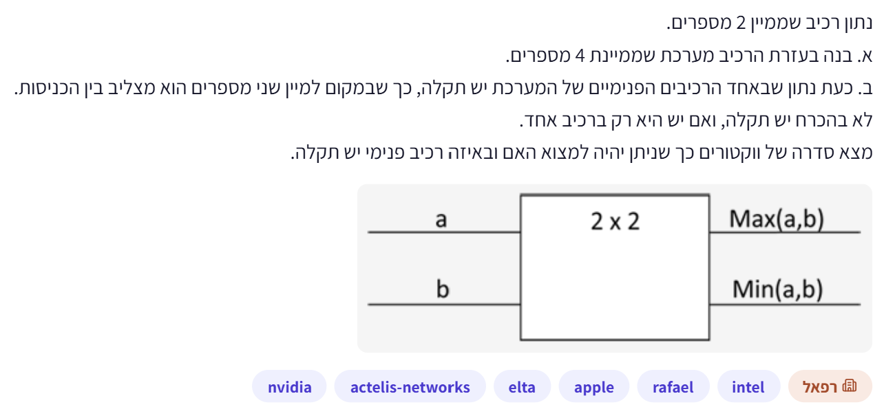
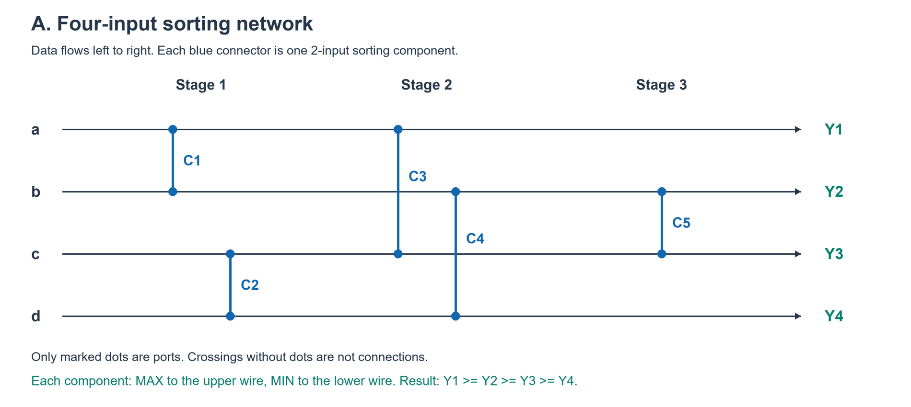
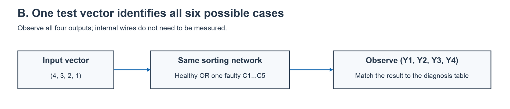

# PREP-030 — מיון ארבעה מספרים ואיתור תקלה

## השאלה המקורית

נתון רכיב שממיין 2 מספרים.
א. בנה בעזרת הרכיב מערכת שממיינת 4 מספרים.
ב. כעת נתון שבאחד הרכיבים הפנימיים של המערכת יש תקלה, כך שבמקום למיין שני מספרים הוא מצליב בין הכניסות.
לא בהכרח יש תקלה, ואם יש היא רק ברכיב אחד.
מצא סדרה של וקטורים כך שניתן יהיה למצוא האם ובאיזה רכיב פנימי יש תקלה.

## קטגוריות וחברות

אין תגיות נושא מפורשות בצילום. סיווג שלנו: רשתות מיון, לוגיקה קומבינטורית, ולידציה, גילוי ואיתור תקלות, וקטורי בדיקה. חברות לפי המקור: NVIDIA, Actelis Networks, Elta, Apple, Rafael, Intel; תווית ראשית רפאל. השיוך לא אומת עצמאית.

## רלוונטיות להכנה

**עדיפות גבוהה במיוחד:** בניית בדיקה שמפעילה תקלה ומאפשרת לזהות את מקורה מתאימה לחשיבה של ולידציה ודיבוג לפי תיאור המשרה. זו הערכת הכנה, לא תחזית לראיון. סעיף א קשור ל־[PREP-005](prep-005-sorting-networks.md), אבל סעיף האבחון חדש ולכן נשמר כשאלה נפרדת.

## שלושה רמזים מדורגים

1. לסעיף א׳: מיין שני זוגות בנפרד. כעת השווה בין שני הגדולים ובין שני הקטנים. אחרי שזיהית את המקסימום והמינימום הכלליים, אילו שני ערכים עדיין צריך לסדר?

2. לסעיף ב׳: מה ההבדל בין רכיב תקין שמוציא Max למעלה ו־Min למטה לבין רכיב שתמיד מחליף את שתי הכניסות? באיזה סדר של זוג קלטים ההבדל נעלם, ובאיזה סדר אפשר לעורר אותו?

3. נסה וקטור של ארבעה ערכים שונים שכבר מסודרים בסדר שהרשת אמורה להוציא. חשב בנפרד את הפלט כאשר כל פעם רכיב אחר תקול וגם כשהכול תקין. האם חתימות הפלט מספיקות כדי לזהות את כל המקרים?

## הצעה לפתרון

**הנחות ומספור:** נבחר מוצא ממוין בסדר יורד כדי להתאים לרכיב שבצילום: הכניסה העליונה a והתחתונה b, והמוצא העליון Max(a,b), התחתון Min(a,b). נסמן ארבעה חוטים מלמעלה למטה w1,w2,w3,w4. כשרכיב תקול הוא תמיד מחזיר (b,a) במקום (max,min), ללא תלות בערכים. זו אינה תקלה ש״מחליפה בין פלטי max/min״ ואינה זהות (a,b); מודל שגוי כאן משנה את הפתרון. התקלה קבועה, יש אפס או רכיב תקול אחד, ניתן להזין כל ארבעה מספרים ולראות את כל ארבעת הפלטים, והקלטים בני השוואה בסדר מלא (ללא NaN). אין צורך בגישה לחוטים פנימיים. מותר שערוך חוטים והסתעפויות כרגיל בתרשים קומבינטורי.

**א. בניית המערכת — חמישה רכיבים בשלוש שכבות:**

| שכבה | רכיב | זוג החוטים | פעולה תקינה |
|---|---|---|---|
| 1 | C1 | w1,w2 | הגדול ל־w1, הקטן ל־w2 |
| 1 | C2 | w3,w4 | הגדול ל־w3, הקטן ל־w4 |
| 2 | C3 | w1,w3 | הגדול ל־w1, הקטן ל־w3 |
| 2 | C4 | w2,w4 | הגדול ל־w2, הקטן ל־w4 |
| 3 | C5 | w2,w3 | הגדול ל־w2, הקטן ל־w3 |

C1,C2 פועלים במקביל, וגם C3,C4. הפלט הוא (w1,w2,w3,w4) בסדר יורד. אחרי השכבה הראשונה w1,w3 הם גדולי הזוגות ו־w2,w4 קטני הזוגות. C3 ממקם את המקסימום הכללי ב־w1, ו־C4 ממקם את המינימום הכללי ב־w4. נשאר רק למיין את שני האמצעיים, ו־C5 עושה זאת. במודל רשת השוואה, חמישה רכיבים הם מינימום: ארבעה מספרים שונים מאפשרים 4!=24 סדרים יחסיים, וכל השוואה מספקת עד ביט אחד; ארבע השוואות נותנות לכל היותר 16 תוצאות, ולכן לא מספיקות. חמישה מספיקים כפי שנבנה. שלוש שכבות הן מינימום לרשת של ארבעה חוטים עם השוואות מקבילות על זוגות זרים: בשתי שכבות אפשר לכל היותר ארבע השוואות. אין זו טענת שטח/השהיה פיזית של רכיב נתון.

**ב. וקטור בדיקה אחד מספיק:** הזן (4,3,2,1) על w1..w4. כל ערך שונה והמערך כבר ממוין בסדר הרצוי. ברשת תקינה כל רכיב מקבל זוג יורד ולכן אינו מחליף אותו. רכיב תקול, לעומת זאת, מחליף אותו בהכרח. עקוב אחרי ההשפעה עד הפלט, גם דרך הרכיבים התקינים שבהמשך.

| מצב | פלט מלא |
|---|---|
| הכול תקין | (4,3,2,1) |
| C1 תקול | (3,4,2,1) |
| C2 תקול | (4,3,1,2) |
| C3 תקול | (2,4,3,1) |
| C4 תקול | (4,2,1,3) |
| C5 תקול | (4,2,3,1) |

כל שש החתימות שונות, ולכן וקטור יחיד גם מגלה שיש תקלה וגם מזהה את הרכיב. זה המינימום במספר וקטורי הבדיקה: בלי אף מדידה לא ניתן להבדיל בין שש האפשרויות. קביעה זו מותנית ברשת ובמודל התקלה המפורשים, ואינה אומרת שכל רשת מיון ארבעה ערכים תיתן אותן חתימות. לכל קלט יורד ממש a>b>c>d מתקבלות אותן תבניות מיקומים; הערכים 4,3,2,1 הם בחירה פשוטה.

**דוגמה למעקב:** אם C3 תקול, אחרי השכבה הראשונה עדיין (4,3,2,1). C3 מחליף את w1,w3, ומתקבל (2,3,4,1). C4 התקין משווה 3 ו־1 ולכן אינו משנה. C5 משווה את האמצעיים 3,4 ומחליף אותם: הפלט (2,4,3,1), חתימה ייחודית ל־C3. חשוב לא להסתפק במוצא של הרכיב התקול, כי צריך להמשיך להעביר את הערכים דרך שאר הרשת.

**איך מגיעים לוקטור?** מגדירים קודם מה התקלה עושה, בוחרים קלט שמעורר הבדל לעומת הרכיב התקין, ואז בודקים שההבדל מגיע לפלט ושאינו זהה לחתימה של תקלה אחרת. קלט עולה a<b גורם לרכיב תקין להחליף בדיוק כמו התקול ולכן עלול להסתיר אותו. ערכים שווים גם עלולים להסתיר החלפה. מתחילים בירידה ממש, יוצרים טבלה של כל ששת המצבים ובודקים ייחודיות. ״הפלט לא ממוין״ לבדו מזהה חריגה אך לא בהכרח איזה רכיב; כאן משתמשים ברביעיית הערכים המלאה. פלט שאינו בטבלה, עבור קלט הבדיקה המדויק, מצביע שהנחותינו אינן מתאימות (למשל תקלה אחרת, כמה תקלות, חיווט שונה), ולא על אבחנה מאולצת.

**בדיקות:** הרשת התקינה הושוותה למיון עבור 256 קלטים עם ערכים −1,0,1,2 וכל 16 הקלטים הבינאריים. שש חתימות התקלה נבדקו במדויק; נבדקו כל 24 סדרי הקלטים השונים ושלושה וקטורים יורדים עם ערכים אחרים. הוכחת המינימום ברכיבים היא חסם ההשוואות; מינימום וקטורים נובע מקיום וקטור מבחין יחיד. זו בדיקת מודל פונקציונלי בפייתון ולא סימולציית HDL, תזמון פיזי או בדיקת כל מודלי התקלות האפשריים.

[מודל וסיווג הפלט](../solutions/prep_030_sorter_fault.py) · [בדיקות](../checks/check_prep_030.py)

## English

A component sorts two numbers, outputting Max(a,b) above Min(a,b). (a) Build a system sorting four numbers using this component. (b) At most one internal component may be faulty: instead of sorting its two inputs, it crosses them. There may be no fault. Find a sequence of input vectors that identifies whether a fault exists and which component is faulty.

Hint 1: Sort two pairs, then compare the two larger values and the two smaller values. After identifying the global extremes, which two remaining values still need ordering?

Hint 2: When does a normal MAX/MIN comparator behave differently from an unconditional crossing? Some input orderings mask the fault; which excite it?

Hint 3: Try four distinct values already in the intended output order. Compute the full output for each single-fault hypothesis and the healthy case. Are the signatures unique?

Use descending output, matching the pictured cell: upper output max(a,b), lower min(a,b). Wires w1..w4 run top to bottom. A faulty cell unconditionally outputs (b,a), not swapped sorted outputs or straight-through identity. Assume at most one permanent fault, total-order values, arbitrary inputs, and observation of all four final outputs without internal probes.

Network: layer 1 C1(w1,w2),C2(w3,w4); layer 2 C3(w1,w3),C4(w2,w4); layer 3 C5(w2,w3). Each healthy cell puts the larger value on the smaller-indexed wire. After pair sorting, C3 selects the global max, C4 the global min, and C5 sorts the middle values. Five comparators are minimal because 4!=24 distinct orders require at least ceil(log2 24)=5 comparisons. Three layers are minimal for ordinary disjoint-pair sorting-network layers: two layers allow at most four comparisons. This is not physical cell-area/timing optimality.

One test vector (4,3,2,1) suffices for full diagnosis. Final outputs by hypothesis: healthy (4,3,2,1); C1 (3,4,2,1); C2 (4,3,1,2); C3 (2,4,3,1); C4 (4,2,1,3); C5 (4,2,3,1). All six signatures differ. The healthy descending input does not need swapping at any cell; any forced crossing activates a fault. Continue propagating through later healthy cells, which may change the visible pattern. For C3, its crossing yields (2,3,4,1), then C5 sorts the middle into (2,4,3,1). Zero tests cannot identify six possibilities, so one is minimum for this chosen network/fault model. Any four strictly descending values yield corresponding positional patterns.

Equal values or an ordering where healthy sorting already crosses can mask faults. Full output values, not just a sorted/not-sorted Boolean, are used. Unlisted output under the exact test vector indicates a violated model rather than a forced diagnosis. Checked 256 signed/repeated-value inputs and all 16 binary inputs for sorting; all six fault outputs, all 24 distinct ordering classes and three other strictly descending vectors. Functional Python model only; no HDL or physical fault experiment.

התוכן נוצר בסיוע AI וממתין לסקירה; טרם פורסם באתר.
