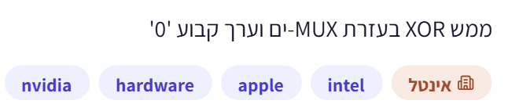
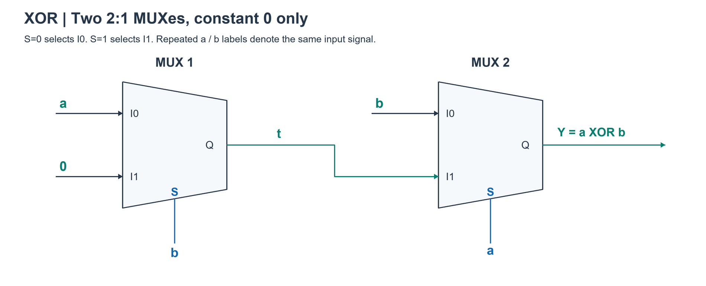

# PREP-031 — XOR באמצעות MUX וקבוע 0

## נוסח המקור

ממש XOR בעזרת MUX-ים וערך קבוע '0'.



חברות לפי המקור: NVIDIA, Apple, Intel; תווית ראשית אינטל. שיוך לא מאומת. תגית מקור: hardware. סיווג נוסף: מוקסים, XOR, לוגיקה קומבינטורית ומימוש תחת אילוצים.

עדיפות גבוהה כחזרה קצרה על יסודות שכבר נלמדו, לא תחזית לראיון.

## שלושה רמזים

1. כתוב מה הפלט צריך להיות כאשר אחת הכניסות היא 0 ומה הוא צריך להיות כאשר היא 1. זכור שלרשותך רק קבוע 0, בלי קבוע 1 או שער NOT.

2. אין צורך לייצר את השלילה של כניסה בכל המצבים: אפשר לייצר אות שמתנהג כמו השלילה רק כאשר המוקס הבא באמת בוחר בו.

3. בחר a כסלקטור של המוקס האחרון. כש־a=0 צריך להעביר b. כש־a=1 צריך להעביר NOT b: האם a עצמו יכול לשמש ערך 1 בענף הזה בלבד?

## הצעה לפתרון

הנחה: MUX רגיל 2:1 בעל מוצא לא מהופך, כניסות הנתונים והסלקטור יכולים להיות a,b,0 או מוצא מוקס קודם. אין קבוע 1, כניסות משלימות, שערים נוספים או משוב. סוג המוקס לא צוין במקור, ולכן יש לציין הנחה זו ולא לטעון למינימום גורף לכל גודל MUX.

הצעה לפתרון: שני מוקסים. החיבורים נכתבים בנפרד מהעברית כדי למנוע היפוך כיווניות:

```text
Convention: MUX(S, I0, I1) = I0 when S=0; I1 when S=1
MUX1: S=b, I0=a, I1=0 -> t
MUX2: S=a, I0=b, I1=t -> Y
```

כאשר a=0, המוקס האחרון בוחר b, בדיוק כנדרש ב־XOR. כאשר a=1, המוקס הראשון מקבל בכניסות הנתונים 1 ו־0, ולכן מוציא את השלילה של b, והאחרון בוחר במוצא הזה. ה־1 אינו מקור קבוע שהוספנו; זהו ערכה של כניסת a במקרה הנדון. האות t אינו NOT b בכל המצבים: כאשר a=0 הוא 0, אבל אז המוקס האחרון אינו בוחר בו. זהו הרעיון המרכזי: לנצל תנאי שבו ענף נבחר, ולא לנסות לבנות NOT כללי שאין עבורו קבוע 1.

```text
t = a AND NOT b
Y = (NOT a AND b) OR (a AND t)
  = (NOT a AND b) OR (a AND b') = a XOR b

a b | t Y
0 0 | 0 0
0 1 | 0 1
1 0 | 1 1
1 1 | 0 0
```

מינימום בשימוש במוקסי 2:1: ללא מוקסים a,b,0 אינם XOR. במוקס יחיד הסלקטור הוא 0,a או b. עם סלקטור 0 נבחר חוט גולמי בלבד. עם סלקטור a, בענף a=1 צריך NOT b, אך הנתונים הזמינים בענף הם רק 0,1,b, ואף אחד אינו NOT b עבור שני ערכי b. עם סלקטור b ההוכחה סימטרית. לכן צריך לפחות שניים, והמימוש משיג שניים.

אם מותר MUX של 4:1, מספיק אחד: חבר את a ל־S1 ואת b ל־S0 ואת I0,I1,I2,I3 אל 0,b,a,0 בהתאמה. כאשר הבחירה 01, b כבר 1; כאשר 10, a כבר 1. גם כאן אין קבוע 1. לכן מספר הרכיבים האופטימלי תלוי בגודל הרכיב המותר.

בלי שום קבוע, רשת של מוקסים רגילים על a,b בלבד שומרת 1: בקלט 11 כל חוט וכל מוצא יהיו 1, בעוד XOR דורש 0. לכן קבוע 0 הוא מהותי כאן. אין סתירה לחוסר האפשרות לבנות NOT כללי עם מוקסים וקבוע 0 בלבד, כי כל הרשתות האלה שומרות 0; XOR עצמו שומר 0.

בדיקה: ארבע שורות טבלת האמת נבדקו בפייתון; נבדקו כל 27 החיווטים למוקס יחיד שכניסותיו נלקחות מ־0,a,b ואף אחד לא מממש XOR. נבדקה גם חלופת 4:1. אין בכך בדיקת השהיה, glitches או שערוך פיזי. תשובה קצרה לראיון: מחברים מוקס ראשון שבוחר a או 0 לפי b, ומוקס שני שבוחר b או מוצא הראשון לפי a. ההיפוך של b נדרש רק כש־a=1, ובתנאי זה a מספק את ה־1 הדרוש בלי קבוע 1.

[בדיקות](../checks/check_prep_031.py)

## English

Implement XOR using MUXes and the constant value '0'.

1. Split the XOR truth table by one input. Only constant zero is available; no constant one or NOT gate.

2. An intermediate signal need not equal an inverted input for every case, only when the final MUX selects it.

3. Select the last MUX with a. At a=0 pass b; at a=1 pass NOT b. Could a itself serve as one within that selected case?

Assume ordinary non-inverting 2:1 MUXes with raw a,b, constant zero and earlier MUX outputs as wires, without extra gates, complements or feedback. The source does not specify MUX size.
With MUX(S,I0,I1) selecting I0 at S=0, use t=MUX(b,a,0), Y=MUX(a,b,t). At a=0 the output is b. At a=1, the first MUX has data 1 and 0 and outputs NOT b, which is selected by the last MUX. No constant-one source is introduced: a is one only in the relevant case. t=a AND NOT b globally, not NOT b. Truth rows (a,b,t,Y): (0,0,0,0),(0,1,0,1),(1,0,1,1),(1,1,0,0).
Two 2:1 MUXes are minimal. Zero MUXes provide only raw a,b,0. One MUX has select 0,a or b: select 0 chooses a raw wire; select a requires NOT b when a=1, but available raw data reduce to 0,1,b, none equal NOT b. Select b is symmetric. Exhaustively verified all four truth rows and rejected all 27 one-MUX raw-input wirings.
If a 4:1 MUX is permitted, one suffices with S1=a,S0=b and data (0,b,a,0); also verified on all four rows. Without any constants, ordinary MUX networks preserve the all-one input and cannot implement XOR. With only zero, general NOT is impossible by zero preservation, but XOR is zero-preserving and this conditional inversion is possible. No HDL/timing/glitch claim. Scope optimality to the allowed MUX size and count, not general physical area/delay.


## שרטוט המימוש בשני מוקסים



כניסות בעלות אותו שם הן אותו אות; I0 נבחרת כשהסלקטור 0 ו־I1 כשהוא 1.
