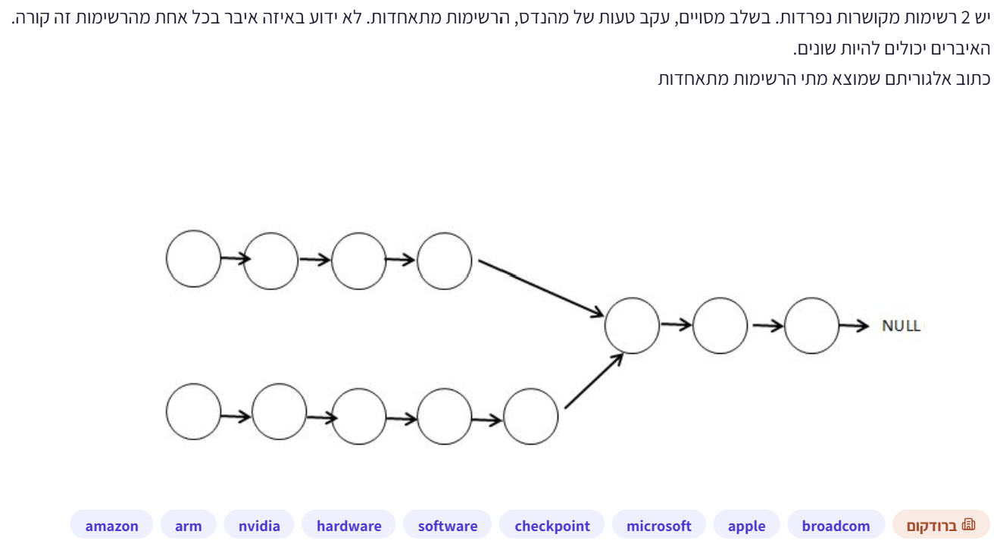
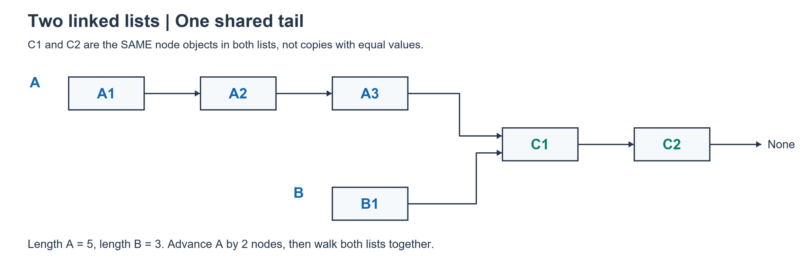

# PREP-032 — נקודת איחוד של רשימות מקושרות

## נוסח המקור

יש 2 רשימות מקושרות נפרדות. בשלב מסויים, עקב טעות של מהנדס, הרשימות מתאחדות. לא ידוע באיזה איבר בכל אחת מהרשימות זה קורה.
האיברים יכולים להיות שונים.
כתוב אלגוריתם שמוצא מתי הרשימות מתאחדות.



תגיות מקור: hardware, software. חברות לפי המקור: Amazon, Arm, NVIDIA, Check Point, Microsoft, Apple, Broadcom; תווית ראשית ברודקום. השיוך לא אומת עצמאית.

## שלושה רמזים

1. איחוד פירושו שהמצביעים מגיעים לאותו צומת בזיכרון, לא לשני צמתים בעלי אותו ערך. מרגע זה, האם המשך הרשימות יכול להיות שונה?

2. אם לשתי הרשימות היה אותו אורך, שני מצביעים שמתחילים בראשיהן ומתקדמים יחד היו מגיעים לנקודת החיבור באותו זמן. מה מפריע כשאורכיהן שונים?

3. חשב את שני האורכים. קדם רק את המצביע ברשימה הארוכה במספר צעדים השווה להפרש האורכים; אחר כך קדם את שניהם יחד והשווה זהות צמתים.

## הצעה לפתרון

הנחות: שתי רשימות חד־כיווניות, סופיות וללא מעגלים, כמתואר בציור המסתיים ב־NULL. יש גישה לשני הראשים ולשדה next של כל צומת, ואין שינוי מקביל ברשימות. אין צורך שהערכים יהיו ממוינים, למרות האזכור של טעות הנדסית. האיחוד הוא אותו צומת פיזי בזיכרון, שממנו ואילך יש זנב משותף: לצומת יחיד יש שדה next יחיד. שני צמתים שערכם שווה אינם בהכרח אותו צומת. אם בצומת המשותף רואים שתי רשימות, גם ערכו הוא אותו ערך משום שזה אותו אובייקט, אבל הערכים לפניו יכולים להיות שונים או שווים.

הצעה לפתרון — יישור לפי האורכים:
1. עוברים על כל רשימה וסופרים את אורכה, n ו־m.
2. מתחילים מצביע בראש כל רשימה. מקדמים רק את הארוכה בהפרש האורכים.
3. כעת לשני המצביעים נותר אותו מספר צמתים עד הסוף. כל עוד אינם מצביעים לאותו אובייקט, מתקדמים צעד בכל רשימה.
4. הצומת הזהה הראשון הוא נקודת האיחוד. אם שניהם מגיעים ל־None, אין איחוד. הקוד מטפל גם ברשימות ריקות ובאיחוד כבר בראש. הרשימות אינן משתנות.

היגיון: כל ההפרש באורכי הרשימות מגיע מהקטעים שלפני נקודת החיבור; הזנב המשותף מוסיף לשתיהן בדיוק אותו אורך. נסמן אורכי קטעים פרטיים p,q ואורך זנב משותף c. אורכי הרשימות הם p+c ו־q+c, ולכן הפרשם p−q. כשמדלגים על ההפרש בקטע הפרטי הארוך, לשני המצביעים נותר מרחק זהה עד החיבור. הליכה משותפת תביא אותם לצומת המשותף הראשון באותו צעד. לפניו אינם יכולים להיות זהים, לפי הגדרת הקטעים הפרטיים.

```text
A: A1 -> A2 -> A3 -> C1 -> C2 -> None   (length 5)
B:             B1 -> C1 -> C2 -> None   (length 3)

Advance A by 2:  p=A3, q=B1
One step each:   p=C1, q=C1  => first shared node
```

C1 ו־C2 בשתי השורות הם אותם צמתים ממש. זו אינה העתקה של שני צמתים בעלי אותו שם או ערך. בפייתון משווים באמצעות is; אין להשוות value או להסתמך על == שעשוי להיות מוגדר להשוואת תוכן.

סיבוכיות: O(n+m) זמן ו־O(1) זיכרון עזר במודל מצביעים/מילות מכונה. אלה כמה מעברים ליניאריים, לא לולאה מקוננת. זהו זמן מיטבי במקרה הגרוע ברשימות כלליות ללא מטא־דאטה או מבני עזר; ייתכן שהחיבור יתגלה רק בסוף קטעים פרטיים ארוכים. קוד נתון ב־solutions/prep_032_list_intersection.py. אפשרות פשוטה יותר משתמשת בקבוצת כתובות הצמתים של הרשימה הראשונה ובודקת שייכות תוך מעבר בשנייה, אך דורשת O(n) זיכרון ובדרך כלל O(n+m) זמן צפוי במימוש hash. אין צורך בה לצורך המימוש בזיכרון קבוע.

בדיקות: כל 343 שילובי האורכים 0..6 של שני קטעים פרטיים וזנב משותף, בשני סדרי הארגומנטים; שני מקרים ארוכים נוספים עם קטע פרטי באורך 10000. כל הערכים בכוונה זהים (7), כדי לוודא שימוש בזהות ולא בשוויון ערכים. נבדק שאין שינוי בשדות next או בערכים. מעגלים ומוטציות מקבילות אינם מכוסים ואינם חלק מהמודל שבתמונה.

תעדוף: בינוני כחזרה קצרה על מצביעים, זהות אובייקטים ובדיקת מקרי קצה. בתקופת הכנה קצרה אין צורך להעמיק מעבר להבנת השיטה. אין להסיק מכך שהמראיינים לא יודעים על קורס מסוים שלא ישאלו על תכנות בסיסי; זו הערכת הכנה לפי תיאור המשרה ולא תחזית לראיון.



[קוד Python](../solutions/prep_032_list_intersection.py) · [בדיקות](../checks/check_prep_032.py)

## English

There are two separate linked lists. At some point, due to an engineer's mistake, the lists merge. It is not known at which element in either list this occurs. The elements may be different. Write an algorithm that finds where the lists merge.

1. Merging means reaching the very same node object, not equal data values. Can the remaining tails differ after sharing a node?

2. With equal list lengths, two pointers advancing together would reach the merge point simultaneously. What changes with unequal lengths?

3. Count both lengths, advance the longer list by the difference, then move both pointers together and compare node identity.

Assume finite acyclic singly linked lists, as the source's NULL-terminated drawing indicates, with two head pointers, readable next links and no concurrent mutation. Lists need not be sorted. Intersection means the identical physical node, not equal data values. Once a node is shared, the suffix is shared because that node has one next pointer.
Count lengths n,m. Advance the longer list's pointer by abs(n-m). Both pointers now have the same remaining length. Move them together until they are identical; return that node, or None if both reach the end. Empty lists and sharing at either head are supported without mutation. In Python use is, not value equality or an overloaded ==.
Proof: with private prefixes p,q and common suffix c, lengths are p+c,q+c. Their difference p-q is entirely due to the private prefixes. Removing the excess prefix aligns distances to the first shared node, which is reached simultaneously. Example: A1->A2->A3->C1->C2 and B1->C1->C2 have lengths 5 and 3; advance A twice, then A3/B1 step together to C1.
O(n+m) time and O(1) auxiliary machine words; worst-case optimal for general pointer-access lists without metadata/indexing. A hash set of node identities is a simpler expected-linear alternative but uses O(n) space. The saved Python code is tested on all 343 prefix/prefix/suffix length triples in 0..6, in both argument orders, plus two long cases. Every node deliberately contains the same value to catch identity mistakes; all links and values are checked for immutability. Cycles/concurrent mutation are outside scope. Medium preparation priority as a short pointer/identity/edge-case revision, not a forecast of interview questions; undisclosed coursework does not rule out basic programming questions.
