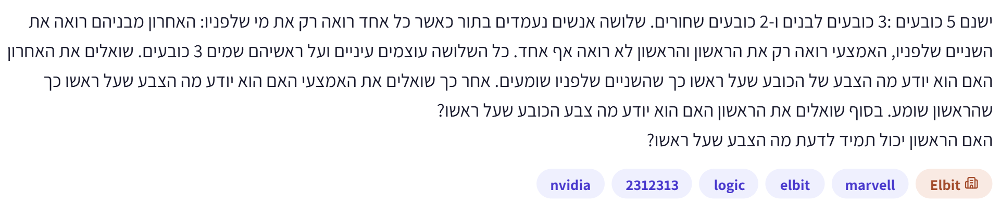

# PREP-033 — שלושה אנשים וחמישה כובעים

## נוסח המקור

ישנם 5 כובעים: 3 כובעים לבנים ו־2 כובעים שחורים. שלושה אנשים נעמדים בתור כאשר כל אחד רואה רק את מי שלפניו: האחרון מביניהם רואה את השניים שלפניו, האמצעי רואה רק את הראשון והראשון לא רואה אף אחד. כל השלושה עוצמים עיניים ועל ראשיהם שמים 3 כובעים. שואלים את האחרון האם הוא יודע מה הצבע של הכובע שעל ראשו כך שהשניים שלפניו שומעים. אחר כך שואלים את האמצעי האם הוא יודע מה הצבע שעל ראשו כך שהראשון שומע. בסוף שואלים את הראשון האם הוא יודע מה צבע הכובע שעל ראשו?
האם הראשון יכול תמיד לדעת מה הצבע שעל ראשו?

תגית מקור: logic. חברות: NVIDIA, Elbit, Marvell. תווית ראשית Elbit. שיוך לא מאומת. התגית 2312313 אינה מסווגת.

## שלושה רמזים

1. התחל מהאחרון: באיזה צירוף כובעים שהוא רואה הוא יכול לדעת בוודאות מה צבע הכובע שלו, בלי לשמוע אף תשובה?

2. גם תשובת ״לא יודע״ מוסיפה מידע. איזה צירוף כובעים אצל השניים שמלפנים היא שוללת?

3. הפרד בין מצב שבו האחרון יודע לבין מצב שבו אינו יודע. בענף השני, בדוק מה האמצעי היה מסיק אילו ראה כובע שחור על הראשון, ומה היה מסיק אילו ראה לבן.

## הצעה לפתרון

הנחות: אחרי הנחת הכובעים פוקחים עיניים ורואים בהתאם לתיאור. כולם יודעים שיש שלושה לבנים ושני שחורים, מבינים את סדר השאלות, שומעים את התשובות הרלוונטיות ומסיקים מסקנות נכונות. ״יודע״ פירושו ודאות מכל המידע הזמין, לא ניחוש; כולם עונים בכנות. שני הכובעים שלא חולקו אינם גלויים. התשובות הן לפחות ״יודע״ או ״לא יודע״; אין צורך שיכריזו גם על הצבע. האחרון, האמצעי והראשון נקראים להלן אחורי, אמצעי וקדמי כדי להימנע מבלבול מספור.

הצעה לפתרון: כן, הקדמי יכול תמיד להסיק את צבע הכובע שלו, אבל הצבע תלוי בתשובות. אין בשאלה נתון ששני האחרים ענו ״לא יודע״ ולכן אסור להניח זאת מראש.

מקרה 1 — האחורי אומר ״יודע״: הוא יכול לדעת רק אם הוא רואה שני כובעים שחורים. במקרה כזה שני השחורים כבר נוצלו, ושלו בהכרח לבן. אם הוא רואה שני לבנים או אחד מכל צבע, עבורו עדיין ייתכן לבן או שחור. לכן עצם ה״יודע״ מוכיח לקדמי שהוא שחור. האמצעי מסיק באותו ענף שגם הוא שחור, ולכן אומר ״יודע״ כשמגיע תורו.

מקרה 2 — האחורי אומר ״לא יודע״: עכשיו כולם יודעים שהקדמי והאמצעי אינם שניהם שחורים.
אם האמצעי רואה שחור אצל הקדמי, הוא יודע שהכובע שלו חייב להיות לבן, אחרת האחורי היה רואה שני שחורים ויודע. לכן הוא עונה ״יודע״.
אם האמצעי רואה לבן אצל הקדמי, הכובע שלו יכול להיות לבן או שחור, ושני המצבים מתאימים ל״לא יודע״ של האחורי. לכן הוא עונה ״לא יודע״.
מכאן שהקדמי, ששמע ״לא יודע״ מאחור, מפרש ״יודע״ מהאמצעי כהוכחה שהכובע שלו שחור, ו״לא יודע״ מהאמצעי כהוכחה שהכובע שלו לבן.

| תשובת האחורי | תשובת האמצעי | צבע הקדמי |
|---|---|---|
| יודע | יודע | שחור |
| לא יודע | יודע | שחור |
| לא יודע | לא יודע | לבן |

התמליל ״יודע, לא יודע״ אינו אפשרי תחת ההנחות: כשהאחורי יודע, גם האמצעי מבין מיד ששניהם מלפנים שחורים. בענף הזה הקדמי כבר יודע לפני תשובת האמצעי, אך עדיין יכול להמתין לתורו. צבע כובעו של האמצעי בענף ״לא יודע, יודע״ הוא לבן, בעוד צבע הקדמי שחור — חשוב לא להחליף ביניהם.

איך לחשוב: רשום מה כל אדם רואה ומתי היה יכול להיות בטוח. לאחר תשובה, מחק את כל חלוקות הכובעים שלא היו גורמות לתשובה הזו; אחר כך נתח את האדם הבא על בסיס האפשרויות שנותרו. אין צורך בהסתברויות או בהנחה שהחלוקה אחידה.

בדיקה: נבדקו כל שבע חלוקות הצבע החוקיות לפי סדר קדמי,אמצעי,אחורי. אסור BBB כי יש רק שני שחורים; כל יתר המילים באורך שלוש מותרות. לכל חלוקה חושבה ידיעת האחורי מתוך זוג הכובעים שהוא רואה, ואז ידיעת האמצעי מתוך כובע הקדמי ותשובת האחורי, ולבסוף האפשרויות של הקדמי מתוך שתי ההכרזות. בכל שבעת המצבים צבעו נקבע ביחידות. זו בדיקה של מודל הסקה אידאלי ולא של התנהגות אנושית בפועל.

תעדוף לראיון: חידת היגיון בעדיפות נמוכה בזמן מוגבל יחסית לתכנות, לוגיקה דיגיטלית ובדיקות מערכת. היא שימושית לתרגול הסקת מסקנות ושלילת אפשרויות. השיוך ל־Marvell מופיע בצילום אך אינו אימות או תחזית לראיון. התגית 2312313 נשמרת כתגית לא מסווגת, לא כחברה או קטגוריה מקצועית.

[בדיקת כל חלוקות הכובעים](../checks/check_prep_033.py)

## English

There are five hats: three white and two black. Three people stand in a line. The rear person sees the two in front, the middle person sees only the front person, and the front person sees nobody. They close their eyes while three hats are placed on their heads. The rear person is asked whether they know their own hat color, and the other two hear the answer. The middle person is then asked the same question, and the front person hears the answer. Finally, the front person is asked whether they know their own color. Can the front person always know?

1. When can the rear person determine their own color from the two visible hats alone?

2. An answer of I do not know also adds information. Which visible pair does it rule out?

3. Split on whether the rear knows. In the no branch, compare what the middle person could infer on seeing a black versus a white front hat.

Assume the participants open their eyes after placement, know the 3-white/2-black inventory and reasoning rules, hear earlier relevant answers, reason correctly and answer truthfully. Unused hats are hidden. Knowing means logical certainty, not a guess. Only yes/no knowledge announcements are needed, not actual color declarations.
Yes: the front person always knows after the announcements, but their color depends on the branch. The prompt does not say the first two answers are no.
If the rear knows, they must see two black hats: only then is their own hat forced white. Thus both front and middle know they are black. The middle also answers yes.
If the rear does not know, the front and middle cannot both be black. If the middle now sees black on the front, the middle's own hat must be white, so they answer yes. If they see white, either own color remains possible, so they answer no. Therefore after rear=no, middle=yes means front=black and middle=no means front=white. Complete transcript map: (yes,yes)->black; (no,yes)->black; (no,no)->white. (yes,no) is impossible under truthful perfect reasoning. In the first case the front knows before hearing the middle.
The method is to eliminate color assignments inconsistent with each public answer. No probability/uniformity assumption is needed. Checked all seven legal three-person color assignments (all W/B triples except BBB), with each agent's visibility and earlier public knowledge respected; every final front information set has a single color. Low preparation priority under time pressure relative to role-specific coding, digital logic and validation; company tags are unverified source reports. Tag 2312313 is uncategorized metadata, not a company.
