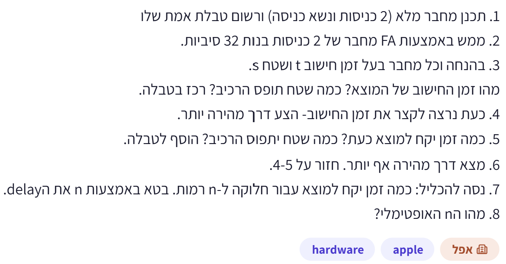
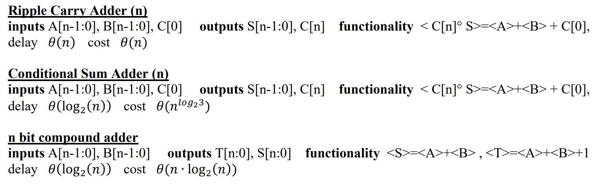
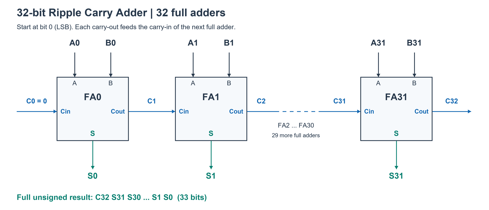
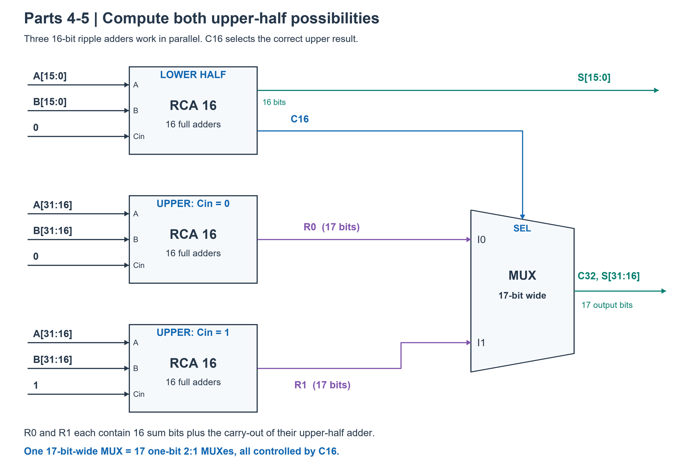
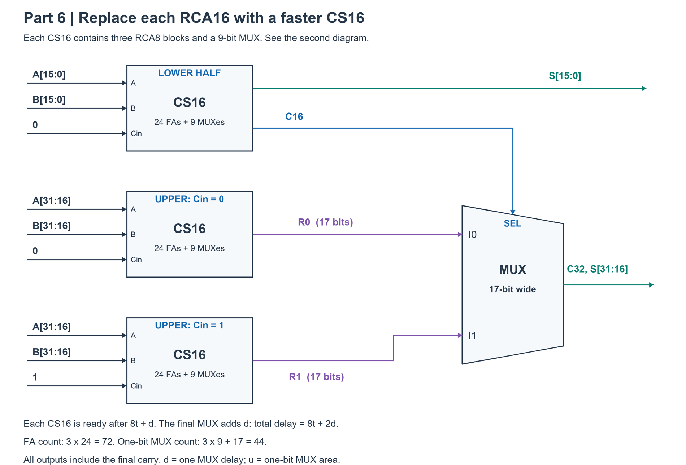
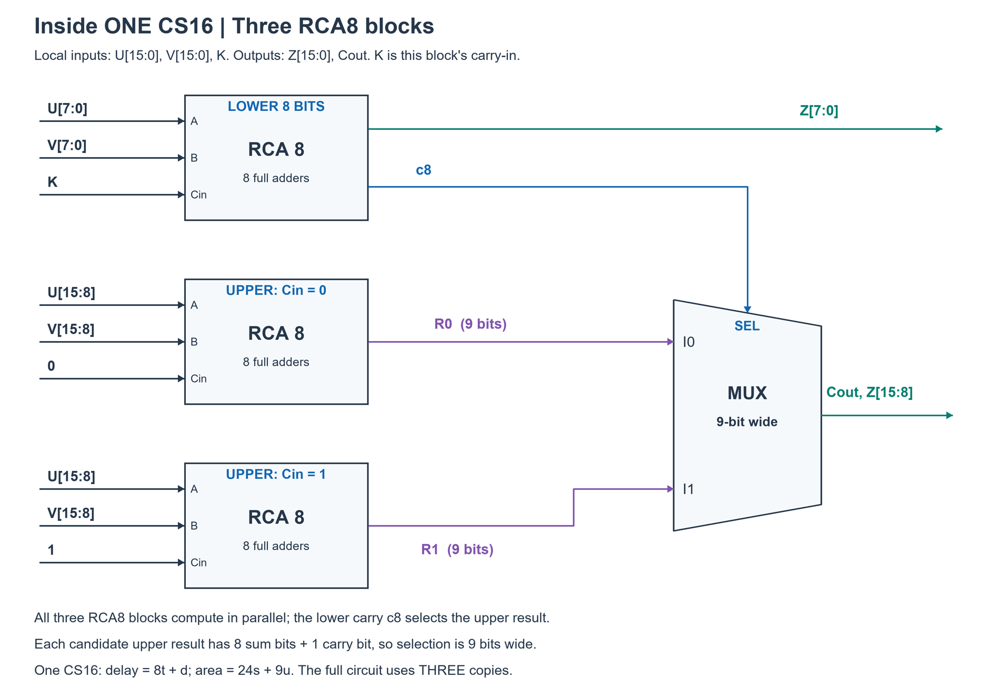

# PREP-034 — מחבר 32 ביט: שטח, השהיה ורמות חלוקה

## נוסח המקור

1. תכנן מחבר מלא (2 כניסות ונשא כניסה) ורשום טבלת אמת שלו
2. ממש באמצעות FA מחבר של 2 כניסות בנות 32 סיביות.
3. בהנחה וכל מחבר בעל זמן חישוב t ושטח s.
מהו זמן החישוב של המוצא? כמה שטח תופס הרכיב? רכז בטבלה.
4. כעת נרצה לקצר את זמן החישוב — הצע דרך מהירה יותר.
5. כמה זמן יקח למוצא כעת? כמה שטח יתפוס הרכיב? הוסף לטבלה.
6. מצא דרך מהירה אף יותר. חזור על 4–5.
7. נסה להכליל: כמה זמן יקח למוצא עבור חלוקה ל־n רמות. בטא באמצעות n את ה־delay
8. מהו ה־n האופטימלי?



תגית מקור hardware; חברה Apple ותווית אפל. השיוך לא אומת עצמאית. עדיפות גבוהה במיוחד להכנה, כהערכת רלוונטיות בלבד.

## שלושה רמזים

1. במחבר שרשרת, איזה מידע צריך לעבור מהביט הפחות משמעותי לביט הבא, ומדוע הוא גורם להמתנה מצטברת?

2. אפשר לחשב את החצי העליון מראש פעמיים: פעם בהנחה שהנשא מהחצי התחתון יהיה 0 ופעם בהנחה שיהיה 1. כשהנשא מגיע, איזו פעולה קצרה נשארה?

3. אפשר להפעיל את אותו רעיון בתוך כל תת־מחבר. בכל רמת חלוקה חוצים את אורך שרשרת הנשאים, אבל מוסיפים שלב בחירה ומגדילים שטח. הגדירו את השהיית המוקס בנפרד מהשהיית FA.

## הצעה לפתרון

הנחות וחוסר נתונים: t ו־s מתייחסים למחבר מלא של ביט אחד. לצורך חישוב השרשרת נשתמש במודל פשטני של השהיה t לכל תא עד Sum/Carry, בלי זמני חוטים, fanout או רגיסטרים. שתי הכניסות הן 32 ביט, נשא הכניסה C0 ניתן או מחובר ל־0; הפלט המלא הוא 32 ביטי סכום ונשא יציאה (33 ביט). התמונה אינה מגדירה ארכיטקטורת שיפור, השהיית/שטח MUX או משמעות מדויקת ל״n רמות״. לכן אין מספר יחיד ל־n האופטימלי מנתוני המקור בלבד. הפתרון להלן הוא הצעה עקבית באמצעות carry-select רקורסיבי; אין להציגו כארכיטקטורה היחידה או כשטח מינימלי.

סעיף 1 — Full Adder:

```text
S    = A XOR B XOR Cin
Cout = (A AND B) OR (A AND Cin) OR (B AND Cin)

A B Cin | S Cout
0 0  0  | 0  0
0 0  1  | 1  0
0 1  0  | 1  0
0 1  1  | 0  1
1 0  0  | 1  0
1 0  1  | 0  1
1 1  0  | 0  1
1 1  1  | 1  1
```

Sum הוא זוגיות של שלוש הכניסות; Carry הוא 1 אם לפחות שתיים מהן 1. נשמר A+B+Cin=S+2*Cout. אפשר לממש עם שני Half-Adders ושער OR לנשאים, או ישירות במשוואות. משוואות אלה מתארות שערים בתוך תא FA; בהמשך סופרים תאים שלמים לפי השטח הנתון.

סעיפים 2–3 — Ripple Carry: מחברים 32 תאי FA. תא i מקבל Ai,Bi,Ci ומוציא Si,C(i+1). מחברים נשא של כל תא לנשא הכניסה של הבא, מה־LSB ל־MSB. זמן worst-case במודל: 32t. שטח: 32s. חיבור נשאים הוא תלות קומבינטורית ולא 32 מחזורי שעון. בספריית תאים אמיתית זמני Cin->Sum ו־Cin->Cout יכולים להיות שונים; כאן הם אוחדו לצורך המודל.

סעיפים 4–5 — רמת Carry-Select אחת: מחלקים לביטים 0–15 ולביטים 16–31. מחבר אחד בן 16 ביט מחשב את החצי התחתון עם הנשא האמיתי. במקביל שני מחברים בני 16 ביט מחשבים את החצי העליון, אחד עם Cin=0 ואחד עם Cin=1. כשהנשא התחתון ידוע, בוחרים את התוצאה העליונה המתאימה בעזרת 17 מוקסי 2:1 חד־ביטיים: 16 עבור הסכום ואחד לנשא הסופי. נסמן השהיית מוקס d ושטחו u. זמן: 16t+d. שטח: 48s+17u. בלי תוספת זו של נתוני מוקס אפשר למסור נוסחה, אך לא מספר מדויק המבוסס רק על t,s. רוחב בחירת 17 כולל נשא יציאה; אם מבקשים סכום מודולו 2^32 בלבד אפשר להשמיט את מוקס הנשיאה העליון, ואין להשתמש באותה טבלת שטח ללא התאמה.

סעיף 6 — שתי רמות: מחליפים כל אחד משלושת מחברי 16 הביט באותו מבנה, הפעם שלושה מחברי 8 ביט ו־9 מוקסים. מתקבלים תשעה מחברי 8 ביט, כלומר 72 FA, ו־17+3*9=44 מוקסים. המסלול עובר שרשרת של 8 FA ועוד שתי בחירות: 8t+2d. שטח: 72s+44u. המהירות משתפרת לעומת רמה אחת רק אם d<8t; עלות הבחירה אינה אפסית בהכרח.

סעיפים 7–8 — נגדיר n כמספר רמות פיצול בינארי, כאשר n=0 פירושו שרשרת רגילה, ו־0<=n<=5. כל תת־מחבר, כולל עותקים המחושבים לנשא 0/1, משוכפל לפי אותה תבנית ללא שיתוף לוגיקה או פישוט קבועים. זהו מימוש קונקרטי נוח לניתוח, לא המימוש החסכוני ביותר של carry-select.

```text
leaf_width = 32 / 2^n
D(n) = (32 / 2^n)*t + n*d

FA_count(n)  = 32*(3/2)^n
MUX_count(n) = 32*((3/2)^n - 1) + (3^n - 1)/2
Area(n) = FA_count(n)*s + MUX_count(n)*u
```

הזמן נובע מכך שכל העותקים עובדים במקביל, ועל המסלול הארוך יש תת־מחבר עלה ואחריו מוקס אחד בכל רמת עץ. נסיגת השטח היא A(W,n)=3*A(W/2,n-1)+(W/2+1)*u, עם A(W,0)=W*s. האיבר W/2+1 סופר את ביטי הסכום העליונים ואת נשא היציאה. ממנו מתקבלות הנוסחאות הסגורות.

| n | רוחב עלה | זמן | שטח |
|---|---|---|---|
| 0 | 32 | 32t | 32s |
| 1 | 16 | 16t+d | 48s+17u |
| 2 | 8 | 8t+2d | 72s+44u |
| 3 | 4 | 4t+3d | 108s+89u |
| 4 | 2 | 2t+4d | 162s+170u |
| 5 | 1 | t+5d | 243s+332u |

בחירת n: מחשבים את שש אפשרויות הזמן ובוחרים את הקטנה, בכפוף למגבלת שטח אם יש. רמה נוספת כדאית לזמן רק כאשר:

```text
D(n+1) - D(n) = d - (32 / 2^(n+1))*t
```

אם ההפרש שלילי משתפרים; אם חיובי נעשים איטיים יותר; אם אפס מקבלים אותו זמן ויותר שטח. לדוגמה בלבד, בהנחה הנוספת d=t, הזמנים הם 32t,17t,10t,7t,6t,6t. גם n=4 וגם n=5 מינימליים בזמן; n=4 עדיף בשטח ולכן נבחר אם שוברים שוויון באמצעות שטח. אין להניח d=t או u=s בלי לומר זאת. כשהמוקס מהיר יותר, למשל d=t/2, n=5 עדיף בזמן במודל הזה. יש הבדל בין n רמות רקורסיביות לבין k בלוקים בטור: חלוקת carry-select רגילה ל־k בלוקים שווים נותנת מודל אחר, בקירוב (32/k)t+(k−1)d. אין לערבב את שני המשתנים והארכיטקטורות.

חלופה אפשרית לשיפור היא carry-lookahead או עץ prefix: מחשבים לכל ביט generate ו־propagate ומצרפים אותם בקבוצות. אפשר לקבל עומק לוגי לוגריתמי במקום שרשרת, אך לחישוב זמן ושטח מספריים נדרש מודל עלות לשערים/לקבוצות. משום כך גם חלופה זו אינה קובעת n יחיד מהנתונים t,s בלבד. אין צורך ב־FF לשיפור הקומבינטורי המוצע; pipeline משנה את latency במחזורים ודורש ניסוח דרישות אחר.

בדיקות: כל שמונה שורות FA, כל 1608 צירופי נתונים/נשא/עומק עבור רוחבי 1,2,4, ועוד 6036 מקרי 32 ביט/עומק (קצוות ואקראיות עם seed קבוע). הושוו לחיבור שלם מדויק כולל נשא. נסיגת ספירת הרכיבים הושוותה לנוסחה הסגורה בכל עומק, ונבדקו שלוש דוגמאות ליחס השהיות. אלה בדיקות פונקציונליות ואלגבריות בלבד, ללא HDL, סינתזה או מדידת השהיה/שטח פיזיים.

תעדוף: גבוה במיוחד להכנה — חשבון בינארי, נשא, מסלול קריטי, חישוב מראש, בחירה ופשרת שטח/מהירות הם יסודות מועילים להבנת חומרה ולוולידציה. זו הערכת הכנה לפי התפקיד, לא תחזית לראיון ב־Marvell. השיוך ל־Apple נשמר כפי שמופיע בצילום.

[מודל המחבר](../solutions/prep_034_recursive_carry_select.py) · [בדיקות](../checks/check_prep_034.py)

## English

1. Design a full adder (two inputs and carry-in) and write its truth table.
2. Use FAs to build an adder for two 32-bit inputs.
3. Assume each FA has computation delay t and area s. What are the output delay and total area? Summarize in a table.
4. Propose a faster implementation.
5. Give its output delay and area; add it to the table.
6. Find an even faster implementation; repeat 4–5.
7. Generalize the delay for division into n levels.
8. What is the optimal n?

1. In a ripple adder, which signal must travel from a less significant bit to the next, causing cumulative delay?

2. Precompute the upper half twice, once for carry-in zero and once for one. Once the real lower carry arrives, what short operation remains?

3. Apply the same idea inside each sub-adder. Every level halves the leaf ripple length but adds selection delay and area. Define MUX delay separately from FA delay.

Assume t,s are the delay and area of a one-bit FA, with a simplified common delay for sum/carry, ignoring wire delay, fanout and registers. Inputs are two 32-bit words and a carry-in (or tie it to zero). Include 32 sum bits plus carry-out. MUX cost and the meaning of n levels are absent from the source, so there is no unique numeric optimum from t,s alone. The following is an explicit unpruned recursive carry-select proposal, not a claimed global area optimum.
FA: S=A XOR B XOR Cin; Cout=AB OR A*Cin OR B*Cin. For inputs 000,001,010,011,100,101,110,111 the (S,Cout) outputs are 00,10,10,01,10,01,01,11. The invariant is A+B+Cin=S+2*Cout. A 32-FA ripple chain has modeled delay 32t and area 32s.
One carry-select level uses a lower 16-bit adder with the real carry-in plus two upper 16-bit adders for carry-in 0 and 1, computed in parallel. Seventeen one-bit 2:1 MUXes select upper sum and final carry. With MUX delay d and area u, delay is 16t+d and area 48s+17u. Recursing each of the three 16-bit sub-adders yields 72 FAs and 44 MUXes, delay 8t+2d and area 72s+44u. The second level is faster only if d<8t.
Define n as binary recursion levels, n=0..5, with no constant simplification or shared speculative logic. Leaf width=32/2^n; D(n)=(32/2^n)t+n*d. FA count=32*(3/2)^n. MUX count=32*((3/2)^n-1)+(3^n-1)/2, from A(W,n)=3*A(W/2,n-1)+(W/2+1)u and A(W,0)=Ws. Count pairs (FA,MUX) for n=0..5: (32,0),(48,17),(72,44),(108,89),(162,170),(243,332). Delay sequence: 32t,16t+d,8t+2d,4t+3d,2t+4d,t+5d. One extra level changes delay by d-(32/2^(n+1))t. Choose the minimum over valid n, respecting any area budget. If d=t is additionally assumed, n=4 and 5 tie at 6t; choose 4 for lower area. If d=t/2, n=5 is fastest in this model. Neither d=t nor u=s follows from the prompt. Omitting carry-out changes area; counting k serial equal-sized blocks gives a different model, roughly (32/k)t+(k-1)d, and must not be confused with recursion levels.
Carry-lookahead/parallel-prefix is another possible architecture, requiring its own gate cost model for timing/area. No pipeline/registers are needed here; a pipeline changes latency semantics. Verified 8 FA rows, 1608 exhaustive small-width configurations, 6036 32-bit/depth cases, recursive component counts and algebraic model optima. No HDL, synthesis or measured timing/area. High preparation priority for arithmetic, carry paths and area/speed reasoning; source reports Apple, not independently verified.


## הבהרת מינוחים: Compound Adder

הבהרת מינוחים בעקבות הכיוון שהציע המשתמש: הרצף FA -> RCA -> Carry-Select -> Compound Adder הוא כיוון טבעי לשאלה, אם CSA פירושו Carry-Select Adder. CSA משמש גם ל־Carry-Save Adder, ולכן אין לפרש את הקיצור בלי הקשר. אם מחברים אלה נלמדו בקורס מערכות לוגיות ספרתיות, כל השאלה עשויה להיות יישום של חומר הקורס; הסעיפים המאוחרים עדיין דורשים מודל עלויות ברור. אין לדעת בוודאות שזהו הפתרון שהמחבר התכוון אליו מתוך הצילום בלבד.

Compound Adder במינוח של מקור ההוראה המצורף מחשב במקביל A+B ו־A+B+1, ונבנה רקורסיבית ממחברים כאלה ומוקסים. זו מסגרת מתאימה להמשך ההסבר. השם לבדו אינו מבטיח יתרון מהירות; צריך לבדוק את המבנה והמסלול הקריטי.

חשוב: ספירת 3^n תתי־מחברים בפתרון הראשוני מתארת שכפול לא משותף של שלושה תתי־מחברים בכל צעד. אין להעתיק ממנה את נוסחת השטח למימוש Compound שמשתף את שני החישובים ומרכיב שני תתי־בלוקים דו־מוצאיים. הפתרון הראשוני נשאר הצעה תקינה תחת הנחותיו, אך אינו טבלת עלות כללית של Compound. בדיון עתידי על המימוש של הקורס צריך לחשב מחדש עלות לפי החיווט המדויק. המקור הטכני מאמת את המינוח והמבנה בלבד, ולא את מקור שאלת הראיון או את הסילבוס של המשתמש.

The proposed FA -> RCA -> Carry-Select -> Compound sequence is a natural interpretation, conditional on CSA meaning carry-select rather than carry-save. If covered in the user's digital-logic course, all parts can be applications of that course. A compound adder in the cited teaching material simultaneously computes A+B and A+B+1 using recursive compound blocks and MUXes. The existing 3^n-area model is explicitly an unshared three-sub-adder recursion, not the area formula for a shared dual-result compound structure; do not transplant those counts. Timing/area require the actual topology and MUX/base-cell cost assumptions. The source validates terminology, not the interview author's intent or the user's syllabus.

[מקור הוראה ראשוני — אוניברסיטת זארלנד](https://www-wjp.cs.uni-saarland.de/lehre/vorlesung/rechnerarchitektur/ws0304/uebungen/ueb2.pdf)


## תיקון לפי סיכום הקורס: CSA הוא Conditional Sum



הבהרה מחייבת לפי סיכום הקורס שסיפק המשתמש: CSA כאן פירושו Conditional Sum Adder, ולא Carry-Select Adder כפי שהונח בתשובה הקודמת. יש להשתמש מעתה במינוח המדויק של הקורס. שמות אלה קשורים ברעיון חישוב מראש ובחירה אך אין להחליף ביניהם בלי לציין את המימוש.

כדי להפריד בין מספר הביטים לבין מספר הרמות, נסמן כאן N כרוחב המספר ו־k כמספר רמות החלוקה. בתמונת הקורס n הוא רוחב המספר; בשאלת הראיון n מתייחס למספר רמות. עבור 32 ביט N קבוע 32.

תמלול סיכום הקורס:

```text
Ripple Carry Adder (N)
Inputs: A[N-1:0], B[N-1:0], C[0]
Outputs: S[N-1:0], C[N]
Function: concatenation(C[N],S) = A + B + C[0]
Delay: Theta(N)
Cost:  Theta(N)

Conditional Sum Adder (N)
Inputs: A[N-1:0], B[N-1:0], C[0]
Outputs: S[N-1:0], C[N]
Function: concatenation(C[N],S) = A + B + C[0]
Delay: Theta(log2(N))
Cost:  Theta(N^(log2(3)))

Compound Adder (N)
Inputs: A[N-1:0], B[N-1:0]
Outputs: S[N:0], T[N:0]
S = A + B
T = A + B + 1
Delay: Theta(log2(N))
Cost:  Theta(N*log2(N))
```

הסבר להתאמה: המבנה הלא־משותף שנותח בפתרון הראשוני, עם שלושה תתי־מחברים בכל חלוקה, תואם את חסם העלות של Conditional Sum שבסיכום: נסיגת השטח היא 3A(N/2)+Theta(N), והשהיה D(N/2)+Theta(1). ב־Compound הרקורסיבי כל תת־בלוק מחזיר מראש שתי אפשרויות, ולכן ניתן להרכיב את שתי התוצאות משני תתי־בלוקים דו־מוצאיים וממוקסים. נסיגת השטח 2A(N/2)+Theta(N) נותנת Theta(N log N), ואותה צורת נסיגת השהיה נותנת Theta(log N).

המעבר RCA -> Conditional Sum משפר את סדר הגודל של ההשהיה, במחיר שטח. המעבר Conditional Sum -> Compound משפר את סדר הגודל של השטח, ושומר על השהיה לוגריתמית. אין להסיק מהטבלה לבדה ש־Compound מהיר יותר בפועל או קבוע פעמים יותר מהיר, ובפרט לא שהוא עונה בהכרח לדרישת ״מהירה אף יותר״ בסעיף 6 בלי ניתוח מדויק.

ממשקי הרכיבים אינם זהים: Compound שבתמונה אינו מקבל נשא כניסה ומוציא את שתי התוצאות. אם צריך מחבר עם Cin משתנה, אפשר לבחור ביניהן באמצעות בנק מוקסים ברוחב N+1; יש לספור גם את השהיית ושטח הבחירה. כש־Cin קבוע 0 אפשר להשתמש ישירות ב־S. סימוני Theta אינם נותנים את הקבועים הדרושים לטבלת t,s ולבחירת מספר הרמות האופטימלי. לכן עדיין יש צורך בעלות מוקסים ובחירת מימוש מדויקת.

מבחינת היכרות עם החומר, התמונה מראה שהרצף שהציע המשתמש מופיע בסיכום הלימוד שלו; אין צורך להציג אותו כחומר שחייב לדרוש קורס נוסף. לא נערכה בדיקת מימוש חדשה: זהו תיעוד הגדרות ותיקון מינוח, והבדיקות הפונקציונליות של המבנה הקודם נשארות בתוקף תחת ההנחות שלהן.

The user's supplied course summary resolves the acronym: CSA means Conditional Sum Adder here, not Carry-Select as previously assumed. Use N for operand width and k for partition depth; the slide's n is width while the interview's n refers to levels. The slide states RCA delay/cost Theta(N)/Theta(N); Conditional Sum Theta(log N)/Theta(N^log2(3)); Compound Theta(log N)/Theta(N log N). The original unshared three-sub-adder recursion matches the course's Conditional Sum model (area recurrence 3A(N/2)+Theta(N)). Shared dual-output Compound uses two dual-result sub-blocks (2A(N/2)+Theta(N)); both have logarithmic modeled delay. Thus Compound improves asymptotic area relative to Conditional Sum, not the asymptotic delay, and the slide does not establish lower concrete latency. Compound has no carry-in in this interface; it returns S=A+B,T=A+B+1. A variable Cin interface needs an additional N+1-bit MUX bank to select the result, which adds area/delay. A fixed zero carry may use S directly. Theta bounds do not supply constants for t,s or an exact optimal partition depth. No new circuit verification is claimed for this terminology/material update.


## סעיף 2 — שרטוט RCA בקופסאות



FA0 מטפל בביטים הפחות משמעותיים ו־FA31 בביטים המשמעותיים ביותר. הקו המקווקו מחליף בציור 29 מחברים נוספים, FA2 עד FA30, ולא מייצג חוט שמדלג עליהם. בחיבור A+B מחברים C0 ל־0. אם יש נשא חיצוני מחברים אותו במקום 0. המוצא המלא ללא סימן כולל 33 ביט: C32 ואחריו S31 עד S0. השמות A0 וכו׳ מציינים חוט ביט יחיד, לא ערך קבוע.


## סעיפים 4–5 — שרטוט מפורש ועלות המוקסים



בשרטוט המוקס הוא ברוחב 17 ביט: 16 ביטי סכום עליונים ועוד נשא יציאה. לכן השטחים נסכמים ל־48s+17u, אך המוקסים פועלים במקביל ולכן מוסיפים שלב השהיה אחד d בלבד. שלושת המחברים מסיימים במודל אחרי 16t; אחר כך מתבצעת הבחירה, והתוצאה המלאה מוכנה אחרי 16t+d. השיפור לעומת 32t מתקבל אם d<16t. ללא נתוני מוקס אין מספר מדויק לשטח ולהשהיה מתוך t,s בלבד. אין צורך במחזור שעון, ברגיסטרים או בשערי פיצול לשני עותקי החצי העליון; חיבור אותם ביטים לשתי כניסות הוא fanout שמודל העלות הפשוט אינו מתמחר.


## סעיף 6 — שתי רמות, עם קופסה פנימית מפורטת

סעיף 6 — שתי רמות של Conditional Sum: מחליפים כל אחד משלושת ה־RCA16 מסעיף 4 בבלוק CS16 מהיר. בתוך כל בלוק כזה שלושה RCA8: אחד לחצי התחתון עם נשא הכניסה K של הבלוק, ושניים לחצי העליון עם נשאי כניסה 0 ו־1. הנשא c8 מהתחתון בוחר את תוצאת החצי העליון במוקס ברוחב 9 ביט. שמונת ביטי הסכום התחתונים יוצאים ישירות. בקופסה הכללית U,V הם 16 ביטי הקלט המקומיים; הם אינם בהכרח 16 הביטים התחתונים של המילה המקורית.

במעגל הגדול משתמשים בשלושה CS16: לתחתון K=0; לעליון הראשון K=0 ולעליון השני K=1. המוקס האחרון ברוחב 17 ביט נשאר ובוחר לפי C16. כל CS16 מכיל 24 FA ו־9 מוקסים חד־ביטיים, ופועל בזמן 8t+d. לכן המעגל הגדול מכיל 72 FA ו־44 מוקסים חד־ביטיים, שטחו 72s+44u והשהייתו 8t+2d. שלושת מוקסי ה־9 ביט נמצאים בשלושה ענפים מקבילים, ולכן במסלול קריטי עוברים מוקס פנימי אחד ואז המוקס הסופי — לא את כל 44 המוקסים בטור. תשעת מחברי RCA8 מחשבים במקביל עבור הנחות הנשיאה שלהם.

השיפור לעומת 16t+d מותנה ב־d<8t. זו התקדמות טבעית לניתוח n רמות שבסעיף 7. אין צורך לעבור ל־Compound כדי לבצע את הצעד הזה; בתמונת הקורס Compound משפר את סדר הגודל של השטח ביחס ל־Conditional Sum, וההשוואה המדויקת דורשת חיווט ועלויות משלה. נוסחאות העלות כאן מתייחסות למבנה המשוכפל שצויר, ללא פישוטים או שיתוף לוגיקה נוספים.





Part 6 replaces each of the three RCA16 instances with a CS16 made of three RCA8 blocks and a 9-bit selector. The local lower RCA8 gets the block carry-in K; upper candidates use zero and one. Its lower carry c8 selects 8 upper sum bits plus carry. The top-level three blocks receive K=0,0,1 respectively and feed the unchanged 17-bit selector controlled by C16. Each CS16 costs 24 FAs and 9 one-bit MUXes, delay 8t+d. Total is 72 FAs and 44 one-bit MUXes, area 72s+44u, delay 8t+2d. Each critical path traverses one local selector and the final selector, not every selector in series. Faster than one level only for d<8t. This is the course's Conditional Sum progression; no claim of globally minimal area or physical timing is made.
