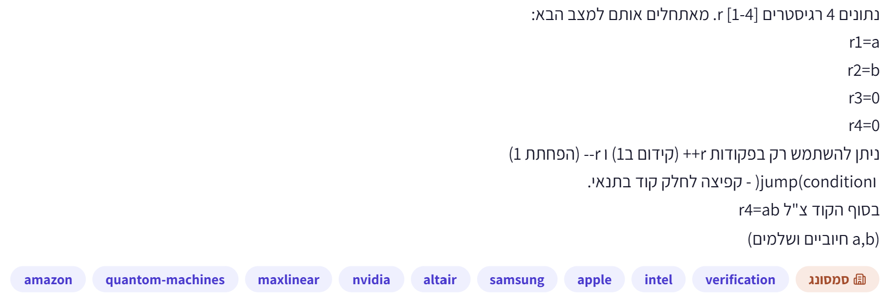

# PREP-035 — כפל באמצעות ארבעה רגיסטרים ופקודות הגדלה והקטנה בלבד



נתונים 4 רגיסטרים r[1-4]. מאתחלים אותם למצב הבא:
r1=a
r2=b
r3=0
r4=0
ניתן להשתמש רק בפקודות r++ (קידום ב־1), r-- (הפחתת 1), ו־jump(condition) — קפיצה לחלק קוד בתנאי.
בסוף הקוד צ״ל r4=ab.
(a,b חיוביים ושלמים)

## סיווג ומקור

תכנות, רגיסטרים, לולאות וקפיצות מותנות. עדיפות בינונית־גבוהה לפי התפקיד שסופק. חברות לפי הצילום בלבד, ללא אימות: Amazon, Quantum Machines, MaxLinear, NVIDIA, Altair, Samsung, Apple, Intel. תגית המקור: verification; תג חברה ראשית: Samsung.

## רמזים

1. איך אפשר לפרק כפל לפעולה פשוטה שחוזרת כמה פעמים?
2. כיצד תוסיף את ערכו של רגיסטר לתוצאה בעזרת הגדלות והקטנות ב־1 בלבד? מה יקרה לערכו המקורי?
3. השתמש ברגיסטר השלישי כדי לזכור כמה יחידות העברת, ואז שחזר את הרגיסטר שנצרך לפני הסיבוב הבא.

## הצעה לפתרון

הצעה לפתרון: כפל הוא חיבור חוזר. נבצע b סבבים, ובכל סבב נוסיף a יחידות ל־r4. אסור להשתמש בפקודת חיבור או העתקה, ולכן בכל צעד מקטינים את r1 ומגדילים גם את r4 וגם את r3. כך r3 זוכר את ערכו של a לאחר ש־r1 מתאפס. אחר כך מעבירים את היחידות מ־r3 חזרה ל־r1 בעזרת הקטנה והגדלה. r2 סופר כמה סבבים נשארו. אין במימוש רגיסטר חמישי, פקודת השמה, חיבור או כפל; האתחול היחיד הוא זה שנתון בשאלה. תוויות וכתובות קוד אינן רגיסטרי נתונים.

הנחות: מותר לבדוק אם רגיסטר שווה או שונה מאפס בפקודת הקפיצה. הרגיסטרים גדולים מספיק למכפלה ואין גלישה. אין דרישה לשמור את r2. הפעולות מתבצעות בטור. אם נדרש לשמור גם את b, זו דרישה נוספת שאינה נכללת בקוד הזה.

```text
OUTER:
    if r2 == 0: jump DONE
    r2--
ADD:
    if r1 == 0: jump RESTORE
    r1--
    r3++
    r4++
    if r1 != 0: jump ADD
RESTORE:
    if r3 == 0: jump OUTER
    r3--
    r1++
    if r3 != 0: jump RESTORE
    if r3 == 0: jump OUTER
DONE:
```

כל if בקוד הוא פקודת קפיצה מותנית אחת, ולא פקודת עיבוד נוספת. שתי הקפיצות האחרונות משלימות את בקרת הלולאה בלי צורך בפקודת קפיצה לא מותנית. DONE מציין את סיום התוכנית, לא פעולה אריתמטית.

נכונות: בכניסה לסבב מספר k, אחרי k סבבים שהושלמו, מתקיים r1=a, r2=b-k, r3=0, r4=k*a. בסבב מקטינים את r2. אחרי j צעדי ADD מתקיים r1=a-j, r3=j, r4=k*a+j. אחרי a צעדים מתקבל r4=(k+1)*a, r1=0, r3=a. RESTORE מחזיר את r1 ל־a ואת r3 לאפס. כך נשמר התנאי לקראת הסבב הבא. אחרי b סבבים r2=0 והתוצאה ab. כל לולאה פנימית מסתיימת כי מונה טבעי קטן עד אפס.

למשל a=3,b=2: תחילה (3,2,0,0). אחרי הפחתת מונה ושלב ההוספה הראשון (0,1,3,3), אחרי השחזור (3,1,0,3). בסיום הסבב השני (3,0,0,6).

בסיום r1=a,r2=0,r3=0,r4=ab. הרחבה: אותו קוד מטפל גם באפס, אף שהמקור מבטיח חיוביים. אין ירידה לערכים שליליים. בקלטים חיוביים הזמן Theta(ab), והמקום ארבעה רגיסטרים, כלומר O(1) רגיסטרים במודל הנתון; אין זו טענת O(1) ביטים לערכים לא חסומים. מספר פקודות ההגדלה וההקטנה הוא 5ab+b, בנוסף לקפיצות. הזמן מיטבי אסימפטוטית במודל הזה: r4 מתחיל מאפס, ורק r4++ יכול להגדילו, ביחידה אחת בלבד; כדי להגיע ל־ab חייבים לפחות ab הגדלות שלו. אין טענה למינימום המדויק של כלל הפקודות או לאופטימליות תחת פקודות חזקות יותר.

תשובה קצרה לראיון: אממש חיבור חוזר. r2 סופר סבבים, r1 נסרק עד אפס תוך הגדלת התוצאה ו־r3, ואז משחזרים מ־r3 את r1 לסבב הבא. ההעתק הזמני חיוני כי החיבור צורך את ערך המקור.

טעויות נפוצות: כתיבת r4+=r1 או r3=r1 למרות האיסור; אי־שחזור r1; שכחת איפוס רגיסטר העזר; שימוש במשתנה לולאה נוסף שאינו אחד מארבעת הרגיסטרים; הנחת רוחב שמאפשר מכפלה ללא בדיקה.

## English

Four registers start at r1=a, r2=b, r3=0, r4=0, where a and b are positive integers. Using only register increment, decrement and conditional jumps, finish with r4=a*b.

Express multiplication as a repeated simpler operation.
How can unit increments and decrements add a register value to the result? What happens to the source?
Use the third register to track transferred units and restore the consumed source before the next repetition.

Proposed solution: repeat addition b times using only unit operations. Decrement r2 once per outer iteration. Transfer r1 down to zero while incrementing both r4 and temporary r3, then restore r1 by decrementing r3 and incrementing r1. No assignments beyond the supplied initial state and no fifth data register are needed. Labels are code addresses. Assume zero/nonzero branch tests are allowed, registers are wide enough without overflow, and r2 need not be preserved.

```text
OUTER:
    if r2 == 0: jump DONE
    r2--
ADD:
    if r1 == 0: jump RESTORE
    r1--
    r3++
    r4++
    if r1 != 0: jump ADD
RESTORE:
    if r3 == 0: jump OUTER
    r3--
    r1++
    if r3 != 0: jump RESTORE
    if r3 == 0: jump OUTER
DONE:
```

At the outer boundary after k iterations the invariant is (r1,r2,r3,r4)=(a,b-k,0,k*a). After j ADD steps, r1=a-j,r3=j,r4=k*a+j. Restoration leaves (a,b-k-1,0,(k+1)*a). After b rounds the result is (a,0,0,ab). Each loop has a decreasing natural counter. Example a=3,b=2: (3,2,0,0), then (0,1,3,3) after first transfer, (3,1,0,3) after restoration, and (3,0,0,6) finally. Both zero inputs also work as an extension. No decrement below zero occurs.

Exactly 5ab+b increment/decrement instructions plus branch overhead. For positive inputs time is Theta(ab), space four registers (O(1) registers, not O(1) bits for unbounded values). This is asymptotically time-optimal for the specified instruction set: starting r4 at zero and only modifying it by one means at least ab increments of r4 are necessary. No claim of exact minimum instruction count. Each if is a conditional branch; DONE is program completion. Do not replace transfers with forbidden assignments or additions, forget restoration, or use hidden extra counters. Interview summary: count repetitions in r2, preserve consumed r1 through temporary r3, restore it after each repeated addition.

Verification: 965 interpreted cases passed. AI-assisted proposal; no expert review.
