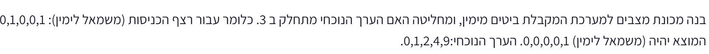
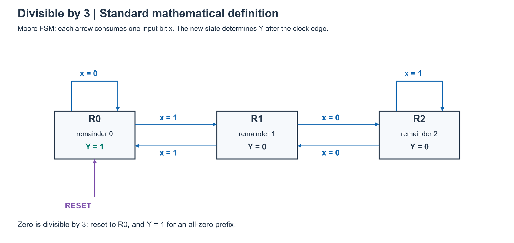
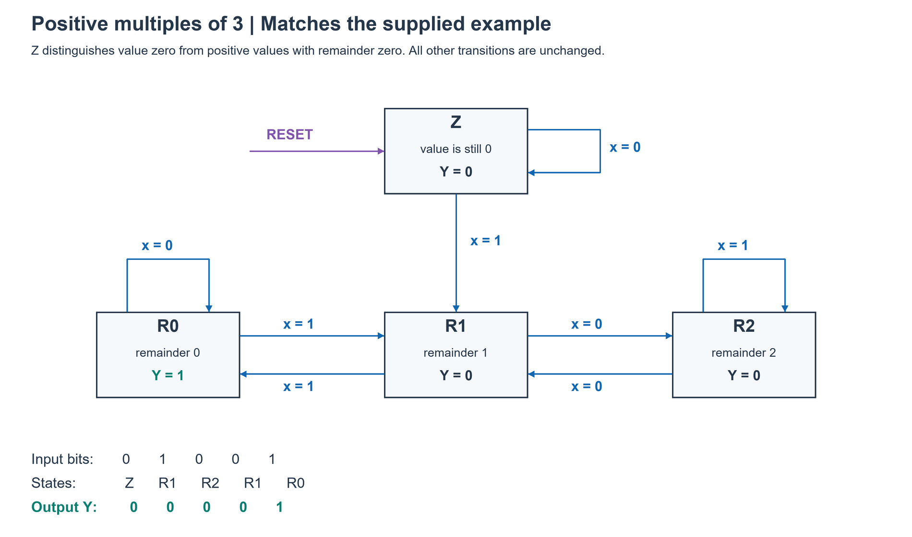
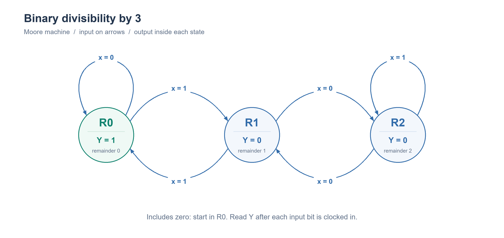
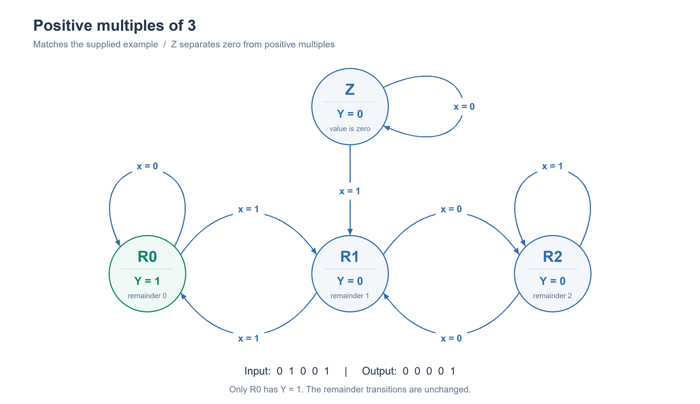
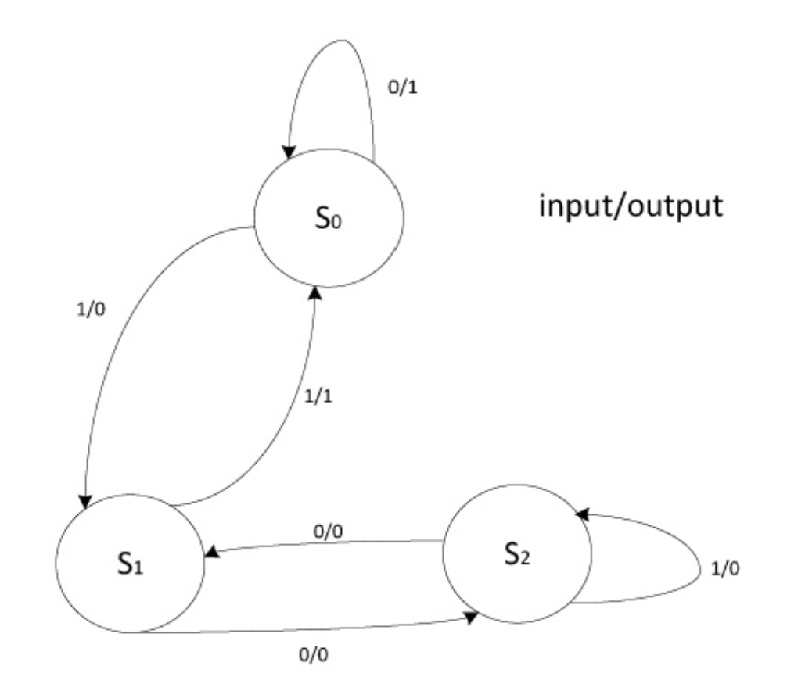

# PREP-036 — מכונת מצבים לבדיקת התחלקות ב־3 של מספר בינארי טורי



בנה מכונת מצבים למערכת המקבלת ביטים מימין, ומחליטה האם הערך הנוכחי מתחלק ב־3. כלומר עבור רצף הכניסות (משמאל לימין): 0,1,0,0,1 המוצא יהיה (משמאל לימין) 0,0,0,0,1. הערך הנוכחי: 0,1,2,4,9.

## סיווג

FSM, לוגיקה סדרתית, שאריות, איפוס ומקרי קצה. עדיפות גבוהה לפי התפקיד שסופק. לא מופיעות תגיות חברה בצילום. שאלה חדשה, קשורה ל־PREP-010 אך אינה אותה משימת מונה.

## רמזים

1. מה הקשר בין הערך הישן לערך החדש כאשר מצרפים ביט מימין לייצוג בינארי?
2. האם צריך לזכור את כל המספר, או שמספיק לזכור מידע מצומצם כדי לדעת אם הוא מתחלק ב־3?
3. עקוב אחרי השארית בחלוקה ל־3: לכל שארית ולכל ביט כניסה חשב את השארית הבאה. בדוק בנפרד כיצד לפרש את המוצא שניתן בדוגמה עבור אפס.

## הצעה לפתרון

הצעה לפתרון — תחילה מבהירים את הדוגמה. צירוף ביט מימין פירושו הכפלת הערך הקודם ב־2 והוספת הביט. אין פירושו שהביטים מגיעים בסדר LSB-first: רצף 01001 בונה בהדרגה את הערכים 0,1,2,4,9. נניח ביט תקף אחד בכל חזית שעון ומוצא המתאר את הערך אחרי קליטת הביט. באיפוס מתחילים מערך אפס.

יש סתירה בין התנאי המתמטי לדוגמה: אפס מתחלק ב־3, ולכן התנאי הרגיל מחזיר 1 בביט הראשון. אין לשנות את ההגדרה בשקט. יש להציג שתי אפשרויות: דוגמה שגויה באיבר הראשון, או דרישה לזהות כפולות חיוביות בלבד. בפרשנות השנייה מוסיפים הבחנה בין ערך אפס לבין כפולה חיובית של 3. אם הכוונה במקום זאת לאות valid מיוחד, צריך להגדיר אותו; הוא אינו נתון.

### אפשרות א — התחלקות רגילה, כולל אפס

מספיק לשמור רק את השארית r ולא את המספר הגדל. אם V=3q+r, אז 2V+x=6q+2r+x, ולכן השארית הבאה תלויה רק ב־r ובביט x:

```text
V_next = 2*V + x
r_next = (2*r + x) mod 3
```

שלושה מצבי Moore: R0,R1,R2 מציינים שאריות 0,1,2. המצב ההתחלתי R0. המוצא 1 רק ב־R0.

| מצב נוכחי | x=0 | x=1 | מוצא במצב |
|---|---|---|---|
| R0 | R0 | R1 | 1 |
| R1 | R2 | R0 | 0 |
| R2 | R1 | R2 | 0 |

לדוגמה R2 עם ביט 1: הערך הרלוונטי לשארית הוא 2*2+1=5, והשארית 2, ולכן נשארים ב־R2. אין צורך לממש מחלק או לשמור מספר בלתי מוגבל: טבלת המעברים היא לוגיקה צירופית קטנה.

לכניסה 01001 נקבל R0,R1,R2,R1,R0 ומוצאים 1,0,0,0,1. זהו הפתרון לניסוח המתמטי אך לא לפלט הראשון שבצילום.

### אפשרות ב — התאמה מדויקת לדוגמה: כפולות חיוביות בלבד

נוסיף מצב Z: הערך המצטבר עדיין אפס, כלומר לא נקלט אף 1. R0 יתאר מעתה כפולה חיובית של 3. מתחילים ב־Z, והמוצא בו 0. אחרי שנקלט 1, המספר חיובי ולעולם לא יחזור לאפס באמצעות הוספת ביטים מימין.

| מצב נוכחי | x=0 | x=1 | מוצא במצב |
|---|---|---|---|
| Z | Z | R1 | 0 |
| R0 | R0 | R1 | 1 |
| R1 | R2 | R0 | 0 |
| R2 | R1 | R2 | 0 |

ברצף 01001 המצבים לאחר כל ביט הם Z,R1,R2,R1,R0, ולכן המוצא 0,0,0,0,1, בדיוק בדוגמה. גם כל רצף אפסים מחזיר 0, לפי פרשנות הכפולות החיוביות.

### מימוש, נכונות ומינימליות

בשתי האפשרויות מספיקים שני DFF, כי צריך לקודד שלושה או ארבעה מצבים. המוצאים Q נכנסים יחד עם x ללוגיקת המצב הבא; שני ביטי התוצאה מזינים את D של שני ה־FF. לוגיקת המוצא מפענחת R0 מן המצב הרשום. אפשר לקודד בפתרון החיובי Z=00,R0=01,R1=10,R2=11; המוצא הוא NOT(Q1) AND Q0, והמעברים נקבעים מהטבלה. בפתרון הרגיל אפשר R0=00,R1=01,R2=10 ולקבוע התאוששות מהקוד הלא־בשימוש 11 אל R0. איפוס חייב לבחור את הקוד המתאים לפרשנות. אם אין ביט תקף בחלק מהמחזורים, יש להוסיף enable לשמירת המצב; זה אינו נדרש בנוסח.

הוכחת נכונות באינדוקציה: באיפוס השארית נכונה; הנוסחה לעיל משמרת את השארית בכל קליטת ביט, ופענוח R0 מחזיר בדיוק את ההתחלקות. במכונה החיובית Z משמר את ההבחנה בין ערך אפס לערך חיובי, ומאז המעבר הראשון ל־R1 אי אפשר לחזור לאפס.

שלושה מצבי Moore הם מינימום בהגדרה הרגילה: R0 מובחן משני האחרים במוצא הנוכחי, ו־R1 מובחן מ־R2 על ידי סיומת 1. ארבעה הם מינימום בפרשנות החיובית: R0 מובחן מכולם במוצא; R1 לעומת R2 וגם Z לעומת R1 מובחנים בסיומת 1; Z לעומת R2 בסיומת 01. כל המצבים נגישים מאיפוס. שתי סיביות זיכרון הן לכן מינימום למימוש Moore בינארי זה. אין טענה למינימום שערים, להסרת גליצ'ים או למבנה Mealy מינימלי; המינימליות כאן מתייחסת למכונה ולתזמון המוצא שהוגדרו.

תשובה קצרה לראיון: צירוף ביט מימין משנה את הערך ל־2V+x. כדי לבדוק חלוקה ב־3 מספיק לזכור את השארית, ולבנות טבלה עבור שלוש שאריות ושני ביטי כניסה. הדוגמה אינה מקבלת את אפס, ולכן אברר אם זו טעות או שנדרשות כפולות חיוביות; במקרה החיובי אפריד את מצב האפס.

טעויות נפוצות: בלבול בין צירוף ביט מימין לבין קבלת LSB ראשון; מונה שסופר אחדות או מחזורים במקום ערך בינארי; מוצא לפי מצב ישן בלי להסביר תזמון; התעלמות מאפס; שמירת המספר כולו ברגיסטר שרוחבו מוגבל. זו שאלה בעדיפות גבוהה לתרגול FSM, מצבים, איפוס ומקרי קצה, על בסיס התפקיד שסופק, ללא תחזית לשאלת ראיון. בצילום אין תגיות חברות.

## English

Build an FSM receiving bits appended on the right and deciding whether the current value is divisible by 3. For input bits (left to right) 0,1,0,0,1, the given outputs are 0,0,0,0,1 and the successive values are 0,1,2,4,9.

How does appending a bit on the right change a binary value?
Must you retain the full number, or is a smaller summary sufficient for divisibility?
Track the remainder modulo 3. Compute the next remainder for every current remainder and input bit, and separately clarify the example output at zero.

Proposed solution: a bit appended on the right gives V_next=2V+x (not an LSB-first weighted stream). Assume one valid bit per active clock edge and a Moore output describing the value after that edge, reset value zero. Only the remainder is needed: if V=3q+r, then 2V+x=6q+2r+x, so r_next=(2r+x) mod 3.

The source is ambiguous: mathematically zero is divisible by 3, but the sample outputs zero for the first zero value. Do not silently ignore this. Ordinary divisibility needs three Moore states with reset R0, output one in R0 only, and transitions R0:(0->R0,1->R1), R1:(0->R2,1->R0), R2:(0->R1,1->R2). Sample 01001 then yields outputs 10001, correcting the first sample output.

To match the sample by recognizing positive multiples only, add reset state Z with output zero and transitions 0->Z,1->R1. Keep the other three states/transitions; R0 now denotes a positive multiple. The same input visits Z,R1,R2,R1,R0 and yields 00001 exactly. Leading/all zeros stay Z. Once positive, appending bits cannot return to zero. A separate input-valid interpretation would require an additional specification; it is not supplied.

Both versions require two DFFs plus next-state combinational logic and output decode. Positive encoding Z=00,R0=01,R1=10,R2=11 gives output NOT(Q1) AND Q0; implement next state from the table. Ordinary encoding R0=00,R1=01,R2=10 can recover unused 11 to R0. Reset differs by encoding; if not every cycle has a valid bit, add a hold enable. No divider or growing value register is needed.

Induction on received bits proves the remainder invariant; in the positive version the extra state tracks whether the value is still zero. Moore-state minimality: R0 differs from every other state immediately; R1/R2 and Z/R1 differ after suffix 1, Z/R2 after suffix 01. All states are reachable. Thus three or four states respectively are minimal under this Moore output/reset model, and two state bits suffice and are necessary. No gate-count or Mealy-minimality claim.

Interview summary: track remainder via (2r+x) modulo 3, clarify zero, then give the transition table and reset/output timing. Avoid confusing appended bits with LSB-first, counting ones, omitting reset, ignoring zero or returning a stale pre-edge output. High preparation priority based on FSM design and validation boundary cases in the supplied role; no company tags are visible in this screenshot.

Verification: 8191 words, 90114 prefixes, both models and state distinction passed. AI-assisted; no expert review, HDL simulation or synthesis claimed.


## שרטוטי מכונת המצבים

כל חץ מסומן בביט הכניסה, ובכל קופסה רשום המוצא של המצב.






## השרטוטים המועדפים — מצבים עגולים וחצים מעוגלים

לפי בקשת המשתמש, מכונות מצבים מוצגות בעיגולים ובחצים מעוגלים. שרטוטי רכיבים יישארו בקופסאות. תמונת הסגנון משתמשת בסימון Mealy על החצים; הפתרונות שלנו נשארים Moore והמוצא בתוך המצב.






