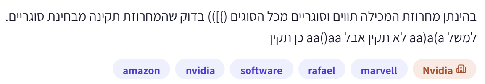

# PREP-037 — בדיקת תקינות סוגריים במחרוזת עם טקסט



בהינתן מחרוזת המכילה תווים וסוגריים מכל הסוגים: (), [], {} — בדוק שהמחרוזת תקינה מבחינת סוגריים. למשל aa)a(a לא תקין אבל aa()aa כן תקין.

## רמזים

1. מה חייב להתאים לסוגר הסוגר הבא: הפותח הראשון, או הפותח האחרון שעדיין לא נסגר?
2. איזה מבנה נתונים מאפשר להוציא קודם את האיבר שנכנס אחרון?
3. שמור פותחים במחסנית. בכל סוגר סוגר בדוק שיש פותח זמין ושהסוג מתאים; בסיום בדוק שלא נשארו פותחים.

## הצעה לפתרון

הצעה לפתרון: משתמשים במחסנית — מבנה שבו האחרון שנכנס הוא הראשון שיוצא, כמו ערימת צלחות. הסיבה אינה רק מספר הפותחים והסוגרים: בסוגריים מקוננים, הפותח האחרון שעדיין לא נסגר חייב להיסגר ראשון. למשל ב־([ ]) צריך לסגור את הסוגריים המרובעים לפני העגולים.

עוברים על המחרוזת משמאל לימין. סוגר פותח נכנס למחסנית. בסוגר סוגר, אם המחסנית ריקה מחזירים שקר; אחרת מוציאים את הפותח האחרון ובודקים שסוגו מתאים לסוגר הנוכחי. אי־התאמה מחזירה שקר. מתעלמים מתווים שאינם סוגריים. בסוף מחזירים אמת רק אם המחסנית ריקה.

```text
stack = empty stack

for each character c in the string:
    if c is '(' or '[' or '{':
        push(stack, c)

    else if c is ')' or ']' or '}':
        if stack is empty:
            return FALSE

        opening = pop(stack)
        if opening and c are not a matching pair:
            return FALSE

return (stack is empty)
```

זוגות חוקיים הם רק (), [], {}. פעולות push ו־pop מוסיפות לראש המחסנית ומוציאות ממנו. אפשר לממש במחסנית שהיא מערך עם אינדקס לראש: אין צורך במבנה נתונים מתקדם. בדיקת סוגים היא השוואה בין שלושת הזוגות; מיפוי קבוע אינו גדל עם אורך המחרוזת.

דוגמה תקינה a{b[c](d)}: אחרי { המחסנית {; אחרי [ היא {[; אחרי ] היא {; אחרי ( היא {(; אחרי ) היא {; אחרי } היא ריקה. האותיות אינן משנות את המחסנית. ב־([)] הכמויות מאוזנות לכל סוג, אבל כשהגיע ) בראש המחסנית יש [, ולכן דוחים מיד. ב־] מחסנית ריקה כבר בתו הראשון; ב־(( אין שגיאה בזמן הסריקה אבל המחסנית אינה ריקה בסוף. לכן כל שלוש הבדיקות נדרשות: אין סגירה בלי פתיחה, התאמת סוג בסדר קינון, ואין פתיחות שנותרו בסוף.

נכונות: אחרי כל קידומת שלא נדחתה, המחסנית מכילה בדיוק את הפותחים שעדיין לא נסגרו, לפי סדר הופעתם; האחרון בראש. פותח מוסיף פריט; סוגר מתאים מסיר רק את הפותח שצריך להיסגר כעת. סוגר לא מתאים או ללא פותח מעיד על הפרת קינון שכבר אי אפשר לתקן בהמשך. בסוף מחסנית ריקה שקולה לכך שכל הפתיחות נסגרו באופן תקין. מחרוזת ריקה או מחרוזת בלי סוגריים תקינות בהנחה שמבקשים תקינות ולא קיום סוגריים.

סיבוכיות: זמן O(n), ובמקרה הגרוע Theta(n), כי כל תו נסרק פעם אחת וכל סוגר נדחף ונשלף לכל היותר פעם אחת. זה מיטבי בסדר הגודל לבדיקת מחרוזת כללית, שבה שינוי תו שלא נקרא עלול לשנות תקינות. זיכרון O(d), כאשר d הוא מספר הפותחים המרבי בו־זמנית במחסנית, עד O(n) במקרה הגרוע. בקלט תקין זה עומק הקינון המרבי. אין טענה למינימום זיכרון גלובלי תחת כל מודל מעברים או שינוי קלט. אם יש רק סוג אחד של סוגריים מספיק מונה, בתנאי שבודקים שאינו נעשה שלילי ושבסוף הוא אפס; עבור שלושה סוגים מונים בלבד אינם שומרים את סדר הסגירה הדרוש.

הנחות: שלושת סוגי הסוגריים בלבד מיוחדים; כל שאר התווים נחשבים טקסט רגיל. אין כאן ניתוח שפת תכנות: סוגריים בתוך מחרוזות מצוטטות או הערות עדיין נחשבים סוגריים, כי המקור לא הגדיר חוקי ציטוט/escape. אין צורך לשנות את הקלט או לבצע רקורסיה. אם נדרשים כללי שפה, יש להוסיף שלב לקסיקלי לפני בדיקת הסוגריים.

תשובה קצרה לראיון: אסרוק פעם אחת עם מחסנית של פותחים. בסוגר סוגר אבדוק שהמחסנית אינה ריקה ושהוא מתאים לפותח שבראשה. בסוף אדרוש מחסנית ריקה. זמן לינארי וזיכרון לפי עומק הקינון, עד לינארי.

טעויות נפוצות: הסתפקות בספירת פותחים וסוגרים; התעלמות מסוג הסוגר; pop ממחסנית ריקה; החזרת אמת למרות פותחים שנותרו בסוף; דחיית אותיות למרות שהמקור מתיר אותן; שימוש בחיתוכים/מחיקות חוזרות שמביא לזמן ריבועי. פתרון המחיקות החוזרות משמש כאן אורקל בדיקה עצמאי בלבד ואינו הפתרון המומלץ.

נמצאה שאלה מקבילה SW-008 במאגר example_question. שם הקלט מכיל סוגריים בלבד; צילום זה מתיר גם טקסט ומוסיף תגיות חברות. הרשומה כאן מקושרת אליה, ואין לייחס בדיעבד חברות לשאלת SW-008 שנכתבה באופן עצמאי. חברות בצילום הן דיווח לא מאומת: Amazon, NVIDIA, Rafael, Marvell. תגית תוכן: software; תג החברה הראשית NVIDIA. עדיפות בינונית־גבוהה לתרגול קצר לקראת התפקיד שסופק, כי זה תרגיל בסיסי בקוד, סדר פעולות ובדיקת מקרי קצה; אין בכך תחזית לשאלת הראיון.

## English

Given a string containing text and all three bracket types (), [], {}, check whether its brackets are valid. For example aa)a(a is invalid, whereas aa()aa is valid.

Which opener must match the next closer: the first, or the most recent still unmatched one?
Which structure returns the last item inserted first?
Push openers. For a closer, require a nonempty stack with a matching top. At the end require no unmatched openers.

Proposed solution: use a stack of unmatched opening brackets. Last-in-first-out matches nesting: the most recently opened, still unmatched bracket must close first. Scan left to right; push (, [ or {. For ), ] or }, reject if empty, otherwise pop and require the corresponding type. Ignore other characters. Accept at the end only when the stack is empty.

```text
stack = empty stack

for each character c in the string:
    if c is '(' or '[' or '{':
        push(stack, c)

    else if c is ')' or ']' or '}':
        if stack is empty:
            return FALSE

        opening = pop(stack)
        if opening and c are not a matching pair:
            return FALSE

return (stack is empty)
```

The stack can be an array with a top index. The only matching pairs are (), [], {}. Example a{b[c](d)} leaves successive stacks {, {[, {, {(, {, empty when considering bracket characters. ([)] has equal counts of every type but fails when ) encounters [ on top. ] fails immediately; (( fails at end. Empty text and text without brackets are valid under the stated assumption.

Invariant: after every nonrejected prefix the stack contains exactly unmatched openers in order. Push preserves it; a matching closer removes precisely the required opener. Empty-stack closing and type mismatch are irreparable prefix violations. Final emptiness proves all openers were properly closed. Complexity O(n) time, Theta(n) worst-case and asymptotically optimal for arbitrary input inspection. Auxiliary memory O(d), the maximum concurrent unmatched-openers count, up to O(n). No global space-minimality claim over alternate computational models. For one bracket type a nonnegative-prefix counter ending at zero suffices; several type counts alone lose nesting order.

Assume all nonbracket text is ignored; this is not a programming-language lexer, so no special treatment of quotes, comments or escapes is specified. No recursion or input mutation is needed. Typical bugs: counting only, wrong pair types, popping empty, forgetting final emptiness, rejecting allowed letters, or repeated deletions with quadratic runtime. Repeated adjacent-pair deletion is used only as an independent test oracle.

Interview answer: one pass, push openers, match/pop each closer, require final emptiness; linear time and depth-bounded stack space. Related existing SW-008 limits input to brackets; this source permits ordinary text and supplies unverified Amazon/NVIDIA/Rafael/Marvell tags. Do not transfer those tags to the independently authored original. Medium-high priority for a short basic coding/edge-case review, based on the supplied role rather than a prediction.

Verification: 57000 test cases passed. AI-assisted proposal, no independent expert review.
