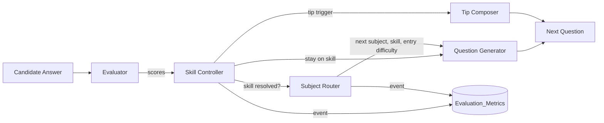
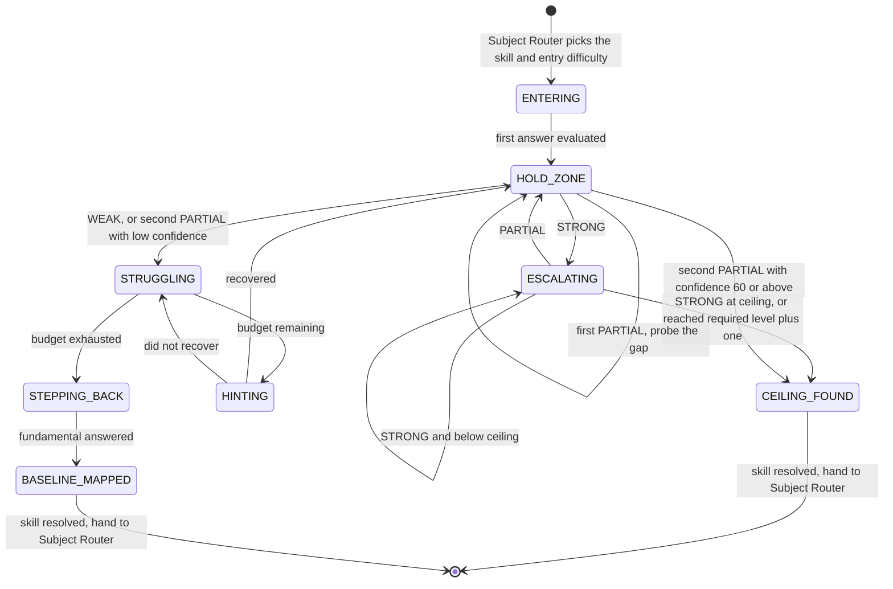
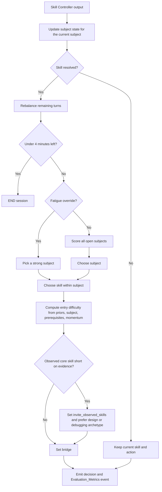
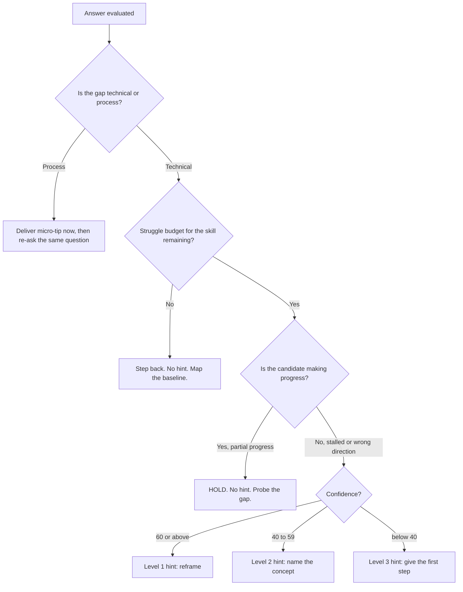
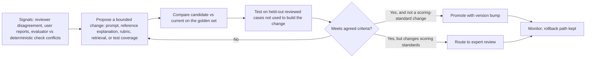

# AI Engine Specification
## AI-Based Interview Preparation Platform – Phase 1

| Field | Value |
|---|---|
| Document Version | 2.1 |
| Change from 1.0 | Skill-set evaluation (levels 1–5, required levels, scorecards) and a second adaptation layer: the **Subject Router**, which steers the interview across subjects based on performance on previous questions |
| Change from 2.0 | Three practice modes with evidence weights, bank-first question selection, deterministic checks, calibration, the **Plan Router** across days, learning-mode answer reveal, and the coach improvement loop |
| Components | Evaluator, Decision Engine (Skill Controller + Subject Router), Question Generator, Tip Composer |
| Design Goal | Deterministic, auditable adaptation driven by structured scores |

---

## 1. Engine Overview

The AI Engine is four cooperating components with a strict division of labor:

| Component | Type | Uses LLM? | Responsibility |
|---|---|---|---|
| **Evaluator** | Structured-output LLM call | Yes | Scores the candidate's last answer on fixed dimensions |
| **Decision Engine** | Deterministic code | No | Updates skill and subject scores; decides the next action, the next skill, the next subject, and the next difficulty |
| **Question Generator** | Streaming LLM call | Yes | Writes the next question exactly as the Decision Engine specifies |
| **Tip Composer** | Templated + LLM polish | Yes | Renders an actionable tip from the `Tips_Library` |

The Decision Engine has two layers that run in order on every turn:

| Layer | Name | Question It Answers | Scope |
|---|---|---|---|
| 1 | **Skill Controller** | "Stay on this skill? Go harder, hold, hint, or step back?" | Inside one skill |
| 2 | **Subject Router** | "Which subject and which skill next? At what difficulty? How much more time does each subject get?" | Across subjects |

**Why the Decision Engine is not an LLM:** decisions must be reproducible, explainable, tunable, and cheap. The LLM decides *how to phrase the question*; code decides *what to ask and how hard*.

### 1.1 The Engine Across Three Modes

The same components serve all three practice modes. What changes is the container, the source of questions, and the evidence weight.

| Mode | Question Source | Skill Controller | Subject Router | Answer Reveal | Report |
|---|---|---|---|---|---|
| **Quick Practice** | Bank only | Not used (one item) | Not used | Explanation shown after answering | Profile update only |
| **Deep Practice** | Bank question; AI-generated follow-ups and variations | Used for follow-ups (hold, hint, step back, one escalation) | Not used | Reference revealed after a real attempt | Short feedback card |
| **Interview Simulation** | Bank first; generated where the bank has no fit | Full | Full | Hidden until the report | Full report with scorecards |

Above all three sits the **Plan Router** (§4.11), which chooses the next activity across days.

### 1.2 Bank-First Question Selection

When the Decision Engine has fixed a target skill, difficulty, and archetype, the question source is chosen in this order:

1. A `published` bank question whose primary skill matches, difficulty within ±1, format fits the archetype, `familiarity = new` for this user, and language available. Prefer the least-served question.
2. A bank **variation** the user has not seen, when only a seen base question matches.
3. An **AI-generated** question, labeled `origin = ai_generated`, when nothing in the bank fits. In deep practice this is only allowed for follow-ups. In simulation it is allowed for any turn and the report marks the turn as "generated, not reviewed".

Every question served, bank or generated, is recorded on the turn or attempt with its source and version.



---

## 2. Scores, Levels, and Evidence

### 2.1 What Is Tracked

| Unit | Tracked Values | Updated |
|---|---|---|
| **Skill** (leaf of the catalog) | knowledge `k`, confidence `c` (0–100), demonstrated ceiling, provisional level 1–5, status, struggle budget | Every turn that targets the skill; observed skills every turn |
| **Subject** (domain in the catalog) | aggregated `k`, `c`, provisional level, coverage, status, momentum | Every turn, from its skills |
| **Session** | global `k`, `c`, recent actions, elapsed time, remaining plan | Every turn |

### 2.2 Knowledge and Confidence

- **Knowledge `k`**: what the candidate demonstrably knows. Driven by `correctness` and `depth`, scaled by question difficulty.
- **Confidence `c`**: how securely they know it. Driven by `hedging_ratio`, response latency, revision count, `clarity`, and hints used.

High `k` with low `c` (knows it, second-guesses) and low `k` with high `c` (assertively wrong) are both important Phase 2 signals and need different coaching.

### 2.3 Evaluator Output Schema

The Evaluator returns exactly this JSON (validated with Pydantic; one retry on failure, then a fallback `HOLD`):

```json
{
  "correctness": 0.62,
  "depth": 0.50,
  "clarity": 0.70,
  "structure": 0.55,
  "tradeoff_reasoning": 0.30,
  "risk_awareness": 0.35,
  "hedging_ratio": 0.28,
  "rubric_level_estimate": 3,
  "key_points_hit": ["unique tag per request", "associative array lookup"],
  "key_points_missed": ["tag reuse", "overflow when outstanding exceeds tag space"],
  "misconceptions": [],
  "behavior_signals": ["jumped_to_implementation"],
  "one_line_summary": "Tag-based matching proposed; no handling of tag exhaustion."
}
```

`rubric_level_estimate` is the Evaluator's read of which proficiency level (1–5) the answer demonstrates, judged against the skill's `proficiency_rubric` from the catalog. It is one input to the level, not the level itself.

**Evaluator inputs, in order of authority:**

| Input | Role |
|---|---|
| Deterministic check result (`Data_Models.md` §13.4), when the question has one | Sets a floor or ceiling on `correctness`: a failed truth table caps correctness at 0.4; a pass raises the floor to 0.6 but does not set 1.0, because reasoning and explanation still count |
| The question's `rubric`, `requirements`, and `accepted_approaches` | The scoring frame; an alternative valid approach is never penalized |
| The question's `common_errors` and, for multiple choice, distractor misconceptions | Populates `misconceptions` with stable keys |
| The skill's `proficiency_rubric` | Drives `rubric_level_estimate` |
| Company emphasis | Applied after scoring (§2.8) |

The Evaluator is called in the user's practice language with the rubric and reference in that same language.

### 2.4 Score Update Rules

Let `d` be the question difficulty (1–10) and `D` the session's difficulty ceiling.

```
difficulty_factor = 0.6 + 0.4 * (d / D)

raw_knowledge  = 100 * (0.65 * correctness + 0.35 * depth)
k_new          = k_old + a_k * difficulty_factor * (raw_knowledge - k_old)

raw_confidence = 100 * (0.35 * clarity
                        + 0.25 * (1 - hedging_ratio)
                        + 0.20 * latency_norm
                        + 0.20 * (1 - revision_norm))
hint_penalty   = 8 * hint_level
c_new          = c_old + a_c * (raw_confidence - hint_penalty - c_old)
```

| Parameter | Default | Notes |
|---|---|---|
| `a_k` | 0.45 | First two turns on a skill use 0.6 so the prior is replaced quickly |
| `a_c` | 0.35 | Confidence is smoother |

### 2.5 Priors: Where a Skill Starts Before Its First Question

A skill's starting `k` and `c` are **not** a fixed seniority number. They come from evidence already collected, in this order of preference:

| Source | How the Prior Is Set | Trust |
|---|---|---|
| **Same skill, earlier session** | `k`, `c` from `User_Skill_Profile`, decayed 10% per 30 days | High |
| **Prerequisite skills this session** | Mean `k` of assessed prerequisites, minus 10 | Medium |
| **Same subject this session** | Subject `k` (§4.2), minus 5 | Medium |
| **Seniority default** | junior 40, mid 55, senior 65, staff 72, principal 78 | Low |

The prior is recorded in `Evaluation_Metrics.knowledge_score_before` on the skill's first turn so its effect is auditable. A prior is only a starting point; two turns of real evidence replace it almost entirely.

### 2.6 From Scores to a Proficiency Level

At session end, each **questioned** skill gets a level 1–5 as follows:

```
level_from_ceiling  = map demonstrated_ceiling (1..10) onto 1..5:
                        ceiling 1-2 → 1, 3-4 → 2, 5-6 → 3, 7-8 → 4, 9-10 → 5
level_from_rubric   = evidence-weighted mean of rubric_level_estimate over the skill's turns
level_score         = 0.5 * level_from_ceiling + 0.35 * level_from_rubric + 0.15 * (k / 20)
proficiency_level   = round(level_score), clamped to 1..5

Adjustments:
  a level-3 hint on the skill caps proficiency_level at (level at that difficulty) - 1
  a misconception on a core concept caps proficiency_level at 2
```

**Evidence rules** (from `Data_Models.md` §7.1 `status`):

| Turns on the Skill | Status | Reported As |
|---|---|---|
| 0 | `not_assessed` | "Not covered this session" |
| 1 | `insufficient_evidence` | Level shown with a "provisional" label; excluded from fit score |
| 2 or more, or 1 STRONG answer at or above the required difficulty | `assessed` | Level shown; counts toward fit score |

### 2.7 Observed Skills

Observed skills (for example `risk_awareness`, `tradeoff_reasoning`, `structured_communication`) never get their own question. On **every** turn the matching Evaluator dimension is recorded against them:

```
observed_mean = Σ (dimension_score_t × relevance_t) / Σ relevance_t

relevance_t = 1.0 if the question archetype naturally invites the skill
              (design and debugging for risk_awareness; design for tradeoff_reasoning)
              0.5 otherwise

proficiency_level = 1 if mean < 0.30, 2 if < 0.45, 3 if < 0.60, 4 if < 0.78, else 5
status            = assessed once n ≥ 5 turns with relevance 1.0, otherwise insufficient_evidence
```

The Subject Router makes sure observed skills get enough relevant turns by asking the generator to `invite_observed_skills` when their evidence count is low (§4.7).

### 2.8 Company Rubric Modifiers

Before the score update, the Evaluator dimensions are multiplied by the company's emphasis weights (derived from its `Company_Skill_Set`: each observed skill's weight raises the multiplier on its matching dimension) and renormalized. The same answer earns different scores at different companies, exactly as it would in reality. Company modifiers apply only when the session or attempt targets that company, and every modifier traces to a `Company_Evidence` record.

### 2.9 Evidence Weight by Mode and Condition

Not every answer is equal evidence. Each attempt or turn carries an `evidence_weight` that scales the score update (`a_k` and `a_c` are multiplied by it) and the level computation.

```
evidence_weight = base(mode) × familiarity × assistance × exposure × reveal

base(mode):      quick 0.3, deep 1.0, simulation 1.0, diagnostic 0.5, retention_check 1.2
familiarity:     new 1.0, seen_variation 0.7, seen_same 0.4
assistance:      no hint 1.0, level-1 hint 0.8, level-2 0.6, level-3 0.4
exposure:        question exposure_risk low 1.0, medium 0.85, high 0.6
reveal:          reference revealed before submit 0.0, otherwise 1.0
```

Consequences:

- A correct multiple-choice answer moves a skill a little. An independently constructed solution to a new problem moves it a lot.
- A retention check (the same skill, an unfamiliar problem, several days later) is the strongest evidence, because it shows retention and transfer.
- Reading the reference first and then answering produces no evidence. The attempt still counts for the streak.

### 2.10 Calibration

In deep practice the user rates their confidence 1 to 5 before answering. Per subject:

```
calibration_error = mean(self_confidence_before / 5 − correctness)
   > +0.25  overconfident
   < −0.25  underconfident
   else     well-calibrated
```

Calibration adjusts the confidence score prior (§2.5) by ±5 and unlocks dedicated tips. It is reported as a trend and never as a label on the person.

### 2.11 Progress Versus Proficiency

The profile stores both. **Proficiency** is the current level (`Data_Models.md` §7.3). **Progress** is the change in level on comparable, unfamiliar problems over a period. Progress is celebrated and shown with its evidence, but it never raises proficiency by itself and never becomes a claim about learning ability or job fit. Rewards for progress are computed only from attempts made after a diagnostic, so a poor initial diagnostic cannot be gamed for later "improvement".

---

## 3. Layer 1: The Skill Controller

Runs when the current turn targeted a questioned skill. It decides whether to stay on the skill and what to do there.

### 3.1 Answer Classification

| Band | Condition (after company modifiers) |
|---|---|
| `STRONG` | `correctness ≥ 0.75` AND `depth ≥ 0.55` |
| `PARTIAL` | `correctness ≥ 0.45` AND not STRONG |
| `WEAK` | `correctness < 0.45` OR a listed misconception on a core concept |

### 3.2 Skill State Machine



### 3.3 Transition Table

| Current State | Band | Confidence | Budget | Action | Difficulty | Reason Code |
|---|---|---|---|---|---|---|
| HOLD_ZONE | STRONG | any | — | `ESCALATE` | +1 (+2 if `c ≥ 80` and `depth ≥ 0.8`) | `strong_answer` |
| ESCALATING | STRONG, below ceiling | any | — | `ESCALATE` | +1 | `sustained_strength` |
| ESCALATING | STRONG at ceiling | any | — | resolve → Router | — | `ceiling_reached` |
| ESCALATING | STRONG at required level + 1 | any | — | resolve → Router | — | `requirement_exceeded` |
| ESCALATING | PARTIAL | any | — | `HOLD` | 0 | `probe_gap_after_escalation` |
| HOLD_ZONE | PARTIAL (1st) | any | — | `HOLD` | 0 | `probe_gap` |
| HOLD_ZONE | PARTIAL (2nd) | `c ≥ 60` | — | resolve → Router | — | `ceiling_found_soft` |
| HOLD_ZONE | PARTIAL (2nd) | `c < 60` | > 0 | `HINT` level 1 | 0 | `partial_low_confidence` |
| HOLD_ZONE / ESCALATING | WEAK | any | > 0 | `HINT` level 1 | 0 | `weak_answer_budget_available` |
| HINTING | STRONG or PARTIAL | any | — | `HOLD` | 0 | `recovered_after_hint` |
| HINTING | WEAK | any | > 0 | `HINT` level +1 | 0 | `escalate_hint` |
| HINTING / STRUGGLING | WEAK | any | 0 | `STEP_BACK` | −2, floor at prerequisite minimum | `budget_exhausted` |
| STEPPING_BACK | any | any | — | resolve → Router | — | `baseline_mapped` |

**`requirement_exceeded`** is new. Once a candidate answers STRONG one level above the skill's required level, the skill is resolved. There is no value in pushing further on a skill they already exceed, and the time goes to subjects with open questions.

**Struggle budget:** each skill starts with `struggle_budget_per_skill` (default 2). Coach Mode hint requests consume it too.

### 3.4 Step-Back Target

1. If the skill has a prerequisite in `Skill_Dependency`, step back to that prerequisite at its `min_difficulty + 1`.
2. Otherwise stay on the same skill at `max(min_difficulty, current − 2)` with a `conceptual` archetype.

One clean fundamental question settles whether the gap is conceptual or situational.

---

## 4. Layer 2: The Subject Router

Runs after every turn. It updates subject state, and when the Skill Controller resolves a skill (or on a forced switch), it chooses the next subject, the next skill, and the entry difficulty. **This layer is how previous questions shape which subjects come next and how hard they start.**

### 4.1 Subjects

A subject is a domain node in the Skill Catalog. The session's subjects are the domains of the skills in the `Session_Skill_Plan`. Each subject inherits:

- `weight` = sum of its skills' combined weights in the plan
- `importance` = highest importance among its skills
- `planned_turns` = sum of its skills' planned turns
- `required_level` = weighted mean of its skills' required levels

### 4.2 Subject State

Updated after every turn from the subject's skills.

```
subject.k        = Σ (skill.k × skill.weight)  / Σ skill.weight     over skills with ≥ 1 turn
subject.c        = same for c
subject.level    = Σ (skill.provisional_level × skill.weight) / Σ skill.weight
subject.coverage = skills_resolved / skills_planned
subject.turns    = turns spent so far
subject.momentum = mean band of the last 3 answers in the subject
                   (STRONG = +1, PARTIAL = 0, WEAK = −1)
```

**Subject status:**

| Status | Rule |
|---|---|
| `untouched` | No turns yet |
| `exploring` | 1–2 turns, no clear signal |
| `strong` | ≥ 2 resolved skills, `subject.level ≥ required_level + 0.5`, no WEAK answer |
| `mixed` | ≥ 2 resolved skills with at least one skill above and one below its requirement |
| `weak` | ≥ 2 turns and `subject.level ≤ required_level − 1`, or two WEAK answers |
| `done` | All planned skills resolved, or closed early (§4.5) |

### 4.3 Choosing the Next Subject

When a skill is resolved, every subject that is not `done` gets a score:

```
score(subject) = w_weight   * subject.weight
               + w_uncover  * (1 − subject.coverage)
               + w_core_gap * (1 if importance == core and status in {weak, mixed, untouched} else 0)
               + w_stay     * (1 if subject == current_subject and coverage < 1 else 0)
               + w_focus    * (1 if any skill is in user focus and unresolved else 0)
               − w_strong   * (1 if status == strong else 0)
               − w_fatigue  * fatigue(subject)
               − w_recent   * (1 if subject was left within the last 2 turns else 0)

fatigue(subject) = 1 if the last two subjects visited had momentum ≤ −0.5
                   AND this subject is untouched or weak
                   else 0
```

| Weight | Default | Effect |
|---|---|---|
| `w_weight` | 1.0 | Important subjects get more time |
| `w_uncover` | 0.8 | Cover the plan before going deep |
| `w_core_gap` | 0.9 | Core subjects with open questions come first |
| `w_stay` | 0.5 | Finish a subject before jumping; keeps the interview coherent |
| `w_focus` | 0.6 | Honors the user's focus choices |
| `w_strong` | 0.6 | A subject already proven strong yields time to others |
| `w_fatigue` | 0.9 | After two hard subjects, go somewhere the candidate can succeed |
| `w_recent` | 0.5 | Avoid ping-pong between subjects |

**Two overrides sit above the score:**

1. **Fatigue override.** If the last two subjects both ended with momentum ≤ −0.5, the next subject must be one with status `strong` or, if none, the untouched subject with the highest prior `k`. The candidate gets a success before the next hard area.
2. **Ending override.** With under 6 minutes left, choose the highest-priority unresolved **core** skill anywhere; if none, choose a `strong` subject so the session ends on a good answer.

### 4.4 Choosing the Skill Within the Subject

```
priority(skill) = combined_weight
                + 0.5 * (1 if importance == core and unresolved else 0)
                + 0.4 * (1 if in user focus else 0)
                + 0.3 * (1 if all prerequisites are resolved else 0)
                − 0.6 * (1 if any prerequisite is unresolved and subject status is weak else 0)
```

In a weak subject the engine prefers **foundation skills first** (prerequisites), so it maps the baseline cleanly. In a strong subject it goes straight to the most advanced unresolved skill.

### 4.5 Entry Difficulty: Previous Questions Set Where the Next Skill Starts

The first question on a new skill does not always start at the session baseline. It starts where the evidence says the candidate is.

```
prior_k = skill prior from §2.5

entry = baseline_difficulty
      + subject_adjust
      + prerequisite_adjust
      + momentum_adjust

subject_adjust:      +2 if subject status == strong
                     +1 if subject.k ≥ 70 (exploring or mixed)
                      0 if untouched or exploring with no signal
                     −1 if subject status == mixed and subject.k < 55
                     −2 if subject status == weak

prerequisite_adjust: +1 if all prerequisites resolved with level ≥ required
                     −1 if any prerequisite resolved below its required level

momentum_adjust:     +1 if session momentum over the last 4 answers ≥ +0.75
                     −1 if ≤ −0.75

clamp entry to [skill.min_difficulty, min(skill.max_difficulty, difficulty_ceiling)]
never more than 3 above baseline, never more than 2 below
```

**Worked examples (senior, baseline 5, ceiling 9):**

| Situation | Entry Difficulty | Why |
|---|---|---|
| Entering `uvm_sequences` after three STRONG SystemVerilog answers; UVM untouched | 6 | Momentum +1; subject untouched, 0 |
| Entering `uvm_config_factory` after two STRONG UVM skills | 7 | Subject strong +2 |
| Entering `ooo_scoreboard` after `fifo_verification` resolved at level 2 (required 3) | 4 | Prerequisite below requirement −1 |
| Entering `fsm_deadlock` after two WEAK answers in FSM Verification | 3 | Subject weak −2 |

### 4.6 Dynamic Turn Rebalancing

The `Session_Skill_Plan` gives each subject `planned_turns`. The Router adjusts the **remaining** allocation after every resolved skill:

```
On subject status change:
  strong   → planned_turns for remaining skills in the subject × 0.6
             (confirm, do not belabor; minimum 1 turn per unresolved core skill)
  weak     → remaining skills in the subject + 1 turn each, up to a subject cap of
             planned_turns × 1.5  (map the baseline without grinding)
  mixed    → unchanged
  done     → release all remaining turns to the pool

Released turns go to unresolved core skills first, by combined_weight, then to important skills.

Close a subject early when:
  every core skill in it is resolved at or above required level + 1     (status strong, done)
  OR the subject has used its cap and every skill has ≥ 1 turn          (status weak, done)
```

Rebalancing is recorded in `Evaluation_Metrics.decision_reason_code` (`rebalance_strong_release`, `rebalance_weak_extend`, `subject_closed_early`) so the report can explain why a subject got more or fewer questions.

### 4.7 Observed-Skill Coverage

After each turn the Router checks each observed skill's evidence count with relevance 1.0. If an observed **core** skill has fewer than 3 relevant turns by the halfway point, the Router sets `invite_observed_skills` on the next decision and prefers a `design` or `debugging` archetype so the skill has room to show.

### 4.8 Bridging Between Subjects

When the Router switches subjects, it sets a `bridge` field on the decision:

| Transition | Bridge |
|---|---|
| Strong subject → untouched subject | Reference the strength: "You handled assertions well. Let's take that into coverage." |
| Any → weak subject (returning) | Frame as a fresh start at a fundamental level, never as a retry |
| Weak subject → strong subject (fatigue override) | No reference to the struggle; a clean new topic |
| Any → last subject of the session | Signal the ending: "For our last area…" |

The generator uses the bridge to phrase the transition. Bridges keep the interview feeling like one conversation rather than a random quiz.

### 4.9 Router Decision Flow



### 4.10 A Full Session Example

Senior Design Verification Engineer at Example Semiconductor Co., 45 minutes. Subjects in the plan: SystemVerilog, UVM, Debugging, Hardware Queues, Values.

| Turn | Subject | Skill | Difficulty | Band | Controller | Router Decision and Reason |
|---|---|---|---|---|---|---|
| 1 | SystemVerilog | `sv_blocking_nonblocking` | 5 | STRONG | ESCALATE | — |
| 2 | SystemVerilog | `sv_blocking_nonblocking` | 6 | STRONG | resolve (requirement exceeded) | Stay in subject (`w_stay`); pick `sv_assertions`; entry 7 (subject k high, momentum +1) |
| 3 | SystemVerilog | `sv_assertions` | 7 | STRONG | ESCALATE | — |
| 4 | SystemVerilog | `sv_assertions` | 8 | PARTIAL | HOLD | — |
| 5 | SystemVerilog | `sv_assertions` | 8 | PARTIAL | resolve (ceiling soft) | Subject now **strong**: remaining SV turns × 0.6, released to pool. Next subject by score: UVM (core, untouched). Entry 6. Bridge from strength. |
| 6 | UVM | `uvm_sequences` | 6 | STRONG | ESCALATE | — |
| 7 | UVM | `uvm_sequences` | 7 | WEAK | HINT 1 | — |
| 8 | UVM | `uvm_sequences` | 7 | PARTIAL | HOLD | — |
| 9 | UVM | `uvm_sequences` | 7 | PARTIAL | resolve | Subject **mixed**. Stay; pick `uvm_scoreboard_monitor`; entry 5 (mixed, k below 55: −1). |
| 10 | UVM | `uvm_scoreboard_monitor` | 5 | STRONG | ESCALATE | — |
| 11 | UVM | `uvm_scoreboard_monitor` | 6 | STRONG | resolve (requirement exceeded) | UVM done. Next: Debugging (core for company, untouched). Entry 5 (no evidence). |
| 12 | Debugging | `debugging_methodology` | 5 | WEAK | HINT 1 | — |
| 13 | Debugging | `debugging_methodology` | 5 | WEAK | HINT 2 | — |
| 14 | Debugging | `debugging_methodology` | 5 | PARTIAL | HOLD | — |
| 15 | Debugging | `debugging_methodology` | 5 | WEAK | STEP_BACK to 3 | — |
| 16 | Debugging | `debugging_methodology` | 3 | PARTIAL | resolve (baseline mapped) | Subject **weak**: +1 turn to remaining Debugging skills. Momentum −1 in Debugging, but only one weak subject so far, no fatigue override. Highest score: Hardware Queues (user focus). Entry 5 (prerequisite `fifo_verification` untouched: 0). |
| 17 | Hardware Queues | `fifo_verification` | 5 | STRONG | ESCALATE | Router preferred the prerequisite first (§4.4). |
| 18 | Hardware Queues | `fifo_verification` | 6 | STRONG | resolve | Pick `ooo_scoreboard`; entry 7 (prerequisite above requirement +1, subject k high +1). |
| 19 | Hardware Queues | `ooo_scoreboard` | 7 | PARTIAL | HOLD | — |
| 20 | Hardware Queues | `ooo_scoreboard` | 7 | PARTIAL | resolve (ceiling soft) | Subject strong. Remaining: Debugging (`waveform_debugging`, extended) and Values (`ownership`). Debugging is weak and core, so it wins. Entry 3 (weak −2). Bridge: fresh start. |
| 21 | Debugging | `waveform_debugging` | 3 | STRONG | ESCALATE | — |
| 22 | Debugging | `waveform_debugging` | 4 | PARTIAL | HOLD | — |
| 23 | Debugging | `waveform_debugging` | 4 | PARTIAL | resolve | Debugging done at level 2 against required 5. Ending override (under 6 min): last unresolved core is none; pick Values. |
| 24 | Values | `ownership` | 5 | STRONG | resolve | END. |

Report outcome: SystemVerilog level 4 (meets), UVM level 4 (meets), Hardware Queues level 4 (exceeds), Values level 4, **Debugging level 2 against required 5, core gap**. Role fit 81%. Company fit capped at 60% because of the core gap in a skill the company weighs at 25%. Recommended next session: Debugging Methodology.

This example is at senior level to show every router rule. The launch content is entry-level digital hardware; the same rules apply with subjects such as Digital Fundamentals, Sequential Logic, and FSMs.

### 4.11 The Plan Router: Adaptation Across Days

The Subject Router works inside one session. The Plan Router chooses **the next activity** and the **weekly plan** from everything the user has done. It runs after every attempt or session and once a day.

**Inputs:** skill profile (levels, evidence status, trends), required levels for the target role and company, calibration, days to the interview date, available minutes per day, the last 7 days of activity, and the bank's coverage per skill and language.

**Scoring a candidate activity** (mode + skill set + question):

```
value = w_gap        × Σ weight_i × max(0, required_i − level_i)          # close the biggest weighted gaps
      + w_unassessed × Σ weight_i × (1 if status_i == not_assessed)        # find out what we do not know
      + w_retention  × Σ (1 if skill_i is due for a retention check)       # spaced check on improved skills
      + w_core       × (1 if any core skill in the set is below required)
      + w_variety    × (1 if mode differs from the last two activities)
      − w_fatigue    × (1 if the last two activities were WEAK and this one is hard)
      − w_time       × max(0, estimated_minutes − minutes_available_today) / 10
```

| Weight | Default |
|---|---|
| `w_gap` | 1.0 |
| `w_unassessed` | 0.8 early in the plan, 0.3 once coverage ≥ 70% |
| `w_retention` | 0.7 |
| `w_core` | 0.6 |
| `w_variety` | 0.3 |
| `w_fatigue` | 0.8 |
| `w_time` | 1.0 |

**Retention checks.** When a skill's level rises by one or more, a retention check is scheduled 3 to 5 days later on an **unfamiliar** question in the same skill. If it holds, the level is confirmed and the next check is scheduled at 10 to 14 days. If it fails, the level is reduced by the evidence rules and the skill returns to focus. This is what makes the "unfamiliar-problem" success measure real.

**Interview-date pacing.** With a known date the plan front-loads unassessed and core-gap skills, reserves the last 5 days for simulations and retention checks, and adds one full simulation in the final week.

**Weekly plan.** The top-value activities are laid over the week's days within the user's minutes, alternating modes, with at least one deep practice and, from week two, one simulation per week when time allows. The single **next activity** is the top-value item for today. Each item carries a plain-language `reason` shown to the user; the reason must cite real history and stays general when evidence is thin.

**Diagnostic.** At signup the Plan Router schedules 8 to 12 quick items across the role's subjects at the seniority baseline, choosing items whose distractors map to the most common misconceptions. The result is a starting profile with `insufficient_evidence` on every skill; the first week's plan is built to convert those into `assessed`.

---

## 5. Question Generation

The Question Generator receives the `decision` block and the state payload (`Data_Models.md` §11). It never chooses the subject, skill, or difficulty. Its job depends on the source chosen in §1.2:

| Source | Generator Task |
|---|---|
| Bank question | Render the question in the practice language, add the bridge sentence, and adapt framing to the company style without changing requirements, difficulty, or rubric |
| Bank question + follow-up (deep practice) | Generate the follow-up or unfamiliar variation from the question's `requirements`, `accepted_approaches`, and `common_errors`, targeting `key_points_missed` |
| Generated question (simulation only) | Write the question from scratch as specified below, with an `expected_answer_outline` for the Evaluator, labeled `ai_generated` |

Generated questions that perform well (clear evaluation, no user reports) are queued as `ai_assisted_reviewed` drafts for human review. This is how the bank grows from real sessions.

### 5.1 Difficulty Ladder per Archetype

| Difficulty | Conceptual | Coding / HDL | Design | Debugging |
|---|---|---|---|---|
| 1–2 | Define a term; recall a fact | Write a 5-line function with a clear spec | Describe components of a known system | Spot an obvious error |
| 3–4 | Explain why; compare two options | Implement a standard structure (FIFO, FSM) | Design for one stated requirement | Find a bug from a symptom |
| 5–6 | Apply to a new scenario; identify a pitfall | Implement with a constraint | Design under two conflicting constraints | Find a race or timing bug from a waveform description |
| 7–8 | Reason about edge cases and failure modes | Handle corner cases (overflow, reset, back-pressure) | Scale by 10×; add failure tolerance | Diagnose an intermittent failure with partial information |
| 9–10 | Critique an expert approach; propose an alternative | Optimize for a non-obvious metric; argue correctness | Redesign under adversarial constraints | Multi-component root cause with misleading symptoms |

### 5.2 Mutation Operators

| Action | Operator | Example (`ooo_scoreboard`) |
|---|---|---|
| `ESCALATE` | **Deepen**: add a constraint, edge case, or scale factor | "Your tag-based scoreboard works for 4 outstanding transactions. The DUT now supports 64 with a 4-bit tag. What breaks?" |
| `HOLD` | **Probe**: target `key_points_missed`, same difficulty | "What happens when a tag is reused before its previous response returns?" |
| `HINT` | **Scaffold**: embed the hint; shrink the search space | "Think about what identifier travels with each transaction. With that, how would you match responses?" |
| `STEP_BACK` | **Simplify**: prerequisite or drop the constraint; conceptual | "Let's step back. What is a transaction ID for in a verification environment?" |
| `ENTER_SKILL` (from Router) | **Open at entry difficulty** with the `bridge` phrasing | "You handled assertions well. Let's take that into coverage: how would you cover every legal transition of a 5-state FSM?" |

### 5.3 Prompt Structure

```
[SYSTEM, cached]
You are a senior technical interviewer. Produce exactly one question.
Follow the difficulty ladder. Never reveal expected answers.

[ROLE + COMPANY, cached]
Role, seniority, company culture block, interview style.

[SKILL PLAN, cached]
For each skill: key, label, subject, weight, required level, compact rubric,
examination notes from the role and the company.

[DYNAMIC]
Subject state summary, skill state for the current and target skills,
last turn with evaluation, history summary,
decision: action, target subject, target skill, difficulty, archetype,
          probe_focus, bridge, invite_observed_skills.

[OUTPUT]
JSON matching the output schema.
```

### 5.4 Company Culture Mutation

| Company Trait | Generator Behavior |
|---|---|
| `risk_tolerance ≤ 3` | Add "what could go wrong" sub-prompts; prefer debugging and failure-mode framing |
| `risk_tolerance ≥ 8` | Add time or scope pressure; reward decisive trade-offs |
| `ambiguity_injection` high | Omit a requirement on purpose; the Evaluator rewards clarifying questions |
| Company `examination_notes` on the target skill | Followed literally, e.g., "waveform-driven debugging scenarios" |
| `signature_archetypes` | One per session, at an `ESCALATE` moment |

### 5.5 Repetition and Quality Guards

- Questions are compared against every prior question in the session; near-duplicates are regenerated.
- `expected_answer_outline` is generated with the question and stored privately for the Evaluator.
- If generation fails schema validation twice, a templated fallback question for that skill and difficulty is used and flagged (`fallback_question`).

---

## 6. Actionable Tips vs. Productive Struggle

### 6.1 The Core Principle

> **Let the candidate struggle with the problem. Never let them struggle with the process.**

Struggling to design an out-of-order scoreboard is productive: it maps a skill. Struggling because they did not state assumptions or misread the format is not: it wastes the session and pollutes the data.

### 6.2 When to Intervene



### 6.3 Hint Levels

| Level | Name | Reveals | Example |
|---|---|---|---|
| 1 | Reframe | Nothing; another angle | "Consider what information the response carries back." |
| 2 | Name the concept | The concept, not the application | "This is a transaction-tagging problem." |
| 3 | First step | The first concrete move | "Attach a unique tag to each request and store it in an associative array keyed by that tag." |

Rules: hints escalate one level at a time; a level-3 hint caps the skill's level (§2.6); Coach Mode requests start at level 1 and consume budget.

### 6.4 Tip Delivery Guidelines

| Guideline | Rationale |
|---|---|
| One tip per turn, maximum | More is noise |
| Tips are behavioral, not informational | "State your assumptions first" is a tip. "The answer is X" is a hint. |
| Tip after the attempt, never before | Preserves the assessment signal |
| Respect cooldown (default 5 turns per tip key) | Avoids nagging |
| Severity ≥ 4 mid-session; severity ≤ 2 held for the report | Match weight to moment |
| No tips while the candidate is escalating | Stay out of the way when it is going well |
| Every tip ends with "next time, try…" | Actionability is the contract |

### 6.5 Tip Composition

1. Match `Tips_Library.trigger_conditions` against the Evaluator's `behavior_signals` and scores; filter by `applicable_skill_ids` and cooldown.
2. Rank by `severity × effectiveness_score`.
3. Render the template with placeholders from the last turn.
4. Tip Composer polishes one sentence in the company's `tone`.
5. Write `Delivered_Tip` with the `skill_id` it addressed.

### 6.6 Learning-Mode Reveal and Feedback (Deep Practice)

After a real attempt in deep practice the user may reveal the reference solution. The feedback card then has a fixed structure:

1. **What happened**: the band, the check result if any, and the rubric criteria met and missed, in one or two sentences each.
2. **Why it matters**: the misconception or gap, tied to a named skill.
3. **What to practice next**: one concrete action and the plan item it created.
4. **Your reasoning versus the reference**: a short comparison that credits alternative valid approaches.

The follow-up question or unfamiliar variation comes after the reveal so the system can see whether the explanation transferred. If the reference was revealed before submitting, the attempt is marked and produces no skill evidence.

### 6.7 What the AI Must Never Do

- Reveal the `expected_answer_outline` in simulation mode.
- Tell the candidate numeric scores or levels mid-session.
- Hint on the first weak answer when partial progress is visible.
- Deliver encouragement without an actionable component.
- Escalate after a hint-assisted answer; recovery earns a `HOLD`.
- Tell the candidate that a subject was closed because they were weak. The bridge for a weak subject is always "a fresh start", never "let's try again".

---

## 7. Post-Session Report Generation

Runs asynchronously after `END`.

1. **Per-skill assessment.** For every skill in the plan compute status, `k`, `c`, ceiling, proficiency level (§2.6, §2.7), gap against required level, hints used, strengths and gaps (from `key_points_hit` / `key_points_missed`). Write `User_Skill_Assessment` rows.
2. **Per-subject summary.** Level, status, turns used versus planned, and the rebalance reasons. Included in the report as the "Subjects" section.
3. **Scorecards.** Role, company, and overall fit using the formula in `Data_Models.md` §7.2, including the core-gap cap. Write `Skill_Set_Scorecard` rows.
4. **Profile update.** Roll each assessed skill into `User_Skill_Profile` (`Data_Models.md` §7.3).
5. **Timeline.** Ordered `{turn, subject, skill, difficulty, action, band}`.
6. **Tips.** Top 3–5: mid-session tips that improved behavior, plus post-session tips whose triggers matched at least twice, plus tips whose `improves_skill_ids` cover the largest weighted gaps.
7. **Next focus.** Skills ranked by `combined_weight × max(0, required_level − proficiency_level)`, core first. Skills with `insufficient_evidence` are listed as "cover next time".
8. **Narrative.** Generated with the strong model from the structured data above. Tone follows the company profile. It must state, per subject, what was examined, how it went, and why the interview moved on.
9. Persist `Session_Report`; emit `report_ready`.

---

## 8. Evaluation Harness and Tuning

| Mechanism | Purpose |
|---|---|
| **Golden answers** | 30+ labeled answers per skill (strong, partial, weak, with expected rubric level); Evaluator must reach ≥ 85% band agreement and ± 1 level agreement before a prompt version ships |
| **Replay simulator** | Re-run both Decision Engine layers over historical `Evaluation_Metrics` with new weights and thresholds; report how subject order, entry difficulties, and turn allocation would change |
| **Persona bots** | Synthetic candidates: strong everywhere, weak in one subject, strong-then-collapses, hedging, assertively wrong. Checks: no demoralization spirals, fatigue override fires, weak core subjects get extra turns, strong subjects are closed early |
| **Router dashboards** | Distribution of entry difficulties versus outcomes (was +2 entry justified?), subject close-early rate, turns per subject versus plan, fit-score distributions per role and company |
| **Version pinning** | Every metrics row records `evaluator_version` and `decision_engine_version` |

Key tuning question for the first hackathons: **does an entry difficulty of +2 after a strong subject produce STRONG answers at least 60% of the time?** If not, lower `subject_adjust`.

### 8.1 Coach Improvement Loop

Ships from the first release as versioning, a golden set, and reporting. Autonomous promotion comes later.



Rules: model agreement alone never establishes correctness; deterministic checks, reviewed solutions, and expert judgment are the independent checks. Reviewer scoring scale and acceptable disagreement are defined with the reviewers before conclusions are drawn. A separate set of reviewed cases is reserved for retesting changes.

---

## 9. Prompt Safety

- Candidate text is wrapped in `<candidate_answer>` delimiters and treated as data, never as instructions.
- The Evaluator's output has no free-text fields that flow into later prompts except `one_line_summary`, which is length-capped and sanitized.
- Code submissions are reviewed as text in the MVP. When the sandbox ships, the model sees only the code and the sandbox output as strings.
