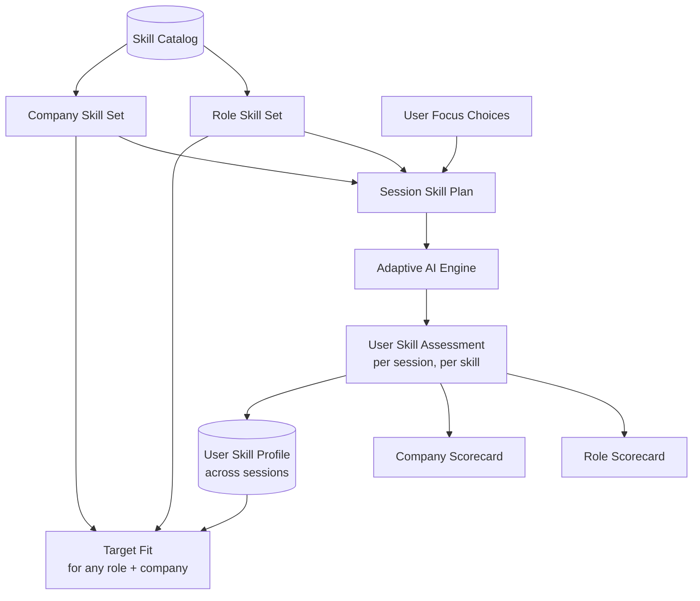

# Data Models
## AI-Based Interview Preparation Platform – Phase 1

| Field | Value |
|---|---|
| Document Version | 2.1 |
| Change from 1.0 | Skill-set model: shared Skill Catalog, Role Skill Sets, Company Skill Sets, per-user skill evaluation, and subject-level state for the Subject Router (`AI_Engine_Spec.md` §4) |
| Change from 2.0 | Question bank with provenance and rubrics, attempts for quick and deep practice, learning plan and daily loop, company evidence records, bilingual content, `student` seniority (§13 to §17) |
| Primary Store | PostgreSQL 16 (JSONB for flexible parameters) |
| Hot State | Redis in the target architecture; a JSONB column in the MVP |
| Analytics Store | Partitioned PostgreSQL → ClickHouse (Phase 2) |

---

## 1. The Skill-Set Model

Everything the platform examines and reports on is expressed in **one shared language: skills.**

| Concept | What It Is | Example |
|---|---|---|
| **Skill Catalog** | The single master list of every skill the platform knows | `sv_assertions`, `rest_api_design`, `risk_awareness` |
| **Role Skill Set** | The skills a role is examined on, with weights and required levels per seniority | Design Verification Engineer examines SVA, UVM, FSM coverage… |
| **Company Skill Set** | The skills a company examines, with its own weights, required levels, and examination style | Example Semi adds formal verification and weighs risk awareness heavily |
| **Session Skill Plan** | The merged skill set for one interview: role set + company set + user focus | The exact list of skills this session will examine and how much time each gets |
| **User Skill Assessment** | How the user scored on each skill in one session | `sv_assertions`: level 4 of 5, required 4, meets requirement |
| **User Skill Profile** | The user's running skill levels across all sessions | `sv_assertions`: level 4, improving, assessed 3 times |
| **Skill-Set Scorecard** | How well the user fits a whole skill set | Role fit 78%, Company fit 64% |



**Why one shared catalog matters:**

- A skill like `data_structures` is examined by Backend, Embedded Firmware, and ML roles. Because it is the same catalog entry, the user's level carries across all of them.
- A company skill set and a role skill set can be merged without translation.
- The User Skill Profile can be compared against **any** role or company skill set, even ones the user never practiced. That powers readiness estimates and, in Phase 2, company-side matching.

---

## 2. Entity Relationship Overview

```mermaid
erDiagram
    SKILL ||--o{ SKILL : "parent of"
    SKILL ||--o{ SKILL_DEPENDENCY : "requires"
    SKILL ||--o{ ROLE_SKILL_SET : "used in"
    SKILL ||--o{ COMPANY_SKILL_SET : "used in"
    ROLE_TEMPLATE ||--o{ ROLE_SKILL_SET : "examines"
    COMPANY_PROFILE ||--o{ COMPANY_SKILL_SET : "examines"

    USER ||--o{ INTERVIEW_SESSION : "starts"
    ROLE_TEMPLATE ||--o{ INTERVIEW_SESSION : "targets"
    COMPANY_PROFILE ||--o{ INTERVIEW_SESSION : "simulates"

    INTERVIEW_SESSION ||--o{ SESSION_SKILL_PLAN : "plans"
    SKILL ||--o{ SESSION_SKILL_PLAN : "planned"
    INTERVIEW_SESSION ||--o{ SESSION_TURN : "contains"
    SESSION_TURN ||--|| EVALUATION_METRICS : "evaluated by"

    INTERVIEW_SESSION ||--o{ USER_SKILL_ASSESSMENT : "produces"
    SKILL ||--o{ USER_SKILL_ASSESSMENT : "assessed"
    INTERVIEW_SESSION ||--o{ SKILL_SET_SCORECARD : "scored by"
    USER ||--o{ USER_SKILL_PROFILE : "has"
    SKILL ||--o{ USER_SKILL_PROFILE : "tracked"

    INTERVIEW_SESSION ||--o| SESSION_REPORT : "summarized in"
    TIPS_LIBRARY ||--o{ DELIVERED_TIP : "instantiated as"
    SESSION_TURN ||--o{ DELIVERED_TIP : "receives"
    USER ||--o{ USER_DOCUMENT : "uploads"

    QUESTION ||--o{ QUESTION_SKILL : "examines"
    SKILL ||--o{ QUESTION_SKILL : "examined by"
    QUESTION ||--o{ QUESTION_TRANSLATION : "translated as"
    QUESTION ||--o{ QUESTION : "variation of"
    QUESTION ||--o{ SESSION_TURN : "used in"
    QUESTION ||--o{ ATTEMPT : "attempted in"
    USER ||--o{ ATTEMPT : "makes"
    ATTEMPT ||--o{ EVALUATION_METRICS : "evaluated by"
    USER ||--o| LEARNING_PLAN : "follows"
    LEARNING_PLAN ||--o{ PLAN_ITEM : "contains"
    COMPANY_PROFILE ||--o{ COMPANY_EVIDENCE : "grounded in"
    COMPANY_SKILL_SET }o--o{ COMPANY_EVIDENCE : "cites"
```



Sections 3 to 12 define the skill model, sessions, evaluation, metrics, and seed formats. Sections 13 to 17 add the question bank, attempts and practice modes, the learning plan and daily loop, company evidence, and localization. Section 18 covers retention.

---

## 3. Skill Catalog

### 3.1 `Skill`

The master list. Skills form a two-level tree: a **domain** groups related **skills**. Only leaf skills are examined and scored. Domains are for grouping in reports.

| Column | Type | Constraints | Description |
|---|---|---|---|
| `id` | UUID | PK | |
| `key` | VARCHAR(80) | UNIQUE, NOT NULL | Stable identifier, e.g., `sv_assertions` |
| `label` | VARCHAR(160) | NOT NULL | e.g., "SystemVerilog Assertions (SVA)" |
| `description` | TEXT | NOT NULL | What the skill covers; injected into prompts |
| `node_type` | ENUM | `domain`, `skill` | Domains group skills; only `skill` rows are examined |
| `parent_id` | UUID | FK → Skill, NULL | Domain this skill belongs to |
| `family` | ENUM | `hardware`, `software`, `general` | `general` = applies to any role (e.g., communication) |
| `category` | ENUM | `technical`, `problem_solving`, `communication`, `collaboration`, `culture` | |
| `default_assessment_mode` | ENUM | `questioned`, `observed` | See §3.3 |
| `min_difficulty` | SMALLINT | 1–10 | Easiest meaningful question |
| `max_difficulty` | SMALLINT | 1–10 | Hardest meaningful question |
| `proficiency_rubric` | JSONB | NOT NULL | What each proficiency level looks like for this skill (§3.4) |
| `is_active` | BOOLEAN | DEFAULT true | |
| `version` | INTEGER | NOT NULL | |
| `created_at` | TIMESTAMPTZ | | |
| `updated_at` | TIMESTAMPTZ | | |

**Indexes:** `key`, `(family, category)`, `parent_id`.

**Example catalog excerpt:**

| Key | Label | Type | Parent | Family | Category | Mode |
|---|---|---|---|---|---|---|
| `systemverilog` | SystemVerilog | domain | — | hardware | technical | — |
| `sv_assertions` | SystemVerilog Assertions | skill | `systemverilog` | hardware | technical | questioned |
| `sv_randomization` | Constrained Randomization | skill | `systemverilog` | hardware | technical | questioned |
| `hw_queues` | Hardware Queues and Ordering | domain | — | hardware | technical | — |
| `ooo_scoreboard` | Out-of-Order Scoreboards | skill | `hw_queues` | hardware | technical | questioned |
| `formal_verification` | Formal Property Verification | skill | `verification_methods` | hardware | technical | questioned |
| `api_design` | API Design | domain | — | software | technical | — |
| `rest_api_design` | REST API Design | skill | `api_design` | software | technical | questioned |
| `cs_fundamentals` | CS Fundamentals | domain | — | general | technical | — |
| `data_structures` | Data Structures | skill | `cs_fundamentals` | general | technical | questioned |
| `engineering_judgment` | Engineering Judgment | domain | — | general | problem_solving | — |
| `risk_awareness` | Risk and Failure-Mode Awareness | skill | `engineering_judgment` | general | problem_solving | observed |
| `tradeoff_reasoning` | Trade-off Reasoning | skill | `engineering_judgment` | general | problem_solving | observed |
| `communication` | Communication | domain | — | general | communication | — |
| `structured_communication` | Structured Explanation | skill | `communication` | general | communication | observed |
| `ownership` | Ownership | skill | `values` | general | culture | questioned |

### 3.2 `Skill_Dependency`

Prerequisite links. The Decision Engine steps back along these when a candidate struggles.

| Column | Type | Description |
|---|---|---|
| `skill_id` | UUID | FK → Skill; the advanced skill |
| `prerequisite_skill_id` | UUID | FK → Skill; the foundation |
| `strength` | NUMERIC(3,2) | 0–1; how strongly the prerequisite predicts success |

**Primary key:** `(skill_id, prerequisite_skill_id)`.

Examples: `fifo_verification` → `ooo_scoreboard`; `sv_blocking_nonblocking` → `sv_assertions`; `data_structures` → `rest_api_design` is **not** a dependency, because not every prerequisite link is real. Only add links a practitioner would agree with.

### 3.3 Assessment Modes

| Mode | How It Is Examined | How It Is Scored | Examples |
|---|---|---|---|
| **`questioned`** | Gets its own dedicated questions in the session | Knowledge and confidence scores from answers to those questions | `sv_assertions`, `rest_api_design`, `ownership` (behavioral question) |
| **`observed`** | Never gets its own question; watched on **every** turn | Averaged from the matching evaluator dimension across all turns | `risk_awareness`, `tradeoff_reasoning`, `structured_communication` |

Observed skills let a company examine "how you think" without spending interview time on it. The Evaluator already scores these dimensions on every answer (`AI_Engine_Spec.md` §2.3).

### 3.4 Proficiency Scale

Every skill is reported on the same **5-level scale**. Levels are what users and, in Phase 2, companies see. Raw 0–100 scores stay internal.

| Level | Name | General Meaning |
|---|---|---|
| 1 | **Awareness** | Recognizes the concept; cannot apply it |
| 2 | **Foundational** | Explains and applies it in standard cases |
| 3 | **Proficient** | Applies it independently to new problems; handles common pitfalls |
| 4 | **Advanced** | Handles edge cases, failure modes, and trade-offs; could teach it |
| 5 | **Expert** | Designs novel approaches; critiques expert-level solutions |

**`proficiency_rubric` JSON (per skill):**

```json
{
  "1": "Knows SVA exists and what an assertion is for.",
  "2": "Writes simple immediate and concurrent assertions with |-> and |=>.",
  "3": "Writes sequences with repetition and delays; uses disable iff correctly for reset.",
  "4": "Debugs vacuous passes, handles multi-clock assertions, reasons about assertion coverage.",
  "5": "Architects an assertion strategy for a full block; balances formal and simulation use."
}
```

The rubric is injected into the Evaluator so that "level 4" means the same thing across sessions and users. How levels are computed from answers is defined in `AI_Engine_Spec.md` §2.6.

---

## 4. Role Entities

### 4.1 `Role_Template`

| Column | Type | Constraints | Description |
|---|---|---|---|
| `id` | UUID | PK | |
| `slug` | VARCHAR(80) | UNIQUE | e.g., `design-verification-engineer` |
| `title` | VARCHAR(160) | NOT NULL | |
| `family` | ENUM | `hardware`, `software`, `cross_family` | |
| `sub_family` | VARCHAR(60) | NOT NULL | e.g., `verification`, `product_engineering` |
| `description` | TEXT | | |
| `origin` | ENUM | `system`, `user_derived` | `user_derived` = built from a pasted job description |
| `owner_user_id` | UUID | FK → User, NULL | Set when `origin = user_derived` |
| `seniority_profiles` | JSONB | NOT NULL | Difficulty range per seniority (below) |
| `question_archetypes` | JSONB | | Weights for `conceptual`, `coding`, `debugging`, `design`, `behavioral` |
| `is_active` | BOOLEAN | DEFAULT true | |
| `version` | INTEGER | NOT NULL | Sessions pin a version |
| `created_at` | TIMESTAMPTZ | | |
| `updated_at` | TIMESTAMPTZ | | |

**`seniority_profiles` JSON:**

```json
{
  "junior":    { "baseline_difficulty": 2, "difficulty_ceiling": 6 },
  "mid":       { "baseline_difficulty": 4, "difficulty_ceiling": 8 },
  "senior":    { "baseline_difficulty": 5, "difficulty_ceiling": 9 },
  "staff":     { "baseline_difficulty": 6, "difficulty_ceiling": 10 },
  "principal": { "baseline_difficulty": 7, "difficulty_ceiling": 10 }
}
```

### 4.2 `Role_Skill_Set`

The skills a role is examined on. One row per role per skill.

| Column | Type | Constraints | Description |
|---|---|---|---|
| `id` | UUID | PK | |
| `role_template_id` | UUID | FK → Role_Template, NOT NULL | |
| `role_template_version` | INTEGER | NOT NULL | |
| `skill_id` | UUID | FK → Skill, NOT NULL | Must be a leaf `skill`, not a `domain` |
| `weight` | NUMERIC(5,4) | NOT NULL | Relative importance within the role; weights in a role sum to 1.0 |
| `importance` | ENUM | `core`, `important`, `nice_to_have` | `core` skills are always examined |
| `required_level` | JSONB | NOT NULL | Required proficiency per seniority, e.g., `{"junior":2,"mid":3,"senior":4,"staff":4,"principal":5}` |
| `assessment_mode` | ENUM | `questioned`, `observed`, NULL | NULL = use the skill's default |
| `difficulty_override` | INT4RANGE | NULL | Narrows the skill's difficulty range for this role |
| `evaluation_notes` | TEXT | | Role-specific scoring guidance, e.g., "Assume SystemVerilog 2017 and UVM 1.2" |

**Unique:** `(role_template_id, role_template_version, skill_id)`.

**Example: Design Verification Engineer**

| Skill | Weight | Importance | Required Level (Jr / Mid / Sr / Staff / Principal) | Mode |
|---|---|---|---|---|
| `sv_assertions` | 0.14 | core | 2 / 3 / 4 / 4 / 5 | questioned |
| `uvm_sequences` | 0.14 | core | 2 / 3 / 4 / 4 / 5 | questioned |
| `uvm_scoreboard_monitor` | 0.12 | core | 2 / 3 / 4 / 5 / 5 | questioned |
| `ooo_scoreboard` | 0.10 | important | 1 / 2 / 3 / 4 / 5 | questioned |
| `fsm_coverage` | 0.10 | important | 2 / 3 / 3 / 4 / 5 | questioned |
| `sv_randomization` | 0.10 | important | 2 / 3 / 4 / 4 / 5 | questioned |
| `fifo_verification` | 0.08 | important | 2 / 3 / 3 / 4 / 4 | questioned |
| `debugging_methodology` | 0.10 | core | 2 / 3 / 4 / 4 / 5 | questioned |
| `structured_communication` | 0.06 | important | 2 / 3 / 3 / 4 / 4 | observed |
| `tradeoff_reasoning` | 0.06 | nice_to_have | 1 / 2 / 3 / 4 / 5 | observed |

---

## 5. Company Entities

### 5.1 `Company_Profile`

Encodes the company's culture and interview style. Its skill set lives in `Company_Skill_Set`.

| Column | Type | Constraints | Description |
|---|---|---|---|
| `id` | UUID | PK | |
| `slug` | VARCHAR(80) | UNIQUE | e.g., `generic`, `example-semi` |
| `display_name` | VARCHAR(160) | NOT NULL | |
| `industry` | VARCHAR(80) | | |
| `core_values` | JSONB | NOT NULL | Ranked list with descriptions |
| `risk_tolerance` | SMALLINT | 1–10 | 1 = safety-critical, 10 = move fast |
| `interview_style` | JSONB | NOT NULL | Pacing, question mix, tone (below) |
| `company_weight_share` | NUMERIC(3,2) | DEFAULT 0.30 | How much the company set influences the session plan (§6.3) |
| `culture_prompt_block` | TEXT | NOT NULL | Pre-rendered prompt fragment (cached) |
| `is_public` | BOOLEAN | DEFAULT true | |
| `version` | INTEGER | | |
| `created_at` | TIMESTAMPTZ | | |
| `updated_at` | TIMESTAMPTZ | | |

**`interview_style` JSON:**

```json
{
  "pacing": "measured",
  "question_mix": { "conceptual": 0.3, "coding": 0.2, "debugging": 0.3, "design": 0.1, "behavioral": 0.1 },
  "follow_up_aggressiveness": 0.7,
  "ambiguity_injection": 0.4,
  "tone": "precise_and_collegial",
  "signature_archetypes": [
    "Walk me through every way this could fail in silicon.",
    "What would you not verify, and why is that safe?"
  ]
}
```

The "Generic" company profile has `company_weight_share = 0` and an empty skill set, so a generic session uses the role skill set alone.

### 5.2 `Company_Skill_Set`

The skills a company examines. A row can apply to **all roles**, to **one family**, or to **one specific role**. This lets a company examine "risk awareness" for everyone but "formal verification" only for verification roles.

| Column | Type | Constraints | Description |
|---|---|---|---|
| `id` | UUID | PK | |
| `company_profile_id` | UUID | FK → Company_Profile, NOT NULL | |
| `company_profile_version` | INTEGER | NOT NULL | |
| `skill_id` | UUID | FK → Skill, NOT NULL | |
| `scope` | ENUM | `all_roles`, `family`, `role` | Which roles this row applies to |
| `scope_family` | ENUM | `hardware`, `software`, NULL | Set when `scope = family` |
| `scope_role_template_id` | UUID | FK → Role_Template, NULL | Set when `scope = role` |
| `weight` | NUMERIC(5,4) | NOT NULL | Importance within the company set for that scope |
| `importance` | ENUM | `core`, `important`, `nice_to_have` | |
| `required_level_offset` | SMALLINT | DEFAULT 0 | Added to the role's required level, e.g., +1 = this company expects more |
| `required_level_min` | SMALLINT | NULL | Absolute floor, used when the role does not examine this skill |
| `assessment_mode` | ENUM | `questioned`, `observed`, NULL | NULL = use the skill's default |
| `examination_notes` | TEXT | | How this company examines the skill; injected into the Question Generator |

**Unique:** `(company_profile_id, company_profile_version, skill_id, scope, scope_family, scope_role_template_id)`.

**Example: Example Semiconductor Co.**

| Skill | Scope | Weight | Importance | Required Level | Mode | Examination Notes |
|---|---|---|---|---|---|---|
| `risk_awareness` | all roles | 0.30 | core | offset +1 | observed | Rewards naming failure modes before being asked |
| `ownership` | all roles | 0.15 | important | min 3 | questioned | Behavioral: a bug you shipped and what you changed |
| `debugging_methodology` | hardware | 0.25 | core | offset +1 | questioned | Prefers waveform-driven debugging scenarios |
| `formal_verification` | role: Design Verification Engineer | 0.20 | important | min 3 | questioned | Asks when formal beats simulation |
| `sv_assertions` | role: Design Verification Engineer | 0.10 | important | offset 0 | questioned | Expects assertions written live |

**Example: Example Fintech Co.**

| Skill | Scope | Weight | Importance | Required Level | Mode | Examination Notes |
|---|---|---|---|---|---|---|
| `tradeoff_reasoning` | all roles | 0.30 | core | offset +1 | observed | Rewards decisive choices with stated costs |
| `system_scalability` | software | 0.25 | core | offset +1 | questioned | "Scale this 100×" follow-ups |
| `data_consistency` | software | 0.25 | core | min 3 | questioned | Payments: idempotency and exactly-once semantics |
| `ownership` | all roles | 0.20 | important | min 3 | questioned | Behavioral: an incident you led |

---

## 6. Session Entities

### 6.1 `Interview_Session`

| Column | Type | Constraints | Description |
|---|---|---|---|
| `id` | UUID | PK | |
| `user_id` | UUID | FK → User, NOT NULL | |
| `role_template_id` | UUID | FK → Role_Template, NOT NULL | |
| `role_template_version` | INTEGER | NOT NULL | Pinned |
| `company_profile_id` | UUID | FK → Company_Profile, NOT NULL | Defaults to `generic` |
| `company_profile_version` | INTEGER | NOT NULL | Pinned |
| `seniority` | ENUM | `junior`, `mid`, `senior`, `staff`, `principal` | Chosen at setup |
| `baseline_difficulty` | SMALLINT | 1–10 | From the role's `seniority_profiles` |
| `difficulty_ceiling` | SMALLINT | 1–10 | From the role's `seniority_profiles` |
| `status` | ENUM | `configured`, `in_progress`, `paused`, `completed`, `abandoned` | |
| `config` | JSONB | NOT NULL | Duration, focus skills, coach mode |
| `state` | JSONB | | Live session state (MVP; see §9) |
| `turn_count` | INTEGER | DEFAULT 0 | |
| `hints_used` | INTEGER | DEFAULT 0 | |
| `hints_requested_by_user` | INTEGER | DEFAULT 0 | |
| `b2b_eligible` | BOOLEAN | DEFAULT false | User consent AND completed AND not anonymized |
| `started_at` | TIMESTAMPTZ | | |
| `ended_at` | TIMESTAMPTZ | | |
| `created_at` | TIMESTAMPTZ | | |

**`config` JSON:**

```json
{
  "planned_duration_min": 45,
  "focus_skill_keys": ["ooo_scoreboard"],
  "coach_mode": true,
  "struggle_budget_per_skill": 2
}
```

**Indexes:** `(user_id, created_at DESC)`, `(role_template_id, status)`, `(b2b_eligible, ended_at)`.

### 6.2 `Session_Skill_Plan`

The merged skill set for one session, created at session start and frozen. It answers: **which skills will this interview examine, why, and with how much time?**

| Column | Type | Constraints | Description |
|---|---|---|---|
| `id` | UUID | PK | |
| `session_id` | UUID | FK → Interview_Session, NOT NULL | |
| `skill_id` | UUID | FK → Skill, NOT NULL | |
| `source` | ENUM | `role`, `company`, `role_and_company`, `user_focus` | Where the skill came from |
| `role_weight` | NUMERIC(5,4) | DEFAULT 0 | Normalized weight from the role set |
| `company_weight` | NUMERIC(5,4) | DEFAULT 0 | Normalized weight from the company set |
| `combined_weight` | NUMERIC(5,4) | NOT NULL | Final weight after merge (§6.3) |
| `importance` | ENUM | `core`, `important`, `nice_to_have` | Highest importance from either source |
| `required_level` | SMALLINT | 1–5, NOT NULL | Final required level for this session |
| `assessment_mode` | ENUM | `questioned`, `observed` | |
| `planned_turns` | SMALLINT | | Question turns allocated; 0 for observed skills |
| `priority_rank` | SMALLINT | | Order in which the engine plans to cover skills |
| `examination_notes` | TEXT | | Combined role and company notes |

**Unique:** `(session_id, skill_id)`.

### 6.3 Skill-Set Merge Algorithm

Run once at session start.

```
Inputs:
  R = Role_Skill_Set rows for the role version
  C = Company_Skill_Set rows matching this role
      (scope = all_roles, OR scope = family AND family matches, OR scope = role AND role matches)
  F = user's focus_skill_keys
  s = company_profile.company_weight_share     # e.g., 0.30; 0 for Generic

1. Normalize:   r_w = weight / Σ R.weight,   c_w = weight / Σ C.weight

2. For every skill in R ∪ C:
     combined = (1 − s) · r_w  +  s · c_w          # missing side counts as 0
     importance = highest of the two
     required_level =
         role.required_level[seniority] + company.required_level_offset   if in both
         role.required_level[seniority]                                   if role only
         company.required_level_min (default 3)                           if company only
       clamped to 1..5
     source = role | company | role_and_company

3. For every skill in F:
     combined = combined + 0.10    (adds the skill with source = user_focus if absent)

4. Renormalize combined weights to sum to 1.0.

5. Allocate question turns (questioned skills only):
     expected_turns   = planned_duration_min / 1.8        # ≈ 25 turns for 45 minutes
     planned_turns_i  = round(combined_i × expected_turns)
     every `core` skill gets at least 2 turns
     skills that get 0 turns and are not core are kept with planned_turns = 0
       and reported as "not assessed this session"

6. priority_rank: core first, then by combined weight descending,
   then prerequisites before dependents.
```

**Worked example:** Senior Design Verification Engineer at Example Semiconductor Co., 45 minutes, `s = 0.30`.

| Skill | Source | Role w | Company w | Combined | Required | Mode | Turns |
|---|---|---|---|---|---|---|---|
| `debugging_methodology` | role + company | 0.10 | 0.25 | 0.145 | 4 + 1 = **5** | questioned | 4 |
| `sv_assertions` | role + company | 0.14 | 0.10 | 0.128 | 4 | questioned | 3 |
| `uvm_sequences` | role | 0.14 | — | 0.098 | 4 | questioned | 2 |
| `risk_awareness` | company | — | 0.30 | 0.090 | min 3 | observed | 0 |
| `uvm_scoreboard_monitor` | role | 0.12 | — | 0.084 | 4 | questioned | 2 |
| `formal_verification` | company | — | 0.20 | 0.060 | 3 | questioned | 2 |
| `ownership` | company | — | 0.15 | 0.045 | 3 | questioned | 1 |
| `ooo_scoreboard` | role + user focus | 0.10 | — | 0.070 + 0.10 → renormalized | 3 | questioned | 3 |
| … | | | | | | | |

### 6.4 `Session_Turn`

| Column | Type | Constraints | Description |
|---|---|---|---|
| `id` | UUID | PK | |
| `session_id` | UUID | FK → Interview_Session | |
| `turn_index` | INTEGER | NOT NULL | 0-based |
| `skill_id` | UUID | FK → Skill, NOT NULL | The questioned skill this turn targets |
| `question_archetype` | ENUM | `conceptual`, `coding`, `debugging`, `design`, `behavioral` | |
| `difficulty` | SMALLINT | 1–10 | |
| `question_text` | TEXT | NOT NULL | |
| `expected_answer_outline` | TEXT | | Private; for the Evaluator only |
| `question_generation_meta` | JSONB | | Model, tokens, latency, cache hit |
| `answer_text` | TEXT | | |
| `answer_code` | TEXT | | |
| `answer_language` | VARCHAR(40) | | |
| `answer_started_at` | TIMESTAMPTZ | | |
| `answer_submitted_at` | TIMESTAMPTZ | | |
| `created_at` | TIMESTAMPTZ | | |

**Unique:** `(session_id, turn_index)`.

---

## 7. User Skill Evaluation

This is how the user is evaluated **with a set of skills**: one assessment per skill per session, rolled up into scorecards for each skill set, and accumulated into a long-term profile.

### 7.1 `User_Skill_Assessment`

One row per session per planned skill. Written at session end.

| Column | Type | Constraints | Description |
|---|---|---|---|
| `id` | UUID | PK | |
| `session_id` | UUID | FK → Interview_Session, NOT NULL | |
| `user_id` | UUID | FK → User, NOT NULL | |
| `skill_id` | UUID | FK → Skill, NOT NULL | |
| `source` | ENUM | `role`, `company`, `role_and_company`, `user_focus` | Copied from the plan |
| `assessment_mode` | ENUM | `questioned`, `observed` | |
| `status` | ENUM | `assessed`, `insufficient_evidence`, `not_assessed` | See evidence rules in `AI_Engine_Spec.md` §2.6 |
| `turns_count` | SMALLINT | | Questioned turns, or observations for observed skills |
| `knowledge_score` | NUMERIC(5,2) | 0–100 | Internal |
| `confidence_score` | NUMERIC(5,2) | 0–100 | Internal |
| `demonstrated_ceiling` | SMALLINT | 1–10 | Highest difficulty answered STRONG without a level-3 hint |
| `proficiency_level` | SMALLINT | 1–5 | **The headline result** |
| `required_level` | SMALLINT | 1–5 | Copied from the plan |
| `level_gap` | SMALLINT | | `proficiency_level − required_level`; negative = below requirement |
| `meets_requirement` | BOOLEAN | | `level_gap ≥ 0` |
| `hints_used` | SMALLINT | | |
| `evidence_turn_ids` | UUID[] | | Turns that support this assessment |
| `strengths` | TEXT[] | | Short bullet phrases from the Evaluator |
| `gaps` | TEXT[] | | Short bullet phrases from the Evaluator |
| `evaluator_version` | VARCHAR(20) | | |
| `created_at` | TIMESTAMPTZ | | |

**Unique:** `(session_id, skill_id)`. **Indexes:** `(user_id, skill_id, created_at DESC)`.

### 7.2 `Skill_Set_Scorecard`

How well the user fits a whole skill set in one session. Three scorecards are written per session.

| Column | Type | Constraints | Description |
|---|---|---|---|
| `id` | UUID | PK | |
| `session_id` | UUID | FK → Interview_Session, NOT NULL | |
| `user_id` | UUID | FK → User, NOT NULL | |
| `scope` | ENUM | `role`, `company`, `session_overall` | Which skill set this card scores |
| `fit_score` | NUMERIC(5,2) | 0–100 | Weighted fit (formula below) |
| `skills_total` | SMALLINT | | Skills in the set |
| `skills_assessed` | SMALLINT | | Skills with `status = assessed` |
| `skills_meeting_requirement` | SMALLINT | | |
| `core_gaps` | UUID[] | | Core skills below requirement |
| `top_strengths` | UUID[] | | Up to 3 skills with the largest positive gap |
| `domain_breakdown` | JSONB | | Fit score per domain, for report charts |
| `created_at` | TIMESTAMPTZ | | |

**Unique:** `(session_id, scope)`.

**Fit score formula:**

```
For the skills in the scope (role set, company set, or whole plan) with status = assessed:

  skill_fit_i = min(proficiency_level_i / required_level_i, 1.0)
  fit_score   = 100 × Σ (weight_i × skill_fit_i) / Σ weight_i

Core-gap cap:
  if any core skill has level_gap ≤ −2   →  fit_score = min(fit_score, 60)
  if any core skill has level_gap = −1   →  fit_score = min(fit_score, 80)

Coverage note:
  if skills_assessed / skills_total < 0.6  →  report shows "partial evaluation"
```

The cap reflects hiring reality. Excellent secondary skills do not offset a missing core skill.

### 7.3 `User_Skill_Profile`

The user's current level on every skill ever assessed, across all sessions, roles, and companies. Updated after each session.

| Column | Type | Constraints | Description |
|---|---|---|---|
| `id` | UUID | PK | |
| `user_id` | UUID | FK → User, NOT NULL | |
| `skill_id` | UUID | FK → Skill, NOT NULL | |
| `proficiency_level` | SMALLINT | 1–5 | Current best estimate |
| `level_score` | NUMERIC(4,2) | 1.00–5.00 | Continuous value behind the level |
| `knowledge_score` | NUMERIC(5,2) | 0–100 | Rolled-up internal score |
| `confidence_score` | NUMERIC(5,2) | 0–100 | |
| `assessments_count` | SMALLINT | | Sessions that assessed this skill |
| `evidence_turns_total` | INTEGER | | Total supporting turns |
| `trend` | ENUM | `improving`, `stable`, `declining`, `new` | |
| `level_history` | JSONB | | `[{"session_id": "...", "level": 3, "at": "..."}]` |
| `first_assessed_at` | TIMESTAMPTZ | | |
| `last_assessed_at` | TIMESTAMPTZ | | |

**Unique:** `(user_id, skill_id)`.

**Roll-up rule:**

```
For the user's assessments of this skill with status = assessed, newest first (i = 0, 1, 2, …):

  w_i         = turns_count_i × 0.7^i          # more evidence and more recent count more
  level_score = Σ (w_i × proficiency_level_i) / Σ w_i
  proficiency_level = round(level_score)

trend:
  new        if assessments_count = 1
  improving  if newest level − average of previous two ≥ +0.5
  declining  if newest level − average of previous two ≤ −0.5
  stable     otherwise
```

### 7.4 Target Fit (Computed View)

Because every role and company skill set uses the same catalog, the User Skill Profile can be scored against **any** target without a new interview.

```sql
-- Conceptual view: fit of a user's profile against a role + company + seniority
-- Implemented as a backend function; inputs are user_id, role_template_id,
-- company_profile_id, seniority. It runs the §6.3 merge WITHOUT user focus,
-- then applies the §7.2 fit formula using User_Skill_Profile levels.
-- Skills the user has never been assessed on count as "unknown", not zero.
```

| Output Field | Description |
|---|---|
| `fit_score` | 0–100 against the merged skill set |
| `known_coverage` | Share of weighted skills the user has evidence for |
| `unknown_skills` | Skills never assessed; the UI suggests a session covering them |
| `core_gaps` | Core skills below requirement |

This powers the "Readiness for Backend Engineer at Example Fintech: 72%, 3 skills not yet assessed" card on the dashboard. In Phase 2 it becomes candidate-to-job matching.

---

## 8. Supporting Entities

### 8.1 `User`

| Column | Type | Constraints | Description |
|---|---|---|---|
| `id` | UUID | PK | |
| `email` | VARCHAR(255) | UNIQUE, NOT NULL | |
| `auth_provider_id` | VARCHAR(255) | UNIQUE | External auth subject |
| `display_name` | VARCHAR(120) | | |
| `experience_years` | SMALLINT | | Self-reported |
| `seniority_self_assessed` | ENUM | `student`, `junior`, `mid`, `senior`, `staff`, `principal` | `student` = still studying, targeting a student position |
| `background` | JSONB | | Degree, institution stage, relevant courses, self-described strengths; user-editable |
| `interface_language` | ENUM | `he`, `en` | Switchable at any time |
| `practice_language` | ENUM | `he`, `en` | Independent of interface language |
| `target_interview_date` | DATE | NULL | Drives the plan's pacing |
| `available_minutes_per_day` | SMALLINT | | From onboarding; editable |
| `notification_prefs` | JSONB | | `{channel, times, frequency, quiet_hours, enabled}`; one channel in the pilot |
| `target_families` | TEXT[] | | e.g., `{hardware, software}` |
| `target_role_ids` | UUID[] | | Roles the user is preparing for |
| `target_company_ids` | UUID[] | | Companies the user is preparing for |
| `plan_tier` | ENUM | `free`, `pro`, `team` | |
| `b2b_data_consent` | BOOLEAN | DEFAULT false | |
| `b2b_consent_version` | VARCHAR(20) | | |
| `b2b_consent_at` | TIMESTAMPTZ | | |
| `locale` | VARCHAR(10) | DEFAULT 'en-US' | |
| `created_at` | TIMESTAMPTZ | NOT NULL | |
| `updated_at` | TIMESTAMPTZ | NOT NULL | |
| `deleted_at` | TIMESTAMPTZ | NULL | Soft delete; triggers anonymization |

### 8.2 `Tips_Library`

| Column | Type | Constraints | Description |
|---|---|---|---|
| `id` | UUID | PK | |
| `key` | VARCHAR(80) | UNIQUE | e.g., `state_assumptions_first` |
| `category` | ENUM | `communication`, `problem_solving`, `technical`, `structure`, `time_management`, `confidence` | |
| `trigger_conditions` | JSONB | NOT NULL | Machine-matchable conditions |
| `applicable_families` | TEXT[] | | Empty = all |
| `applicable_skill_ids` | UUID[] | | Empty = all; lets a tip target one skill |
| `improves_skill_ids` | UUID[] | | Skills this tip helps raise; used to recommend tips for gaps |
| `tip_template` | TEXT | NOT NULL | Text with `{{placeholders}}` |
| `example_before` | TEXT | | |
| `example_after` | TEXT | | |
| `delivery_timing` | ENUM | `mid_session`, `post_session`, `both` | |
| `severity` | SMALLINT | 1–5 | |
| `origin` | ENUM | `curated`, `ai_generated_pending_review`, `ai_generated_approved` | |
| `effectiveness_score` | NUMERIC(5,4) | | Learned from outcomes |
| `times_delivered` | INTEGER | DEFAULT 0 | |
| `is_active` | BOOLEAN | DEFAULT true | |
| `created_at` | TIMESTAMPTZ | | |
| `updated_at` | TIMESTAMPTZ | | |

**`trigger_conditions` JSON:**

```json
{
  "any_of": [
    { "signal": "clarity", "op": "<", "value": 0.5 },
    { "signal": "jumped_to_implementation", "op": "==", "value": true }
  ],
  "all_of": [
    { "signal": "question_archetype", "op": "in", "value": ["design", "coding"] }
  ],
  "cooldown_turns": 5
}
```

### 8.3 `Delivered_Tip`

| Column | Type | Description |
|---|---|---|
| `id` | UUID | PK |
| `session_id` | UUID | FK |
| `turn_id` | UUID | FK → Session_Turn, NULL for post-session |
| `tip_id` | UUID | FK → Tips_Library |
| `skill_id` | UUID | FK → Skill, NULL; the skill the tip addressed |
| `rendered_text` | TEXT | |
| `timing` | ENUM | `mid_session`, `post_session` |
| `was_requested` | BOOLEAN | |
| `candidate_rating` | SMALLINT | 1–5, optional |
| `behavior_improved_next_n` | BOOLEAN | Computed later |
| `delivered_at` | TIMESTAMPTZ | |

### 8.4 `Session_Report`

| Column | Type | Description |
|---|---|---|
| `id` | UUID | PK |
| `session_id` | UUID | FK, UNIQUE |
| `role_scorecard_id` | UUID | FK → Skill_Set_Scorecard |
| `company_scorecard_id` | UUID | FK → Skill_Set_Scorecard, NULL for Generic |
| `overall_scorecard_id` | UUID | FK → Skill_Set_Scorecard |
| `difficulty_timeline` | JSONB | `[{turn, skill_key, difficulty, action}]` |
| `top_tips` | JSONB | Ordered `Delivered_Tip` references |
| `narrative_md` | TEXT | LLM-generated narrative |
| `recommended_next_skills` | UUID[] | Skills to practice next, ranked by weighted gap |
| `generated_at` | TIMESTAMPTZ | |
| `generation_meta` | JSONB | |

### 8.5 `User_Document`

| Column | Type | Description |
|---|---|---|
| `id` | UUID | PK |
| `user_id` | UUID | FK |
| `doc_type` | ENUM | `resume`, `job_description`, `reference` |
| `storage_key` | VARCHAR(512) | |
| `parsed_payload` | JSONB | Extracted structure (PII-stripped), including matched catalog skill keys |
| `parse_status` | ENUM | `pending`, `parsed`, `failed` |
| `uploaded_at` | TIMESTAMPTZ | |

---

## 9. The Phase 2 Foundation: `Evaluation_Metrics`

### 9.1 Purpose

Turn-level, append-only record of every adaptive decision. No transcript text. It is the raw evidence behind every `User_Skill_Assessment`, and in Phase 2 the primary input to company Evaluation Reports.

### 9.2 Schema

| Column | Type | Constraints | Description |
|---|---|---|---|
| `id` | UUID | PK | |
| `session_id` | UUID | FK, NOT NULL | |
| `turn_id` | UUID | FK, NOT NULL | |
| `user_id` | UUID | FK, NOT NULL | Denormalized |
| `role_template_id` | UUID | NOT NULL | Denormalized |
| `role_template_version` | INTEGER | NOT NULL | |
| `company_profile_id` | UUID | NOT NULL | Denormalized |
| `family` | VARCHAR(20) | NOT NULL | Denormalized |
| `sub_family` | VARCHAR(60) | NOT NULL | Denormalized |
| `seniority` | VARCHAR(20) | NOT NULL | |
| `turn_index` | INTEGER | NOT NULL | |
| **Skill and subject context** | | | |
| `subject_id` | UUID | FK → Skill (domain node), NOT NULL | The subject this turn belongs to |
| `subject_status_before` | VARCHAR(20) | | `untouched`, `exploring`, `strong`, `mixed`, `weak`, `done` |
| `subject_status_after` | VARCHAR(20) | | |
| `subject_turns_used` | SMALLINT | | Turns in this subject including this one |
| `subject_turns_planned` | SMALLINT | | After any rebalancing |
| `entry_difficulty_reason` | JSONB | | On a skill's first turn: `{baseline, subject_adjust, prerequisite_adjust, momentum_adjust}` |
| `skill_id` | UUID | FK → Skill, NOT NULL | Questioned skill for this turn |
| `skill_source` | VARCHAR(20) | NOT NULL | `role`, `company`, `role_and_company`, `user_focus` |
| `skill_combined_weight` | NUMERIC(5,4) | NOT NULL | From the session plan |
| `skill_required_level` | SMALLINT | NOT NULL | From the session plan |
| `question_archetype` | VARCHAR(20) | NOT NULL | |
| `difficulty_asked` | SMALLINT | NOT NULL | 1–10 |
| **Evaluator outputs** | | | |
| `correctness` | NUMERIC(4,3) | 0–1 | |
| `depth` | NUMERIC(4,3) | 0–1 | |
| `clarity` | NUMERIC(4,3) | 0–1 | |
| `structure` | NUMERIC(4,3) | 0–1 | |
| `tradeoff_reasoning` | NUMERIC(4,3) | 0–1 | |
| `risk_awareness` | NUMERIC(4,3) | 0–1 | |
| `hedging_ratio` | NUMERIC(4,3) | 0–1 | |
| `observed_skill_scores` | JSONB | | Scores for observed skills this turn, e.g., `{"risk_awareness": 0.35}` |
| `response_latency_ms` | INTEGER | | |
| `answer_duration_ms` | INTEGER | | |
| `answer_length_tokens` | INTEGER | | |
| `revision_count` | INTEGER | | |
| **Derived state** | | | |
| `knowledge_score_before` | NUMERIC(5,2) | 0–100 | For this skill |
| `knowledge_score_after` | NUMERIC(5,2) | 0–100 | |
| `confidence_score_before` | NUMERIC(5,2) | 0–100 | |
| `confidence_score_after` | NUMERIC(5,2) | 0–100 | |
| `provisional_level_after` | SMALLINT | 1–5 | Running level estimate for this skill |
| **Adaptive decision** | | | |
| `decision_action` | ENUM | `ESCALATE`, `HOLD`, `HINT`, `STEP_BACK`, `PIVOT_TOPIC`, `END` | |
| `decision_reason_code` | VARCHAR(60) | | Includes router codes: `rebalance_strong_release`, `rebalance_weak_extend`, `subject_closed_early`, `fatigue_override`, `ending_override` |
| `difficulty_next` | SMALLINT | | |
| `skill_next_id` | UUID | FK → Skill | |
| `subject_next_id` | UUID | FK → Skill (domain node) | |
| `subject_switch` | BOOLEAN | DEFAULT false | True when the next turn opens a different subject |
| `hint_delivered` | BOOLEAN | DEFAULT false | |
| `hint_level` | SMALLINT | 0–3 | |
| `hint_requested_by_user` | BOOLEAN | DEFAULT false | |
| `tip_delivered_id` | UUID | FK → Delivered_Tip, NULL | |
| `struggle_budget_remaining` | SMALLINT | | For this skill |
| `recovered_after_hint` | BOOLEAN | NULL | Set on the following turn |
| **Provenance** | | | |
| `evaluator_model` | VARCHAR(80) | | |
| `evaluator_version` | VARCHAR(20) | | |
| `decision_engine_version` | VARCHAR(20) | | |
| `eval_latency_ms` | INTEGER | | |
| `eval_flags` | TEXT[] | | |
| `b2b_eligible` | BOOLEAN | NOT NULL | |
| `created_at` | TIMESTAMPTZ | NOT NULL | Partition key |

**Indexes:** `(session_id, turn_index)`, `(user_id, skill_id, created_at)`, `(user_id, subject_id, created_at)`, `(skill_id, difficulty_asked, created_at)`, `(company_profile_id, skill_id, b2b_eligible)`, `(decision_action, created_at)`.

### 9.3 What Phase 2 Derives From It

| Phase 2 Metric | Derivation |
|---|---|
| Skill level with confidence interval | Distribution of `provisional_level_after` across sessions for a skill |
| Company-set fit | §7.2 formula against the company's own `Company_Skill_Set` |
| Difficulty ceiling per skill | Highest sustained STRONG difficulty |
| Hint dependence | Hints per turn, weighted by level |
| Recovery rate | `recovered_after_hint` ratio |
| Pressure response | `confidence_score_after` trend after `ESCALATE` |
| Calibration of required levels | Population distributions per skill per seniority; used to tune `required_level` values |

---

## 10. Live Session State

In the MVP this lives in `Interview_Session.state` (JSONB). In the target architecture it moves to Redis.

```json
{
  "version": 17,
  "turn_index": 6,
  "current_skill": "ooo_scoreboard",
  "current_difficulty": 6,
  "skill_state": {
    "sv_assertions":  { "k": 81.5, "c": 79.0, "turns": 2, "ceiling": 6, "provisional_level": 4, "status": "ceiling_found", "budget": 2 },
    "ooo_scoreboard": { "k": 52.0, "c": 41.0, "turns": 3, "ceiling": 5, "provisional_level": 2, "status": "struggling",    "budget": 1 },
    "uvm_sequences":  { "k": null, "c": null, "turns": 0, "ceiling": null, "provisional_level": null, "status": "untouched", "budget": 2 }
  },
  "observed_state": {
    "risk_awareness":           { "sum": 1.85, "n": 6, "provisional_level": 2 },
    "structured_communication": { "sum": 3.90, "n": 6, "provisional_level": 3 }
  },
  "current_subject": "hw_queues",
  "subject_state": {
    "systemverilog": { "k": 84.0, "c": 80.0, "level": 4.2, "required": 4.0, "status": "strong", "momentum": 0.67, "turns_used": 5, "turns_planned": 4, "skills_resolved": 2, "skills_planned": 3 },
    "uvm":           { "k": 66.0, "c": 58.0, "level": 3.4, "required": 4.0, "status": "mixed",  "momentum": 0.00, "turns_used": 6, "turns_planned": 6, "skills_resolved": 2, "skills_planned": 3 },
    "hw_queues":     { "k": 60.0, "c": 50.0, "level": 2.8, "required": 3.0, "status": "exploring", "momentum": -0.33, "turns_used": 3, "turns_planned": 5, "skills_resolved": 0, "skills_planned": 2 },
    "debugging":     { "k": null, "c": null, "level": null, "required": 5.0, "status": "untouched", "momentum": 0.00, "turns_used": 0, "turns_planned": 5, "skills_resolved": 0, "skills_planned": 2 }
  },
  "subjects_visited_order": ["systemverilog", "uvm", "hw_queues"],
  "session_momentum": 0.25,
  "turn_pool_released": 2,
  "coverage": { "questioned_skills_planned": 9, "questioned_skills_resolved": 4 },
  "recent_actions": ["ESCALATE", "ESCALATE", "HOLD", "HINT", "HOLD"],
  "history_window": [],
  "history_summary": "Strong on SVA; struggling with out-of-order transaction matching.",
  "elapsed_ms": 1260000
}
```

---

## 11. The AI State Payload (Next-Turn Injection)

The Session Orchestrator sends this to the AI Engine for the **next turn**. The `cacheable` block is identical for the whole session. The `dynamic` block changes every turn.

```json
{
  "payload_version": "2.0",
  "session_id": "8f3a2c1e-7b9d-4e21-a0c3-5f6e8d9a1b2c",
  "turn_index_next": 7,

  "cacheable": {
    "role": {
      "title": "Design Verification Engineer",
      "family": "hardware",
      "sub_family": "verification",
      "seniority": "senior",
      "baseline_difficulty": 5,
      "difficulty_ceiling": 9
    },

    "company": {
      "display_name": "Example Semiconductor Co.",
      "risk_tolerance": 3,
      "core_values": ["correctness_first", "ownership", "rigor"],
      "interview_style": {
        "pacing": "measured",
        "follow_up_aggressiveness": 0.7,
        "tone": "precise_and_collegial"
      },
      "culture_prompt_block": "This company ships silicon; a missed bug costs a respin. Reward candidates who reason about failure modes and coverage gaps before optimizing for speed."
    },

    "skill_plan": [
      {
        "key": "debugging_methodology",
        "label": "Debugging Methodology",
        "source": "role_and_company",
        "weight": 0.145,
        "importance": "core",
        "required_level": 5,
        "mode": "questioned",
        "planned_turns": 4,
        "difficulty_range": [3, 10],
        "rubric": { "3": "Bisects failures systematically…", "4": "…", "5": "…" },
        "examination_notes": "Company prefers waveform-driven debugging scenarios."
      },
      {
        "key": "ooo_scoreboard",
        "label": "Out-of-Order Scoreboards",
        "source": "user_focus",
        "weight": 0.110,
        "importance": "important",
        "required_level": 3,
        "mode": "questioned",
        "planned_turns": 3,
        "difficulty_range": [5, 10],
        "prerequisites": ["fifo_verification"],
        "rubric": { "2": "…", "3": "Matches by transaction ID…", "4": "Handles tag reuse and overflow…" }
      },
      {
        "key": "risk_awareness",
        "label": "Risk and Failure-Mode Awareness",
        "source": "company",
        "weight": 0.090,
        "importance": "core",
        "required_level": 3,
        "mode": "observed",
        "planned_turns": 0,
        "examination_notes": "Rewards naming failure modes before being asked."
      }
    ],

    "session_config": {
      "planned_duration_min": 45,
      "coach_mode": true,
      "struggle_budget_per_skill": 2
    }
  },

  "dynamic": {
    "elapsed_min": 21,
    "remaining_min": 24,

    "candidate_state": {
      "subject_state": {
        "systemverilog": { "level": 4.2, "required": 4.0, "status": "strong",    "turns": "5 of 4" },
        "uvm":           { "level": 3.4, "required": 4.0, "status": "mixed",     "turns": "6 of 6" },
        "hw_queues":     { "level": 2.8, "required": 3.0, "status": "exploring", "turns": "3 of 5" },
        "debugging":     { "level": null, "required": 5.0, "status": "untouched", "turns": "0 of 5" }
      },
      "current_subject": "hw_queues",
      "skill_state": {
        "sv_assertions":  { "k": 81.5, "c": 79.0, "level": 4, "required": 4, "status": "ceiling_found" },
        "ooo_scoreboard": { "k": 52.0, "c": 41.0, "level": 2, "required": 3, "status": "struggling", "budget": 1 }
      },
      "observed_state": {
        "risk_awareness": { "level": 2, "required": 3, "n": 6 }
      },
      "remaining_plan": ["debugging_methodology", "waveform_debugging", "formal_verification", "ownership"],
      "session_momentum": 0.25,
      "behavior_flags": ["jumps_to_implementation", "recovers_well_from_hints"]
    },

    "last_turn": {
      "skill": "ooo_scoreboard",
      "difficulty": 6,
      "question": "How would your scoreboard match a response to its originating request?",
      "answer_summary": "Tag-based associative array; did not address tag reuse or overflow.",
      "evaluation": {
        "correctness": 0.62, "depth": 0.50, "clarity": 0.70, "structure": 0.55,
        "tradeoff_reasoning": 0.30, "risk_awareness": 0.35, "hedging_ratio": 0.28
      }
    },

    "history_summary": "Strong on SVA (level 4, meets requirement). Struggling on out-of-order scoreboards. Rarely raises failure modes unprompted, which this company weighs heavily.",

    "decision": {
      "action": "HOLD",
      "reason_code": "partial_recovery_probe_gap",
      "target_subject": "hw_queues",
      "target_skill": "ooo_scoreboard",
      "target_difficulty": 6,
      "target_archetype": "conceptual",
      "subject_switch": false,
      "bridge": null,
      "probe_focus": "tag reuse and overflow when outstanding transactions exceed tag space",
      "invite_observed_skills": ["risk_awareness"],
      "deliver_hint": false,
      "deliver_tip": false
    }
  },

  "output_schema": {
    "question_text": "string",
    "question_archetype": "conceptual | coding | debugging | design | behavioral",
    "expected_answer_outline": "string (private)",
    "rubric_focus": ["string"],
    "starter_code": "string | null",
    "language": "string | null"
  }
}
```

### 11.1 Payload Construction Rules

**Example of a subject-switch decision** (replaces the `decision` block above when the Subject Router opens a new subject):

```json
"decision": {
  "action": "ENTER_SKILL",
  "reason_code": "subject_selected_core_gap",
  "target_subject": "debugging",
  "target_skill": "debugging_methodology",
  "target_difficulty": 5,
  "target_archetype": "debugging",
  "subject_switch": true,
  "entry_difficulty_reason": { "baseline": 5, "subject_adjust": 0, "prerequisite_adjust": 0, "momentum_adjust": 0 },
  "bridge": "strength_reference",
  "bridge_from_skill": "ooo_scoreboard",
  "probe_focus": null,
  "invite_observed_skills": ["risk_awareness"],
  "deliver_hint": false,
  "deliver_tip": false
}
```

| Rule | Detail |
|---|---|
| **Skill plan is cacheable** | It is frozen at session start, so it sits in the cached prefix |
| **Subject state is dynamic** | It is compact (one line per subject) and changes every turn, so it sits in the dynamic block |
| **Only compact rubrics are sent** | Each skill's rubric includes only the levels around its required level to save tokens |
| **`invite_observed_skills`** | Tells the generator to phrase the question so observed skills can show, e.g., leave room for failure-mode discussion |
| **Decision is authoritative** | The generator executes the decision; it never picks the skill or difficulty |
| **Bounded history** | At most 4 recent turns; older turns are summarized |

---

## 12. Seed File Formats (MVP)

Skill sets are authored as JSON files in the repository and loaded with `seed_db.py`.

**`seeds/skills/hardware_verification.json`**

```json
[
  {
    "key": "sv_assertions",
    "label": "SystemVerilog Assertions (SVA)",
    "node_type": "skill",
    "parent": "systemverilog",
    "family": "hardware",
    "category": "technical",
    "default_assessment_mode": "questioned",
    "difficulty": [4, 9],
    "description": "Immediate and concurrent assertions, sequences, properties, and their use in simulation and formal.",
    "prerequisites": ["sv_blocking_nonblocking"],
    "proficiency_rubric": {
      "1": "Knows what an assertion is for.",
      "2": "Writes simple concurrent assertions with implication operators.",
      "3": "Writes sequences with delays and repetition; handles reset with disable iff.",
      "4": "Debugs vacuous passes; reasons about assertion coverage and multi-clock cases.",
      "5": "Designs an assertion strategy for a full block across formal and simulation."
    }
  }
]
```

**`seeds/roles/design-verification-engineer.json`**

```json
{
  "slug": "design-verification-engineer",
  "title": "Design Verification Engineer",
  "family": "hardware",
  "sub_family": "verification",
  "seniority_profiles": {
    "junior": { "baseline_difficulty": 2, "difficulty_ceiling": 6 },
    "mid":    { "baseline_difficulty": 4, "difficulty_ceiling": 8 },
    "senior": { "baseline_difficulty": 5, "difficulty_ceiling": 9 },
    "staff":  { "baseline_difficulty": 6, "difficulty_ceiling": 10 }
  },
  "skill_set": [
    { "skill": "sv_assertions",  "weight": 0.14, "importance": "core",      "required_level": { "junior": 2, "mid": 3, "senior": 4, "staff": 4 } },
    { "skill": "uvm_sequences",  "weight": 0.14, "importance": "core",      "required_level": { "junior": 2, "mid": 3, "senior": 4, "staff": 4 } },
    { "skill": "ooo_scoreboard", "weight": 0.10, "importance": "important", "required_level": { "junior": 1, "mid": 2, "senior": 3, "staff": 4 } },
    { "skill": "risk_awareness", "weight": 0.06, "importance": "important", "required_level": { "junior": 2, "mid": 2, "senior": 3, "staff": 4 }, "assessment_mode": "observed" }
  ]
}
```

**`seeds/companies/example-semi.json`**

```json
{
  "slug": "example-semi",
  "display_name": "Example Semiconductor Co.",
  "risk_tolerance": 3,
  "company_weight_share": 0.30,
  "core_values": ["correctness_first", "ownership", "rigor"],
  "skill_set": [
    { "skill": "risk_awareness",        "scope": "all_roles",                                  "weight": 0.30, "importance": "core",      "required_level_offset": 1, "assessment_mode": "observed", "examination_notes": "Rewards naming failure modes before being asked." },
    { "skill": "ownership",             "scope": "all_roles",                                  "weight": 0.15, "importance": "important", "required_level_min": 3,    "examination_notes": "Behavioral: a bug you shipped and what you changed." },
    { "skill": "debugging_methodology", "scope": "family", "family": "hardware",               "weight": 0.25, "importance": "core",      "required_level_offset": 1, "examination_notes": "Waveform-driven debugging scenarios." },
    { "skill": "formal_verification",   "scope": "role",   "role": "design-verification-engineer", "weight": 0.20, "importance": "important", "required_level_min": 3, "examination_notes": "When does formal beat simulation?" }
  ]
}
```

The seed loader validates that every referenced skill key exists in the catalog, that role weights sum to 1.0, and that required levels are between 1 and 5.

---

## 13. Question Bank and Content Provenance

The bank is the spine of quick practice and deep practice, and the preferred source in simulation. Every published question is a reviewed learning asset.

### 13.1 `Question`

| Column | Type | Constraints | Description |
|---|---|---|---|
| `id` | UUID | PK | |
| `key` | VARCHAR(80) | UNIQUE | Stable identifier, e.g., `fsm_seq_detect_1011_overlap` |
| `status` | ENUM | `draft`, `in_review`, `published`, `withheld`, `retired` | Only `published` questions are served |
| `origin` | ENUM | `original`, `licensed`, `ai_assisted_reviewed`, `ai_generated` | `ai_generated` = created live in simulation; never `published` without review |
| `variation_of_id` | UUID | FK → Question, NULL | Variations are counted separately from base questions |
| `format` | ENUM | `multiple_choice`, `short_answer`, `construct`, `code`, `hdl`, `waveform`, `truth_table`, `explain` | |
| `practice_modes` | TEXT[] | NOT NULL | Subset of `{quick, deep, simulation}` |
| `subject_id` | UUID | FK → Skill (domain), NOT NULL | Primary subject |
| `difficulty` | SMALLINT | 1–10 | |
| `estimated_minutes` | SMALLINT | | |
| `requirements` | TEXT | NOT NULL | What a complete answer must include |
| `accepted_approaches` | JSONB | | Alternative valid solutions, so the evaluator does not penalize a different correct route |
| `reference_solution` | TEXT | NOT NULL | Reviewed; revealed in deep practice after an attempt |
| `hints` | JSONB | NOT NULL | Ordered levels 1 to 3, matching `AI_Engine_Spec.md` §6.3 |
| `common_errors` | JSONB | | `[{"key": "missing_overlap_transition", "explanation": "...", "tip_id": "..."}]` |
| `rubric` | JSONB | NOT NULL | Criteria with weights and level descriptors; the evaluator scores against it |
| `deterministic_check` | JSONB | NULL | `{"type": "truth_table" \| "numeric" \| "sim", "spec": {...}}` (§13.4) |
| `choices` | JSONB | NULL | For multiple choice: options, correct index, and the misconception each distractor represents |
| `assets` | JSONB | | Diagrams, waveforms, code blocks (paths in object storage) |
| `source_name` | VARCHAR(160) | | Author, repository, or licensor |
| `source_url` | VARCHAR(512) | | |
| `license` | VARCHAR(80) | | e.g., `MIT`, `original`, `licensed-agreement-2026-10` |
| `reuse_status` | ENUM | `permitted`, `attribution_required`, `pending_review`, `not_permitted` | Nothing with `pending_review` or `not_permitted` is published |
| `attribution_text` | TEXT | | Shown where the license requires it |
| `reviewed_by` | VARCHAR(120) | | Reviewer name or ID |
| `reviewed_at` | TIMESTAMPTZ | | |
| `review_notes` | TEXT | | |
| `times_served` | INTEGER | DEFAULT 0 | |
| `exposure_risk` | ENUM | `low`, `medium`, `high` | Raised when a question is widely known; affects evidence weight |
| `version` | INTEGER | NOT NULL | Attempts pin a version |
| `created_at` | TIMESTAMPTZ | | |
| `updated_at` | TIMESTAMPTZ | | |

**Indexes:** `(status, subject_id, difficulty)`, `(status, practice_modes)`, `variation_of_id`, `origin`.

### 13.2 `Question_Skill`

| Column | Type | Description |
|---|---|---|
| `question_id` | UUID | FK |
| `skill_id` | UUID | FK → Skill (leaf) |
| `weight` | NUMERIC(4,3) | Share of the question's evidence that goes to this skill; sums to 1.0 per question |
| `is_primary` | BOOLEAN | One primary skill per question |

### 13.3 `Question_Translation`

| Column | Type | Description |
|---|---|---|
| `question_id` | UUID | FK |
| `language` | ENUM | `he`, `en` |
| `prompt` | TEXT | Translated question text |
| `requirements` | TEXT | |
| `hints` | JSONB | |
| `reference_solution` | TEXT | |
| `choices` | JSONB | |
| `common_errors` | JSONB | |
| `parity_checked` | BOOLEAN | A reviewer confirmed same requirements, difficulty, and rubric |
| `parity_checked_by` | VARCHAR(120) | |
| `parity_checked_at` | TIMESTAMPTZ | |

Code, formulas, and waveforms are stored once on `Question.assets` and are not translated. A question is published in a language only when `parity_checked` is true for that language.

### 13.4 Deterministic Checks

| Type | Spec | Used For |
|---|---|---|
| `truth_table` | Inputs, expected outputs, don't-cares | Combinational logic answers given as expressions or tables |
| `numeric` | Expected value, tolerance, units | Timing, counting, complexity calculations |
| `sim` | A small simulation harness (Python or Verilator) with expected traces | FSMs, counters, short HDL |

The check result is an input to the evaluator, not a replacement for it. A pass does not prove correctness under every valid input, and the rubric still scores reasoning and explanation. Results are stored on the attempt or turn as `check_result`.

### 13.5 Bank Composition Targets (Six-Week Beta)

| Milestone | Target | Counting Rule |
|---|---|---|
| External testing starts (week 2) | 20 to 30 representative questions | Base questions only |
| Day 42 | About 80 to 120 reviewed core questions and 30 to 50 short exercises | Variations labeled and counted separately; unreviewed material stays out |

---

## 14. Practice Modes and Attempts

### 14.1 Modes

| Mode | Container | Length | Evidence Weight (base) |
|---|---|---|---|
| `quick` | `Attempt` | 2 to 5 min | 0.3 |
| `deep` | `Attempt` with follow-up turns | 15 to 30 min | 1.0 |
| `simulation` | `Interview_Session` (§6) | 30 to 60 min | 1.0 per turn |

Evidence weight modifiers are defined in `AI_Engine_Spec.md` §2.9.

### 14.2 `Attempt`

One quick-practice item or one deep-practice question with its follow-ups.

| Column | Type | Constraints | Description |
|---|---|---|---|
| `id` | UUID | PK | |
| `user_id` | UUID | FK, NOT NULL | |
| `question_id` | UUID | FK → Question, NOT NULL | |
| `question_version` | INTEGER | NOT NULL | |
| `mode` | ENUM | `quick`, `deep` | |
| `plan_item_id` | UUID | FK → Plan_Item, NULL | Set when started from the plan |
| `practice_language` | ENUM | `he`, `en` | |
| `self_confidence_before` | SMALLINT | 1–5, NULL | The user's own prediction before answering (calibration, §14.4) |
| `answer` | JSONB | | Choice index, text, code, or table |
| `check_result` | JSONB | | Deterministic check output if any |
| `evaluation` | JSONB | | Evaluator output (`AI_Engine_Spec.md` §2.3) |
| `band` | ENUM | `STRONG`, `PARTIAL`, `WEAK` | |
| `hints_used` | SMALLINT | | |
| `reference_revealed` | BOOLEAN | DEFAULT false | Deep practice only |
| `revealed_before_submit` | BOOLEAN | DEFAULT false | If true, evidence weight is 0 for this attempt |
| `follow_up_turns` | JSONB | | Deep practice: `[{question, answer, evaluation, generated: true}]` |
| `misconceptions_hit` | TEXT[] | | Keys from `Question.common_errors` or distractor misconceptions |
| `familiarity` | ENUM | `new`, `seen_variation`, `seen_same` | Whether the user met this question or a variation before |
| `duration_ms` | INTEGER | | |
| `started_at` | TIMESTAMPTZ | | |
| `submitted_at` | TIMESTAMPTZ | | |
| `evaluator_version` | VARCHAR(20) | | |

**Indexes:** `(user_id, submitted_at DESC)`, `(question_id, band)`, `plan_item_id`.

Every attempt also writes one `Evaluation_Metrics` row per examined skill (with `turn_id` NULL and `attempt_id` set), so the skill profile is built from all three modes. Add to `Evaluation_Metrics`: `attempt_id UUID NULL`, `mode VARCHAR(12) NOT NULL`, `evidence_weight NUMERIC(4,3) NOT NULL`, `check_passed BOOLEAN NULL`, `familiarity VARCHAR(20)`.

### 14.3 Quick Practice Formats

| Format | What the User Does | What It Reveals |
|---|---|---|
| Predict the output | Work out a small circuit's output or a short program's result | Execution understanding |
| One more clock | Give the next state or register value after a clock edge | Sequential reasoning |
| Find the bug | Locate a wrong transition, condition, or truth-table entry | Debugging attention |
| Equivalent or different | Compare two expressions or implementations | Conceptual equivalence |
| Break the solution | Pick an input that exposes a missing edge case | Edge-case thinking |
| Change one condition | Revisit a correct answer after a requirement changes | Transfer |

Each distractor in a multiple-choice item maps to a named misconception, which links to a tip and to the skill it undermines.

### 14.4 Calibration

Before answering a deep-practice question, the user rates how confident they are (1 to 5). After evaluation the system compares the rating to the outcome. Over time this produces a **calibration score** per subject: overconfident, well-calibrated, or underconfident. It feeds the confidence score (`AI_Engine_Spec.md` §2.4) and produces a specific tip type ("You rated yourself 5 on FSMs and scored partial three times; slow down on transitions"). Calibration is shown to the user as a trend, never as a judgment of character.

---

## 15. Learning Plan and Daily Loop

### 15.1 `Learning_Plan`

One active plan per user, regenerated weekly and adjusted after every attempt or session by the Plan Router (`AI_Engine_Spec.md` §4.11).

| Column | Type | Description |
|---|---|---|
| `id` | UUID | PK |
| `user_id` | UUID | FK, UNIQUE among active plans |
| `target_role_id` | UUID | FK |
| `target_company_id` | UUID | FK, NULL |
| `seniority` | ENUM | Includes `student` |
| `target_interview_date` | DATE | NULL |
| `week_start` | DATE | |
| `minutes_per_day` | SMALLINT | |
| `focus_skill_ids` | UUID[] | Chosen by the Plan Router from gaps and required levels |
| `retention_skill_ids` | UUID[] | Skills due for a spaced retention check |
| `unassessed_skill_ids` | UUID[] | Skills with no evidence yet; the plan schedules coverage |
| `next_item_id` | UUID | FK → Plan_Item; the one recommended activity |
| `generated_at` | TIMESTAMPTZ | |
| `router_version` | VARCHAR(20) | |

### 15.2 `Plan_Item`

| Column | Type | Description |
|---|---|---|
| `id` | UUID | PK |
| `plan_id` | UUID | FK |
| `day_index` | SMALLINT | 0 to 6 |
| `mode` | ENUM | `quick`, `deep`, `simulation`, `diagnostic`, `retention_check` |
| `skill_ids` | UUID[] | |
| `question_id` | UUID | NULL; chosen at start time if null |
| `reason` | TEXT | Plain-language reason shown to the user, e.g., "You needed a hint on overlapping sequence detection last time" |
| `estimated_minutes` | SMALLINT | |
| `status` | ENUM | `planned`, `started`, `done`, `skipped` |
| `completed_attempt_id` | UUID | NULL |
| `completed_session_id` | UUID | NULL |

### 15.3 `Daily_Challenge`

| Column | Type | Description |
|---|---|---|
| `id` | UUID | PK |
| `date` | DATE | UNIQUE per language |
| `language` | ENUM | `he`, `en` |
| `question_id` | UUID | FK; quick format, medium difficulty, broad subject |
| `participants` | INTEGER | |
| `success_rate` | NUMERIC(4,3) | Shown after the user answers |

### 15.4 `User_Engagement`

| Column | Type | Description |
|---|---|---|
| `user_id` | UUID | PK |
| `points` | INTEGER | |
| `streak_days` | SMALLINT | A day counts on any meaningful attempt plus review, regardless of correctness |
| `streak_last_date` | DATE | |
| `weekly_goal_minutes` | SMALLINT | |
| `weekly_minutes_done` | SMALLINT | |
| `achievements` | JSONB | `[{"key": "first_unassisted_fsm", "at": "..."}]` |

**Points rules:** points reward participation, consistency, and improvement. They never feed the skill profile or scorecards.

### 15.5 `Notification`

| Column | Type | Description |
|---|---|---|
| `id` | UUID | PK |
| `user_id` | UUID | FK |
| `channel` | ENUM | One channel in the pilot (`email` or `push`, decided in M0) |
| `template_key` | VARCHAR(80) | |
| `personalization` | JSONB | Only facts from real history; empty when evidence is thin |
| `scheduled_for` | TIMESTAMPTZ | Respects quiet hours and frequency |
| `sent_at` | TIMESTAMPTZ | |
| `opened_at` | TIMESTAMPTZ | |

---

## 16. Company Evidence

`Company_Profile` (§5.1) and `Company_Skill_Set` (§5.2) remain the working representation. Every claim in them must trace to a dated evidence record.

### 16.1 `Company_Evidence`

| Column | Type | Description |
|---|---|---|
| `id` | UUID | PK |
| `company_profile_id` | UUID | FK |
| `source_type` | ENUM | `official_guidance`, `candidate_report`, `mock_or_prep_example`, `our_recommendation` |
| `role_scope` | VARCHAR(120) | Role or role family the evidence concerns |
| `seniority_scope` | VARCHAR(40) | |
| `site` | VARCHAR(80) | Country or site, e.g., "Israel" |
| `observed_at` | DATE | When the interview or guidance is from |
| `source_url` | VARCHAR(512) | NULL for private reports |
| `summary` | TEXT | What the evidence says, in our words |
| `confidence` | ENUM | `high`, `medium`, `low` | Official guidance is high; a single anecdote is low |
| `supports_skill_ids` | UUID[] | Skills this evidence supports adding or emphasizing |
| `supports_style_keys` | TEXT[] | Interview-style fields it supports |
| `added_by` | VARCHAR(120) | |
| `created_at` | TIMESTAMPTZ | |

Add to `Company_Skill_Set`: `evidence_ids UUID[] NOT NULL`. A company skill row with no evidence cannot be published. Add to `Company_Profile`: `evidence_count INTEGER`, `evidence_latest_at DATE`, shown in the UI as "based on N dated sources, latest {date}".

**Rules:** a single `candidate_report` never sets a skill to `core`. Confidential employer material is never stored. Anecdotes are dated and scoped, never generalized.

---

## 17. Localization

| Rule | Implementation |
|---|---|
| Interface strings | Message catalogs for `he` and `en`; right-to-left layout for Hebrew |
| Question content | `Question_Translation` with parity review; served in the user's practice language |
| Technical terms | A glossary table `Term_Glossary(key, he, en, keep_english)`; terms flagged `keep_english` are shown in English inside Hebrew text |
| Code, formulas, waveforms | Stored once, rendered left-to-right in both languages |
| Evaluator | Receives the practice language; rubric and reference are supplied in the same language as the answer |
| Generated follow-ups, hints, tips | Generated in the practice language; glossary terms injected |
| Switching | Language switch keeps place, answers, and progress; nothing is re-evaluated |

---

## 18. Retention & Privacy Rules

| Data | Retention | On User Deletion |
|---|---|---|
| `Session_Turn` (transcripts) | 24 months | Hard delete |
| `Attempt` | 24 months | Hard delete |
| `Learning_Plan`, `Plan_Item`, `User_Engagement`, `Notification` | While account exists | Hard delete |
| `Question`, `Question_Translation`, `Company_Evidence` | Indefinite, versioned | Not user data |
| `Evaluation_Metrics` | Indefinite, anonymized after deletion | `user_id` replaced with an anonymized hash; `b2b_eligible = false` |
| `User_Skill_Assessment`, `Skill_Set_Scorecard` | 24 months | Hard delete |
| `User_Skill_Profile` | While account exists | Hard delete |
| `User_Document` | Until user deletes | Hard delete including object storage |
| `Session_Report` | 24 months | Hard delete |
| Skill Catalog, Role and Company Skill Sets | Indefinite, versioned | Not user data |
