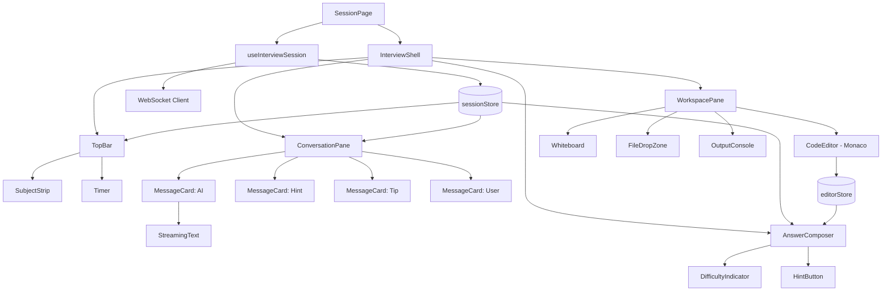
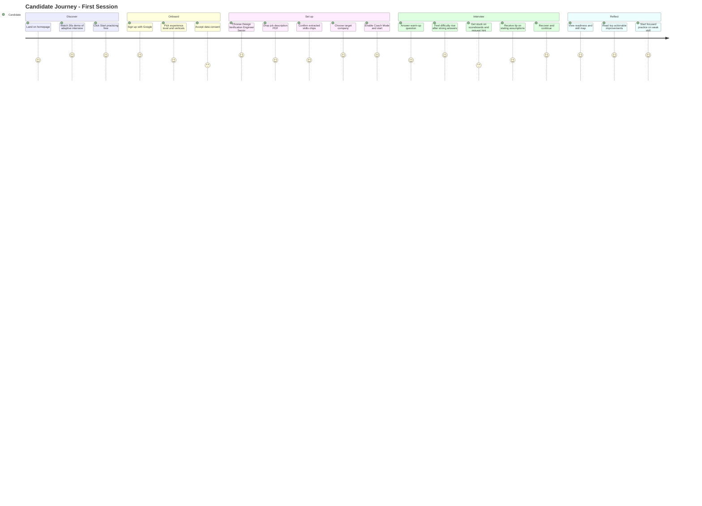
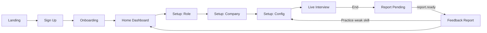

# Frontend UI & Architecture Specification
## AI-Based Interview Preparation Platform – Phase 1

| Field | Value |
|---|---|
| Document Version | 1.0 |
| Framework | Next.js 15 (App Router), React 19, TypeScript, TailwindCSS |
| Realtime | WebSocket with streaming token rendering |
| Editor | Monaco Editor |

---

## 1. Design Principles

1. **The interview is the product.** Every pixel on the live interview screen exists to reduce friction between the candidate and the AI.
2. **Streaming everywhere.** Questions, hints, and tips render token-by-token; the candidate never stares at a spinner.
3. **Real-interview fidelity.** Layout mirrors a real technical interview: conversation on one side, working area on the other, no clutter.
4. **Adaptation is visible but not gamified.** The candidate can feel the interview shifting, but numeric scores stay hidden until the report.
5. **Zero-install technical workspace.** Code, HDL, and design answers happen in-browser.

---

## 2. Screen Inventory

| Screen | Route | Purpose |
|---|---|---|
| Landing | `/` | Value proposition, CTA, language switch |
| Auth | `/sign-in`, `/sign-up` | OAuth + email |
| Onboarding | `/onboarding` | Languages, background, target role, time, interview date, consent |
| Diagnostic | `/app/diagnostic` | 8 to 12 quick items, then the starting profile |
| Home | `/app` | One recommended next activity, the week, streak and goals, daily challenge |
| Quick Practice | `/app/quick/[attemptId]` | One short item with explanation |
| Deep Practice | `/app/deep/[attemptId]` | One bank question: attempt, hints, feedback, reveal, follow-up |
| Simulation Setup | `/app/new` | Role → Company → Config → Skill plan preview |
| Live Interview | `/app/session/[id]` | The adaptive interview screen |
| Feedback Report | `/app/session/[id]/report` | Scorecards, subjects, skills, timeline, narrative |
| Weekly Plan | `/app/plan` | The plan by day with reasons; edit time and focus |
| Question Bank | `/app/bank` | Search and filter by subject, skill, difficulty, format, language |
| History | `/app/history` | Sessions and attempts |
| Progress | `/app/progress` | Skill profile, trends, readiness per target |
| Settings | `/app/settings` | Languages, reminders and quiet hours, billing, data and consent |

Every screen exists in Hebrew and English. The interface is mobile-first: the launch audience will often practice on a phone for a few minutes at a time.

---

## 3. Core Layouts & Wireframes

### 3.1 Live Interview Dashboard (Primary Screen)

The screen uses a **three-zone layout** on desktop and a **tabbed stack** on mobile.

```
┌──────────────────────────────────────────────────────────────────────────────────────┐
│  TOP BAR                                                                             │
│  [Logo]  Design Verification Engineer · Senior  @ Example Semi     ⏱ 23:41   [Pause] │
│  Subject: Hardware Queues (3 of 5) · Skill: Out-of-Order Scoreboards       [End Session]│
│  Subjects: SystemVerilog ✓  UVM ✓  Hardware Queues ●  Debugging ○  Values ○            │
├──────────────────────────────────┬───────────────────────────────────────────────────┤
│  AI CONVERSATION PANE            │  WORKSPACE PANE                                   │
│  (40% width)                     │  (60% width)                                      │
│                                  │  ┌─────────────────────────────────────────────┐  │
│  ┌────────────────────────────┐  │  │ [Code] [Whiteboard] [Files]   SystemVerilog ▾│  │
│  │ 🤖 AI Interviewer          │  │  ├─────────────────────────────────────────────┤  │
│  │ Your tag-based scoreboard  │  │  │  1  class ooo_scoreboard extends uvm_...    │  │
│  │ works for 4 outstanding    │  │  │  2    bit [3:0] tag_q[$];                   │  │
│  │ transactions. The DUT now  │  │  │  3    txn_t  pending[bit[3:0]];             │  │
│  │ supports 64 with a 4-bit   │  │  │  4                                          │  │
│  │ tag. What breaks?▌         │  │  │  5    function void write_req(txn_t t);     │  │
│  └────────────────────────────┘  │  │  6      ...                                 │  │
│                                  │  │                                              │  │
│  ┌────────────────────────────┐  │  │            MONACO EDITOR                     │  │
│  │ 💡 Tip                     │  │  │                                              │  │
│  │ State your assumptions     │  │  │                                              │  │
│  │ before implementing.       │  │  │                                              │  │
│  │                [Got it] [?]│  │  └─────────────────────────────────────────────┘  │
│  └────────────────────────────┘  │  ┌─────────────────────────────────────────────┐  │
│                                  │  │ OUTPUT / CONSOLE                    [▶ Run] │  │
│  ┌────────────────────────────┐  │  │ Compiling with Verilator...                 │  │
│  │ 🧑 You (turn 6)            │  │  │ 0 errors, 1 warning                         │  │
│  │ I'd tag each request...    │  │  └─────────────────────────────────────────────┘  │
│  └────────────────────────────┘  │                                                   │
│         ↑ scrollable history     │                                                   │
├──────────────────────────────────┴───────────────────────────────────────────────────┤
│  ANSWER COMPOSER                                                                     │
│  ┌──────────────────────────────────────────────────────────────────┐ [💡 Hint]      │
│  │ Type your answer... (Shift+Enter for newline)                    │ [Attach code]  │
│  └──────────────────────────────────────────────────────────────────┘ [Submit ⏎]     │
│  Difficulty ●●●●●●○○○○   Interviewer is listening...                                 │
└──────────────────────────────────────────────────────────────────────────────────────┘
```

**Zone descriptions:**

| Zone | Contents | Behavior |
|---|---|---|
| **Top Bar** | Role, company, timer, current subject and skill, a subject strip showing every planned subject (done ✓, current ●, upcoming ○), pause/end | Sticky. Subject label cross-fades on a subject switch. The strip never shows how well a subject went, only whether it is done. |
| **AI Conversation Pane** | Chronological stream of AI questions, hints, tips, and candidate answers | Newest at bottom, auto-scroll unless user scrolled up. Streams tokens. Hints and tips are visually distinct cards. |
| **Workspace Pane** | Tabbed: Code (Monaco), Whiteboard (rich text / simple diagram), Files (upload zone) | Persists content per turn. The AI can pre-populate starter code. "Attach code" links the current editor buffer to the answer. |
| **Output Console** | Sandbox compile/run output | Collapsible. Only visible when `allow_code_execution` is true. |
| **Answer Composer** | Free-text answer, hint request, submit | Difficulty indicator is a subtle dot-scale, not a number. Disabled while AI is streaming. |

**Adaptive visual cues (subtle, non-numeric):**

| Engine Action | UI Cue |
|---|---|
| `ESCALATE` | Difficulty dots fill by one; short "Going deeper" label fades in on the AI card |
| `HOLD` | No change |
| `HINT` | Hint card slides in above the question; hint button shows "Hint 1 of 2 used" |
| `STEP_BACK` | Difficulty dots reduce; AI card prefixed with "Let's step back" |
| Skill switch within a subject | Skill label in the top bar updates; nothing else changes |
| Subject switch | Subject label cross-fades; the previous subject gets a ✓ in the strip; the AI card opens with the bridge sentence |
| Subject closed early (strong) | Same as a subject switch. The UI never says "closed early"; the report explains it afterwards |
| Tip delivered | Amber tip card with "Got it" acknowledgement; collapses after acknowledgement |

Difficulty dots reset to the new skill's entry difficulty on every skill switch, so a candidate who is doing well sees the dots start higher on the next skill. That is the only visible signal of the Subject Router's judgement during the session.

### 3.2 Mobile Layout (< 768px)

```
┌──────────────────────────┐
│ DV Eng · Senior  ⏱ 23:41 │
│ [Chat] [Code] [Files]    │  ← segmented control
├──────────────────────────┤
│                          │
│   Active tab content     │
│   (Chat by default)      │
│                          │
├──────────────────────────┤
│ [Answer...]  [💡] [Send] │
└──────────────────────────┘
```

Coding questions on mobile show a banner suggesting desktop; the editor remains usable with a simplified toolbar.

### 3.3 Session Setup Wizard

```
┌───────────────────────────────────────────────────────────────┐
│  Step 1 of 3 · Choose your role                               │
│  ┌───────────────┐ ┌───────────────┐ ┌───────────────┐        │
│  │ Hardware / DV │ │ Backend       │ │ ML Engineering│  ...   │
│  └───────────────┘ └───────────────┘ └───────────────┘        │
│  Seniority:  ( ) Junior  ( ) Mid  (•) Senior  ( ) Staff        │
│                                                               │
│  ┌─────────────────────────────────────────────────────────┐  │
│  │  📄 Drop a job description or resume here               │  │
│  │     We'll tailor the interview to it.        [Browse]   │  │
│  └─────────────────────────────────────────────────────────┘  │
│                                                   [Next →]    │
└───────────────────────────────────────────────────────────────┘
```

- **Step 2 – Company:** searchable grid of company profile cards with a "Generic" default; each card shows values chips, a risk-tolerance indicator, and "Adds N skills" so the candidate sees that the company changes what is examined.
- **Step 3 – Configure and review the skill plan:** duration (30/45/60), Coach Mode toggle, then the **Skill Plan Preview**:

```
┌───────────────────────────────────────────────────────────────┐
│  Skills this interview will examine                           │
│                                                               │
│  SYSTEMVERILOG                              ~4 questions      │
│   ● SystemVerilog Assertions      core      required: Lv 4    │
│   ● Constrained Randomization     important required: Lv 4    │
│  UVM                                        ~6 questions      │
│   ● Sequences and Sequencers      core      required: Lv 4    │
│   ● Scoreboards and Monitors      core      required: Lv 4    │
│  DEBUGGING                        ★ company ~5 questions      │
│   ● Debugging Methodology         core      required: Lv 5    │
│  HARDWARE QUEUES                  ☆ focus   ~5 questions      │
│   ● Out-of-Order Scoreboards      important required: Lv 3    │
│  OBSERVED THROUGHOUT                                          │
│   ○ Risk Awareness                ★ company required: Lv 3    │
│   ○ Structured Communication                required: Lv 3    │
│                                                               │
│  + Add a focus skill ▾          [← Back]      [Start Interview]│
└───────────────────────────────────────────────────────────────┘
```

  Skills are grouped by subject. Badges show where each skill came from: ★ added or raised by the company, ☆ added by the candidate's focus choice. Question counts are estimates; the candidate is told the AI will spend more or less time on a subject depending on how it goes. Required levels are shown so the candidate knows the bar before starting.

### 3.4 Feedback Report Screen

```
┌────────────────────────────────────────────────────────────────────────────┐
│  Session Report · DV Engineer (Senior) @ Example Semi · 45 min · 24 turns  │
│                                                                            │
│  ROLE FIT        COMPANY FIT         OVERALL                               │
│  ┌────────┐      ┌────────┐          ┌────────┐                            │
│  │  81%   │      │  60%   │ capped   │  74%   │                            │
│  └────────┘      └────────┘          └────────┘                            │
│  "Strong verification fundamentals. Debugging is a core gap for this       │
│   company and is the single biggest lever for your readiness."             │
├────────────────────────────────────────────────────────────────────────────┤
│  BY SUBJECT                                                                │
│  SystemVerilog    Lv 4.2 / 4 required   strong    5 questions (closed early)│
│  UVM              Lv 4.0 / 4 required   meets     6 questions              │
│  Hardware Queues  Lv 3.5 / 3 required   exceeds   4 questions              │
│  Debugging   ★    Lv 2.0 / 5 required   CORE GAP  7 questions (extended)   │
│  Values      ★    Lv 4.0 / 3 required   exceeds   1 question               │
├────────────────────────────────────────────────────────────────────────────┤
│  BY SKILL                                        Level  Required  Result   │
│  ▾ SystemVerilog                                                           │
│     SystemVerilog Assertions              core   ●●●●○   4     meets       │
│     Blocking vs Non-blocking              core   ●●●●●   4     exceeds     │
│  ▾ Debugging                                                               │
│     Debugging Methodology            ★    core   ●●○○○   5     gap −3      │
│     Waveform Debugging               ★    core   ●●○○○   4     gap −2      │
│  ▾ Observed throughout                                                     │
│     Risk Awareness                   ★    core   ●●○○○   3     gap −1      │
│     Structured Communication                     ●●●○○   3     meets       │
│  ▸ UVM · Hardware Queues · Values                                          │
├─────────────────────────────┬──────────────────────────────────────────────┤
│  INTERVIEW TIMELINE         │  TOP ACTIONABLE IMPROVEMENTS                 │
│  d ▲  SV   │ HWQ │ DBG │UVM │  1. Start debugging from the symptom, not    │
│  8 │ ╭─╮   │     │     │    │     the code (Debugging, seen 3×)            │
│  6 │─╯ ╰─╮ │ ╭─╮ │     │╭── │  2. State assumptions before designing       │
│  4 │     ╰─│─╯ ╰─│╮  ╭─│╯   │     (improved after tip)                     │
│  2 │       │     │╰──╯ │    │  3. Name failure modes before being asked    │
│    └───────┴─────┴─────┴────│     (Risk Awareness, company core)           │
│      ▲ hint  ▲ step-back    │                                              │
├─────────────────────────────┴──────────────────────────────────────────────┤
│  NARRATIVE (expandable)   ·   TRANSCRIPT (expandable)                      │
│                                          [Practice Debugging Methodology]  │
└────────────────────────────────────────────────────────────────────────────┘
```

Rules for this screen:

- Levels are shown as five dots, never as raw scores.
- The company fit card shows "capped" with a tooltip naming the core gap that caused the cap.
- The subject table explains why a subject got more or fewer questions in plain words: "closed early", "extended", or nothing.
- Skills with insufficient evidence show a hollow dot pattern and the label "provisional"; skills not covered show "not covered this session".
- Each skill row expands to show strengths, gaps, and the evidence turns, linked into the transcript.

### 3.5 Home: One Next Activity

The home screen answers one question: what should I do right now?

```
┌──────────────────────────────┐
│  Good morning, Noa      🔥 6 │
│  Interview in 12 days        │
│                              │
│  ┌──────────────────────────┐│
│  │ NEXT · Deep practice     ││
│  │ FSM: overlapping         ││
│  │ sequence detection       ││
│  │ ~20 min                  ││
│  │                          ││
│  │ Last time you needed a   ││
│  │ hint here. Try a new     ││
│  │ problem on your own.     ││
│  │            [Start  →]    ││
│  └──────────────────────────┘│
│                              │
│  Have 3 minutes?             │
│  [Daily challenge]  [Quick]  │
│                              │
│  THIS WEEK        42/90 min  │
│  Mon ● Tue ● Wed ● Thu ○ …   │
│                              │
│  READINESS                   │
│  Digital HW (student)        │
│  @ Generic          64%      │
│  3 skills not yet assessed   │
│                              │
│  [Plan] [Bank] [Progress]    │
└──────────────────────────────┘
```

- The **next activity card** comes from the Plan Router with its plain-language reason. The reason only cites real history; with little evidence it says "Let's find out where you stand on counters."
- **Quick entry points** for the daily challenge and a quick item are always one tap away.
- **Week strip**: days with a meaningful attempt are filled. The streak counts attempts plus review, not correctness.
- **Readiness cards** per target: fit score from the skill profile, skills not yet assessed, top core gap. Never-assessed skills are "unknown", not zero.

### 3.5a Quick Practice Screen

```
┌──────────────────────────────┐
│  ← Quick · Sequential Logic  │
│                        1 / 5 │
│  A 3-bit up counter is at    │
│  110 with synchronous reset  │
│  asserted. After the next    │
│  rising edge it holds:       │
│                              │
│  ( ) 111                     │
│  ( ) 000                     │
│  ( ) 110                     │
│  ( ) 001                     │
│                              │
│              [Check]         │
├──────────────────────────────┤
│  after answering:            │
│  ✓ 000. Synchronous reset    │
│  takes effect on the clock   │
│  edge, so the counter clears.│
│  You chose 110: that is what │
│  an asynchronous reset       │
│  ordering mistake looks like.│
│  [Explain more]  [Next →]    │
└──────────────────────────────┘
```

- One item per screen, thumb-reachable options, feedback under 1.5 s.
- Each distractor's explanation names the misconception it represents.
- "Explain more" opens a short explanation with an animated illustration where one exists (for example stepping the clock).

### 3.5b Deep Practice Screen

```
┌──────────────────────────────────────────────────────────────┐
│  ← Deep · FSMs · Sequence detector, overlapping   ~20 min    │
├──────────────────────────────────────────────────────────────┤
│  QUESTION                                                    │
│  Design a Moore FSM that asserts out=1 whenever the input    │
│  serial stream contains 1011, overlapping allowed. Give      │
│  states, transitions, and the output per state.              │
│  [Clarify a requirement ▾]                                   │
│                                                              │
│  How confident are you?   ○ 1  ○ 2  ● 3  ○ 4  ○ 5            │
├──────────────────────────────────────────────────────────────┤
│  YOUR ANSWER      [Text] [Table] [Code]                      │
│  ┌──────────────────────────────────────────────────────────┐│
│  │ States: S0 (none), S1 (1), S2 (10), S3 (101), S4 (1011) ││
│  │ ...                                                      ││
│  └──────────────────────────────────────────────────────────┘│
│  💡 Hint (2 left)                       [Submit answer]      │
├──────────────────────────────────────────────────────────────┤
│  after submit:                                               │
│  FEEDBACK                                     Partial        │
│  ✓ States and outputs correct                                │
│  ✗ Missing transition S4 --1--> S2 for overlap               │
│  Check: 3 of 4 test sequences pass                           │
│  Why it matters: overlapping detection reuses the suffix.    │
│  Next: one unfamiliar variation, then a retention check      │
│  on Thursday.                                                │
│  [Show reference solution]   [Continue to follow-up →]       │
└──────────────────────────────────────────────────────────────┘
```

- The confidence rating is required before the first submit and feeds calibration.
- The reference is behind an explicit button. Opening it before submitting is allowed but the attempt is then marked as no evidence, and the UI says so plainly.
- Feedback follows the fixed structure in `AI_Engine_Spec.md` §6.6: what happened, why it matters, what next, reasoning versus reference.

### 3.5c Weekly Plan Screen

- Seven day columns (or a vertical list on mobile), each with its items, mode icon, minutes, and reason.
- Editing available minutes or focus skills regenerates the plan in place.
- Retention checks are shown as "check-in" items with the skill and the date the level was reached.
- The interview date sits at the top with days remaining and what the final week holds.

### 3.5d Question Bank Browser

- Filters: subject, skill, difficulty, format, mode, language, "not yet attempted".
- Each card shows subject, skill chips, difficulty, estimated minutes, format, and reuse attribution where required.
- Opening a card starts a deep practice attempt outside the plan; it still updates the profile.

### 3.6 Progress Page (Skill Profile)

```
┌───────────────────────────────────────────────────────────────────────┐
│  Your Skill Profile                       Filter: [All] [Hardware] …  │
│                                                                       │
│  READINESS FOR YOUR TARGETS                                           │
│  DV Engineer (Senior) @ Example Semi     72%   2 skills not yet assessed│
│  DV Engineer (Senior) @ Generic          81%   all skills assessed    │
│  RTL Design Engineer (Senior) @ Generic  58%   6 skills not yet assessed│
│                                                                       │
│  BY SUBJECT                        Level   Trend      Sessions        │
│  ▾ SystemVerilog                   4.2     ↗ improving   3            │
│      SystemVerilog Assertions      ●●●●○   ↗            3            │
│      Constrained Randomization     ●●●○○   →            2            │
│  ▾ Debugging                       2.0     → new        1            │
│      Debugging Methodology         ●●○○○   new          1            │
│  ▸ UVM · Hardware Queues · Values                                     │
│                                                                       │
│  [Practice my weakest core skill]   [Cover unassessed skills]         │
└───────────────────────────────────────────────────────────────────────┘
```

- Built from `User_Skill_Profile`, grouped by subject with a weighted subject level.
- Each skill expands into a level history chart across sessions.
- The two action buttons create a session pre-configured with those skills as focus.

---

## 4. Component Architecture

### 4.1 Directory Structure

```
apps/web/
├── app/
│   ├── (marketing)/
│   │   └── page.tsx                      # Landing (static, edge-rendered)
│   ├── (auth)/
│   │   ├── sign-in/page.tsx
│   │   └── sign-up/page.tsx
│   ├── onboarding/page.tsx
│   └── app/
│       ├── layout.tsx                    # Authenticated shell
│       ├── page.tsx                      # Home dashboard
│       ├── new/page.tsx                  # Session setup wizard
│       ├── session/[id]/
│       │   ├── page.tsx                  # Live interview
│       │   └── report/page.tsx
│       ├── history/page.tsx
│       ├── progress/page.tsx
│       └── settings/page.tsx
├── components/
│   ├── interview/
│   │   ├── InterviewShell.tsx            # 3-zone layout, responsive
│   │   ├── TopBar.tsx
│   │   ├── ConversationPane.tsx
│   │   ├── MessageCard.tsx               # AI / user / hint / tip variants
│   │   ├── StreamingText.tsx             # Token-by-token renderer
│   │   ├── AnswerComposer.tsx
│   │   ├── DifficultyIndicator.tsx
│   │   ├── SubjectStrip.tsx              # planned subjects: done / current / upcoming
│   │   └── HintButton.tsx
│   ├── workspace/
│   │   ├── WorkspacePane.tsx             # Tab container
│   │   ├── CodeEditor.tsx                # Monaco wrapper
│   │   ├── Whiteboard.tsx
│   │   ├── FileDropZone.tsx
│   │   └── OutputConsole.tsx
│   ├── setup/
│   │   ├── RoleSelector.tsx
│   │   ├── CompanySelector.tsx
│   │   ├── SessionConfigForm.tsx
│   │   └── DocumentUpload.tsx
│   ├── setup/
│   │   └── SkillPlanPreview.tsx          # grouped by subject, with source badges
│   ├── report/
│   │   ├── FitScorecards.tsx             # role, company, overall
│   │   ├── SubjectTable.tsx
│   │   ├── SkillTable.tsx                # level dots vs required
│   │   ├── DifficultyTimeline.tsx        # segmented by subject
│   │   ├── TipList.tsx
│   │   └── NarrativeView.tsx
│   ├── progress/
│   │   ├── TargetReadinessCard.tsx
│   │   ├── SkillProfileTree.tsx
│   │   └── LevelHistoryChart.tsx
│   └── ui/                               # Design-system primitives (button, card, tabs, dialog...)
├── lib/
│   ├── ws/
│   │   ├── client.ts                     # WebSocket client with reconnect
│   │   └── protocol.ts                   # Typed message schemas (zod)
│   ├── api/                              # REST client (typed via OpenAPI codegen)
│   ├── stores/
│   │   ├── sessionStore.ts               # Zustand: live session state
│   │   └── editorStore.ts                # Zustand: per-turn editor buffers
│   └── hooks/
│       ├── useInterviewSession.ts
│       ├── useStreamingMessage.ts
│       └── useCodeExecution.ts
└── styles/
    └── globals.css                       # Tailwind base + tokens
```

### 4.2 Component Tree (Live Interview)



### 4.3 Monaco Editor Integration

Monaco is the VS Code editor engine and runs entirely client-side, giving a "local-like" editing experience without exposing any backend.

| Concern | Implementation |
|---|---|
| **Loading** | `@monaco-editor/react` with lazy `dynamic()` import; editor chunk excluded from the initial bundle |
| **Languages** | Built-in: Python, C++, TypeScript, Go, Java. Custom Monarch tokenizer for **SystemVerilog / Verilog** (keywords, `always_ff`, `assert property`, etc.) |
| **Security** | Editor content never executes in the browser. Execution is an explicit "Run" action that POSTs the buffer to the sandbox API. No `eval`, no web workers executing user code. |
| **Isolation** | Editor state held in `editorStore`, keyed by `turn_index`; switching turns restores the correct buffer |
| **Starter code** | Generator's `starter_code` pre-populates the buffer with a read-only decoration on scaffold lines |
| **Telemetry** | `revision_count` and `answer_started_at` derived from Monaco's `onDidChangeModelContent`; batched and sent with the answer, never keystroke-by-keystroke |
| **Accessibility** | Monaco's built-in screen-reader mode; Tab-trap escape via `Ctrl+M` |
| **Theming** | Custom theme aligned to Tailwind tokens; dark/light follows system |

**Wrapper contract:**

```ts
interface CodeEditorProps {
  language: 'systemverilog' | 'verilog' | 'python' | 'cpp' | 'typescript' | 'go' | 'java';
  value: string;
  starterLockedRanges?: Array<{ startLine: number; endLine: number }>;
  onChange: (value: string, meta: { revisionCount: number; firstEditAt: number | null }) => void;
  onRun?: () => void;
  readOnly?: boolean;
}
```

### 4.4 File Upload Zone

- Drag-and-drop with click-to-browse fallback.
- Accepts PDF, DOCX, TXT, MD up to 10 MB.
- Direct-to-object-storage upload via pre-signed URL; the client never proxies file bytes through the API.
- Upload progress + parse status (`pending → parsed`) polled via the API; parsed skills are shown as removable chips for the candidate to confirm before the session starts.
- During a live session, the Files tab lets the candidate reference their own uploaded documents (read-only viewer).

### 4.5 Realtime Protocol (Client ↔ WebSocket Server)

All messages are typed with zod schemas shared with the backend.

**Client → Server**

| Type | Payload |
|---|---|
| `session.join` | `{ session_id }` |
| `turn.submit` | `{ turn_index, answer_text, answer_code?, language?, editor_meta }` |
| `hint.request` | `{ turn_index }` |
| `tip.ack` | `{ delivered_tip_id, rating? }` |
| `code.run` | `{ turn_index, code, language }` |
| `session.pause` / `session.resume` / `session.end` | `{}` |

**Server → Client**

| Type | Payload |
|---|---|
| `state.snapshot` | Full renderable state on join / reconnect |
| `question.delta` | `{ turn_index, token }` streamed |
| `question.done` | `{ turn_index, archetype, starter_code?, language? }` |
| `hint.delta` / `hint.done` | Streamed hint |
| `tip.deliver` | `{ delivered_tip_id, text, severity }` |
| `ui.cue` | `{ action: 'ESCALATE' \| 'HOLD' \| 'HINT' \| 'STEP_BACK' \| 'ENTER_SKILL', subject_key, subject_label, skill_key, skill_label, subject_switch: boolean, subjects_done: string[], difficulty_dots }` |
| `plan.snapshot` | Sent on join: the session skill plan grouped by subject, for the top bar strip and the setup preview |
| `code.result` | `{ turn_index, stdout, stderr, exit_code, duration_ms }` |
| `session.ended` | `{ report_pending: true }` |
| `report.ready` | `{ report_url }` |

**Reconnect strategy:** exponential backoff; on reconnect the client sends `session.join` and receives `state.snapshot`, which includes any partially streamed question so no turn is lost.

### 4.6 State Management

| State | Store | Rationale |
|---|---|---|
| Live session (messages, difficulty, topic, timer) | Zustand `sessionStore`, fed by WebSocket | Fine-grained subscriptions; no provider nesting |
| Editor buffers per turn | Zustand `editorStore` | Isolated from message churn |
| Server data (sessions list, reports, templates) | TanStack Query | Caching, revalidation, optimistic updates |
| Form state (setup wizard) | React Hook Form + zod | Validation parity with backend |
| Theme / preferences | `localStorage` with try/catch | Per-device convenience only |

---

## 5. User Journey Through the UI



### 5.1 Step-by-Step Screen Flow



### 5.2 Key Interaction Details

| Moment | UX Detail |
|---|---|
| **First question** | Rendered with a brief "Your interviewer is preparing…" state for ≤ 800 ms, then streams. Sets the pacing expectation. |
| **Submitting an answer** | Composer locks; "Interviewer is thinking" indicator with subtle pulse; evaluation and next question stream within the latency budget. |
| **Difficulty escalation** | No modal, no fanfare. Difficulty dots fill, and the AI card carries a small "Going deeper" label. The candidate feels progress without a scoreboard. |
| **Hint request** | Button shows remaining budget for the skill. Confirmation-free; the hint streams into a distinct card. |
| **Tip delivery** | Tip card appears *above* the next question so the candidate reads it before answering. "Got it" collapses it; a thumbs-up/down feeds `candidate_rating`. |
| **Step-back** | AI card begins with "Let's step back." Difficulty dots reduce. The tone is collegial, never punitive. |
| **Subject switch** | Subject label cross-fades; the finished subject gets a ✓ in the strip; the AI card opens with the bridge sentence; difficulty dots reset to the entry difficulty. |
| **Returning to a weak subject** | Looks identical to any other subject switch. No "let's try again" language anywhere in the UI. |
| **Session end** | Full-screen "Generating your report" with the timeline animating in as data arrives; report opens automatically. |
| **Reconnect** | Toast: "Reconnecting…" → "Back online". State snapshot restores exactly where the candidate was. |

---

## 6. Recommended Frontend Stack

| Layer | Choice | Rationale |
|---|---|---|
| **Framework** | Next.js 15 (App Router) | Edge-rendered marketing pages, RSC for dashboards, client components for the live interview |
| **UI Library** | React 19 | Concurrent rendering suits streaming UIs; `useOptimistic` for tip acknowledgements |
| **Language** | TypeScript (strict) | Shared zod schemas with the backend protocol |
| **Styling** | TailwindCSS v4 + CSS variables for tokens | Rapid iteration; dark/light via `prefers-color-scheme` and `data-theme` |
| **Component Primitives** | Radix UI (via shadcn/ui) | Accessible dialogs, tabs, tooltips out of the box |
| **Editor** | Monaco Editor (`@monaco-editor/react`) | VS Code engine; custom SystemVerilog tokenizer |
| **Realtime** | Native WebSocket + custom typed client; SSE fallback | Minimal dependency; typed protocol |
| **Client State** | Zustand | Lightweight, selector-based |
| **Server State** | TanStack Query v5 | Caching, background refetch |
| **Forms** | React Hook Form + zod | Validation parity |
| **Charts** | Recharts (skill map, timeline) | Declarative, SVG, accessible |
| **Localization** | next-intl; logical CSS properties; RTL tested in CI | Hebrew and English at parity from day one |
| **Notifications** | Web push via a service worker, or email through the backend (one channel in the pilot) | User-controlled timing and quiet hours |
| **Animation** | Framer Motion (sparingly) | Difficulty dots, topic cross-fade, tip card entrance |
| **Auth** | Clerk (or Auth0) React SDK | Fast, secure defaults |
| **Testing** | Vitest + React Testing Library; Playwright for the full interview flow with a mocked WebSocket server | |
| **Tooling** | pnpm workspaces, Turborepo, ESLint, Prettier | Monorepo with shared `protocol` package |

### 6.1 Performance Targets

| Metric | Target |
|---|---|
| Landing LCP | ≤ 1.5 s |
| Live interview TTI (post-auth) | ≤ 2.0 s |
| Monaco chunk load (lazy) | ≤ 600 ms on broadband; loaded during setup wizard step 3 to be warm |
| Token render latency (WS → DOM) | ≤ 16 ms per frame batch |
| Bundle size (interview route) | ≤ 350 KB gzipped excluding Monaco |

### 6.2 Accessibility

- All interview actions keyboard-reachable; `Ctrl+Enter` submits, `Ctrl+/` requests a hint.
- Streaming text uses `aria-live="polite"` on completed sentences, not on every token.
- Difficulty indicator has an `aria-label` describing the level in words ("moderately challenging").
- Color is never the only carrier of meaning on hint/tip cards; icons and labels accompany it.
- WCAG 2.1 AA contrast on both themes.

---

## 6.3 Bilingual and Right-to-Left

| Rule | Implementation |
|---|---|
| Message catalogs | `next-intl` with `he` and `en`; every string keyed, none inline |
| Direction | `dir="rtl"` on the document for Hebrew; layout built with logical CSS properties (`margin-inline-start`, not `margin-left`) so it mirrors automatically |
| Mixed content | Code, formulas, waveforms, and glossary terms flagged `keep_english` are wrapped in `dir="ltr"` islands inside Hebrew text |
| Switching | A language toggle in the top bar and settings; state lives in the URL locale segment and the user profile; switching never reloads an in-progress attempt |
| Fonts | A Hebrew and Latin pair with matching x-height; test numerals and code alignment in both |
| Monaco | Editor stays left-to-right in both languages; UI chrome around it mirrors |
| Testing | Every Playwright flow runs in both locales; screenshots reviewed for truncation and mirrored icons |

## 6.4 Explanatory Motion

Animation explains concepts: highlighting a signal path, stepping through an FSM, advancing a clock. Learners can pause and step instructional motion. Decorative motion is restrained, respects `prefers-reduced-motion`, and never changes measured response time. Initial explanatory animations: clock stepping on a flip-flop, FSM transition walk, and mux select highlighting.

## 7. Phase 2 Frontend Considerations

The following are out of scope for Phase 1 but influence current decisions:

| Future Need | Present Decision |
|---|---|
| Company-facing dashboard | Authenticated shell (`/app/layout.tsx`) is role-aware from day one; a `/company` route group can be added without restructuring |
| Shareable candidate reports | Report components are pure functions of `Session_Report` data, so a redacted company view reuses them |
| Embeddable interview widget | `InterviewShell` has no dependency on Next.js routing; it can be packaged separately |
