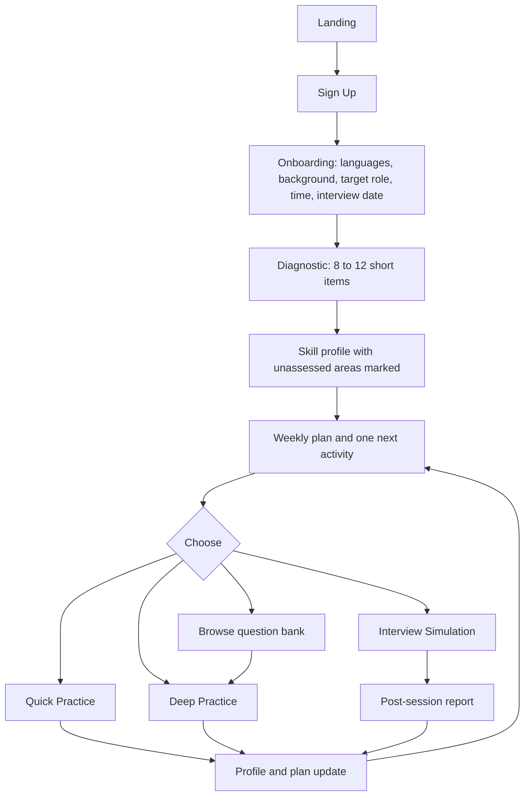
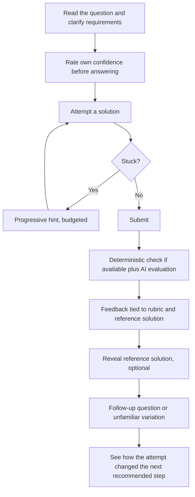

# Product Requirements Document (PRD)
## AI-Based Interview Preparation Platform

| Field | Value |
|---|---|
| Document Version | 2.0 |
| Change from 1.0 | Merged with the company vision (September 16, 2026): Israel launch track, bilingual, three practice modes, reviewed question bank, learning plan, growth features, consent-based B2B, six-week beta |
| Founders | Harel Artman and Shaked Buzi |
| Status | Working document |
| Phase Covered | Phase 1 (B2C) with Phase 2 (institutions, employers, matching) roadmap |
| Brand | Temporary name; naming will not delay development |

---

## 1. Executive Summary

We are building a company that helps people develop professional skills, demonstrate what they know, and progress toward suitable career opportunities.

The product is an AI-driven interview preparation platform. The AI acts as a personal coach: it examines the candidate skill by skill, adapts every question to their performance, gives actionable feedback during and after practice, and keeps a learning plan that changes as they improve.

### Phase 1 (Current Focus): B2C

**Launch track:** students and recent graduates preparing for student positions and entry-level digital hardware roles in Israel, in Hebrew and English from day one. This is the audience the founders are closest to and can recruit and observe directly.

**What the product does:**

- Examines the candidate against a **skill set** drawn from the target role and, optionally, a target company.
- Offers **three practice modes**: quick practice (2 to 5 minutes), deep practice (15 to 30 minutes), and a full adaptive interview simulation (30 to 60 minutes).
- Adapts inside a session with the **Skill Controller** and **Subject Router**, and across days with a **weekly plan** and one recommended next activity.
- Uses a **reviewed question bank** as the spine, with AI-generated follow-ups, variations, hints, and feedback around it.
- Builds a **skill profile** that shows current proficiency per skill, progress over time, and what has not been assessed yet.

The goals of Phase 1 are user acquisition, a product real candidates return to, and a structured evidence base of skill assessments collected with consent.

### Phase 2 (Roadmap): Institutions, Employers, Matching

The same skill language serves three later customers: educational institutions offering preparation to a cohort, employers running assessments as a separate mode, and consent-based candidate matching. Practice transcripts and old mistakes are never sent to anyone automatically. The candidate chooses what to share and with whom.

### Delivery Target

A tested first beta by day 28 where feasible, a second review cycle by day 42, candidate testing from week two, and interviewer review of real feedback. The figures in this document are operating targets, not verified demand or guarantees of hiring outcomes.

### Three Adaptive Axes

| Axis | What It Controls |
|---|---|
| **User Performance** | Real-time difficulty, depth, hints, subject order, and the weekly plan |
| **Role Parameters** | The skill set examined, required levels, and seniority |
| **Company Parameters** | Extra skills, emphasis, and question style, grounded in dated evidence |

---

## 2. Target Audience

### 2.1 Launch Persona (Phase 1, first six weeks)

| Persona | Description | Core Pain Point | What They Value |
|---|---|---|---|
| **The Engineering Student or Recent Graduate (Israel)** | Electrical, electronics, or computer engineering student or graduate targeting a student position or first digital hardware role | Does not know what matters for the role, whether they truly understand it, or how to improve after getting stuck | Clear next step, honest baseline, short daily practice, Hebrew or English |

Preparation follows target-role requirements and demonstrated knowledge. Degree stage alone does not determine the track.

### 2.2 Later Personas

| Persona | Description | When |
|---|---|---|
| **The Active Job Seeker** | Engineer with 2 to 8 years experience interviewing at multiple companies | After the launch track is stable |
| **The Career Switcher** | Mid-career professional moving into a new technical domain | With deeper tracks |
| **The Senior/Staff Candidate** | 8+ years, senior IC or lead roles | With senior content and simulation depth |
| **Software Candidates** | Frontend, backend, ML, DevOps and other software roles | Software is the next vertical after hardware |

### 2.3 Role Coverage

The platform is designed to cover every engineering role in two families, hardware and software. One AI engine serves all of them because roles are data: a skill set drawn from one shared catalog. The full catalog is in `MVP_Build_Guide.md` §3.

**Launch content (six weeks):** one track, entry-level digital hardware.

| Subject | Initial Content | Role in the Experience |
|---|---|---|
| Digital fundamentals | Boolean algebra, gates, multiplexers, encoders, decoders, adders, comparators | Core preparation and quick practice |
| Sequential logic | Latches, flip-flops, registers, counters, reset, timing diagrams | Core reasoning and waveform interpretation |
| Finite-state machines | States, transitions, Mealy and Moore, sequence detection, edge cases | Deep practice and assessment |
| Relevant programming | Bit operations, arrays, loops, search, basic complexity, selected data structures | Role-specific supporting practice |
| Reasoning | Assumptions, constraints, decomposition, selected logic puzzles | Problem-solving practice and daily challenges |
| Projects and behavioral | Personal contribution, design decisions, debugging, teamwork, explaining a project | Written interview preparation |

**Next:** deeper digital design and HDL (Verilog/SystemVerilog, timing, pipelines, FIFOs, verification), then the software family, then a separately reviewed analog track.

---

## 3. Core Features

### 3.1 Adaptive Real-Time Assessment

The AI evaluates every answer and adjusts the next question along difficulty and depth.

| Candidate Signal | AI Response |
|---|---|
| Strong, precise answer | Increase difficulty; edge cases, trade-offs, scale; deeper sub-topic |
| Partially correct | Hold difficulty; probe the gap |
| Incorrect or uncertain | Step back; hint; fundamental question to map the baseline |
| Repeated struggle in a skill | Mark the skill baseline mapped; move on |
| Strong across a subject | Close the subject early; start the next subject above baseline |
| Weak across a subject | Extra fundamental questions, with a cap; return later with a fresh start |
| Two hard subjects in a row | Switch to a subject the candidate is strong in |

Adaptation works on two levels inside a session. The **Skill Controller** handles one skill. The **Subject Router** decides which subject comes next, how many questions it gets, and how hard its first question is, based on previous questions in related subjects (`AI_Engine_Spec.md` §3 and §4).

**Functional Requirements:**

- FR-1.1: The system SHALL compute per-turn `knowledge_score` and `confidence_score` per skill and per subject.
- FR-1.2: The system SHALL select the next question from the session skill plan and company parameters within **≤ 2.5 s p95**.
- FR-1.3: The system SHALL never repeat a question verbatim within the same session.
- FR-1.4: Every adaptive decision SHALL be persisted to `Evaluation_Metrics`.
- FR-1.5: The first question on a new skill SHALL start at a difficulty derived from performance on the same subject, prerequisite skills, and earlier sessions.
- FR-1.6: Strong subjects SHALL release remaining questions to subjects with open gaps; weak core subjects SHALL receive extra questions up to a cap.

### 3.2 Candidate Tips / Feedback Module

The AI is a mentor, not just an examiner.

**Mid-session:** contextual hints under a struggle budget; micro-tips for fixable process errors; Coach Mode for on-demand hints (logged).

**Post-session:** fit scorecards, per-subject and per-skill results against required levels, an interview timeline, 3 to 5 actionable improvements from the Tips Library, and the recommended next activity.

**Learning mode answer reveal:** in deep practice, after a real attempt the candidate can reveal the reviewed reference solution and get feedback tied to the rubric. In simulation mode the reference stays hidden until the report.

- FR-2.1: Tips SHALL be actionable behaviors, not generic encouragement.
- FR-2.2: Post-session report SHALL be generated within 30 s.
- FR-2.3: Every delivered tip SHALL be traceable to a Tips Library entry.
- FR-2.4: Feedback SHALL state what happened and what to practice next.

### 3.3 Skill-Based Evaluation

Everything examined is expressed as **skills from one shared catalog**, grouped into **subjects**.

- Every role has a skill set with weights, importance, and required level per seniority.
- Every company has a skill set on top of the role, scoped to all roles, one family, or one role.
- Every session has a skill plan the candidate sees before starting.
- Every candidate is evaluated skill by skill: level 1 (Awareness) to 5 (Expert) against the required level, with "insufficient evidence" and "not assessed" stated honestly.
- Scorecards for role fit, company fit, and overall. A missing core skill caps the score.
- The skill profile carries across sessions and modes and can be compared against any role and company pair.

**Four separate user measures** (kept apart on purpose):

| Measure | What It Is | Rule |
|---|---|---|
| Current proficiency | What the user can do now, by skill | Emphasizes recent independent performance; considers difficulty, hints, familiarity, retention |
| Progress over time | How performance changed under comparable conditions | Recognized and celebrated; never converted into a "learning ability" or job-fit claim |
| Competitive rating | Later, for matching opponents | Never lowers a skill estimate when the solution was correct |
| Points and achievements | Motivation | Rewards participation, consistency, and improvement |

Full definitions are in `Data_Models.md`.

### 3.4 Subject-Aware Question Ordering

Questions are asked subject by subject. Order, depth, and starting difficulty depend on previous answers. Transitions are phrased as bridges so the interview feels like one conversation. Rules in `AI_Engine_Spec.md` §4.

### 3.5 Three Practice Modes

| Mode | Length | What Happens | Evidence Weight |
|---|---|---|---|
| **Quick Practice** | 2 to 5 min | Predict the output, one more clock, find the bug, equivalent or different, break the solution, change one condition. Multiple choice with plausible-misconception distractors and short explanations | Low; many small observations that reveal misconceptions |
| **Deep Practice** | 15 to 30 min | One reviewed bank question: clarify, attempt before reveal, progressive hints, rubric feedback, follow-up or variation, see how the plan changes | High; independent construction on a new problem |
| **Interview Simulation** | 30 to 60 min | The full adaptive interview with the Subject Router, optional company, no reveal until the report | High; also the closest measure of interview readiness |

All three feed the same skill profile with different evidence weights (`AI_Engine_Spec.md` §2.9).

### 3.6 Reviewed Question Bank with AI Generation Around It

The bank is the spine; the AI works around it.

- **Every published question** has a source and reuse status, skills, difficulty, requirements, accepted approaches, a reference solution, progressive hints, common errors, a scoring rubric, and translations. Where possible it also has a deterministic check: truth table, calculation, or small simulation.
- **The AI generates** follow-ups, variations, hints, feedback, and, in simulation mode, questions for skills the bank does not yet cover. Generated questions are labeled as generated in the data and never shown as reviewed.
- **Variations** are tracked separately so the bank's size is not exaggerated.
- **Content sources:** original expert-authored questions, suitably licensed material (candidates such as the MIT-licensed MakerCode RTL Challenge and mikinty's hardware interview repository, subject to file-level review), and reviewed AI-assisted drafts. Commercial banks are research references only; nothing is scraped.

### 3.7 Diagnostic, Weekly Plan, and Next Activity

- At signup: interface language, practice language, background, target role, available time, interview date if known.
- A short **diagnostic** gives an initial skill estimate; unassessed areas are labeled as such.
- A **weekly plan** and **one recommended next activity** on the home screen. The Plan Router (`AI_Engine_Spec.md` §4.11) chooses it from gaps, required levels, the interview date, retention checks on skills not seen for several days, and available time.
- A searchable question bank stays available for independent exploration.

### 3.8 Daily Engagement

Daily challenge, personal goals, weekly tasks, points, and a practice streak. A meaningful attempt and review count toward activity, so users never need easy questions to protect a streak. Users control reminder timing, frequency, and quiet hours; the pilot uses one notification channel. Personalized messages reflect real history and stay general when evidence is thin.

### 3.9 Role-Parameterized Question Generation

The role's skill set defines what is examined and at what level. Candidates can paste a job description; the system matches it to catalog skills.

### 3.10 Company-Informed Preparation

- Candidate selects a target company or Generic.
- The company profile carries interview style, values, and its own skill set, **each backed by dated evidence records** that distinguish official employer guidance, a candidate's report, a mock or preparation example, and our own recommendation.
- The AI adjusts emphasis and style within what the evidence supports. The product never turns one anecdote into a universal claim and never publishes confidential employer material.
- The UI shows how many dated sources a company profile is based on.

### 3.11 Bilingual by Design

Hebrew and English interface and content, switchable without losing place, answers, or progress. Practice language is independent of interface language. Technical terms stay available in English in both. Code, formulas, and waveforms keep their natural direction. Translated questions keep the same requirements, difficulty, and rubric.

### 3.12 Integrated Technical Workspace

Text-based coaching with code, diagrams, formulas, truth tables, and waveforms in questions. Embedded code editor for HDL and programming answers. Deterministic checkers for digital logic where the question supports them. Full sandbox execution, schematic editing, and voice are later.

### 3.13 Session History and Progress

Full history per session and attempt, skill profile by subject with trends, readiness per target, and what remains unassessed.

### 3.14 Feature Priority Matrix

| Feature | Priority | Six-Week Beta | Notes |
|---|---|---|---|
| Skill-Based Evaluation (catalog, role and company sets, scorecards) | P0 | ✅ | Foundation |
| Reviewed Question Bank with provenance and rubrics | P0 | ✅ | 20 to 30 questions for testing; 80 to 120 core plus 30 to 50 short by day 42, subject to review capacity |
| Deep Practice with answer reveal and rubric feedback | P0 | ✅ | First end-to-end journey (day 7) |
| Adaptive Assessment (Skill Controller) | P0 | ✅ | |
| Diagnostic, weekly plan, next activity | P0 | ✅ | Week 2 |
| Bilingual interface and content | P0 | ✅ | Week 2 |
| Mobile web | P0 | ✅ | Week 2 |
| Quick Practice, daily challenge, goals, streaks, one reminder channel | P1 | ✅ | Week 3 |
| Interview Simulation with Subject Router | P1 | ✅ (reduced) | Week 3 to 4 with bank questions plus generated follow-ups; full generative depth after day 42 |
| Candidate Tips / Feedback Module | P0 | ✅ | |
| Company-informed preparation with evidence records | P1 | ✅ (2 to 3 companies) | |
| Deterministic checkers (truth table, small simulation) | P1 | ✅ (where cheap) | |
| Job description paste | P2 | ❌ | After day 42 |
| Coach improvement loop (versioning, golden set, reporting) | P1 | ✅ (foundation) | Autonomous promotion later |
| Software vertical, HDL depth, analog track | P2 | ❌ | Roadmap |
| Challenges, learning partners, text chat, resume suite, recordings, voice | P3 | ❌ | Roadmap |

---

## 4. User Flows

### 4.1 Candidate Flow

### 4.2 Deep Practice Flow

### 4.3 Interview Simulation Flow

Unchanged from the adaptive loop: warm-up, evaluate, update scores, Skill Controller decision, Subject Router decision, next question, until time or coverage ends, then the report. The full worked example with subjects and levels is in `AI_Engine_Spec.md` §4.10.

### 4.4 Post-Session Flow

Aggregate metrics, compute per-skill assessments and scorecards, update the profile, select tips, generate the narrative, update the weekly plan, render the report.

---

## 5. The Personal AI Coach

### 5.1 Assessment Dimensions

| Dimension | What It Examines | Example Feedback |
|---|---|---|
| Technical knowledge and execution | Correctness, concepts, implementation, constraints | "You defined the states correctly but omitted a transition for an overlapping sequence." |
| Engineering problem solving | Assumptions, decomposition, edge cases, debugging, trade-offs | "Test the design against a boundary input before concluding it works." |
| Interview communication | Structure, clarity, clarifying questions, explaining personal contribution | "Explain the block's purpose before describing the implementation." |

During text practice, communication feedback concerns the written answer only. The system never infers speaking style, body language, or personality from text.

### 5.2 Memory and Data

The coach stores structured attempts, rubric results, hint use, common errors, and dated skill summaries. Each request receives the relevant context, not the whole history. Evidence and derived summaries stay distinguishable. Users can correct background information and see the main conclusions in their profile.

### 5.3 Improving the Coach

From the first release: version tracking, a reviewed golden set, feedback reporting, and repeatable evaluation. Later: detect disagreements and user reports, propose bounded changes, compare against the current version on held-out cases, promote only when agreed criteria are met, monitor, and keep a rollback path. Model agreement alone never establishes correctness; deterministic checks, reviewed solutions, and expert judgment are the independent checks.

---

## 6. Non-Functional Requirements

| Category | Requirement |
|---|---|
| Latency | AI turn ≤ 2.5 s p95; first token ≤ 800 ms p95; quick practice feedback ≤ 1.5 s |
| Availability | 99.5% for Phase 1 |
| Language | Hebrew and English at parity on every candidate-facing screen |
| Mobile | Every mode usable on a phone; coding questions suggest desktop but remain usable |
| Data privacy | Encrypted at rest and in transit; explicit, versioned consent for any sharing; deletion with metrics anonymization |
| Cost | Per-action AI cost measured from day one; pilot usage limits per user |
| Accessibility | WCAG 2.1 AA; reduced-motion preference respected |
| Observability | Every adaptive decision traceable |

---

## 7. Success Measures

The primary product measure is the number of active learners who improve a target skill on **unfamiliar problems** during their preparation period.

| Area | Measures | Question |
|---|---|---|
| Activation | Diagnostic completion, first meaningful attempt, understands next step | Does the user reach value quickly? |
| Learning | Independent success, reduced hint reliance, unfamiliar-task performance, delayed retention | Does practice improve demonstrated ability? |
| AI quality | Expert disagreement rate, material errors, consistency, response time | Is the feedback dependable? |
| Engagement | Repeated sessions, goal completion, streak survival on meaningful attempts | Does it fit the routine? |
| Business | Paid conversion, refunds, acquisition cost, variable cost per learner | Can the service sustain itself? |

Pilot targets: 10 to 15 candidates, at least about five completing three separate sessions; 2 to 3 interviewers reviewing 30 to 50 feedback cases. These are recruitment targets, not commitments. Leaving after finding a job is a success and is distinguished from leaving because the product did not help.

---

## 8. Competitive Context

| Reference | Why It Matters | Lesson |
|---|---|---|
| Voltage Learning | Hardware-focused preparation with AI feedback | Technical depth and a subject-specific experience |
| ChipPrep | Hardware question bank and progress tracking | Reliable interaction, bilingual consistency, and coaching matter beyond volume |
| Aced (formerly Exponent) | Guides, experiences, peer practice, AI practice, coaching | Connect activities while keeping the next step obvious |
| BeTheOne | Israeli interview questions and company context | Local relevance and dated company context |

Our position: Israeli relevance, Hebrew and English, explainable skill-level feedback, a persistent plan, subject-aware adaptation, and engaging practice. A polished interface strengthens this; it does not replace the need to show better preparation. These are public-page impressions, not audits, and none of these banks is a content source.

---

## 9. Growth Roadmap

| Stage | Features | Advance When |
|---|---|---|
| Weeks 7 to 10 | Broader beta, first paid offer, cost measurement | Users return and payment behavior can be observed |
| Months 3 to 4 | Asynchronous friend challenges or deeper digital/HDL track | Core journey stable; demand shown |
| Months 4 to 6 | Software vertical; consent-based learning partners with text chat and pre-delivery moderation; scheduled duels; or the first analog track | Enough activity or a qualified content owner |
| Months 6 to 9 | Institutional or employer pilot | A partner uses it and is willing to pay |
| Month 9 onward | Opt-in matching; additional markets | Candidate and employer value demonstrated |

Later capabilities: resume-based preparation that connects claimed experience to practice (never fabricating achievements), recorded answers to the AI, live spoken simulation if demand justifies it. Peer communication stays text-only; no video system is built. Expansion beyond technology (medical admissions, law, accounting) is a separate unscheduled decision.

---

## 10. Phase 2: Institutions, Employers, Matching

### 10.1 The Data Asset, With Consent

Phase 1 builds turn-level `Evaluation_Metrics` and per-skill assessments in a shared skill language. Sharing is always a candidate choice, per target, with a clear preview of what is shared. Practice transcripts, old mistakes, rankings, and chats are never shared automatically.

### 10.2 Three Lines

| Line | What It Is | Rule |
|---|---|---|
| **Institutions** | Universities, career centers, and training providers offer preparation to a cohort with agreed reporting | Learners are told what the institution can see |
| **Employer assessments** | Employers define skills, assemble a task from permitted or private questions, set time, tools, assistance, and scoring; interviewers get solutions, checks, and an explanation of strengths and issues | A separate mode from learning: hints, AI help, retries, prior exposure, and accessibility handled explicitly; private material kept apart from the public bank |
| **Matching** | Opt-in profiles related to explicit job requirements with gaps identified | Employers keep hiring decisions; growth shown with evidence and limits, never an "employability score" |

### 10.3 Phase 1 Decisions That Enable Phase 2

| Decision | Rationale |
|---|---|
| One shared skill catalog | Companies and candidates speak the same language |
| Levels 1 to 5 with required levels | Comparable, explainable per-skill results |
| Metrics separate from transcripts | Share evidence without exposing conversations |
| Versioned consent at signup and per share | Legal basis and user control |
| Learning mode and assessment mode separated in the data model | Employer assessments do not contaminate learning evidence |

---

## 11. Business Model

Test a limited free experience against a paid preparation package and a monthly plan. Interview preparation is episodic, so a fixed-duration offer (for example, "until your interview date") is tested alongside subscriptions. Plans differ in practice volume, AI allowance, trend analysis, and simulations; feedback accuracy and learning memory stay consistent across plans. Track net revenue and variable costs (model usage, checks, storage, payments, support) separately from development and review labor. Distribution starts with candidate conversations, engineering communities, founder networks, useful public content, and referrals. No institutional partnership is assumed.

---

## 12. Release Gate for the First Beta

- A user completes onboarding, practices, and receives a relevant next step.
- Candidate use and professional feedback are documented.
- Blocking defects in the core journey are fixed and retested.
- Material technical errors are corrected, or the affected question or capability is withheld.
- Uncertainty is shown where evidence is insufficient or an answer cannot be verified.
- Published questions have reviewed solutions, rubrics, and documented reuse status.
- Hebrew and English work on desktop and mobile.
- A short findings report states what works, current limitations, and next tests.

The beta is not called effective because AI-generated answers look convincing.

---

## 13. Principal Risks

| Risk | Response |
|---|---|
| Too many subjects at once | One launch track; expand by demand and review capacity |
| Incorrect AI feedback | Reviewed solutions, deterministic checks, expert review, versioning, correction workflow |
| Unclear content rights | Provenance and permitted use recorded for every published item |
| Progress measures reward memorization | Unfamiliar tasks, delayed retention checks, explicit hint and exposure handling |
| Excessive cost | Per-action metering, pilot limits, focused model context, prompt caching |
| Loss of trust during B2B expansion | Learning and assessment separated; informed sharing choices |
| Development outpaces evaluation | Recruit reviewers immediately; testing from week two |

---

## 14. Open Questions

1. Should candidates see their numeric level score (for example 3.4) or only the level and dots? Recommendation: level and dots, with the evidence count.
2. Which two or three companies get evidence-backed profiles first?
3. Which paid offer to test first: fixed-duration or monthly?
