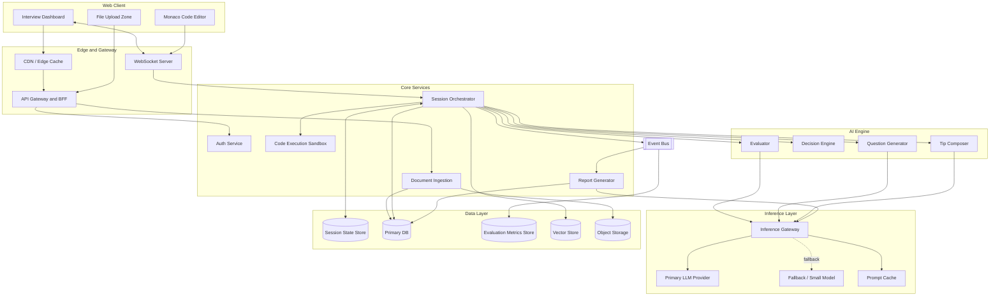
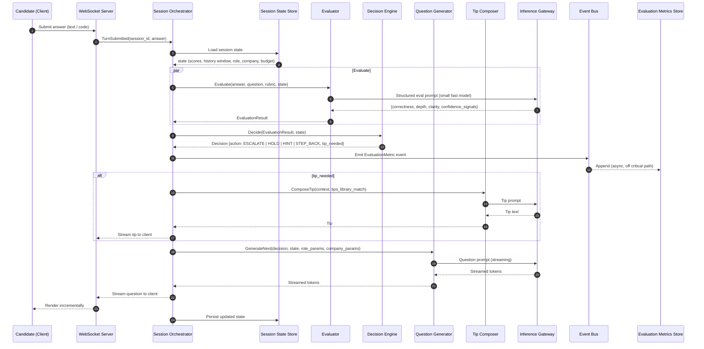
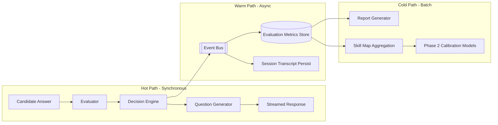
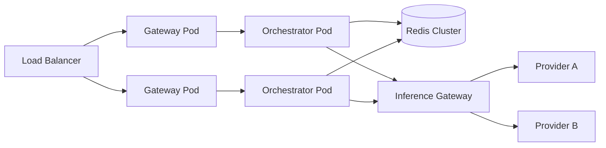

# System Architecture
## AI-Based Interview Preparation Platform – Phase 1

| Field | Value |
|---|---|
| Document Version | 1.0 |
| Scope | Phase 1 (B2C) with Phase 2 extension points |
| Primary Constraint | Low-latency, real-time adaptive inference |

---

## 1. Architectural Principles

1. **Latency is a feature.** The adaptive loop must feel conversational. Target: first streamed token ≤ 800 ms p95, full turn ≤ 2.5 s p95.
2. **Separate the "brain" from the "memory."** The AI Engine is stateless per request; all session state lives in a fast state store and is injected per turn.
3. **Every decision is an event.** Adaptive decisions are emitted as immutable events so Phase 2 analytics never require re-instrumentation.
4. **Model-agnostic inference layer.** Swap or route between LLM providers without touching business logic.
5. **Vertical scalability by isolation.** Session orchestration, evaluation, and reporting scale independently.

---

## 2. High-Level System Components

### 2.1 Component Inventory

| Component | Responsibility | Scaling Profile |
|---|---|---|
| **Web Client** | Interview dashboard, code editor, feedback UI | CDN-served, edge-rendered |
| **API Gateway / BFF** | Auth, rate limiting, request routing, WebSocket termination | Horizontal, stateless |
| **Session Orchestrator** | Owns the turn lifecycle; assembles state payload; coordinates evaluator, decision engine, and generator | Horizontal, stateless; one logical actor per session |
| **AI Engine** | Three cooperating services: Evaluator, Decision Engine, Question Generator | GPU/LLM-bound; autoscale on queue depth |
| **Inference Gateway** | Routes prompts to LLM providers; handles streaming, caching, fallback, and token accounting | Horizontal |
| **Session State Store** | Hot, in-memory session state (scores, history window, struggle budget) | In-memory cluster |
| **Primary Database** | Users, role templates, company profiles, sessions, tips library | Relational, read-replicas |
| **Evaluation Metrics Store** | Append-only turn-level evaluation events (Phase 2 data asset) | Append-optimized, columnar for analytics |
| **Vector Store** | Semantic retrieval of role micro-skills, company culture snippets, tips | Managed vector DB |
| **Event Bus** | Decouples orchestration from persistence, reporting, and analytics | Partitioned log |
| **Report Generator** | Builds post-session feedback reports asynchronously | Worker pool |
| **Deterministic Checker** | Evaluates truth tables, numeric answers, and small simulations (Python, Verilator) against a question's check spec; feeds the Evaluator | Per-check worker; sandboxed for HDL |
| **Code Execution Sandbox** | Later: runs arbitrary candidate code / HDL in isolated containers | Ephemeral, per-execution |
| **Content Pipeline** | Question authoring, review, translation parity checks, provenance, publish/withhold; the admin side of the bank | Low volume, internal |
| **Plan Router Service** | Recomputes the weekly plan and next activity after each attempt and daily | Worker, cheap |
| **Notification Service** | One channel in the pilot; schedules within user quiet hours; renders personalization from real history | Worker |
| **Cost Meter** | Records tokens, checks, and storage per action and per user; enforces pilot limits | Inline, cheap |
| **Document Ingestion** | Later: parses job descriptions into catalog skills | Async workers |
| **Observability Stack** | Tracing, metrics, structured logs, LLM prompt/response logging | Centralized |

### 2.2 Component Diagram

---

## 3. The Real-Time Feedback Loop

This is the critical path. Each candidate turn triggers exactly one pass through the loop.

### 3.1 Turn Lifecycle

### 3.2 Latency Budget (p95 targets)

| Stage | Budget | Technique |
|---|---|---|
| WebSocket ingress + state load | 50 ms | In-memory state store, co-located |
| Evaluation | 600 ms | Small, fast model; structured JSON output; short context |
| Decision Engine | 5 ms | Deterministic rules + lightweight scoring; no LLM call |
| Metric emission | 0 ms (async) | Fire-and-forget to event bus |
| Tip composition (when needed) | 400 ms | Cached tip templates; small model |
| Next question – first token | 500 ms | Prompt caching of system + role + company blocks |
| Next question – full stream | 1,500 ms | Streaming to client; user perceives first token latency |
| **Total to first visible token** | **≤ 800 ms** | |
| **Total turn** | **≤ 2.5 s** | |

### 3.3 Latency Optimization Strategies

- **Prompt caching:** System prompt, role template block, and company profile block are stable per session and cached at the provider level. Only the dynamic state payload and the last few turns are sent uncached.
- **Model tiering:** Evaluation and tip composition use a small, fast model. Question generation uses a stronger model only when the decision is `ESCALATE` into a novel sub-topic; otherwise a mid-tier model suffices.
- **Speculative pre-generation:** After the candidate begins typing, the orchestrator can pre-warm the two most likely next-question branches (`ESCALATE` and `HOLD`) and discard the unused one.
- **Sliding context window:** Only the last N turns plus a compressed summary are injected; full transcript stays in the database.
- **Regional inference routing:** Route to the nearest provider region; fall back cross-region on failure.

---

## 4. Data Flow Overview

The separation matters: **nothing on the hot path waits on a database write.** The Session State Store is the only synchronous persistence, and it is in-memory.

---

## 5. Tech Stack Recommendations

### 5.1 Summary Table

| Layer | Recommendation | Rationale |
|---|---|---|
| **Frontend** | Next.js 15 (App Router) + React 19 + TypeScript + TailwindCSS | SSR/edge rendering for landing pages, rich client for the interview dashboard, strong ecosystem |
| **Code Editor** | Monaco Editor | VS Code engine; syntax highlighting for SystemVerilog/Verilog/Python/C++; runs fully client-side |
| **Realtime Transport** | WebSockets (Socket.IO or native) with SSE fallback | Bidirectional streaming for token-by-token rendering |
| **API Gateway / BFF** | Node.js (Fastify) or Go | Low overhead, native streaming support |
| **Session Orchestrator** | Python (FastAPI + asyncio) | Best-in-class LLM tooling; async I/O for fan-out to evaluator and generator |
| **AI Engine** | Python; structured-output LLM calls; Pydantic schemas | Type-safe prompts and outputs |
| **Inference Gateway** | LiteLLM or custom router; provider SDKs with streaming | Multi-provider routing, retries, cost tracking |
| **LLM Provider** | Claude API: `claude-opus-5` for all engine roles, with per-role `effort` tuning (evaluator `low`, generator `medium`, report `high`) and prompt caching | One model keeps one prompt cache; effort trades speed against depth. See `MVP_Build_Guide.md` §7 |
| **Session State Store** | Redis Cluster (or Dragonfly) | Sub-millisecond reads; TTL-based session expiry |
| **Primary Database** | PostgreSQL 16 (managed) | Relational integrity for users, templates, sessions; JSONB for flexible params |
| **Evaluation Metrics Store** | PostgreSQL partitioned table (Phase 1) → ClickHouse (Phase 2) | Start simple; migrate to columnar when analytics volume demands |
| **Vector Store** | pgvector (Phase 1) → dedicated vector DB if needed | Keeps ops surface small early |
| **Event Bus** | Redis Streams (Phase 1) → Kafka / Redpanda (scale) | Same rationale: minimal ops until proven need |
| **Object Storage** | S3-compatible | Resumes, JDs, session artifacts |
| **Deterministic Checker** | Python for truth tables and numeric checks; Verilator in a container for small HDL simulations | Cheap, fast, independent of the LLM |
| **Code Sandbox (later)** | Firecracker microVMs or gVisor containers | Strong isolation; only when arbitrary execution is needed |
| **Localization** | Message catalogs in the frontend; `Question_Translation` and a term glossary in the database; practice language passed on every engine call | Hebrew and English at parity |
| **Notifications** | Web push or transactional email (one in the pilot); scheduled by a worker respecting quiet hours | |
| **Background Workers** | Celery or Temporal | Report generation, document ingestion, aggregation |
| **Auth** | Clerk / Auth0 / Supabase Auth with OAuth | Fast to ship, secure by default |
| **Infrastructure** | Kubernetes on a major cloud; Terraform | Standard, portable, autoscaling |
| **Observability** | OpenTelemetry + Grafana stack; LLM tracing (Langfuse or similar) | Prompt-level traceability of every adaptive decision |
| **CI/CD** | GitHub Actions; preview environments per PR | |

### 5.2 Why Python for the Orchestrator and AI Engine

- Native, mature SDKs for every LLM provider.
- Pydantic gives schema-validated structured outputs for the Evaluator, which is essential for deterministic decision logic.
- asyncio handles the fan-out to evaluator, tip composer, and generator concurrently.
- The existing project scaffold is Python (`app.py`, `requirements.txt`), so the orchestrator can grow from it.

### 5.3 Why a Separate Inference Gateway

- Provider outages must not take down the product: automatic failover.
- Cost control: per-session token accounting and model tiering in one place.
- Prompt caching and deduplication centralized.
- A/B testing of models without redeploying the orchestrator.

---

## 6. Security & Privacy Architecture

| Concern | Control |
|---|---|
| Candidate code execution | Sandboxed microVMs, no network egress, CPU/memory/time limits |
| PII in prompts | Resume/JD parsing strips direct identifiers before injection into prompts |
| Data at rest | AES-256 encryption; separate keys for `Evaluation_Metrics` |
| Data in transit | TLS 1.3 everywhere; WSS for sockets |
| Consent | Explicit, versioned consent flags on User and Interview_Session for Phase 2 usage |
| Deletion | Cascading delete with metrics anonymization (retain aggregate statistics, remove linkage) |
| Prompt injection | Candidate answers are wrapped in delimited blocks and never interpreted as instructions; evaluator uses structured output schemas |
| Secrets | Managed secrets store; no provider keys in client |

---

## 7. Scalability & Reliability

### 7.1 Scaling Model

- Orchestrator pods are stateless; session affinity is not required because all state is in Redis.
- Autoscale orchestrators on active WebSocket count; autoscale AI workers on inference queue depth.
- Rate limit per user and per session to protect inference spend.

### 7.2 Failure Modes

| Failure | Behavior |
|---|---|
| Primary LLM provider down | Inference Gateway fails over to secondary; quality slightly reduced, session continues |
| Evaluator timeout | Decision Engine defaults to `HOLD` with a generic follow-up; metric flagged `eval_timeout` |
| Redis node loss | Cluster failover; session state replicated; at worst one turn is replayed |
| Event bus lag | Hot path unaffected; metrics arrive late but complete |
| Sandbox failure | Candidate sees "execution unavailable"; interview continues with static review |

---

## 7.3 Per-Action Cost Metering

Every LLM call, deterministic check, and notification writes a cost event: user, mode, action, tokens in and out, cache reads, check runtime, and the model used. A daily job rolls these up per user and per mode. Pilot limits are enforced per user per day (for example, 3 simulations and 40 deep or quick attempts) and the UI shows remaining allowance. Optimization decisions follow observed cost, not assumptions about database size.

## 8. Phase 2 Extension Points

The following are deliberately left as seams:

| Seam | Phase 2 Use |
|---|---|
| `Evaluation_Metrics` store with role-normalized scores | Cross-candidate calibration and benchmarking |
| Event Bus | Add consumers for company-facing analytics without touching the hot path |
| Company Profile as structured data | Reused as the rubric for company-specific Evaluation Reports |
| Consent flags | Gate which sessions are eligible for B2B reporting |
| Inference Gateway model routing | Dedicated report-generation models for B2B narrative quality |

---

## 9. Deployment Topology (Phase 1)

| Environment | Purpose |
|---|---|
| `dev` | Per-developer, mocked inference |
| `preview` | Per-PR, real inference with capped spend |
| `staging` | Production mirror; load tests |
| `prod` | Multi-AZ, single region at launch; second region before B2B pilot |
